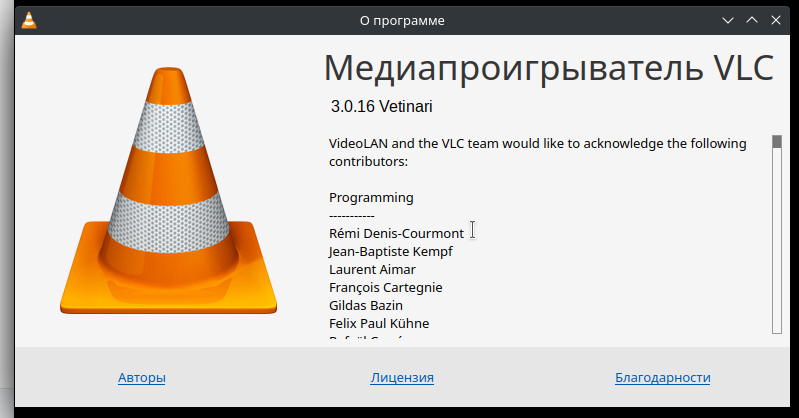
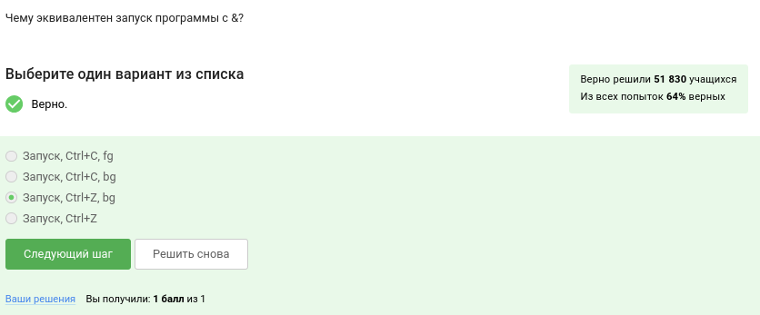
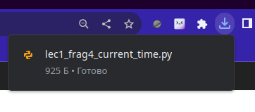
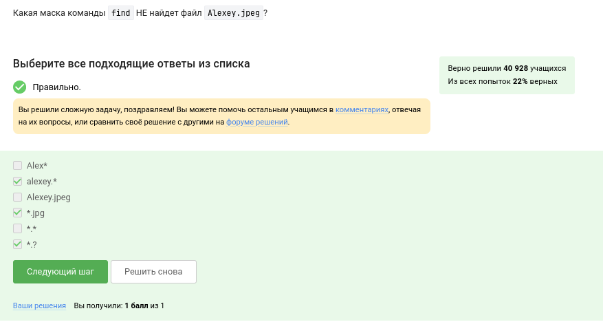

---
## Front matter
title: "Отчёт по прохождению 1 этапа внешних курсов на stepik"
subtitle: "Введение"
author: "Верниковская Екатерина Андреевна"

## Generic otions
lang: ru-RU
toc-title: "Содержание"

## Bibliography
bibliography: bib/cite.bib
csl: pandoc/csl/gost-r-7-0-5-2008-numeric.csl

## Pdf output format
toc: true # Table of contents
toc-depth: 2
lof: true # List of figures
lot: true # List of tables
fontsize: 12pt
linestretch: 1.5
papersize: a4
documentclass: scrreprt
## I18n polyglossia
polyglossia-lang:
  name: russian
  options:
	- spelling=modern
	- babelshorthands=true
polyglossia-otherlangs:
  name: english
## I18n babel
babel-lang: russian
babel-otherlangs: english
## Fonts
mainfont: PT Serif
romanfont: PT Serif
sansfont: PT Sans
monofont: PT Mono
mainfontoptions: Ligatures=TeX
romanfontoptions: Ligatures=TeX
sansfontoptions: Ligatures=TeX,Scale=MatchLowercase
monofontoptions: Scale=MatchLowercase,Scale=0.9
## Biblatex
biblatex: true
biblio-style: "gost-numeric"
biblatexoptions:
  - parentracker=true
  - backend=biber
  - hyperref=auto
  - language=auto
  - autolang=other*
  - citestyle=gost-numeric
## Pandoc-crossref LaTeX customization
figureTitle: "Рис."
tableTitle: "Таблица"
listingTitle: "Листинг"
lofTitle: "Список иллюстраций"
lotTitle: "Список таблиц"
lolTitle: "Листинги"
## Misc options
indent: true
header-includes:
  - \usepackage{indentfirst}
  - \usepackage{float} # keep figures where there are in the text
  - \floatplacement{figure}{H} # keep figures where there are in the text
---

# Цель работы

Ознакомиться с функционалом операционной системы Linux.

# Задание

Посмотреть много видео и на основе полученной информации пройти тестовые задания.

# Выполнение 1 этапа внешних курсов на stepik

Задание №1: курс называется "введение в Linux" (рис. [-@fig:001])

{#fig:001 width=70%}

Задание №2: прочитав критерии прохождения курса, я отметила необходимые утверждения (рис. [-@fig:002])

{#fig:002 width=70%}

Задание №3: я использую операционную систему linux, так как она намного удобнее чем windows. На иойм основном компьютере стоит linux (рис. [-@fig:003])

{#fig:003 width=70%}

Задание №4: на свой компьютер я устанавливала программу VirtualBox, которая нужна для подключения одной операционной системы на другую (рис. [-@fig:004])

{#fig:004 width=70%}

Задание №5: да, у меня получилось запустить с неё Линукс, но в основном я использую ноутбук, на котором Линукс стоит как основная операционная система (рис. [-@fig:005])

{#fig:005 width=70%}

Задание №6: я создала документ, и перед сохранением выбрала нужный формат, а после прикрепила его к курсу (рис. [-@fig:006]), (рис. [-@fig:007]), (рис. [-@fig:008])

{#fig:006 width=70%}

{#fig:007 width=70%}

{#fig:008 width=70%}

Задание №7: deb — формат пакетов операционных систем проекта Debian. Используется также их производными, такими как Ubuntu, Knoppix и другими (рис. [-@fig:009])

{#fig:009 width=70%}

Задание №8: программа медиапроигрыватель VLC у меня уже была установлена по умолчанпю. Открыв информацию о программе я посмотрела как зовут автора (рис. [-@fig:010]), (рис. [-@fig:011]), (рис. [-@fig:012])

{#fig:010 width=70%}

{#fig:011 width=70%}

{#fig:012 width=70%}

Задание №9: менеджер обновлений — это программа для обновления установленного про- граммного обеспечения в дистрибутивах ОС Linux, основанных на Debian или использующих систему управления пакетами APT. Менеджер обновлений устанавливает обновления безопасности или просто улучшающие функциональность программы (рис. [-@fig:013])

{#fig:013 width=70%}

Задание №10: Ассоль - героиня литературного произведения, а термин - это определение. Я как опытный пользователь linux знаю синонимы к "командная строка" (рис. [-@fig:014])

{#fig:014 width=70%}

Задание №11: интерфейс командной строки Linux является регистрозависимым. Поэтому только "pwd" (рис. [-@fig:015])

{#fig:015 width=70%}

Задание №12: я посмотрела вывод всех команд, предложенных в задании и выбрала те, которые эквиваленты команде *ls -A --human-readable -l /some/directory* (рис. [-@fig:016]), (рис. [-@fig:017])

{#fig:016 width=70%}

{#fig:017 width=70%}

Задание №13: я выполнила задание через терминал. Плучилось, что подходят все варианты (рис. [-@fig:018])

{#fig:018 width=70%}

Задание №14: rm -r удаление директории и рекуррентное удаление файлов, находящихся в ней (рис. [-@fig:019])

{#fig:019 width=70%}

Задание №15: это я проверила на практике (рис. [-@fig:020])

{#fig:020 width=70%}

Задание №16: это запуск программы в фоновом режиме (рис. [-@fig:021])

{#fig:021 width=70%}

Задание №17: скачала нужный файл, сделала его исполняемым и запустила (рис. [-@fig:022]), (рис. [-@fig:023]), (рис. [-@fig:024])

{#fig:022 width=70%}

{#fig:023 width=70%}

{#fig:024 width=70%}

Задание №18: автоматически поток ошибок выводится на экран - это видно, например, в ходе выполненных лабораторных. В файл будет поток выводиться, если его перенаправить (рис. [-@fig:025])

{#fig:025 width=70%}

Задание №19: 

- program < file.txt - эта команда перенаправляет входной поток программы program из файла file.txt, то есть данные из файла file.txt будут подаваться на вход программы program

- program >> file.txt - эта команда добавит вывод программы program в конец файла file.txt без перезаписи его содержимого. То есть результат выполнения программы будет дописан в файл file.txt

- program file.txt <2 - эта команда означает попытку запустить программу file.txt и перенаправить ввод 2 в программу. Однако, обычно символ < используется для перенаправления ввода из файла, поэтому эта команда не вполне корректна

- program << file.txt - в данной команде << обычно используется для "here document", когда ввод программы подается из следующих строк в командной оболочке, в данном случае file.txt является меткой завершения. Но это не соответствует стандартному синтаксису перенаправления ввода или вывода

Поэтому подходят только первые два варианта, которые создадут файл file.txt и запишут в него поток ошибок программы program (рис. [-@fig:026])

{#fig:026 width=70%}

Задание №20:

1. cat names.txt | ./interacter.py | less = вывод на экран
2. cat names.txt | ./interacter.py 2>err.txt | less = вывод ошибки в err.txt 

Подходит первый вариант (рис. [-@fig:027])

{#fig:027 width=70%}

Задание №21: 

Команда wget -P /home/alex/Pictures http://example.com/example.jpg скачивает файл и размещает его, назвав example.jpg, в папке /home/alex/Pictures. Но после этих действий срабатывает часть ключа -O 1.jpg и только что скачаный example.jpg конвертируется в 1.jpg и размещается в текущей директории,
в которой мы находимся, потому что путь файла уже не указан, указано только название - 1.jpg (рис. [-@fig:028])

{#fig:028 width=70%}

Задание №22: чтобы узнать правильный ответ я воспользовалась командой *man wget* (рис. [-@fig:029]), (рис. [-@fig:030])

{#fig:029 width=70%}

{#fig:030 width=70%}

Задание №23: 

При использовании команды wget -r -l 1 -A jpg и передачи ссылки на web-страницу, произойдет следующее:

- будут скачаны jpg и html файлы, так как опция -A jpg указывает на загрузку файлов только с расширением jpg
- все html файлы (страницы сайта) будут удалены из загруженных, поскольку опция -l 1 указывает на ограничение загрузки до уровня ссылки, то есть будет загружена только текущая страница
- поскольку указана загрузка только jpg файлов, файлы в формате png не будут загружены

Следовательно, правильный ответ: "Будут скачаны jpg и html файлы, но все html будут удалены", так как команда загрузит только jpg файлы, но также загрузит html файлы (страницы сайта), но их количество будет ограничено до уровня одной ссылки и они будут удалены из загрузки (рис. [-@fig:031])

{#fig:031 width=70%}

Задание №24: ну тут всё понятно (рис. [-@fig:032])

{#fig:032 width=70%}

Задание №25: gzip (сокращение от GNU Zip) — утилита сжатия и восстановления (декомпрессии) файлов, использующая алгоритм Deflate (рис. [-@fig:033])

{#fig:033 width=70%}

Задание №26:

c - архиватор
j - указатель на тип архиватора bzip
f - потому что создаем архив в файловой системе

(рис. [-@fig:034])

{#fig:034 width=70%}

Задание №27: 

? = один символ
alexey = маленькая буква
И файл должен быть jpeg, а не jpg

(рис. [-@fig:035])

{#fig:035 width=70%}

Задание №28: создала текстовый документ с нужными строками и проверила вывод с помощью команды *grep "world" text.txt* (рис. [-@fig:036]), (рис. [-@fig:037]), (рис. [-@fig:038])

{#fig:036 width=70%}

{#fig:037 width=70%}

{#fig:038 width=70%}

Задание №29: скачала архив с произведением Шекспира. Далее проделала действия для генерации файла, в котором будут все строчки, содержащие слово "love" (рис. [-@fig:039]), (рис. [-@fig:040]), (рис. [-@fig:041]), (рис. [-@fig:042]), (рис. [-@fig:043])

{#fig:039 width=70%}

{#fig:040 width=70%}

{#fig:041 width=70%}

{#fig:042 width=70%}

{#fig:043 width=70%}

# Выводы

В ходе выполнения 1 этапа внешних курсов на stepik я освоила linux, terminal, запуск исполняемых фалов, а также научилась работать с архивами и искать слова в файлах через командную строку.

# Список литературы

1. Курс на stepik. Введение [Электронный ресурс] URL: https://stepik.org/course/73/syllabus?id=1098930
