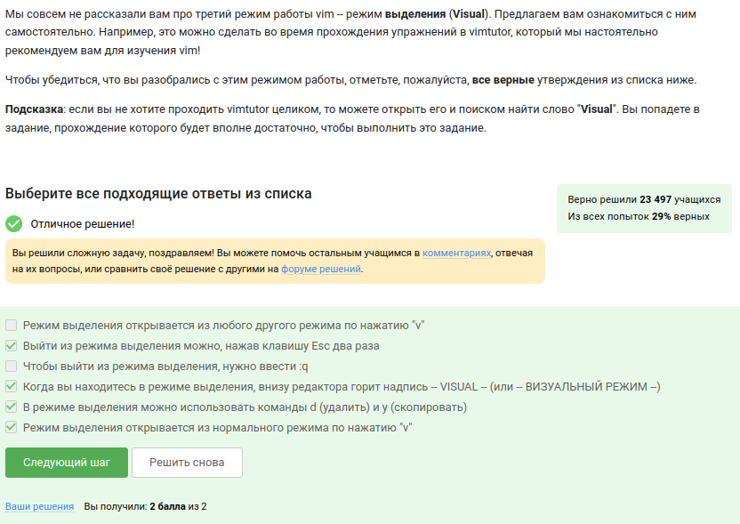
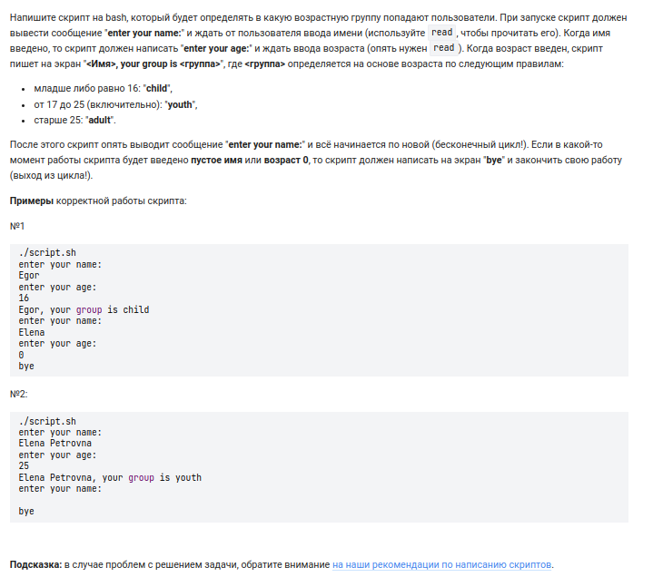
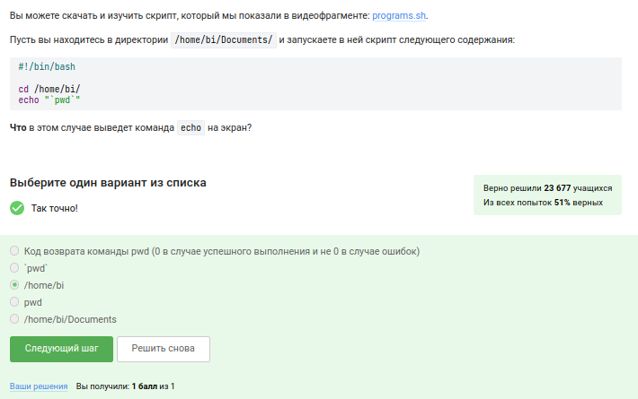
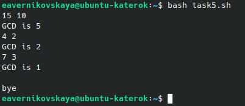
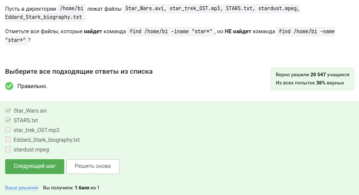
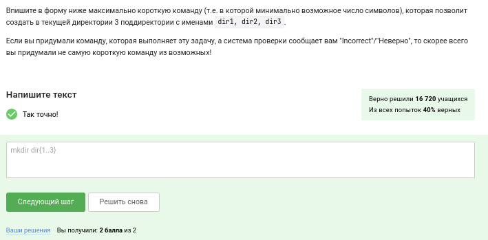

---
## Front matter
title: "Отчёт по прохождению 3 этапа внешних курсов на stepik"
subtitle: "Продвинутые темы"
author: "Верниковская Екатерина Андреевна"

## Generic otions
lang: ru-RU
toc-title: "Содержание"

## Bibliography
bibliography: bib/cite.bib
csl: pandoc/csl/gost-r-7-0-5-2008-numeric.csl

## Pdf output format
toc: true # Table of contents
toc-depth: 2
lof: true # List of figures
lot: true # List of tables
fontsize: 12pt
linestretch: 1.5
papersize: a4
documentclass: scrreprt
## I18n polyglossia
polyglossia-lang:
  name: russian
  options:
	- spelling=modern
	- babelshorthands=true
polyglossia-otherlangs:
  name: english
## I18n babel
babel-lang: russian
babel-otherlangs: english
## Fonts
mainfont: PT Serif
romanfont: PT Serif
sansfont: PT Sans
monofont: PT Mono
mainfontoptions: Ligatures=TeX
romanfontoptions: Ligatures=TeX
sansfontoptions: Ligatures=TeX,Scale=MatchLowercase
monofontoptions: Scale=MatchLowercase,Scale=0.9
## Biblatex
biblatex: true
biblio-style: "gost-numeric"
biblatexoptions:
  - parentracker=true
  - backend=biber
  - hyperref=auto
  - language=auto
  - autolang=other*
  - citestyle=gost-numeric
## Pandoc-crossref LaTeX customization
figureTitle: "Рис."
tableTitle: "Таблица"
listingTitle: "Листинг"
lofTitle: "Список иллюстраций"
lotTitle: "Список таблиц"
lolTitle: "Листинги"
## Misc options
indent: true
header-includes:
  - \usepackage{indentfirst}
  - \usepackage{float} # keep figures where there are in the text
  - \floatplacement{figure}{H} # keep figures where there are in the text
---

# Цель работы

Ознакомиться с функционалом операционной системы Linux.

# Задание

Посмотреть много видео и на основе полученной информации пройти тестовые задания.

# Выполнение 3 этапа внешних курсов на stepik

Задание №1: так как я работала с редактором vim, я помню что надо сделать для того чтобы выйти из него (рис. [-@fig:001])

{#fig:001 width=70%}

Задание №2: 

- Точка считается “маленьким словом”, так что всего их 9: Strange_, is_here, ., 2, =, 2, ! и два лишних пробела 

- Клавиша W перемещает курсор на один символ вправо, а точка (".") находится на конце строки. Чтобы переместить курсор на точку, необходимо нажать W 25 раз, так как строка содержит 25 символов (включая пробелы). Однако если вы нажмете W 25 раз, курсор переместится за пределы строки. Клавиша w, с другой стороны, перемещает курсор на одно слово влево или вправо. Поскольку точка отделена от слова "YES!" пробелом, можно переместить курсор на нее, нажав w один раз.

(рис. [-@fig:002])

{#fig:002 width=70%}

Задание №3: 

- $ — в конец текущей строки;
- w — на слово вправо;
- b — на слово влево;
- i — начать ввод перед курсором;
- p — вставка содержимого неименнованного буфера под курсором;
- P — вставка содержимого неименованного буфера перед курсором;
- yy (также Y) — копирование текущей строки в неименованный буфер;
- yy — копирование числа строк начиная с текущей в неименованный буфер;

Ответ: d2wwywPp; d2wwifour four <Esc>; ddithree four four four five<Esc>

(рис. [-@fig:003])

{#fig:003 width=70%}

Задание №4: поиск и замена в редакторе работают по следующей схеме:
:{пределы}s/{что заменяем}/{на что заменяем}/{опции}
Для замены во всем файле можно использовать символ % (рис. [-@fig:004])

{#fig:004 width=70%}

Задание №5: 

Команда $ — в конец текущей строки, W - до пробела вправо - то есть, перемещение.
Нажать Esc достаточно один раз, но да ладно.
Надпись visual - горит.
d — используется совместно с командами перемещения. Удаляет символы с текущего положения курсора до положения после ввода команды перемещения.
yy (также Y) — копирование текущей строки в буфер;

(рис. [-@fig:005])

{#fig:005 width=70%}

Задание №6: только из набора С потому что у каждой оболочки свой буфер, который при
выходе из нее будет записываться в файл истории (рис. [-@fig:006])

{#fig:006 width=70%}

Задание №7: /home/bi/file1.txt - потому что именно в этой директории мы создаем но-
вый файл, а уже после его создания мы переходим в другую папку (рис. [-@fig:007])

{#fig:007 width=70%}

Задание №8: в имени только буквы, цифры и подчеркивание. Больше никаких символов! (рис. [-@fig:008])

{#fig:008 width=70%}

Задание №9: создаю файл sh, пишу программу и проверяю работу командного файла (рис. [-@fig:009]), (рис. [-@fig:010]), (рис. [-@fig:011]), (рис. [-@fig:012])

{#fig:009 width=70%}

{#fig:010 width=70%}

{#fig:011 width=70%}

{#fig:012 width=70%}

Задание №10: на скрине всё видно (рис. [-@fig:013])

{#fig:013 width=70%}

Задание №11: 

- -lt, (<) - меньше
- -gt - больше
- -eq - равно

3 не больше 5, 3 не меньше 3, 3 не равно 4.
5 не больше 5, 5 не меньше 3, 5 не равно 4.
Оба раза выведет four

(рис. [-@fig:014])

{#fig:014 width=70%}

Задание №12: создаю файл sh, пишу программу и проверяю работу командного файла (рис. [-@fig:015]), (рис. [-@fig:016]), (рис. [-@fig:017]), (рис. [-@fig:018])

{#fig:015 width=70%}

{#fig:016 width=70%}

{#fig:017 width=70%}

{#fig:018 width=70%}

Задание №13: 

- (Start)
- a > c нет (Finish)
- (Start)
- , > c нет (Finish)
- (Start)
- b > c нет (Finish)
- (Start)
- , > c нет (Finish)
- (Start)
- c_d > c да

(рис. [-@fig:019])

{#fig:019 width=70%}

Задание №14: создаю файл sh, пишу программу и проверяю работу командного файла (рис. [-@fig:020]), (рис. [-@fig:021]), (рис. [-@fig:022]), (рис. [-@fig:023]), (рис. [-@fig:024])

{#fig:020 width=70%}

{#fig:021 width=70%}

{#fig:022 width=70%}

{#fig:023 width=70%}

{#fig:024 width=70%}

Задание №15: на скрине всё видно (рис. [-@fig:025])

{#fig:025 width=70%}

Задание №16: выведет путь до директории, в которую мы перешли,так как "pwd"- это команда (рис. [-@fig:026])

{#fig:026 width=70%}

Задание №17: на скрине всё видно (рис. [-@fig:027])

{#fig:027 width=70%}

Задание №18: создаю файл sh, пишу программу и проверяю работу командного файла (рис. [-@fig:028]), (рис. [-@fig:029]), (рис. [-@fig:030]), (рис. [-@fig:031])

{#fig:028 width=70%}

{#fig:029 width=70%}

{#fig:030 width=70%}

{#fig:031 width=70%}

Задание №19: создаю файл sh, пишу программу и проверяю работу командного файла (рис. [-@fig:032]), (рис. [-@fig:033]), (рис. [-@fig:034]), (рис. [-@fig:035]), (рис. [-@fig:036])

{#fig:032 width=70%}

{#fig:033 width=70%}

{#fig:034 width=70%}

{#fig:035 width=70%}

{#fig:036 width=70%}

Задание №20: создаю файл sh, пишу программу и проверяю работу командного файла (рис. [-@fig:037]), (рис. [-@fig:038]), (рис. [-@fig:039]), (рис. [-@fig:040]), (рис. [-@fig:041])

{#fig:037 width=70%}

{#fig:038 width=70%}

{#fig:039 width=70%}

{#fig:040 width=70%}

{#fig:041 width=70%}

Задание №21: -iname ищет без учета регистра, а -name в точности как в запросе. Звездочка стоит после слова, значит после слова бесконечное количество символов, до слова символов не должно быть. (рис. [-@fig:042])

{#fig:042 width=70%}

Задание №22: на скрине всё видно (рис. [-@fig:043])

{#fig:043 width=70%}

Задание №23: текущий каталог - это depth=1, а остальное считается просто:

/home/bi   -> depth=1
/home/bi/dir1   -> depth=2
/home/bi/dir1/dir2   -> depth=3
etc.

(рис. [-@fig:044])

{#fig:044 width=70%}

Задание №24: на скрине всё видно (рис. [-@fig:045])

{#fig:045 width=70%}

Задание №25: создаю файл txt и записываю в него строчки, показанные среди вариантов ответа. Далее использую команду *grep -E "[xklXKL]?[uU]buntu$" text.txt* и получаю ответ (рис. [-@fig:046]), (рис. [-@fig:047]), (рис. [-@fig:048]), (рис. [-@fig:049])

{#fig:046 width=70%}

{#fig:047 width=70%}

{#fig:048 width=70%}

{#fig:049 width=70%}

Задание №26: опция -n отключает автоматическую печать, что означает, что строки, которые вы специально не указываете на печать, не печатаются, а строки, которые вы явно указываете на печать (например, с помощью p), печатаются только один раз (рис. [-@fig:050]), (рис. [-@fig:051])

{#fig:050 width=70%}

{#fig:051 width=70%}

Задание №27: создаю файл sh и пишу нужную программу. Далее ссоздаю файл txt и записываю в него строчки из примера. Далее проверяю работу командного файла. В процессе создался файл edited.txt, где абривиатуры заменены на слово abbreviation (рис. [-@fig:052]), (рис. [-@fig:053]), (рис. [-@fig:054]), (рис. [-@fig:055]), (рис. [-@fig:056]), (рис. [-@fig:057]), (рис. [-@fig:058])

{#fig:052 width=70%}

{#fig:053 width=70%}

{#fig:054 width=70%}

{#fig:055 width=70%}

{#fig:056 width=70%}

{#fig:057 width=70%}

{#fig:058 width=70%}

Задание №28: -p, --persist позволяет окнам графиков сохраняться после выхода из основной программы gnuplot (рис. [-@fig:059])

{#fig:059 width=70%}

Задание №29: на скрине всё видно (рис. [-@fig:060])

{#fig:060 width=70%}

Задание №30: на скрине всё видно (рис. [-@fig:061])

{#fig:061 width=70%}

Задание №31: создала файлы animated.gnu и move.rot. Написала нужные программы и далее проверила с помощью команды *gnuplot --persist animated.gnu* (рис. [-@fig:062]), (рис. [-@fig:063]), (рис. [-@fig:064]), (рис. [-@fig:065]), (рис. [-@fig:066]), (рис. [-@fig:067]), (рис. [-@fig:068])

{#fig:062 width=70%}

{#fig:063 width=70%}

{#fig:064 width=70%}

{#fig:065 width=70%}

{#fig:066 width=70%}

{#fig:067 width=70%}

{#fig:068 width=70%}

Задание №32: на скрине всё видно (рис. [-@fig:069])

{#fig:069 width=70%}

Задание №33: на скрине всё видно (рис. [-@fig:070])

{#fig:070 width=70%}

Задание №34: 

- wc -l вывести количество строк
- wc -c вывести количество байт
- wc -m вывести количество символов
- wc -L вывести длину самой длинной строки
- wc -w вывести количество слов

(рис. [-@fig:071])

{#fig:071 width=70%}

Задание №35: на скрине всё видно (рис. [-@fig:072]), (рис. [-@fig:073])

{#fig:072 width=70%}

{#fig:073 width=70%}

Задание №36: на скрине всё видно (рис. [-@fig:074])

{#fig:074 width=70%}

# Выводы
 
В ходе выполнения 3 этапа внешних курсов на stepik я освоила linux, научилась пользоваться редактором vim, научилась писать скрипты на bash, а также строить графики в gnuplot.

# Список литературы

1. Курс на stepik. Продвинутые темы [Электронный ресурс] URL: https://stepik.org/course/73/syllabus?id=1098930
