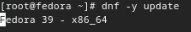

---
## Front matter
lang: ru-RU
title: Лабораторная работа №1
subtitle: Операционные системы
author:
  - Верниковская Е. А., НПИбд-01-23
institute:
  - Российский университет дружбы народов, Москва, Россия
date: 27 февраля 2024

## i18n babel
babel-lang: russian
babel-otherlangs: english

## Formatting pdf
toc: false
toc-title: Содержание
slide_level: 2
aspectratio: 169
section-titles: true
theme: metropolis
header-includes:
 - \metroset{progressbar=frametitle,sectionpage=progressbar,numbering=fraction}
 - '\makeatletter'
 - '\beamer@ignorenonframefalse'
 - '\makeatother'
 
## Fonts
mainfont: PT Serif
romanfont: PT Serif
sansfont: PT Sans
monofont: PT Mono
mainfontoptions: Ligatures=TeX
romanfontoptions: Ligatures=TeX
sansfontoptions: Ligatures=TeX,Scale=MatchLowercase
monofontoptions: Scale=MatchLowercase,Scale=0.9
---

# Вводная часть

## Цель работы

Приобрести практические навыки установки операционной системы на виртуальную машину, настройки минимально необходимых для дальнейшей работы сервисов.

## Задание

1. Скачать VirtualBox и Fedora Sway.
2. Создать виртуальную машину.
3. Настроить виртуальную машину.

# Выполнение лабораторной работы

## Создание виртуальной машины`

Скачиваем VirtualBox (в моём случае для Ubuntu 22.04) (рис. 1)

{#fig:001 width=70%}

## Создание виртуальной машины`

Скачиваем Fedora Sway (рис. 2)

{#fig:002 width=60%}

## Создание виртуальной машины`

- Создаём новую виртуальную машину
- Указываем имя и операционную систему виртуальной машины (eavernikovskaya), подключив к виртуальной машине скаченный ISO-файл (рис. 3)

{#fig:003 width=50%}

## Создание виртуальной машины`

Указываем размер основной памяти виртуальной машины — 2048 МБ (рис. 4)

{#fig:004 width=50%}

## Создание виртуальной машины`

Далее задаём размер диска - 80 ГБ (рис. 5)

{#fig:005 width=70%}

## Установка операционной системы

Запускаем виртуальную машину (рис. 6)

{#fig:006 width=50%}

## Установка операционной системы

- Нажимимаем комбинацию *Win+d для запуска терминала* 
- Далее запускаем *liveinst* (рис. 7)

{#fig:007 width=40%}

## Установка операционной системы

Выбираем язык интерфейса (русский) и переходим к настройкам установки операционной системы (рис. 8)

{#fig:008 width=50%}

## Установка операционной системы

Поверяем место установки ОС и оставляем без изменений (рис. 9)

{#fig:009 width=50%}

## Установка операционной системы

- Создаём пользователя
- Устанавливаем имя и пароль для нашего пользователя (рис. 10)

{#fig:010 width=50%}

## Установка операционной системы

- Включаем учётную запись root
- Устанавливаем пароль для пользователя root (рис. 11)

{#fig:011 width=50%}

## Установка операционной системы

- После завершения установки операционной системы выключаем виртуальную машину
- Отключаем оптический диск (рис. 12)

{#fig:012 width=70%}

## Работа с операционной системой после установки

- Входим в ОС под заданной нами при установке учётной записью
- Открываем терминал и переключаемся на супер-пользователя, введя *sudo -i* 
- Обновляем все пакеты, с помощью *dnf -y update* (рис. 13)

{#fig:013 width=70%}

## Работа с операционной системой после установки

Скачиваем программы (mc и tmux) для удобства работы в консоли, введя *dnf -y install tmux mc* (рис. 14)

{#fig:014 width=70%}

## Работа с операционной системой после установки

Далее скачиваем программное обеспечение для автоматического обновления, с помощью команды *dnf install dnf-automatic*  (рис. 15)

{#fig:015 width=70%}

## Работа с операционной системой после установки

Следующим шагом запускаем таймер, с помощью команды *systemctl enable --now dnf-automatic.timer*  (рис. 16)

{#fig:016 width=70%}

## Работа с операционной системой после установки

- Далее надо отключить SELinux
- В файле /etc/selinux/config заменяем значение *SELINUX=enforcing* на значение *SELINUX=permissive* (рис. 17)

## Работа с операционной системой после установки

{#fig:017 width=50%}

## Установка драйверов для VirtualBox

- После перезагрузки запускаем tmux и пререходим на роль супер-пользователя 
- Уставнавливаем средства разработки, введя *dnf -y group install "Development Tools"* (рис. 18)

{#fig:018 width=70%}

## Установка драйверов для VirtualBox

Далее устанавливаем пакет DKMS (рис. 19)

{#fig:019 width=70%}

## Установка драйверов для VirtualBox

В меню виртуальной машины подключаем браз диска дополнений гостевой ОС (рис. 20)

{#fig:020 width=50%}

## Установка драйверов для VirtualBox

- Подмонтируем диска, с помощью *mount /dev/sr0 /media* 
- Далее устанавливаем драйвера, введя */media/VBoxLinuxAdditions.run* (рис. 21)
- После перезапускаем виртуальную машину

{#fig:021 width=50%}

## Настройка раскладки клавиатуры

Создаём конфигурационный файл ~/.config/sway/config.d/95-system-keyboard-config.conf (рис. 22)

{#fig:022 width=70%}

## Настройка раскладки клавиатуры

Далее редактируем этот конфигурационный файл, вставивив в него строчку *exec_always/usr/libexec/sway-systemd/locale1-xkb-config –oneshot* (рис. 23)

{#fig:023 width=70%}

## Настройка раскладки клавиатуры

После редактируем другой конфигурационный файл /etc/X11/xorg.conf.d/00-keyboard.conf (рис. 24)

{#fig:024 width=70%}

## Настройка раскладки клавиатуры

- Далее перезагружаем виртуальную машину
- Теперь мы можем менять язык с помощью *right ctrl*

## Установка имени пользователя и названия хоста

- Устанавливаем имя хоста (eavernikovskaya), с помощью *hostnamectl set-hostname <username>*
- Далее проверяем, что имя хоста установлено правильно, введя *hostnamectl* (рис. 25)

{#fig:025 width=40%}

## Подключение общей папки

Внутри виртуальной машины добавляем своего пользователя в группу vboxsf, введя *gpasswd -a <username> vboxsf* (рис. 26)

{#fig:026 width=70%}

## Подключение общей папки

Далее в хостовой системе подключаем разделяемую папку (рис. 27])

{#fig:027 width=70%}

## Установка программного обеспечения для создания документации

- Переключаемся на роль супер-пользователя
- Устанавливаем pandoc, введя команду *dnf -y install pandoc* (рис. 28)

{#fig:028 width=70%}

## Установка программного обеспечения для создания документации

- Далее устанавливаем версию pandoc-crossref, которая соответствует скачанному pandoc
- Распаковываем архив с помощью *tar -xvf* (рис. 29)

{#fig:029 width=70%}

## Установка программного обеспечения для создания документации

После помещаем pandoc-crossref в каталог /usr/local/bin, с помощью *mv* (рис. 30)

{#fig:030 width=70%}

## Установка программного обеспечения для создания документации

Далее устанавливаем дистрибутив TeXlive. Для этого вводим команду *dnf -y install texlive-scheme-full*  (рис. 31)

{#fig:031 width=70%}

# Выполнение домашнего задания

## №1

Вводим команду *dmesg | less*, чтобы проанализировать последовательность загрузки системы (рис. 32)

{#fig:032 width=50%}

## №1

{#fig:033 width=50%}

## №2

Далее получаем нужную информацию, с помощью *dmesg | grep -i "то, что ищем"*: (рис. 34)

- Версия ядра Linux (Linux version)
- Частота процессора (Detected Mhz processor)
- Модель процессора (CPU0)
- Объём доступной оперативной памяти (Memory available)
- Тип обнаруженного гипервизора (Hypervisor detected)
- Тип файловой системы корневого раздела
- Последовательность монтирования файловых систем 

## №2

{#fig:034 width=70%}

# Выводы

В ходе выполнения лабораторной работы мы приобрели практические навыки установки операционной системы на виртуальную машину, настройки минимально необходимых для дальнейшей работы сервисов.

