---
## Front matter
lang: ru-RU
title: Лабораторная работа №2
subtitle: Операционные системы
author:
  - Верниковская Е. А., НПИбд-01-23
institute:
  - Российский университет дружбы народов, Москва, Россия
date: 27 февраля 2024

## i18n babel
babel-lang: russian
babel-otherlangs: english

## Formatting pdf
toc: false
toc-title: Содержание
slide_level: 2
aspectratio: 169
section-titles: true
theme: metropolis
header-includes:
 - \metroset{progressbar=frametitle,sectionpage=progressbar,numbering=fraction}
 - '\makeatletter'
 - '\beamer@ignorenonframefalse'
 - '\makeatother'
 
## Fonts
mainfont: PT Serif
romanfont: PT Serif
sansfont: PT Sans
monofont: PT Mono
mainfontoptions: Ligatures=TeX
romanfontoptions: Ligatures=TeX
sansfontoptions: Ligatures=TeX,Scale=MatchLowercase
monofontoptions: Scale=MatchLowercase,Scale=0.9
---

# Вводная часть

## Цель работы

Изучение идеологии и применениния средств контроля версий, а также освоение умений по работе с git.

## Задание

1. Создать базовую конфигурацию для работы с git.
2. Создать ключ SSH.
3. Создать ключ PGP.
4. Настроить подписи git.
5. Зарегистрироваться на Github.
6. Создать локальный каталог для выполнения заданий по предмету.

# Выполнение лабораторной работы

## Установка программного обеспечения

Устанавливаем git, введя *dnf install git* (рис. 1)

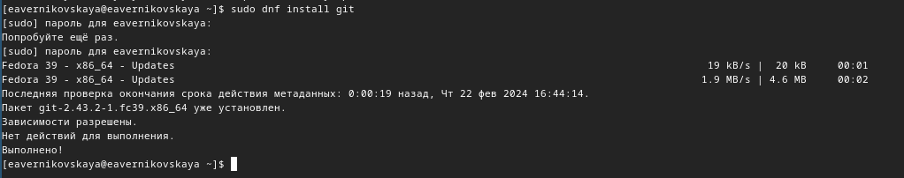{#fig:001 width=70%}

## Установка программного обеспечения

Далее устанавливаем gh, введя команду *dnf install gh* (рис. 2)

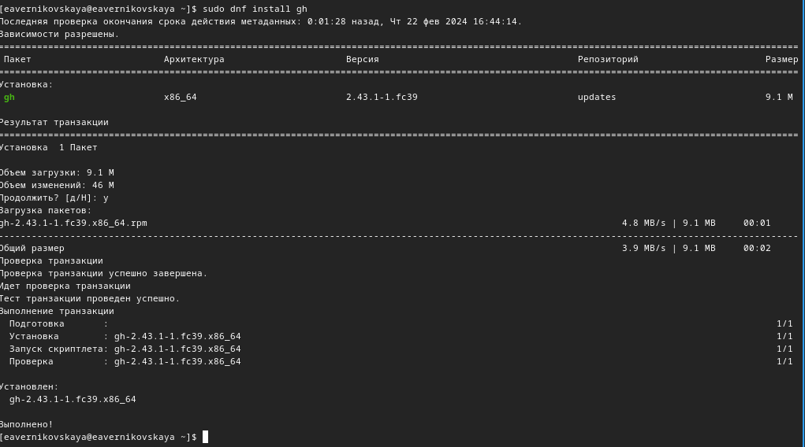{#fig:002 width=70%}

## Базовая настройка git

Задаём имя и email владельца репозитория (рис. 3)

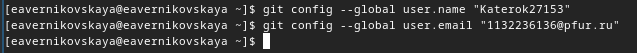{#fig:003 width=70%}

## Базовая настройка git

Настраиваем utf-8 в выводе сообщений git, с помощью команды *git config --global core.quotepath false* (рис. 4)

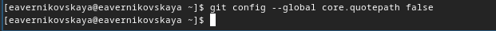{#fig:004 width=70%}

## Базовая настройка git

Далее задаём имя начальной ветки (будем называть её master), введя *git config --global init.defaultBranch master* (рис. 5)

{#fig:005 width=70%}

## Базовая настройка git

Задаём параметры *autocrlf* и *safecrlf* (рис. 6)

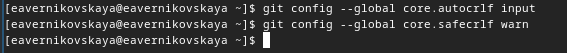{#fig:006 width=70%}

## Создание SSH ключей

Создаём ключ по алгоритму rsa размером 4096 бит (рис. 7)

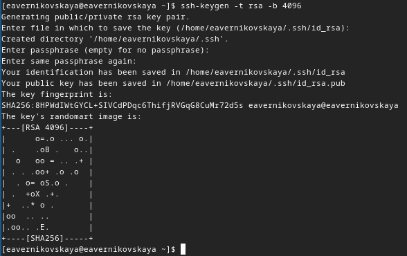{#fig:007 width=60%}

## Создание SSH ключей

Создаём ключ по алгоритму ed25519 (рис. 8)

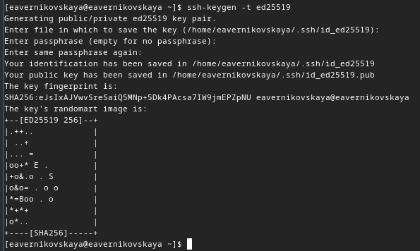{#fig:008 width=70%}

## Создание PGP ключa

- Генерируем ключ, с помощью команды *gpg --full-generate-key* 
- Из предложенных опций выбираем тип RSA and RSA, размер 4096, срок действия - значение по умолчанию 0 (рис. 9)

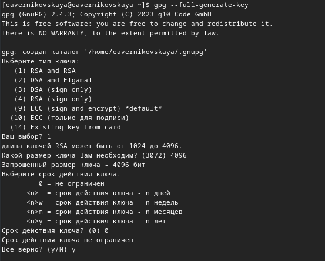{#fig:009 width=40%}

## Настройка github

У меня уже естб аккаунт github, поэтому регестрироваться не надо (рис. 10)

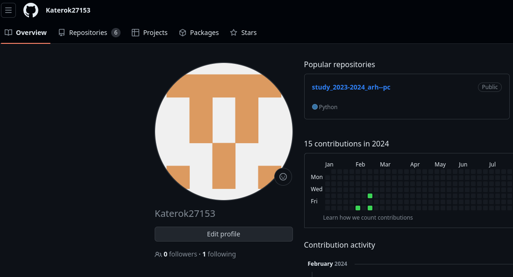{#fig:010 width=70%}

## Добавление PGP ключа в GitHub

Выводим список ключей и копируем отпечаток приватного ключа, введя *gpg --list-secret-keys --keyid-format LONG* (рис. 11)

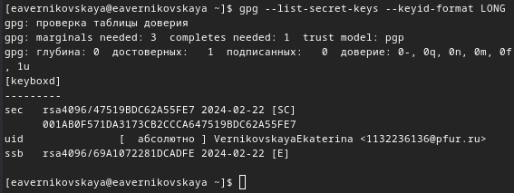{#fig:011 width=70%}

## Добавление PGP ключа в GitHub

- Выводим наш сгенерированный ключ на экран, с помощью команды *gpg --armor --export <отпечаток ключа>* 
- Копируем ключ (рис. 12)

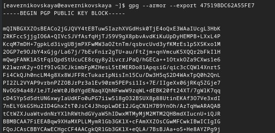{#fig:012 width=70%}

## Добавление PGP ключа в GitHub

Переходим в настройки GitHub, нажмимаем на кнопку New GPG key и вставляем полученный ключ в поле ввода (рис. 13)

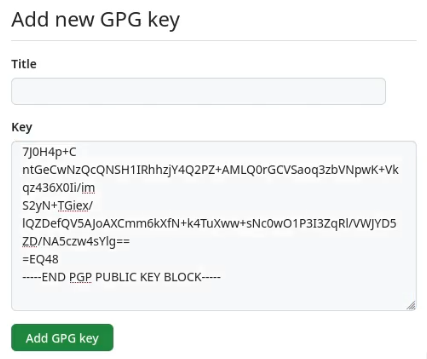{#fig:013 width=40%}

## Добавление PGP ключа в GitHub

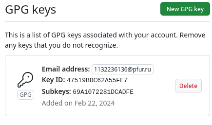{#fig:014 width=70%}

## Настройка автоматических подписей коммитов git

Используя введёный email, указываем Git применять его при подписи коммитов (рис. 15)

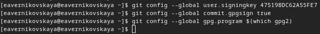{#fig:015 width=70%}

## Настройка gh

- Для начала необходимо авторизоваться
- Отвечаем на несколько наводящх вопросов
- Авторизовываемся через браузер (рис. 16)

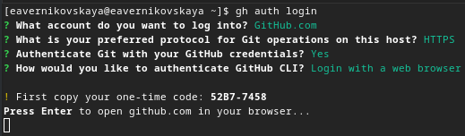{#fig:016 width=70%}

## Настройка gh

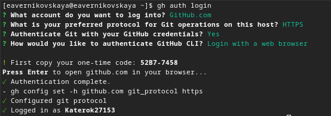{#fig:017 width=70%}

## Шаблон для рабочего пространства

- Создаём необходимые каталоги для рабочего пространства
- Используем команду *gh repo create study_2023-2024_os-intro --template=yamadharma/course-directory-student-template --public* (рис. 18)

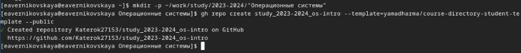{#fig:018 width=70%}

## Шаблон для рабочего пространства

Далее клонируем репозиторий к себе в директорию, с помощью *git clone --recursive https://github.com/<owner>/study_2023-2024_os-intro.git* (рис. 19)

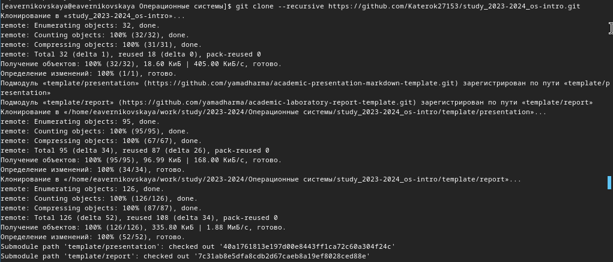{#fig:019 width=70%}

## Шаблон для рабочего пространства

- Переходим в каталог курса *cd ~/work/study/2023-2024/"Операционные системы"/os-intro*
- Удаляем все лишние файлы, введя *rm package.json* (рис. 20)

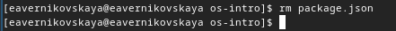{#fig:020 width=70%}

## Шаблон для рабочего пространства

Создаём необходимые каталоги введя команды:

1. *echo os-intro > COURSE* (рис. 21)
2. *make list*, *make prepare*, *make submodule*

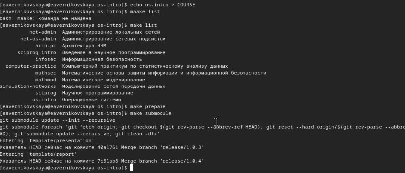{#fig:021 width=70%}

## Шаблон для рабочего пространства

Отправляем файлы на сервер, с помощью *git add .*, *git cimmit -am* и *git push* (рис. 22)

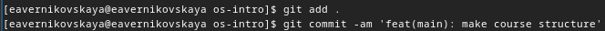{#fig:022 width=70%}

## Шаблон для рабочего пространства

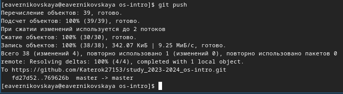{#fig:023 width=70%}

# Подведение итогов

## Выводы

В ходе выполнения лабораторной работы мы изучили идеологию и применениние средств контроля версий, а также освоили умения по работе с git.

## Список литературы

1. Лаборатораня работа №2 [Электронный ресурс] URL: https://esystem.rudn.ru/mod/page/view.php?id=1098933
2. GitHub [Электронный ресурс] URL: https://github.com/
