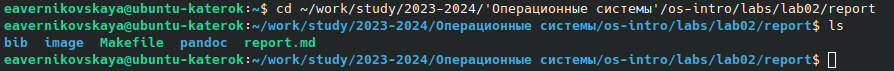
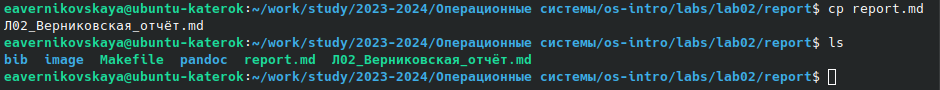
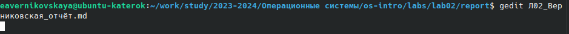
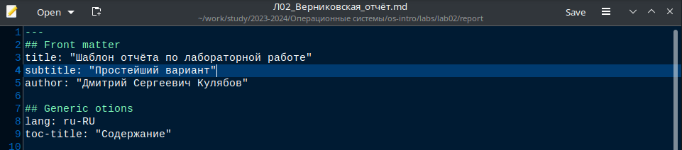
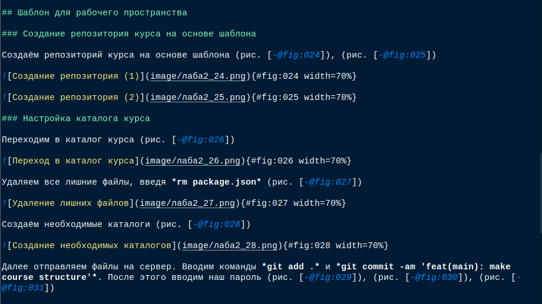
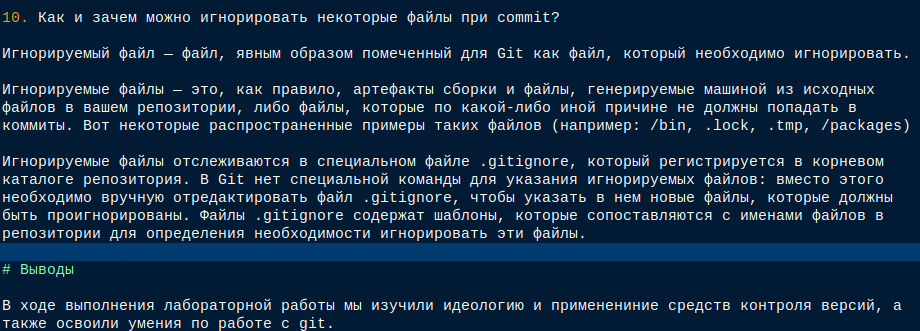
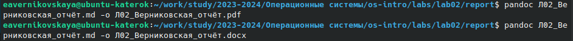
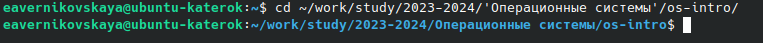
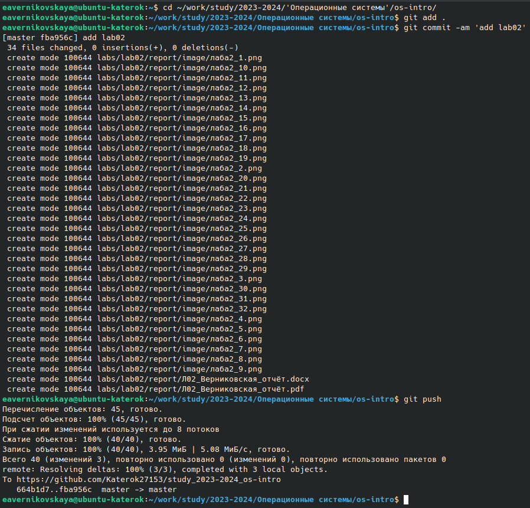

---
## Front matter
lang: ru-RU
title: Лабораторная работа №3
subtitle: Операционные системы
author:
  - Верниковская Е. А., НПИбд-01-23
institute:
  - Российский университет дружбы народов, Москва, Россия
date: 27 февраля 2024

## i18n babel
babel-lang: russian
babel-otherlangs: english

## Formatting pdf
toc: false
toc-title: Содержание
slide_level: 2
aspectratio: 169
section-titles: true
theme: metropolis
header-includes:
 - \metroset{progressbar=frametitle,sectionpage=progressbar,numbering=fraction}
 - '\makeatletter'
 - '\beamer@ignorenonframefalse'
 - '\makeatother'
 
## Fonts
mainfont: PT Serif
romanfont: PT Serif
sansfont: PT Sans
monofont: PT Mono
mainfontoptions: Ligatures=TeX
romanfontoptions: Ligatures=TeX
sansfontoptions: Ligatures=TeX,Scale=MatchLowercase
monofontoptions: Scale=MatchLowercase,Scale=0.9
---

# Вводная часть

## Цель работы

Научиться оформлять отчёты с помощью легковесного языка разметки Markdown.

## Задание

1. Оформить отчёт по лабораторной работе №2 в формате Markdown.

# Выполнение лабораторной работы

## Оформление отчёта

Переходим в каталог где хранится шаблон отчёта в формате md, введя *cd* (рис. 1)

{#fig:001 width=70%}

## Оформление отчёта

Делаем копию шаблона с другим именем, с помощью *cp* (рис. 2)

{#fig:002 width=70%}

## Оформление отчёта

Открываем файл отчёта с помощью текстового редактора *gedit* (рис. 3)

{#fig:003 width=70%}

## Оформление отчёта

{#fig:004 width=70%}

## Оформление отчёта

Далее оформляем отчёт (рис. 5), (рис. 6), (рис. 7)

{#fig:005 width=70%}

## Оформление отчёта

{#fig:006 width=70%}

## Оформление отчёта

{#fig:007 width=70%}

## Оформление отчёта

Далее компилируем файл с отчётом в формате *md* в форматы *pdf* и *docx* (рис. 8) 

{#fig:008 width=70%}

## Оформление отчёта

После преходим в каталог *os-intro* (рис. 9) 

{#fig:009 width=70%}

## Оформление отчёта

Далее отправляем наши файлы на глобальный репозиторий, с помощью команд *git add .*, *git commit -am* и  *git push* (рис. 10)

## Оформление отчёта

{#fig:010 width=50%}

# Подведение итогов

## Выводы

В ходе выполнения лабораторной работы мы научились оформлять отчёты с помощью легковесного языка разметки Markdown, а также оформили отчёт по лабораторной работе №2.

## Список литературы

1. Лаборатораня работа №2 [Электронный ресурс] URL: https://esystem.rudn.ru/mod/page/view.php?id=1098933
