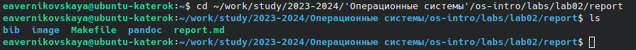
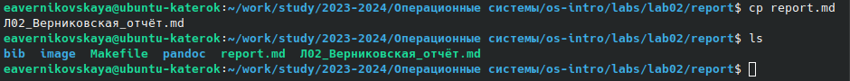
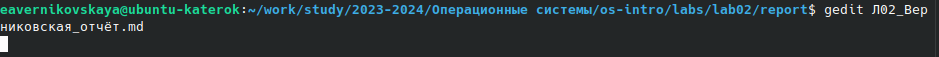
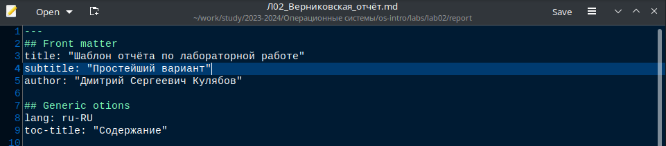
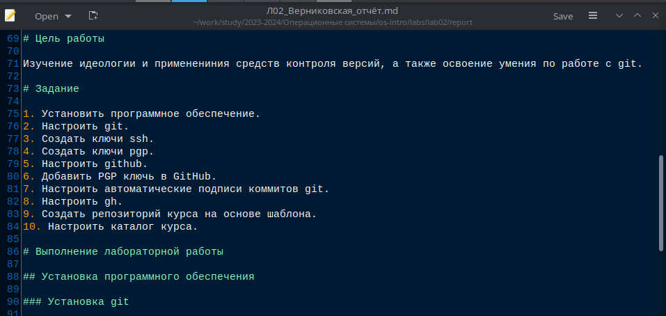
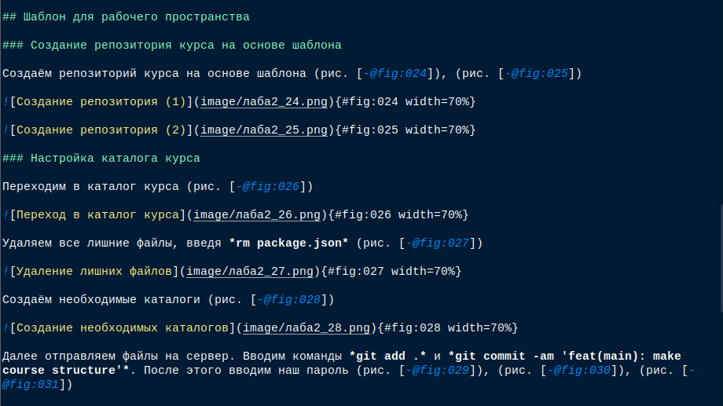
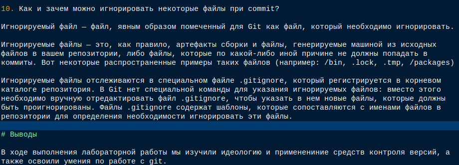
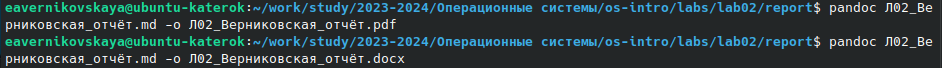
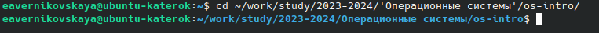
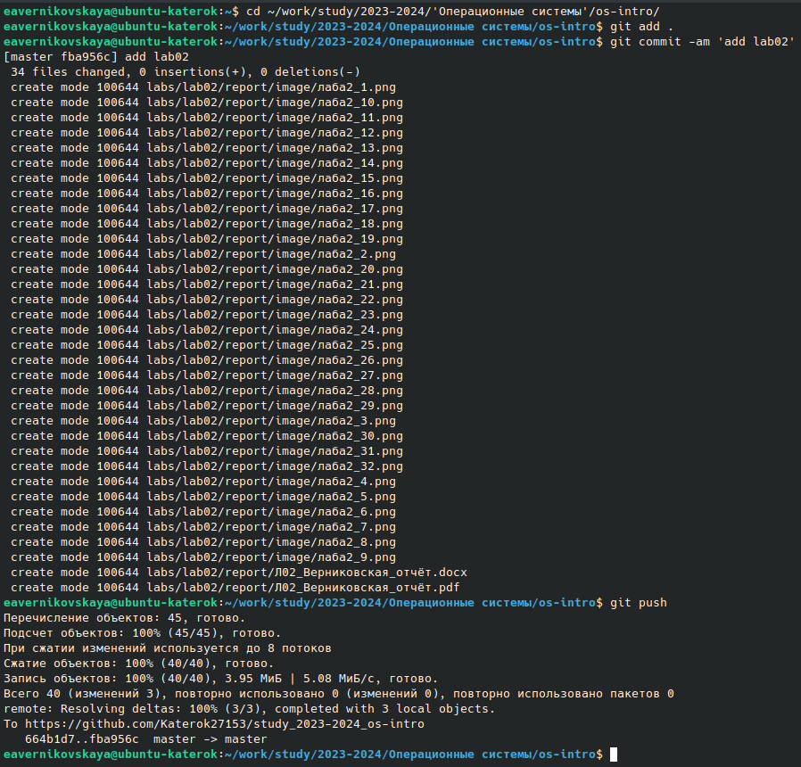

---
## Front matter
title: "Отчёт по лабораторной работе №3"
subtitle: "Дисциплина: Операционные системы"
author: "Верниковская Екатерина Андреевна"

## Generic otions
lang: ru-RU
toc-title: "Содержание"

## Bibliography
bibliography: bib/cite.bib
csl: pandoc/csl/gost-r-7-0-5-2008-numeric.csl

## Pdf output format
toc: true # Table of contents
toc-depth: 2
lof: true # List of figures
lot: true # List of tables
fontsize: 12pt
linestretch: 1.5
papersize: a4
documentclass: scrreprt
## I18n polyglossia
polyglossia-lang:
  name: russian
  options:
	- spelling=modern
	- babelshorthands=true
polyglossia-otherlangs:
  name: english
## I18n babel
babel-lang: russian
babel-otherlangs: english
## Fonts
mainfont: PT Serif
romanfont: PT Serif
sansfont: PT Sans
monofont: PT Mono
mainfontoptions: Ligatures=TeX
romanfontoptions: Ligatures=TeX
sansfontoptions: Ligatures=TeX,Scale=MatchLowercase
monofontoptions: Scale=MatchLowercase,Scale=0.9
## Biblatex
biblatex: true
biblio-style: "gost-numeric"
biblatexoptions:
  - parentracker=true
  - backend=biber
  - hyperref=auto
  - language=auto
  - autolang=other*
  - citestyle=gost-numeric
## Pandoc-crossref LaTeX customization
figureTitle: "Рис."
tableTitle: "Таблица"
listingTitle: "Листинг"
lofTitle: "Список иллюстраций"
lotTitle: "Список таблиц"
lolTitle: "Листинги"
## Misc options
indent: true
header-includes:
  - \usepackage{indentfirst}
  - \usepackage{float} # keep figures where there are in the text
  - \floatplacement{figure}{H} # keep figures where there are in the text
---

# Цель работы

Научиться оформлять отчёты с помощью легковесного языка разметки Markdown.

# Задание

1. Оформить отчёт по лабораторной работе №2 в формате Markdown.

# Выполнение лабораторной работы

Переходим в каталог где хранится шаблон отчёта в формате md, введя *cd* (рис. [-@fig:001])

{#fig:001 width=70%}

Делаем копию шаблона с другим именем, с помощью *cp* (рис. [-@fig:002])

{#fig:002 width=70%}

Открываем файл отчёта с помощью текстового редактора *gedit* (рис. [-@fig:003]), (рис. [-@fig:004])

{#fig:003 width=70%}

{#fig:004 width=70%}

Оформляем отчёт: вставляем скриншоты, описываем наши действия, формулируем цель и вывод лабораторной работы, а также отвечаем на контрольные фопросы (рис. [-@fig:005]), (рис. [-@fig:006]), (рис. [-@fig:007])

{#fig:005 width=70%}

{#fig:006 width=70%}

{#fig:007 width=70%}

Далее компилируем файл с отчётом в формате *md* в форматы *pdf* и *docx* (рис. [-@fig:008])

{#fig:008 width=70%}

Далее отправляем наши файлы на глобальный репозиторий, с помощью команд *git add .*, *git commit -am* и  *git push* (рис. [-@fig:009]), (рис. [-@fig:010])

{#fig:009 width=70%}

{#fig:010 width=70%}

# Выводы

В ходе выполнения лабораторной работы мы научились оформлять отчёты с помощью легковесного языка разметки Markdown, а также оформили отчёт по лабораторной работе №2.
