---
## Front matter
lang: ru-RU
title: Лабораторная работа №4
subtitle: Операционные системы
author:
  - Верниковская Е. А., НПИбд-01-23
institute:
  - Российский университет дружбы народов, Москва, Россия
date: 27 февраля 2024

## i18n babel
babel-lang: russian
babel-otherlangs: english

## Formatting pdf
toc: false
toc-title: Содержание
slide_level: 2
aspectratio: 169
section-titles: true
theme: metropolis
header-includes:
 - \metroset{progressbar=frametitle,sectionpage=progressbar,numbering=fraction}
 - '\makeatletter'
 - '\beamer@ignorenonframefalse'
 - '\makeatother'
 
## Fonts
mainfont: PT Serif
romanfont: PT Serif
sansfont: PT Sans
monofont: PT Mono
mainfontoptions: Ligatures=TeX
romanfontoptions: Ligatures=TeX
sansfontoptions: Ligatures=TeX,Scale=MatchLowercase
monofontoptions: Scale=MatchLowercase,Scale=0.9
---

# Вводная часть

## Цель работы

Получить навыки правильной работы с репозиториями git.

## Задание

1. Установить программное обеспечение.
2. Выполнить работу для тестового репозитория.
3. Преобразовать рабочий репозиторий в репозиторий с git-flow и conventional commits.

# Выполнение лабораторной работы

## Установка git-flow

Переключаемся на супер-пользователя и устанавливаем git-flow введя 2 команды:
- *dnf copr enable elegos/gitflow*
- *dnf install gitflow* (рис. 1), (рис. 2)

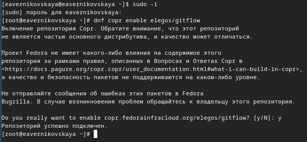{#fig:001 width=70%}

## Установка git-flow

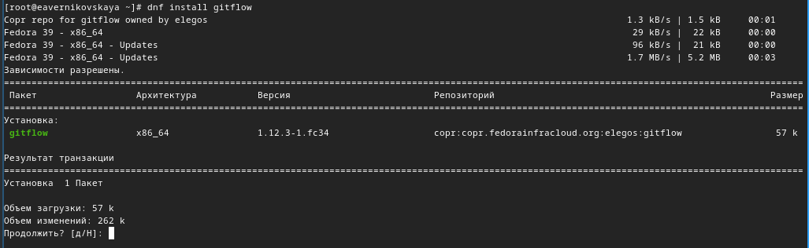{#fig:002 width=70%}

## Установка Node.js

Далее устанавливаем Node.js введя 2 команды:
- *dnf install nodejs*
- *dnf install pnpm* (рис. 3), (рис. 4)

{#fig:003 width=70%}

## Установка Node.js

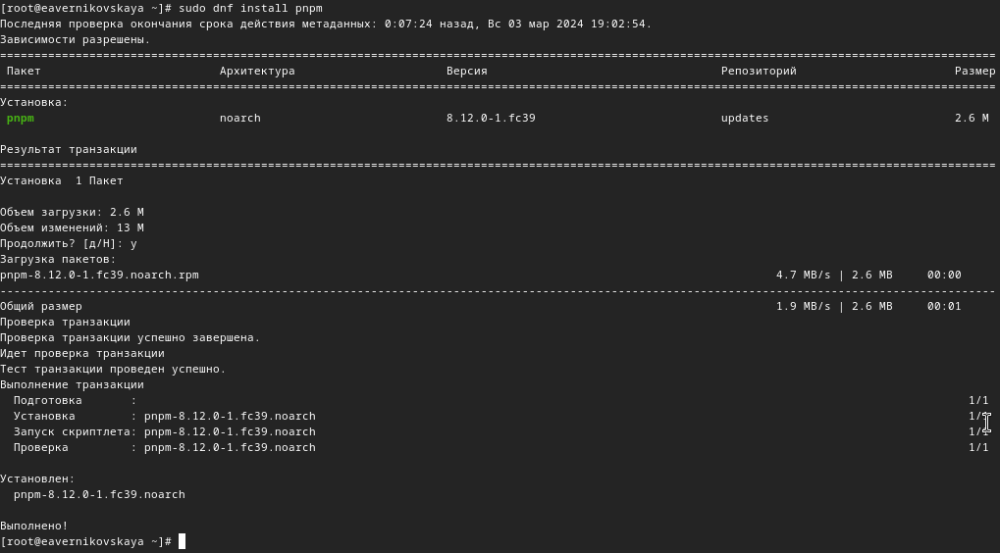{#fig:004 width=70%}

## Настройка Node.js

Запускаем pnpm с помощью *pnpm setup*, далее выполняем команду *source ~/.bashrc* (рис. 5), (рис. 6)

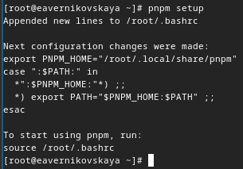{#fig:005 width=50%}

## Настройка Node.js

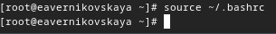{#fig:006 width=70%}

## Общепринятые коммиты

Устанавливаем пакет commitizen с помощью команды *pnpm add -g commitizen*. Данная программа используется для помощи в форматировании коммитов (рис. 7)

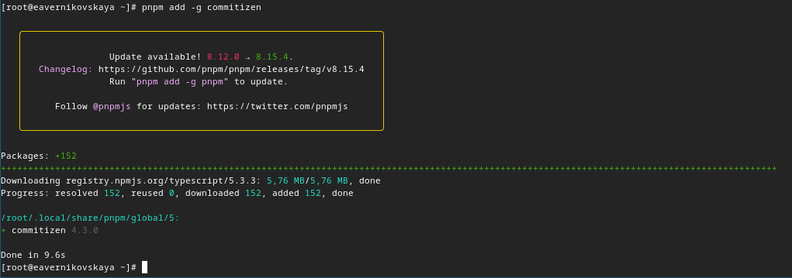{#fig:007 width=70%}

## Общепринятые коммиты

Устанавливаем пакет standard-changelog с помощью команды *pnpm add -g standard-changelog*. Данная программа используется для помощи в создании логов (рис. 8)

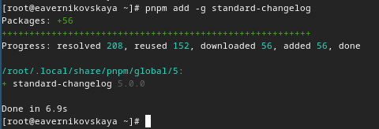{#fig:008 width=70%}

## Общепринятые коммиты

Создаём репозиторий на GitHub. Называем его git-extended (рис. 9)

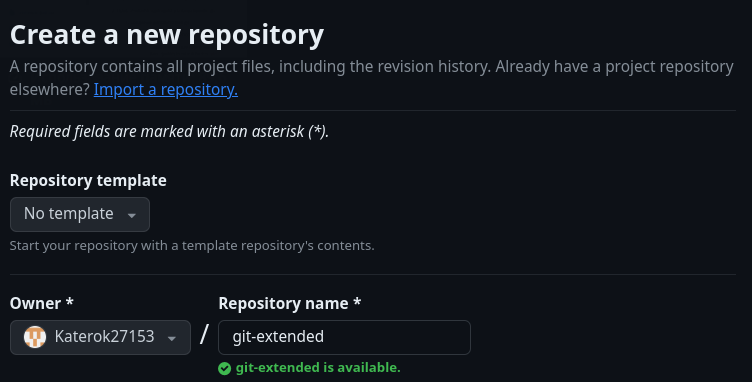{#fig:009 width=70%}

## Общепринятые коммиты

Далее клонируем созданный репозиторий, с помощью *git clone --recursive* (рис. 10)

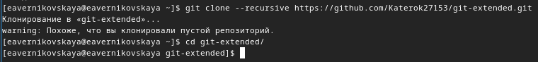{#fig:010 width=70%}

## Общепринятые коммиты

Создаём пустой файл, чтобы активировать репозиторий, делаем первый коммит и выкладываем на github (рис. 11)

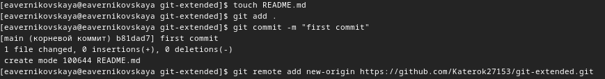{#fig:011 width=70%}

## Общепринятые коммиты

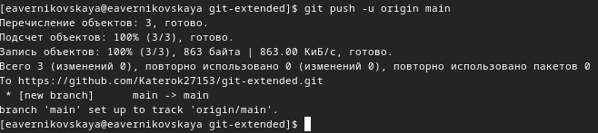{#fig:012 width=70%}

## Общепринятые коммиты

Выполняем конфигурацию для пакетов Node.js, с помощью команды *pnpm init* (рис. 13)

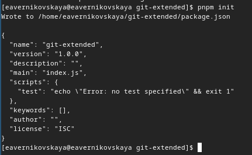{#fig:013 width=60%}

## Общепринятые коммиты

Далее редактируем файл package.json, вставив в него команду для формирования коммитов и заполнив информацию о названии, лицензии и т.д. (рис. 14)

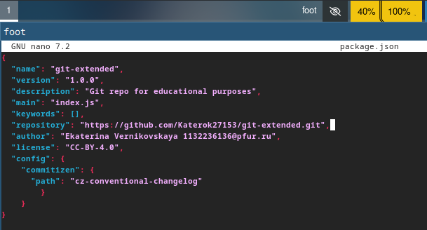{#fig:014 width=60%}

## Общепринятые коммиты

После добавляем новые файлы, выполняем коммит и отправляем на github, с помощью *git add .*, *git cz* и *git push* (рис. 15), (рис. 16)

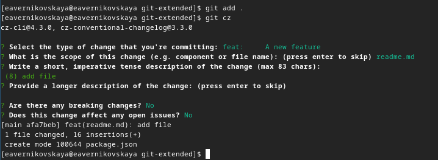{#fig:015 width=70%}

## Общепринятые коммиты

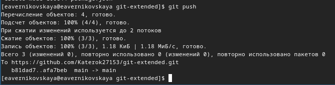{#fig:016 width=70%}

## Общепринятые коммиты

Инициализируем git-flow введя *git flow init*. Префикс для ярлыков устанавливаем в *v* (рис. 17)

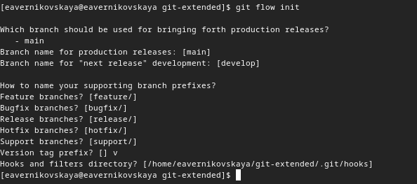{#fig:017 width=70%}

## Общепринятые коммиты

Проверяем, что мы находимся на ветке develop с помощью *git branch* (рис. 18)

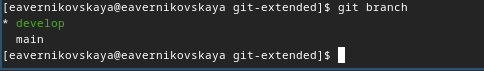{#fig:018 width=70%}

## Общепринятые коммиты

Далее загружаем весь репозиторий в хранилище командой *git push --all* (рис. 19)

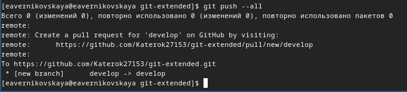{#fig:019 width=70%}

## Общепринятые коммиты

После устанавливаем внешнюю ветку как вышестоящую для ветки develop (рис. 20)

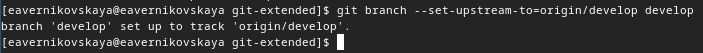{#fig:020 width=70%}

## Общепринятые коммиты

Создаём релиз с версией 1.0.0 введя *git flow release start 1.0.0* (рис. 21)

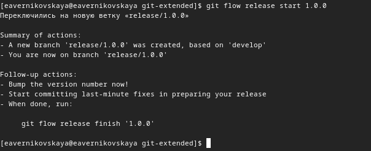{#fig:021 width=70%}

## Общепринятые коммиты

Потом создаём журнал изменений, с помощью *standard-changelog --first-release* (рис. 22)

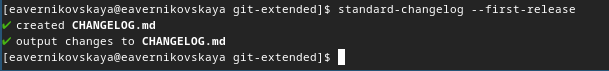{#fig:022 width=70%}

## Общепринятые коммиты

Добавляем журнал изменений в индекс (рис. 23)

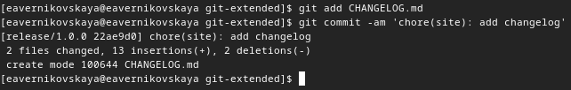{#fig:023 width=70%}

## Общепринятые коммиты

Заливаем релизную ветку в основную ветку введя *git flow release finish 1.0.0* (рис. 24)

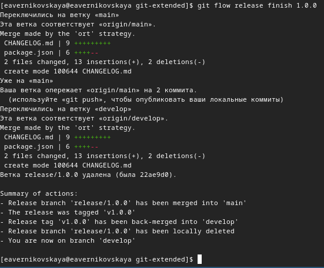{#fig:024 width=40%}

## Общепринятые коммиты

Далее отправляем данные на github с помощью *git push --all* и *git push --tags* (рис. 25)

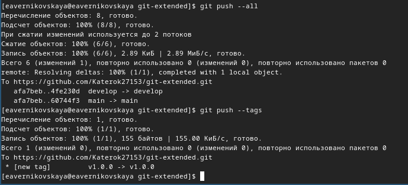{#fig:025 width=70%}

## Общепринятые коммиты

Создаём релиз на github (рис. 26)

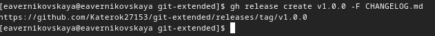{#fig:026 width=70%}

## Общепринятые коммиты

Далее создаём ветку для новой функциональности введя (рис. 27)

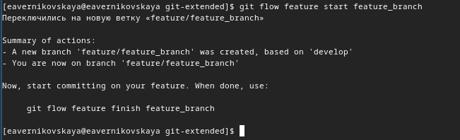{#fig:027 width=70%}

## Общепринятые коммиты

После оъединяем ветку feature_branch c develop (рис. 28)

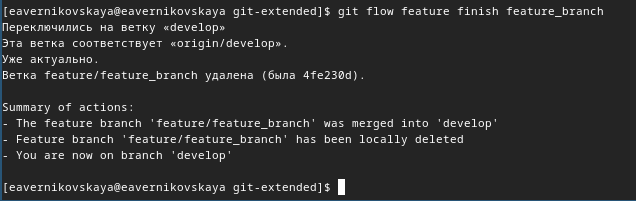{#fig:028 width=70%}

## Общепринятые коммиты

Создаём релиз с версией 1.2.3, ввведя *git flow release start 1.2.3* (рис. 29)

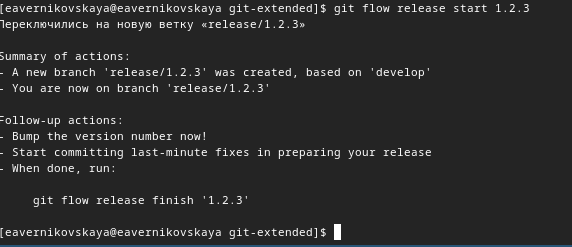{#fig:029 width=70%}

## Общепринятые коммиты

После редактируем файл package.json: изменяем версию на 1.2.3 (рис. 30)

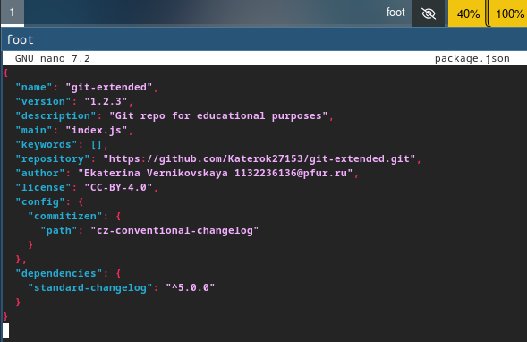{#fig:030 width=60%}

## Общепринятые коммиты

Снова создаём журнал изменений (рис. 31)

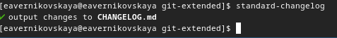{#fig:031 width=70%}

## Общепринятые коммиты

Добавляем журнал изменений в индекс (рис. 32)

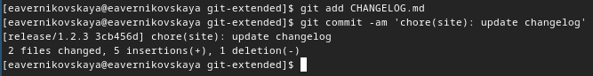{#fig:032 width=70%}

## Общепринятые коммиты

Заливаем релизную ветку в основную введя команду *git flow release finish 1.2.3* (рис. 33) 

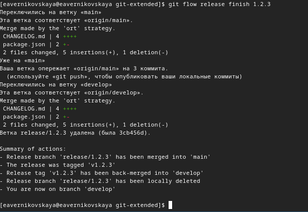{#fig:033 width=50%}

## Общепринятые коммиты

Отправляем данные на github (рис. 34)

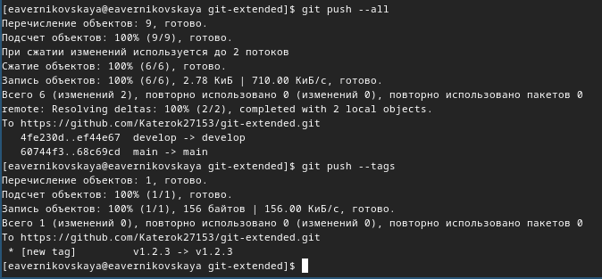{#fig:034 width=70%}

## Общепринятые коммиты

И последним шагом создаём релиз на github (рис. 35)

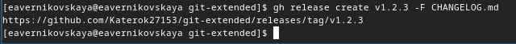{#fig:035 width=70%}

## Общепринятые коммиты

Далее заходим на github и видим что всё получилось!!! Все релизы на github (рис. 36)

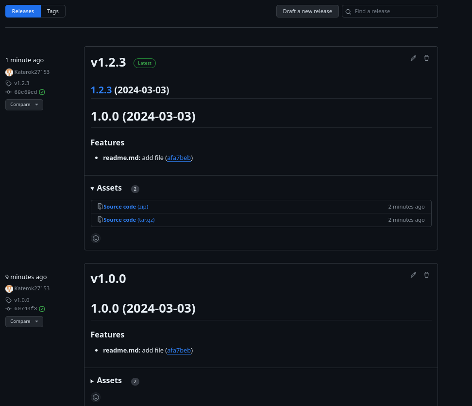{#fig:036 width=40%}

# Подведение итогов

## Выводы

В ходе выполнения лабораторной работы мы получили навыки правильной работы с репозиториями git, а также научились создавать релизы.

## Список литературы

1. Лаборатораня работа №4 [Электронный ресурс] URL: https://esystem.rudn.ru/mod/page/view.php?id=1098937#org5411099
2. Список лицензий [Электронный ресурс] URL: https://spdx.org/licenses/
