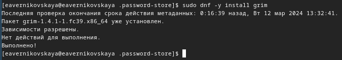

---
## Front matter
lang: ru-RU
title: Лабораторная работа №5
subtitle: Операционные системы
author:
  - Верниковская Е. А., НПИбд-01-23
institute:
  - Российский университет дружбы народов, Москва, Россия
date: 14 марта 2024

## i18n babel
babel-lang: russian
babel-otherlangs: english

## Formatting pdf
toc: false
toc-title: Содержание
slide_level: 2
aspectratio: 169
section-titles: true
theme: metropolis
header-includes:
 - \metroset{progressbar=frametitle,sectionpage=progressbar,numbering=fraction}
 - '\makeatletter'
 - '\beamer@ignorenonframefalse'
 - '\makeatother'
 
## Fonts
mainfont: PT Serif
romanfont: PT Serif
sansfont: PT Sans
monofont: PT Mono
mainfontoptions: Ligatures=TeX
romanfontoptions: Ligatures=TeX
sansfontoptions: Ligatures=TeX,Scale=MatchLowercase
monofontoptions: Scale=MatchLowercase,Scale=0.9
---

# Вводная часть

## Цель работы

Настроить рабочую среду и получить навыки работы с менеджером паролей pass и с chezmoi.

## Задание

1. Установить gopass и настроить всё, что надо.
2. Настроить интерфейс с браузером.
3. Установить chezmoi.
4. Использовать chezmoi на нескольких машинах.

# Выполнение лабораторной работы

## Менеджер паролей pass

РАБОТА С МЕНЕДЖЕРОМ ПАРОЛЕЙ PASS

## Установка

Устанавливаем pass введя *sudo dnf install pass pass-otp* (рис. 1)

{#fig:001 width=70%}

## Установка

Устанавливаем gopass введя *sudo dnf install gopass* (рис. 2)

{#fig:002 width=70%}

## Настройка

Просмотрим список ключей, введя *gpg --list-secret-keys* (рис. 3)

{#fig:003 width=70%}

## Настройка

Далее инициализируем хранилище командой *pass init <gpg-id or email>*. Я ввела email (рис. 4)

{#fig:004 width=70%}

## Настройка

После создаём структуру git с помощью *pass git init* (рис. 5)

{#fig:005 width=70%}

## Настройка

Далее создаём репозиторий с именем pass (рис. 6)

{#fig:006 width=60%}

## Настройка

Задаём адрес репозитория на хостинге, введя *pass git remote add origin https://github.com/<git_username>/<git_repo>.git* (рис. 7)

{#fig:007 width=70%}

## Настройка

Потом выполняем синхронизацию с помощью двух команд *pass git push* и *pass git pull* (рис. 8)

{#fig:008 width=70%}

## Настройка

Далее вручную коммитим и выкладываем изменения (рис. 9)

{#fig:009 width=70%}

## Настройка

Проверяем статус синхронизации командой *pass git status* (рис. 10)

{#fig:010 width=70%}

## Настройка интерфейса с браузером

Переходим на сайт с плагином для Firefox и добавляем этот плагин (рис. 11)

{#fig:011 width=30%}

## Настройка интерфейса с браузером

Далее подключаем репозиторий и скачиваем  browserpass, с помощью двух команд: *dnf copr enable maximbaz/browserpass* и *dnf install browserpass* (рис. 12), (рис. 13)

{#fig:012 width=70%}

## Настройка интерфейса с браузером

{#fig:013 width=70%}

## Сохранение пароля

Создаём новый файл с помощью *touch* и добавляем пароль с помощью команды *pass insert [FILENAME]* (рис. 14) 

{#fig:014 width=70%}

## Сохранение пароля

Отображаем пароль для указанного файла командой *pass [FILENAME]* (рис. 15) 

{#fig:015 width=70%}

## Сохранение пароля

Далее можно заменить существующий пароль командой *pass generate --in-place FILENAME*. Сгенерируется новый рандомный пароль (рис. 16)

{#fig:016 width=70%}

## Управление файлами конфигурации

РАБОТА С CHEZMOI

## Дополнительное программное обеспечение

Устанавливаем дополнительтное программное обеспечение с помощью *sudo dnf -y install* (рис. 17), (рис. 18), (рис.19), (рис. 20), (рис. 21), (рис. 22), (рис. 23), (рис. 24), (рис. 25), (рис. 26]), (рис. 27), (рис. 28)

{#fig:017 width=70%}

## Дополнительное программное обеспечение

{#fig:018 width=70%}

## Дополнительное программное обеспечение

{#fig:019 width=70%}

## Дополнительное программное обеспечение

{#fig:020 width=70%}

## Дополнительное программное обеспечение

{#fig:021 width=70%}

## Дополнительное программное обеспечение

{#fig:022 width=70%}

## Дополнительное программное обеспечение

{#fig:023 width=70%}

## Дополнительное программное обеспечение

{#fig:024 width=70%}

## Дополнительное программное обеспечение

{#fig:025 width=70%}

## Дополнительное программное обеспечение

{#fig:026 width=70%}

## Дополнительное программное обеспечение

{#fig:027 width=70%}

## Дополнительное программное обеспечение

{#fig:028 width=70%}

## Дополнительное программное обеспечение

Далее устанавливаем шрифты. Сначала подключаем репозиторий, потом ищем нужное название и устанавливаем нужные шрифты (рис. 29), (рис. 30), (рис. 31)

{#fig:029 width=70%}

## Дополнительное программное обеспечение

{#fig:030 width=70%}

## Дополнительное программное обеспечение

{#fig:031 width=70%}

## Установка

Устанавливаем chezmoi с помощью команды *sh -c "$(wget -qO- chezmoi.io/get)"* (рис. 32)

{#fig:032 width=70%}

## Создание собственного репозитория с помощью утилит

Создаём свой репозиторий для конфигурационных файлов на основе шаблона, с помощью *gh repo create* (рис. 33)

{#fig:033 width=70%}

## Подключение репозитория к своей системе

Инициализируем chezmoi с нашим репозиторием dotfiles (рис. 34)

{#fig:034 width=70%}

## Подключение репозитория к своей системе

Проверяем какие изменение внёс chezmoi в домашний каталог, введя *chezmoi diff* (рис. 35) 

{#fig:035 width=70%}

## Подключение репозитория к своей системе

Так нас устраивает большое количество внесённых изменений мы запускаем команду *chezmoi apply -v* (рис. 36) 

{#fig:036 width=70%}

## Использование chezmoi на нескольких машинах

В качестве второй виртуальной машины я выбрала kali. Сначала устанавливаем на kali chezmoi (рис. 37)

{#fig:037 width=70%}

## Использование chezmoi на нескольких машинах

На второй машине инициализируем chezmoi с нашим репозиторием dotfiles (рис. 38)

{#fig:038 width=70%}

## Использование chezmoi на нескольких машинах

Снова проверяем какие изменения внесёт chezmoi командой *chezmoi diff*, и если изменения устраивают вводим команду *chezmoi apply -v* (рис. 39), (рис. 40)

{#fig:039 width=70%}

## Использование chezmoi на нескольких машинах

{#fig:040 width=70%}

## Использование chezmoi на нескольких машинах

Выполняем команду *chezmoi update -v*  - получаем и применяем последние изменения из нашего репозитория (рис. 41)

{#fig:041 width=70%}

## Настройка новой машины с помощью одной команды

Настраиваем новую машину с помощью одной команды *chezmoi init --apply https://github.com/<username>/dotfiles.git* (рис. 42)

{#fig:042 width=70%}

## Ежедневные операции c chezmoi

Извлекаем изменения из репозитория и применяем их одной командой *chezmoi update* (рис. 43)

{#fig:043 width=70%}

## Ежедневные операции c chezmoi

Далее выполняем *chezmoi git pull -- --autostash --rebase && chezmoi diff* (рис. 44])

{#fig:044 width=70%}

## Ежедневные операции c chezmoi

Так как мы довольны изменениями то применяем их введя команду *chezmoi apply* (рис. 45)

{#fig:045 width=70%}

## Ежедневные операции c chezmoi

Включем функцию автоматического фиксирования и отправки изменений в репозиторий добавив в файл  конфигурации ~/.config/chezmoi/chezmoi.toml следующее: 
- [git]
    autoCommit = true
    autoPush = true (рис. 46)
    
{#fig:046 width=70%}

# Подведение итогов

## Выводы

В ходе выполнения лабораторной рбаоты мы настроили рабочую среду и получили навыки работы с менеджером паролей pass и с chezmoi.

## Список литературы

1. Лаборатораня работа №5 [Электронный ресурс] URL: https://esystem.rudn.ru/mod/page/view.php?id=1098939#org2695679
2. Плагин для Firefox[Электронный ресурс] URL: https://addons.mozilla.org/en-US/firefox/addon/browserpass-ce/.
