---
## Front matter
title: "Отчёт по лабораторной работе №5"
subtitle: "Дисциплина: Операционные системы"
author: "Верниковская Екатерина Андреевна"

## Generic otions
lang: ru-RU
toc-title: "Содержание"

## Bibliography
bibliography: bib/cite.bib
csl: pandoc/csl/gost-r-7-0-5-2008-numeric.csl

## Pdf output format
toc: true # Table of contents
toc-depth: 2
lof: true # List of figures
lot: true # List of tables
fontsize: 12pt
linestretch: 1.5
papersize: a4
documentclass: scrreprt
## I18n polyglossia
polyglossia-lang:
  name: russian
  options:
	- spelling=modern
	- babelshorthands=true
polyglossia-otherlangs:
  name: english
## I18n babel
babel-lang: russian
babel-otherlangs: english
## Fonts
mainfont: PT Serif
romanfont: PT Serif
sansfont: PT Sans
monofont: PT Mono
mainfontoptions: Ligatures=TeX
romanfontoptions: Ligatures=TeX
sansfontoptions: Ligatures=TeX,Scale=MatchLowercase
monofontoptions: Scale=MatchLowercase,Scale=0.9
## Biblatex
biblatex: true
biblio-style: "gost-numeric"
biblatexoptions:
  - parentracker=true
  - backend=biber
  - hyperref=auto
  - language=auto
  - autolang=other*
  - citestyle=gost-numeric
## Pandoc-crossref LaTeX customization
figureTitle: "Рис."
tableTitle: "Таблица"
listingTitle: "Листинг"
lofTitle: "Список иллюстраций"
lotTitle: "Список таблиц"
lolTitle: "Листинги"
## Misc options
indent: true
header-includes:
  - \usepackage{indentfirst}
  - \usepackage{float} # keep figures where there are in the text
  - \floatplacement{figure}{H} # keep figures where there are in the text
---

# Цель работы

Настроить рабочую среду и получить навыки работы с менеджером паролей pass и с chezmoi.

# Задание

1. Установить gopass и настроить всё, что надо.
2. Настроить интерфейс с браузером.
3. Установить chezmoi.
4. Использовать chezmoi на нескольких машинах.

# Выполнение лабораторной работы

## Менеджер паролей pass

### Установка

Установим pass и gopass, с помощью двух команд: *dnf install pass pass-otp* и *dnf install gopass* (рис. [-@fig:001]), (рис. [-@fig:002])

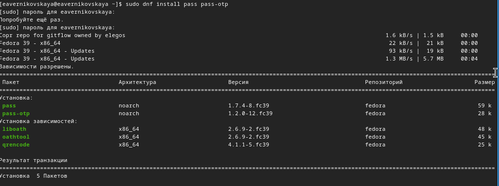{#fig:001 width=70%}

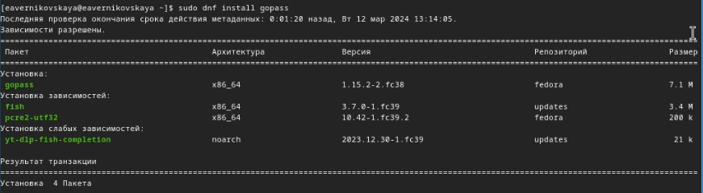{#fig:002 width=70%}

### Настройка

Просмотрим список ключей, введя *gpg --list-secret-keys* (рис. [-@fig:003])

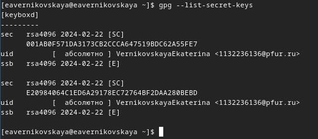{#fig:003 width=70%}

Далее инициализируем хранилище командой *pass init <gpg-id or email>*. Я ввела email (рис. [-@fig:004])

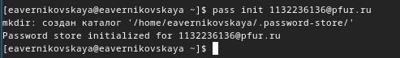{#fig:004 width=70%}

Создаём структуру с помощью *pass git init* (рис. [-@fig:005])

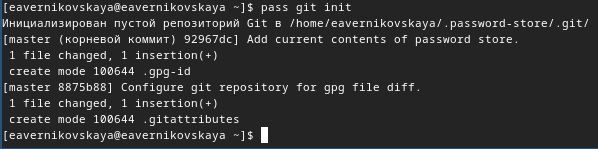{#fig:005 width=70%}

Далее создаём репозиторий с именем pass и задаём адрес репозитория на хостинге, введя *pass git remote add origin https://github.com/<git_username>/<git_repo>.git* (рис. [-@fig:006]), (рис. [-@fig:007])

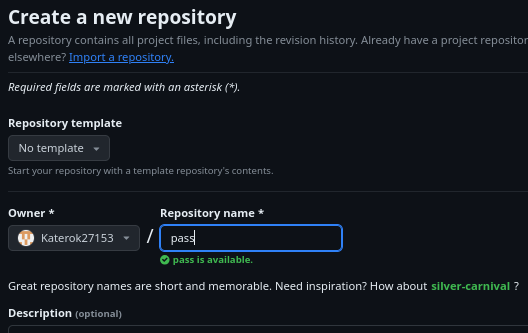{#fig:006 width=70%}

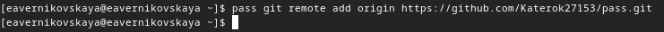{#fig:007 width=70%}

Потом выполняем синхронизацию с помощью двух команд *pass git push* и *pass git pull* (рис. [-@fig:008])

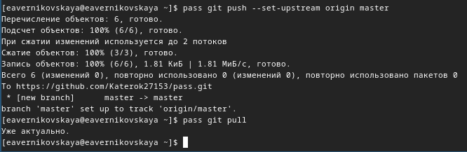{#fig:008 width=70%}

Далее вручную коммитим и выкладываем изменения (рис. [-@fig:009])

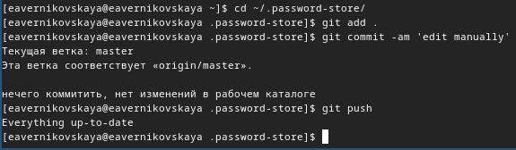{#fig:009 width=70%}

Проверяем статус синхронизации командой *pass git status* (рис. [-@fig:010])

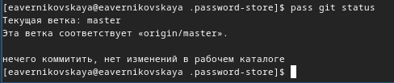{#fig:010 width=70%}

### Настройка интерфейса с браузером

Переходим на сайт с плагином для Firefox и добавляем этот плагин (рис. [-@fig:012]), (рис. [-@fig:012])

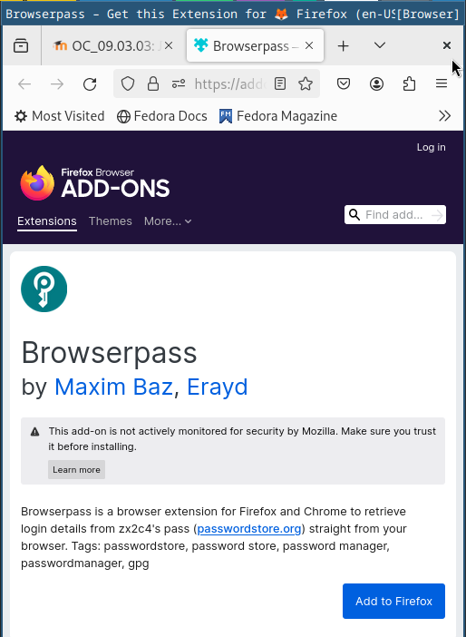{#fig:011 width=70%}

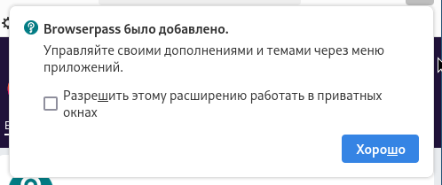{#fig:012 width=70%}

Далее подключаем репозиторий и скачиваем  browserpass, с помощью двух команд: *dnf copr enable maximbaz/browserpass* и *dnf install browserpass* (рис. [-@fig:013]), (рис. [-@fig:014])

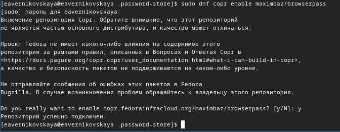{#fig:013 width=70%}

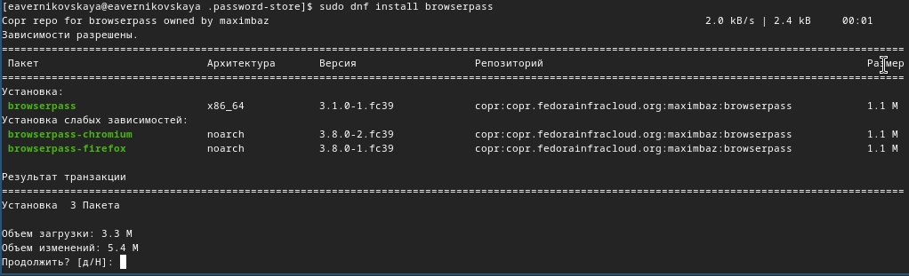{#fig:014 width=70%}

### Сохранение пароля

Создаём новый файл с помощью *touch* и добавляем пароль с помощью команды *pass insert [FILENAME]* (рис. [-@fig:015]) 

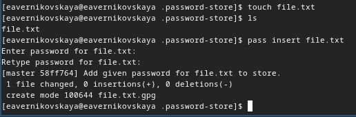{#fig:015 width=70%}

Отобразить пароль для указанного файла можно командой *pass [FILENAME]* (рис. [-@fig:016]) 

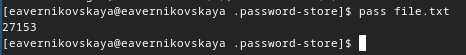{#fig:016 width=70%}

Далее можно заменить существующий пароль командой *pass generate --in-place FILENAME*. Сгенерируется новый рандомный пароль (рис. [-@fig:017])

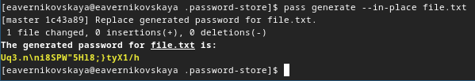{#fig:017 width=70%}

## Управление файлами конфигурации

### Дополнительное программное обеспечение

Утанавливаем дополнительное программное обеспечение (рис. [-@fig:018]), (рис. [-@fig:019]), (рис. [-@fig:020]), (рис. [-@fig:021]), (рис. [-@fig:022]), (рис. [-@fig:023]), (рис. [-@fig:024]), (рис. [-@fig:025]), (рис. [-@fig:026]), (рис. [-@fig:027]), (рис. [-@fig:028]), (рис. [-@fig:029])

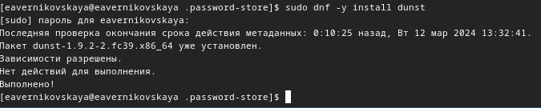{#fig:018 width=70%}

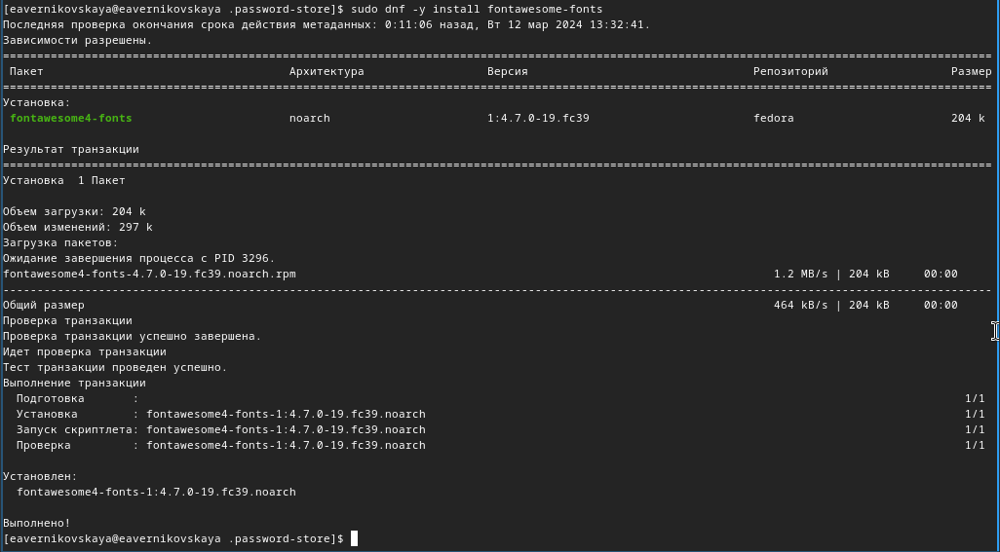{#fig:019 width=70%}

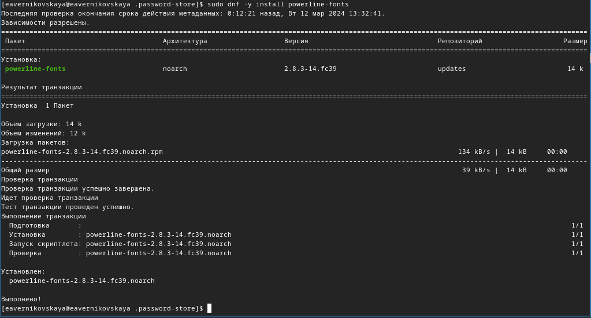{#fig:020 width=70%}

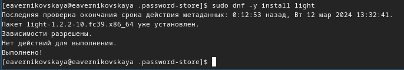{#fig:021 width=70%}

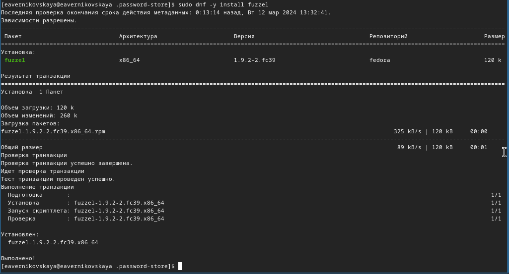{#fig:022 width=70%}

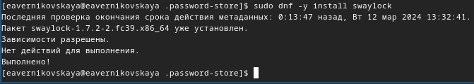{#fig:023 width=70%}

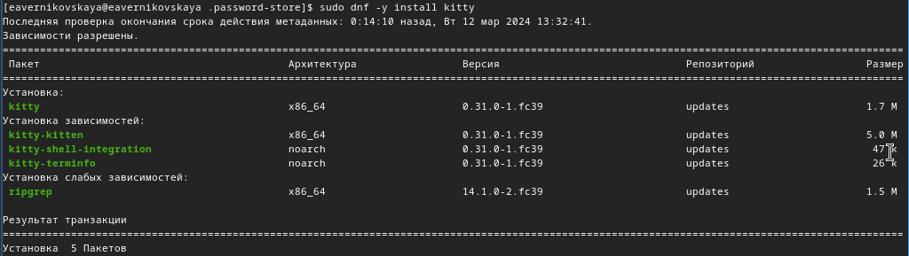{#fig:024 width=70%}

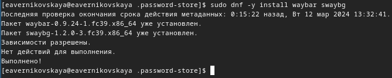{#fig:025 width=70%}

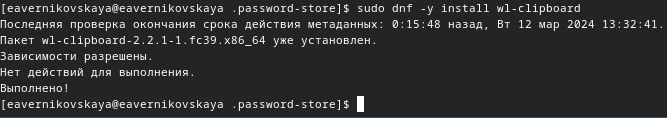{#fig:026 width=70%}

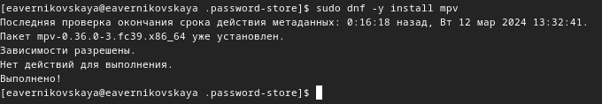{#fig:027 width=70%}

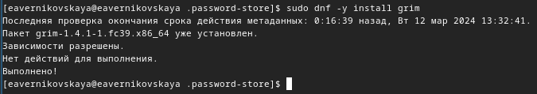{#fig:028 width=70%}

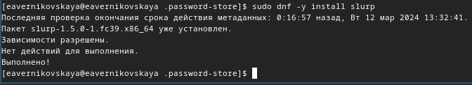{#fig:029 width=70%}

Далее устанавливаем шрифты. Сначала подключаем репозиторий, потом ищем нужное название и устанавливаем нужные шрифты (рис. [-@fig:030]), (рис. [-@fig:031]), (рис. [-@fig:032])

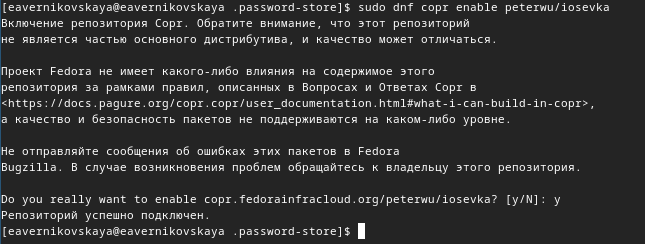{#fig:030 width=70%}

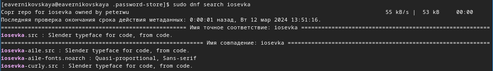{#fig:031 width=70%}

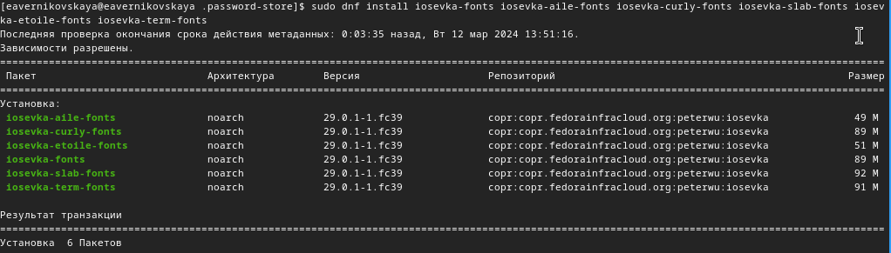{#fig:032 width=70%}

### Установка

Устанавливаем chezmoi с помощью команды *sh -c "$(wget -qO- chezmoi.io/get)"* (рис. [-@fig:033])

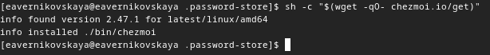{#fig:033 width=70%}

### Создание собственного репозитория с помощью утилит

Создаём свой репозиторий для конфигурационных файлов на основе шаблона, с помощью *gh repo create* (рис. [-@fig:034])

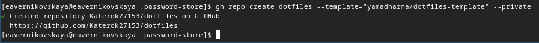{#fig:034 width=70%}

### Подключение репозитория к своей системе

Переносим бинарный файл chezmoi в папку ~/usr/lacal/bin (рис. [-@fig:035])

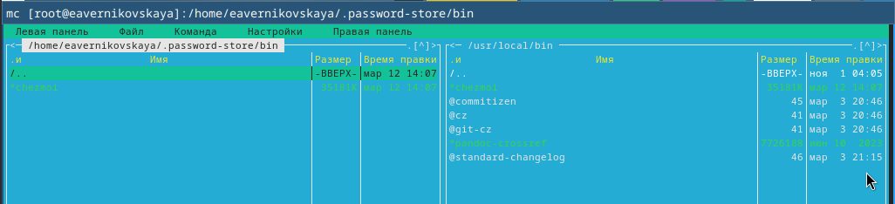{#fig:035 width=70%}

Инициализируем chezmoi с нашим репозиторием dotfiles (рис. [-@fig:036])

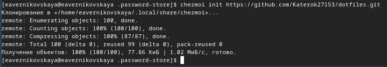{#fig:036 width=70%}

Проверяем какие изменение внёс chezmoi в домашний каталог, введя *chezmoi diff* (рис. [-@fig:037]) 

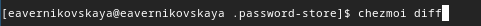{#fig:037 width=70%}

Так нас устраивает большое количество внесённых изменений мы запускаем команду *chezmoi apply -v* (рис. [-@fig:038]) 

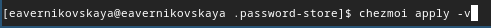{#fig:038 width=70%}

### Использование chezmoi на нескольких машинах

В качестве второй виртуальной машины я выбрала kali. Сначала устанавливаем на kali chezmoi (рис. [-@fig:039])

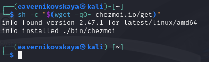{#fig:039 width=70%}

Снова переносим бинарный файл chezmoi в папку ~/usr/lacal/bin (рис. [-@fig:040])

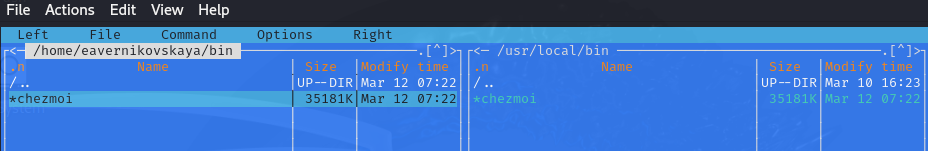{#fig:040 width=70%}

На второй машине инициализируем chezmoi с нашим репозиторием dotfiles (рис. [-@fig:041])

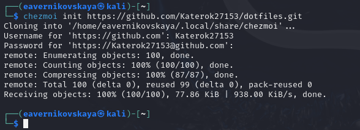{#fig:041 width=70%}

Снова проверяем какие изменения внесёт chezmoi командой *chezmoi diff*, и если изменения устраивают вводим команду *chezmoi apply -v* (рис. [-@fig:042]), (рис. [-@fig:043])

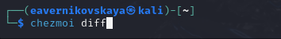{#fig:042 width=70%}

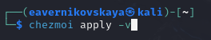{#fig:043 width=70%}

Выполняем команду *chezmoi update -v*  - получаем и применяем последние изменения из нашего репозитория (рис. [-@fig:044])

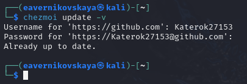{#fig:044 width=70%}

### Настройка новой машины с помощью одной команды

Настраиваем новую машину с помощью одной команды *chezmoi init --apply https://github.com/<username>/dotfiles.git* (рис. [-@fig:045])

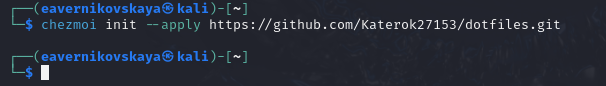{#fig:045 width=70%}

### Ежедневные операции c chezmoi

Извлекаем изменения из репозитория и применяем их одной командой *chezmoi update* (рис. [-@fig:046])

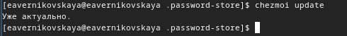{#fig:046 width=70%}

Далее выполняем *chezmoi git pull -- --autostash --rebase && chezmoi diff* (рис. [-@fig:047])

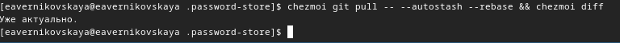{#fig:047 width=70%}

Так как мы довольны изменениями то применяем их введя команду *chezmoi apply* (рис. [-@fig:048])

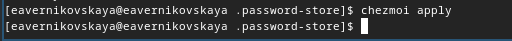{#fig:048 width=70%}

Включем функцию автоматического фиксирования и отправки изменений в репозиторий добавив в файл  конфигурации ~/.config/chezmoi/chezmoi.toml следующее: 
- [git]
    autoCommit = true
    autoPush = true (рис. [-@fig:049])
    
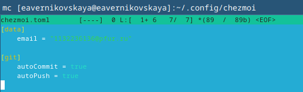{#fig:049 width=70%}
    
# Выводы

В ходе выполнения лабораторной рбаоты мы настроили рабочую среду и получили навыки работы с менеджером паролей pass и с chezmoi

# Список литературы

1. Лаборатораня работа №5 [Электронный ресурс] URL: https://esystem.rudn.ru/mod/page/view.php?id=1098939#org2695679
2. Плагин для Firefox[Электронный ресурс] URL: https://addons.mozilla.org/en-US/firefox/addon/browserpass-ce/.
