---
## Front matter
lang: ru-RU
title: Лабораторная работа №6
subtitle: Операционные системы
author:
  - Верниковская Е. А., НПИбд-01-23
institute:
  - Российский университет дружбы народов, Москва, Россия
date: 14 марта 2024

## i18n babel
babel-lang: russian
babel-otherlangs: english

## Formatting pdf
toc: false
toc-title: Содержание
slide_level: 2
aspectratio: 169
section-titles: true
theme: metropolis
header-includes:
 - \metroset{progressbar=frametitle,sectionpage=progressbar,numbering=fraction}
 - '\makeatletter'
 - '\beamer@ignorenonframefalse'
 - '\makeatother'
 
## Fonts
mainfont: PT Serif
romanfont: PT Serif
sansfont: PT Sans
monofont: PT Mono
mainfontoptions: Ligatures=TeX
romanfontoptions: Ligatures=TeX
sansfontoptions: Ligatures=TeX,Scale=MatchLowercase
monofontoptions: Scale=MatchLowercase,Scale=0.9
---

# Вводная часть

## Цель работы

Приобрести практические навыки взаимодействия пользователя с системой посредством командной строки.

## Задание

1. Определить полное имя домашнего каталога.
2. Перейти в каталог /tmp и вывести содердимое каталога командой ls  с различными опциями.
3. Определить есть ли в каталоге  /var/spool подкаталог с именем cron.
4. Определить кто является владельцом файлов и подкатологов в домашнем каталоге.
5. Создать каталог с именем newdir и проделать в нё разные действия ( создать каталоги, удалить и т.д.)
6. Научиться пользоваться командой man.
7. Научиться пользоваться командой history.

# Выполнение лабораторной работы

## Выполнение лабораторной работы

С помощью команды *pwd* определяем полное имя нашего домашнего каталога (рис. 1)

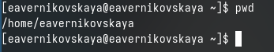{#fig:001 width=70%}

## Выполнение лабораторной работы

С помощью команды *cd* переходим в каталог /tmp (рис. 2)

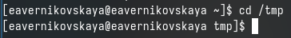{#fig:002 width=70%}

## Выполнение лабораторной работы

Выводим содержимое каталога /tmp с помощью команды *ls* (рис. 3)

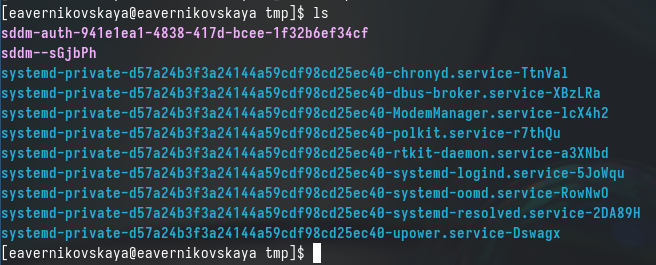{#fig:003 width=70%}

## Выполнение лабораторной работы

Далее мы используем команду ls с различными опциями. Это *ls -l*(отображает подробный список файлов и папок с дополнительной информацией, такой как права доступа к файлу, владелец, группа, размер файла, время последнего изменения и имя файла.) ,*ls -a*(ыводит все файлы и папки, включая скрытые файлы, которые начинаются с точки), *ls - F*(добавляет символ на конец каждого выводимого имени файла или папки для обозначения их типа) и *ls - alF*(Комбинация опций -l, -a, -F) (рис. 4), (рис. 5), (рис. 6), (рис. 7)

## Выполнение лабораторной работы

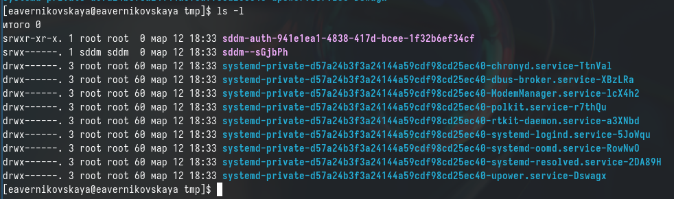{#fig:004 width=70%}

## Выполнение лабораторной работы

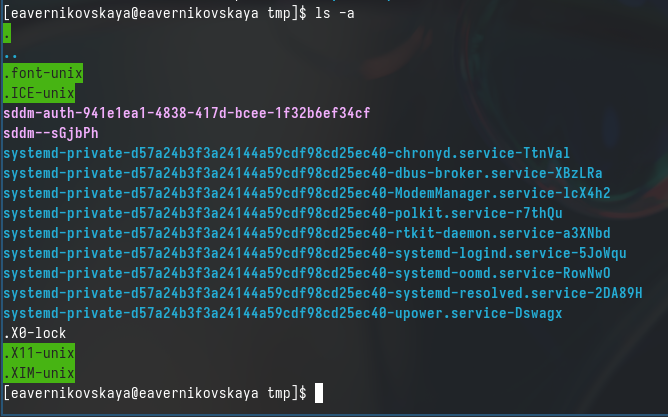{#fig:005 width=70%}

## Выполнение лабораторной работы

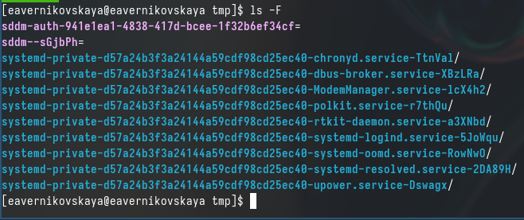{#fig:006 width=70%}

## Выполнение лабораторной работы

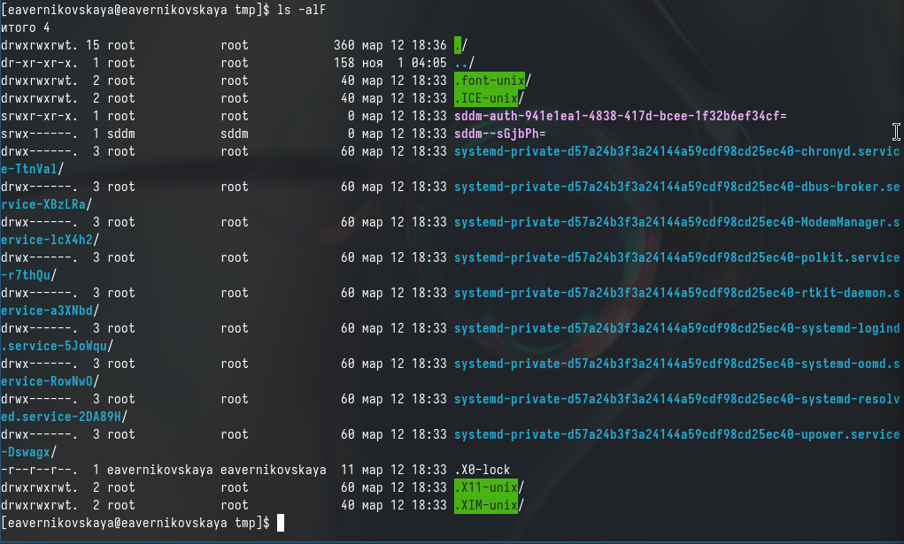{#fig:007 width=70%}

## Выполнение лабораторной работы

Переходим в каталог /var/spool и с помощью команды *ls* определяем есть ли там подкаталог с именем cron. Подкаталог cron есть в каталоге /var/spool (рис. 8)

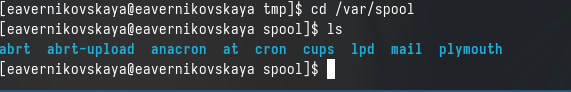{#fig:008 width=70%}

## Выполнение лабораторной работы

Переходим в домашний каталог и с помощью команды *ls -l* выводим содержимое каталога и узнаём  кто является владельцем файлов и подкаталогов (рис. 9)

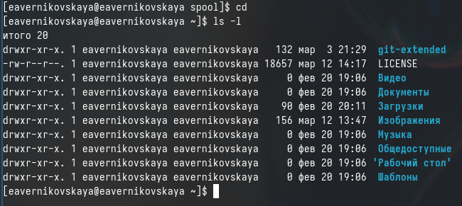{#fig:009 width=70%}

## Выполнение лабораторной работы

В домашнем каталоге создаём каталог с именем newdir (рис. 10)

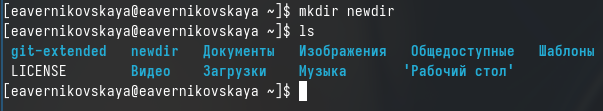{#fig:010 width=70%}

## Выполнение лабораторной работы

В каталоге ~/newdir создаём новый каталог с именем morefun (рис. 11)

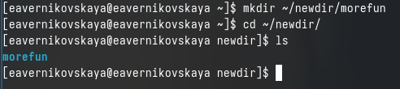{#fig:011 width=70%}

## Выполнение лабораторной работы

Далее в домашнем каталоге создаём одной командой *mkdir* три новых каталога с именами letters, memos, misk (рис. 12)

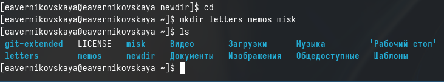{#fig:012 width=70%}

## Выполнение лабораторной работы

Затем удаляем их одной командой *rmdir -p* (рис. 13)

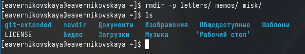{#fig:013 width=70%}

## Выполнение лабораторной работы

Далее пробуем удалить ранее созданный каталог ~/newdir командой *rm*. Но у нас не получится это сделать, так как *rm* удаляет файлы, а не каталоги (рис. 14)

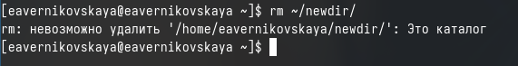{#fig:014 width=70%}

## Выполнение лабораторной работы

После удаляем каталог ~/newdir/morefun из домашнего каталога командой *rmdir -p*. А затем проверяем, был ли каталог удалён (рис. 15)

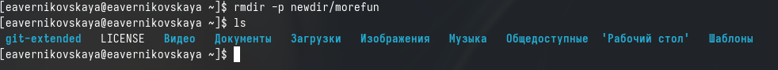{#fig:015 width=70%}

## Выполнение лабораторной работы

- Далее с помощью команды *man* определяем, какую опцию команды ls нужно использовать для просмотра содержимого не только указанного каталога, но и подкаталогов, входящих в него (это -R)
- После с помощью команды man определяем набор опций команды ls, позволяющий отсортировать по времени последнего изменения выводимый список содержимого каталога с развёрнутым описанием файлов (это -lt) (рис. 16), (рис. 17), (рис. 18), (рис. 19), (рис. 20)

## Выполнение лабораторной работы

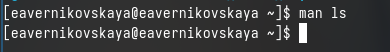{#fig:016 width=70%}

## Выполнение лабораторной работы

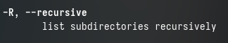{#fig:017 width=70%}

## Выполнение лабораторной работы

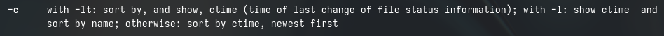{#fig:018 width=70%}

## Выполнение лабораторной работы

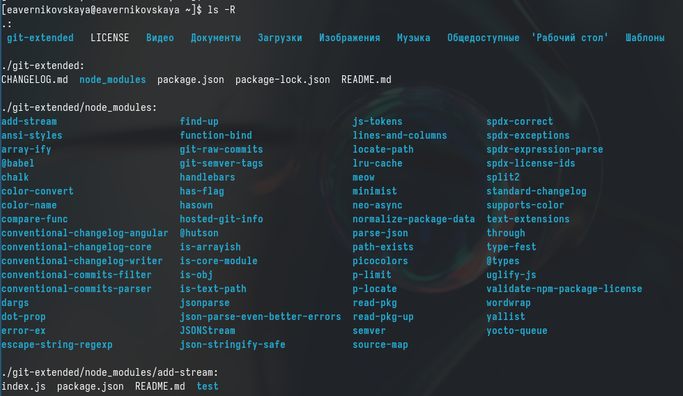{#fig:019 width=70%}

## Выполнение лабораторной работы

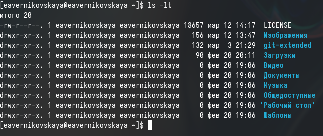{#fig:020 width=70%}

## Выполнение лабораторной работы

Далее используем команду *man* для просмотра описания следующих команд: cd, pwd, mkdir,
rmdir, rm. Просматриваем основные опции этих команд (рис. 21), (рис. 22), (рис. 23), (рис. 24), (рис. 25)

## Выполнение лабораторной работы

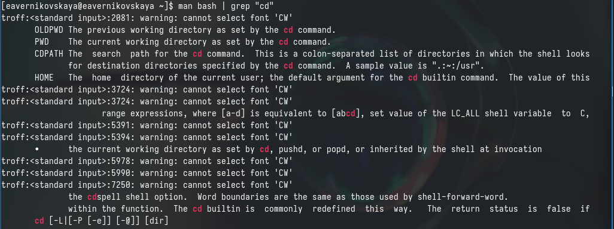{#fig:021 width=70%}

## Выполнение лабораторной работы

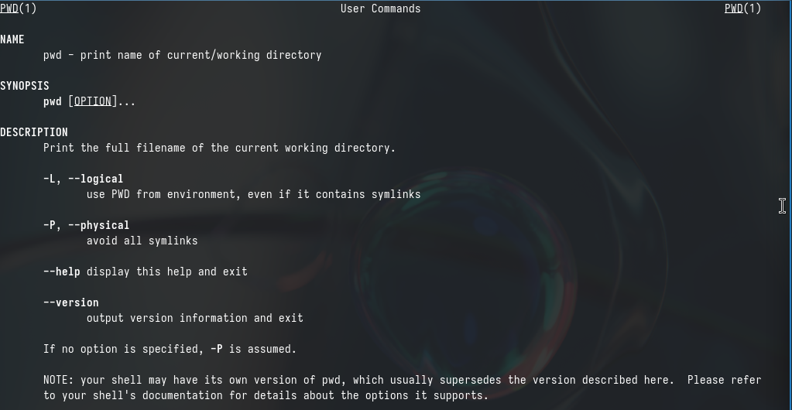{#fig:022 width=70%}

## Выполнение лабораторной работы

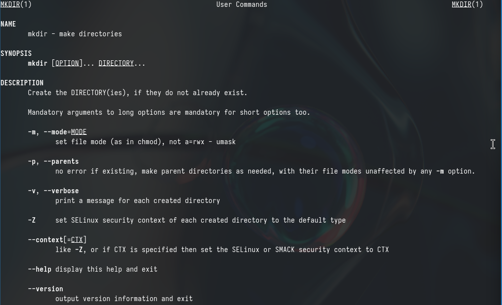{#fig:023 width=70%}

## Выполнение лабораторной работы

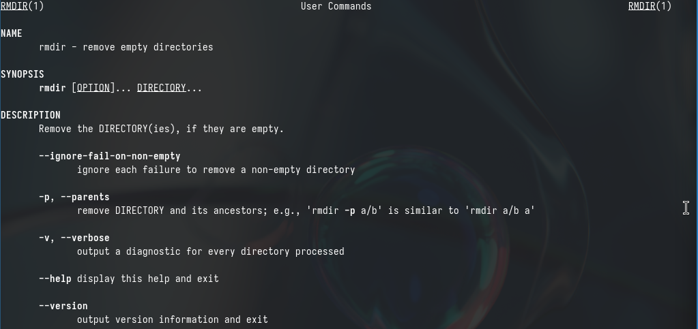{#fig:024 width=70%}

## Выполнение лабораторной работы

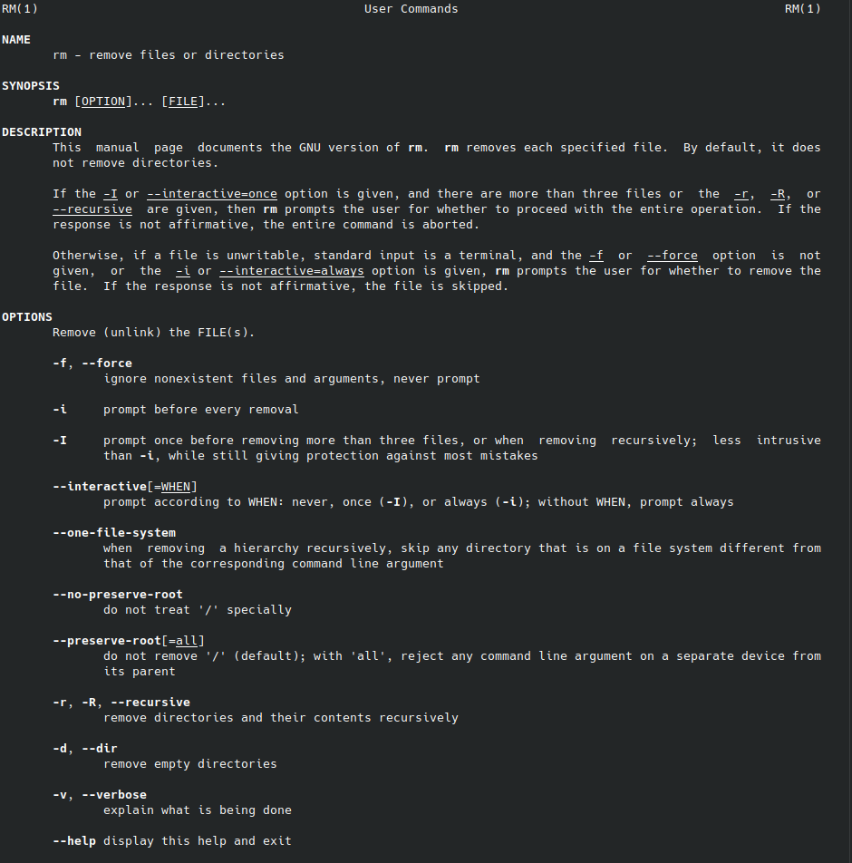{#fig:025 width=40%}

## Выполнение лабораторной работы

С помощью команды *history* просматриваем историю наших команд (рис. 26)

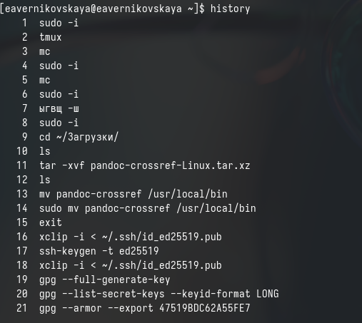{#fig:026 width=40%}

## Выполнение лабораторной работы

Далее выполняем модификацию и исполнение нескольких команд из буфера команд введя при этом *!номер_команды:s/что_меняем/на_что_меняем* (рис. 27), (рис. 28), (рис. 29)

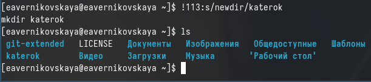{#fig:027 width=70%}

## Выполнение лабораторной работы

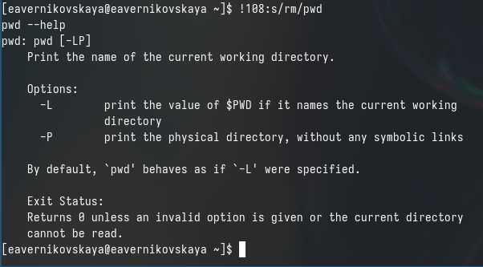{#fig:028 width=70%}

## Выполнение лабораторной работы

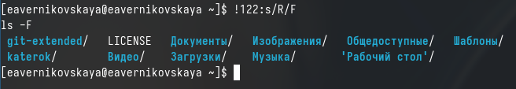{#fig:029 width=70%}

# Подведение итогов

## Выводы

В ходе выполнения лабораторной рбаоты мы приобрели практические навыки взаимодействия пользователя с системой посредством командной строки.

## Список литературы

Не пользовалась сайтами.
