---
## Front matter
title: "Отчёт по лабораторной работе №6"
subtitle: "Дисциплина: Операционные системы"
author: "Верниковская Екатерина Андреевна"

## Generic otions
lang: ru-RU
toc-title: "Содержание"

## Bibliography
bibliography: bib/cite.bib
csl: pandoc/csl/gost-r-7-0-5-2008-numeric.csl

## Pdf output format
toc: true # Table of contents
toc-depth: 2
lof: true # List of figures
lot: true # List of tables
fontsize: 12pt
linestretch: 1.5
papersize: a4
documentclass: scrreprt
## I18n polyglossia
polyglossia-lang:
  name: russian
  options:
	- spelling=modern
	- babelshorthands=true
polyglossia-otherlangs:
  name: english
## I18n babel
babel-lang: russian
babel-otherlangs: english
## Fonts
mainfont: PT Serif
romanfont: PT Serif
sansfont: PT Sans
monofont: PT Mono
mainfontoptions: Ligatures=TeX
romanfontoptions: Ligatures=TeX
sansfontoptions: Ligatures=TeX,Scale=MatchLowercase
monofontoptions: Scale=MatchLowercase,Scale=0.9
## Biblatex
biblatex: true
biblio-style: "gost-numeric"
biblatexoptions:
  - parentracker=true
  - backend=biber
  - hyperref=auto
  - language=auto
  - autolang=other*
  - citestyle=gost-numeric
## Pandoc-crossref LaTeX customization
figureTitle: "Рис."
tableTitle: "Таблица"
listingTitle: "Листинг"
lofTitle: "Список иллюстраций"
lotTitle: "Список таблиц"
lolTitle: "Листинги"
## Misc options
indent: true
header-includes:
  - \usepackage{indentfirst}
  - \usepackage{float} # keep figures where there are in the text
  - \floatplacement{figure}{H} # keep figures where there are in the text
---

# Цель работы

Приобрести практические навыки взаимодействия пользователя с системой посредством командной строки.

# Задание

1. Определить полное имя домашнего каталога.
2. Перейти в каталог /tmp и вывести содердимое каталога командой ls  с различными опциями.
3. Определить есть ли в каталоге  /var/spool подкаталог с именем cron.
4. Определить кто является владельцом файлов и подкатологов в домашнем каталоге.
5. Создать каталог с именем newdir и проделать в нё разные действия ( создать каталоги, удалить и т.д.)
6. Научиться пользоваться командой man.
7. Научиться пользоваться командой history.

# Выполнение лабораторной работы

С помощью команды *pwd* определяем полное имя нашего домашнего каталога (рис. [-@fig:001])

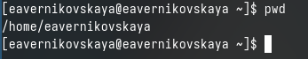{#fig:001 width=70%}

С помощью команды *cd* переходим в каталог /tmp (рис. [-@fig:002])

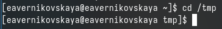{#fig:002 width=70%}

Выводим содержимое каталога /tmp с помощью команды *ls* (рис. [-@fig:003])

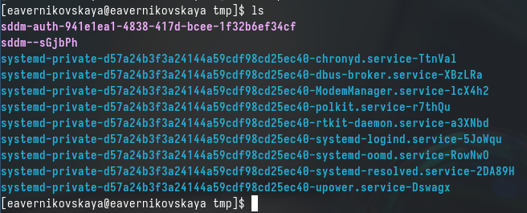{#fig:003 width=70%}

Далее мы используем команду ls с различными опциями. Это *ls -l*(отображает подробный список файлов и папок с дополнительной информацией, такой как права доступа к файлу, владелец, группа, размер файла, время последнего изменения и имя файла.) ,*ls -a*(ыводит все файлы и папки, включая скрытые файлы, которые начинаются с точки), *ls - F*(добавляет символ на конец каждого выводимого имени файла или папки для обозначения их типа) и *ls - alF*(Комбинация опций -l, -a, -F) (рис. [-@fig:004]), (рис. [-@fig:005]), (рис. [-@fig:006]), (рис. [-@fig:007])

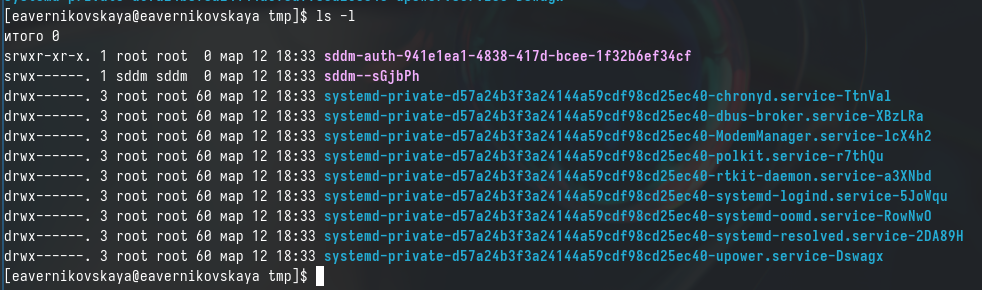{#fig:004 width=70%}

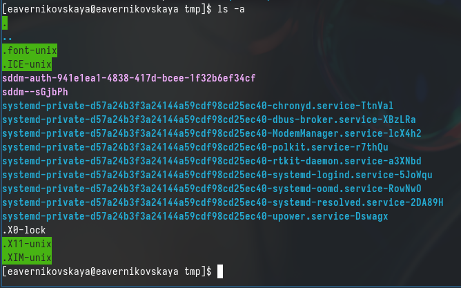{#fig:005 width=70%}

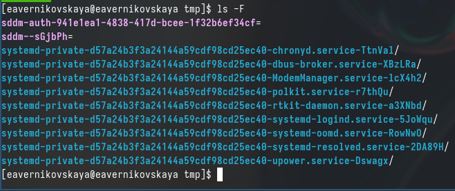{#fig:006 width=70%}

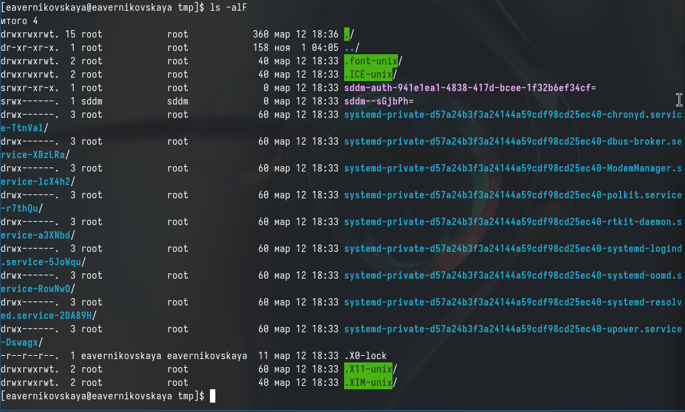{#fig:007 width=70%}

Переходим в каталог /var/spool и с помощью команды *ls* определяем есть ли там подкаталог с именем cron. Подкаталог cron есть в каталоге /var/spool (рис. [-@fig:008])

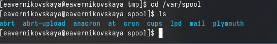{#fig:008 width=70%}

Переходим в домашний каталог и с помощью команды *ls -l* выводим содержимое каталога и узнаём  кто является владельцем файлов и подкаталогов (рис. [-@fig:009])

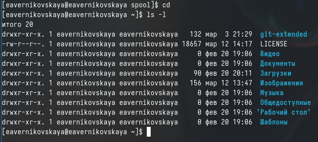{#fig:009 width=70%}
 
В домашнем каталоге создаём каталог с именем newdir (рис. [-@fig:010])

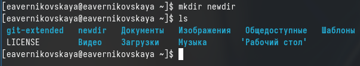{#fig:010 width=70%}

 В каталоге ~/newdir создаём новый каталог с именем morefun (рис. [-@fig:011])

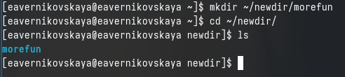{#fig:011 width=70%}

Далее в домашнем каталоге создаём одной командой *mkdir* три новых каталога с именами letters, memos, misk (рис. [-@fig:012])

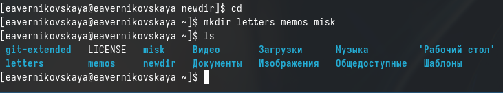{#fig:012 width=70%}

Затем удаляем их одной командой *rmdir -p* (рис. [-@fig:013])

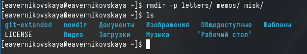{#fig:013 width=70%}

Далее пробуем удалить ранее созданный каталог ~/newdir командой *rm*. Но у нас не получится это сделать, так как *rm* удаляет файлы, а не каталоги (рис. [-@fig:014])

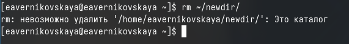{#fig:014 width=70%}

После удаляем каталог ~/newdir/morefun из домашнего каталога командой *rmdir -p*. А затем проверяем, был ли каталог удалён (рис. [-@fig:015])

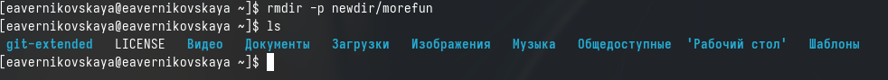{#fig:015 width=70%}

- Далее с помощью команды *man* определяем, какую опцию команды ls нужно использовать для просмотра содержимого не только указанного каталога, но и подкаталогов, входящих в него (это -R)
- После с помощью команды man определяем набор опций команды ls, позволяющий отсортировать по времени последнего изменения выводимый список содержимого каталога с развёрнутым описанием файлов (это -lt) (рис. [-@fig:016]), (рис. [-@fig:017]), (рис. [-@fig:018]), (рис. [-@fig:019]), (рис. [-@fig:020])

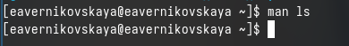{#fig:016 width=70%}

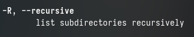{#fig:017 width=70%}

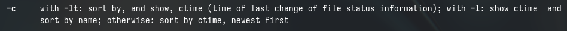{#fig:018 width=70%}

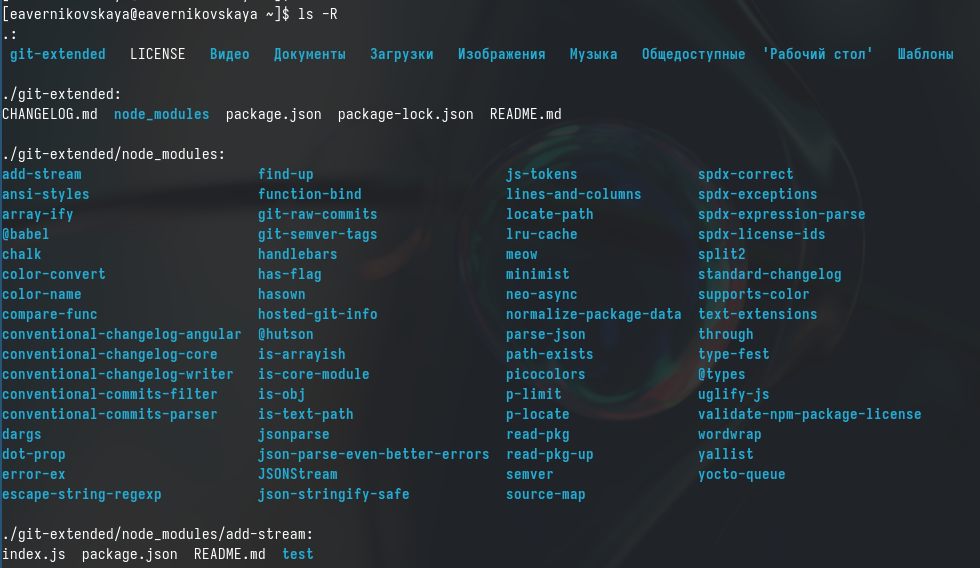{#fig:019 width=70%}

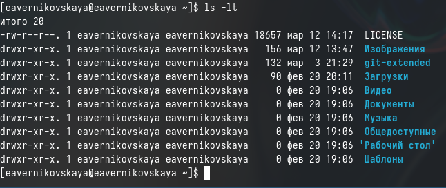{#fig:020 width=70%}

Далее используем команду *man* для просмотра описания следующих команд: cd, pwd, mkdir,
rmdir, rm. Просматриваем основные опции этих команд (рис. [-@fig:021]), (рис. [-@fig:022]), (рис. [-@fig:023]), (рис. [-@fig:024]), (рис. [-@fig:025])

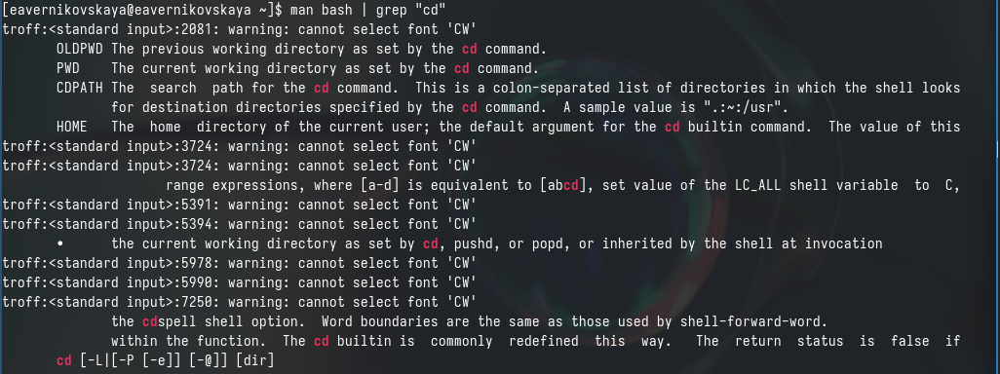{#fig:021 width=70%}

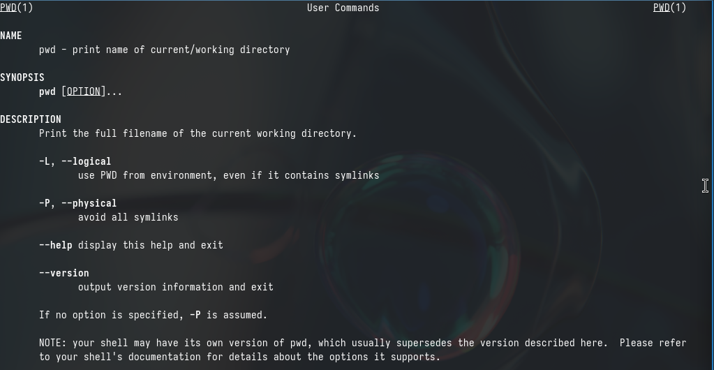{#fig:022 width=70%}

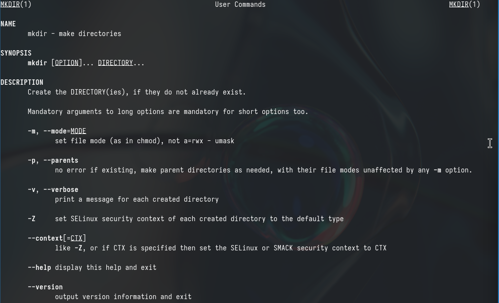{#fig:023 width=70%}

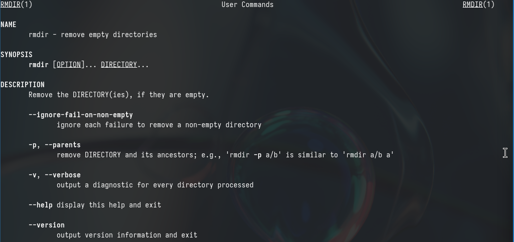{#fig:024 width=70%}

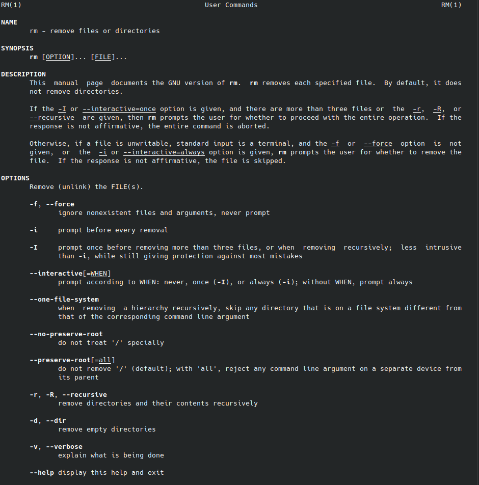{#fig:025 width=70%}

С помощью команды *history* просматриваем историю наших команд (рис. [-@fig:026])

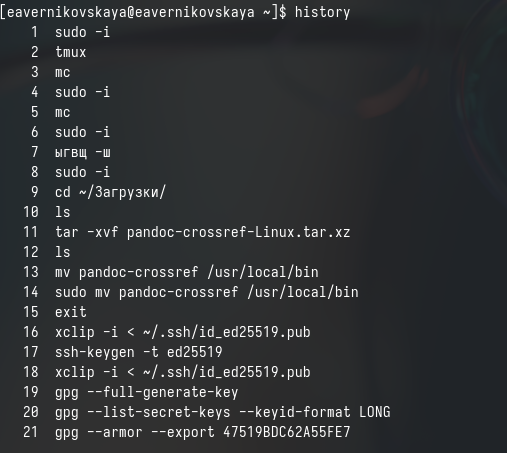{#fig:026 width=70%}

Далее выполняем модификацию и исполнение нескольких команд из буфера команд введя при этом *!номер_команды:s/что_меняем/на_что_меняем* (рис. [-@fig:027]), (рис. [-@fig:028]), (рис. [-@fig:029])

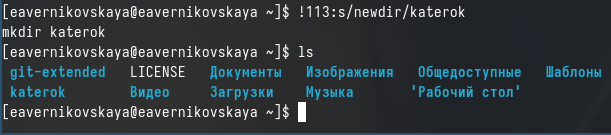{#fig:027 width=70%}

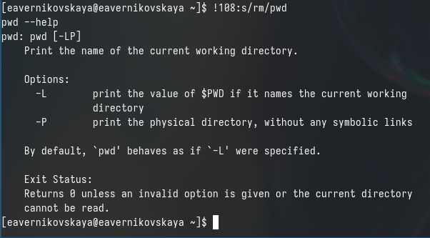{#fig:028 width=70%}

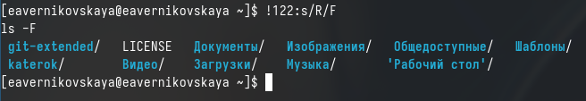{#fig:029 width=70%}

# Ответы на контрольные вопросы

1. Что такое командная строка?

Командная строка - это текстовая система, которая передает команды компьютеру и возвращает результаты пользователю. В операционной системе типа Linux взаимодействие пользователя с системой обычно осуществляется с помощью командной строки посредством построчного ввода команд.

2. При помощи какой команды можно определить абсолютный путь текущего каталога?
Приведите пример.

Для определения абсолютного пути к текущему каталогу используется команда pwd. Например: если я введу pwd в своем домашнем каталоге то получу /home/eavernikovskaya

3. При помощи какой команды и каких опций можно определить только тип файлов
и их имена в текущем каталоге? Приведите примеры.

С помощью команды ls можно определить имена файлов, при помощи опции -F уже мы сможем определить тип файлов, если нам необходимы скрытые файлы, добавим опцию -a. Пример есть в лабораторной работе

4. Каким образом отобразить информацию о скрытых файлах? Приведите примеры.

С помощью команды ls можно определить имена файлов, если нам необходимы скрытые файлы, добавим опцию -a. Пример есть в лабораторной работе.

5. При помощи каких команд можно удалить файл и каталог? Можно ли это сделать
одной и той же командой? Приведите примеры.

rmdir по умолчанию удаляет пустые каталоги, не удаляет файлы. rm удаляет файлы, без дополнительных опций (-d, -r) не будет удалять каталоги. Удалить в одной строчке одной командой можно файл и каталог. Если файл находится в каталоге, используем рекурсивное удаление, если файл и каталог не связаны подобным образом, то добавим опцию -d, введя имена через пробел после утилиты.

6. Каким образом можно вывести информацию о последних выполненных пользователем командах? работы?

Вывести информацию о последних выполненных пользователем команд можно с помощью history. Пример приведет в лабораторной работе.

7. Как воспользоваться историей команд для их модифицированного выполнения? При-
ведите примеры.

Используем синтаксиси !номеркоманды в выводе history:s/что заменяем/на что заменяем. Примеры приведены в лабораторной работе.

8. Приведите примеры запуска нескольких команд в одной строке.

Предположим, я нахожусь не в домашнем каталоге. Если я введу “cd ; ls”, то окажусь в домашнем каталоге и получу вывод файлов внутри него

9. Дайте определение и приведите примера символов экранирования.

Символ экранирования - (обратный слеш) добавление перед спецсимволом обратный слеш, чтобы использовать специальный символ как обычный. Также позволяет читать системе название директорий с пробелом. Пример:
cd work/Операционные системы/

10. Охарактеризуйте вывод информации на экран после выполнения команды ls с опцией l.

Опция -l позволит увидеть дополнительную информацию о файлах в каталоге: время создания, владельца, права доступа

11. Что такое относительный путь к файлу? Приведите примеры использования относи-
тельного и абсолютного пути при выполнении какой-либо команды.

Относительный путь к файлу начинается из той директории, где вы находитесь (она сама не прописывается в пути), он прописывается относительно данной директории. Абсолютный путь начинается с корневого каталога.

12. Как получить информацию об интересующей вас команде?

Использовать man или –help

13. Какая клавиша или комбинация клавиш служит для автоматического дополнения
вводимых команд?

Клавиша Tab.

# Выводы

В ходе выполнения лабораторной рбаоты мы приобрели практические навыки взаимодействия пользователя с системой посредством командной строки.

# Список литературы

Не пользовалась сайтами.
