---
## Front matter
lang: ru-RU
title: Лабораторная работа №7
subtitle: Операционные системы
author:
  - Верниковская Е. А., НПИбд-01-23
institute:
  - Российский университет дружбы народов, Москва, Россия
date: 14 марта 2024

## i18n babel
babel-lang: russian
babel-otherlangs: english

## Formatting pdf
toc: false
toc-title: Содержание
slide_level: 2
aspectratio: 169
section-titles: true
theme: metropolis
header-includes:
 - \metroset{progressbar=frametitle,sectionpage=progressbar,numbering=fraction}
 - '\makeatletter'
 - '\beamer@ignorenonframefalse'
 - '\makeatother'
 
## Fonts
mainfont: PT Serif
romanfont: PT Serif
sansfont: PT Sans
monofont: PT Mono
mainfontoptions: Ligatures=TeX
romanfontoptions: Ligatures=TeX
sansfontoptions: Ligatures=TeX,Scale=MatchLowercase
monofontoptions: Scale=MatchLowercase,Scale=0.9
---

# Вводная часть

## Цель работы

Ознакомиться с файловой системой Linux, её структурой, именами и содержанием каталогов. Приобрести практические навыки по применению команд для работы с файлами и каталогами, по управлению процессами (и работами), по проверке использования диска и обслуживанию файловой системы.

## Задание

1. Выполнить все примеры, приведённые в первой части описания лабораторной работы.
2. Выполнить задания с командой chmod.
3. Выполнить задания с командой man.

# Выполнение лабораторной работы

## Копирование файлов и каталогов (пункт 1)

Создаём файл abc1 и копируем его с названием april и may с помощью команд *touch* (создание файла) и *cp* (копирование файла) (рис. 1)

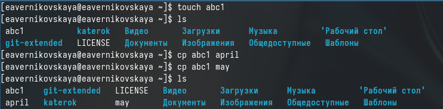{#fig:001 width=70%}

## Копирование файлов и каталогов (пункт 1)

Создаём каталог monthly с помощью *mkdir* и копируем в него файлы april и may (рис. 2)

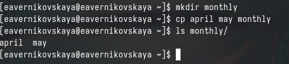{#fig:002 width=70%}

## Копирование файлов и каталогов (пункт 1)

В каталоге monthly копируем файл may с именем june (рис. 3)

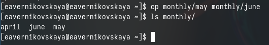{#fig:003 width=70%}

## Копирование файлов и каталогов (пункт 1)

Копируем каталог monthly с именем monthly.00 ddtlz *cp -r* (рис. 4)

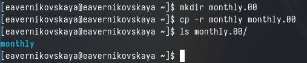{#fig:004 width=70%}

## Копирование файлов и каталогов (пункт 1)

Далее копируем каталог monthly.00 в каталог /tmp (рис. 5)

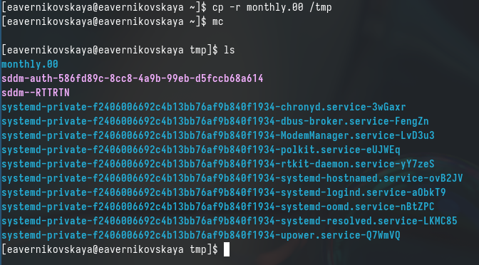{#fig:005 width=70%}

## Перемещение и переименование файлов и каталогов (пункт 1)

В домашнем каталоге меняем название файла а april на july с поомщью *mv* (рис. 6)

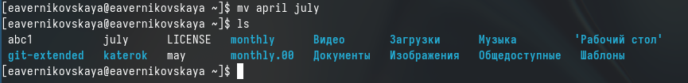{#fig:006 width=70%}

## Перемещение и переименование файлов и каталогов (пункт 1)

Перемещаем файл july в каталог monthly.00 используя команду *mv* (рис. 7)

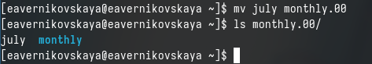{#fig:007 width=70%}

## Перемещение и переименование файлов и каталогов (пункт 1)

Переименовываем каталог monthly.00 в monthly.01 (рис. 8)

{#fig:008 width=70%}

## Перемещение и переименование файлов и каталогов (пункт 1)

После создаём каталог с названием reports и перемещаем в него каталог monthly.01 (рис. 9)

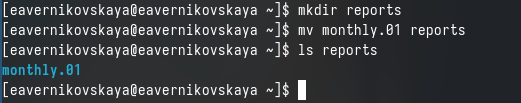{#fig:009 width=70%}

## Перемещение и переименование файлов и каталогов (пункт 1)

В каталоге reports переименовываем каталог monthly.01 в monthly (рис. 10)

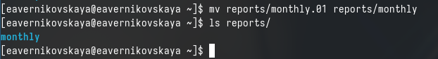{#fig:010 width=70%}

## Права доступа (пункт 1)

Создаём файл may с правом выполнения для владельца. Задать права можно с помощью команды *chmod u+x may* (рис. 11)

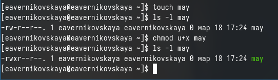{#fig:011 width=70%}

## Права доступа (пункт 1)

После лишаем владельца файла may прав на выполнения введя *hmod u-x may* (рис. 12)

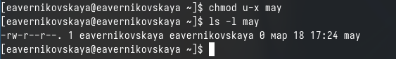{#fig:012 width=70%}

## Права доступа (пункт 1)

Создаём каталог monthly с запретом на чтение для членов группы и всех остальных пользователей. Это можно сделать введя команды *chmod g-r monthly* и *chmod o-r monthly* (рис. 13), (рис. 14)

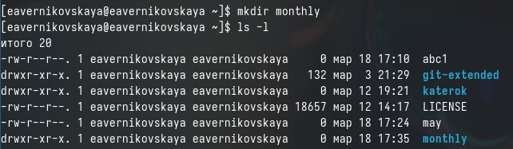{#fig:013 width=70%}

## Права доступа (пункт 1)

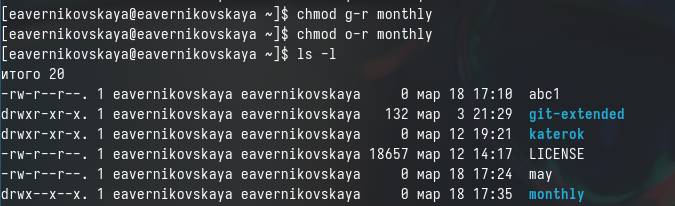{#fig:014 width=70%}

## Права доступа (пункт 1)

Далее создаём файл abc1 с правом записи для членов группы *chmod g+w abc1* (рис. 15), (рис. 16)

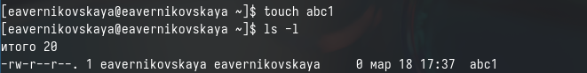{#fig:015 width=70%}

## Права доступа (пункт 1)

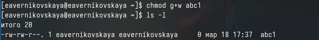{#fig:016 width=70%}

## Анализ файловой системы (пункт 1)

Для просмотра используемых в операционной системе файловых систем можно используем командой *mount* без параметров (рис. 17)

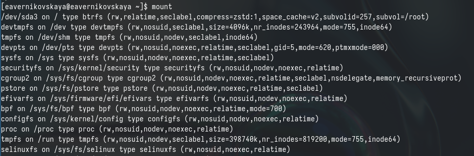{#fig:017 width=70%}

## Анализ файловой системы (пункт 1)

Далее с помощью команды *cat /etc/fstab* просматриваем файл /etc/fstab чтобы определить смонтированные файловые системы в ОС (рис. 18)

{#fig:018 width=70%}

## Анализ файловой системы (пункт 1)

Потом используем команду *df* чтобы я определения объёма свободного пространства на файловой системе (рис. 19)

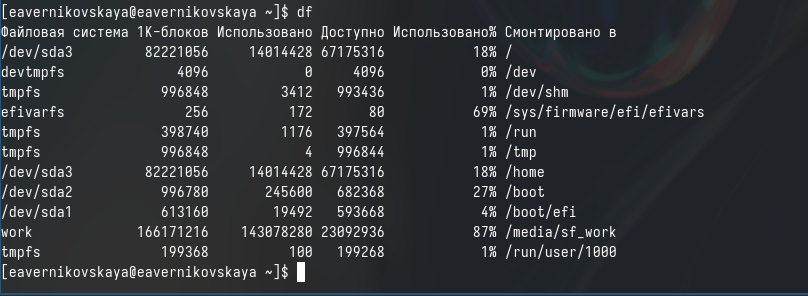{#fig:019 width=70%}

## Анализ файловой системы (пункт 1)

Далее с помощью команды *fsck* проверяем целостность файловых систем (рис. 20)

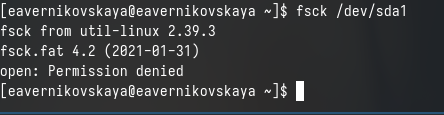{#fig:020 width=70%}

## Пункт 2

Копируем файл /usr/include/sys/io.h в домашний каталог и называем его equipment (рис. 21)
 
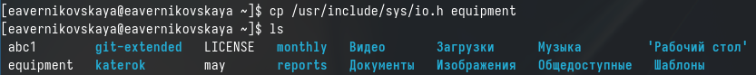{#fig:021 width=70%}

## Пункт 2

В домашнем каталоге создаём директорию ~/ski.plases (рис. 22)

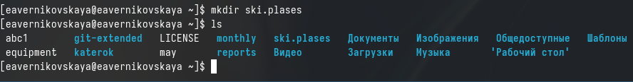{#fig:022 width=70%}

## Пункт 2

Перемещаем файл equipment в каталог ~/ski.plases (рис. 23)

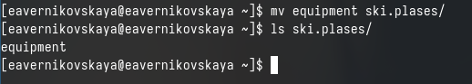{#fig:023 width=70%}

## Пункт 2

В каталоге ski.plases переименовыеваем файл equipment в equiplist (рис. 24)
 
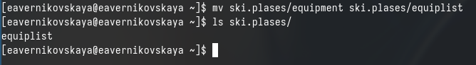{#fig:024 width=70%}

## Пункт 2

В домашнем каталоге создаём файл abc1 и копируем его в каталог ~/ski.plases с название equiplist2 (рис. 25)

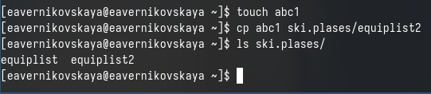{#fig:025 width=70%}

## Пункт 2

Создаём каталог с именем equipment в каталоге ~/ski.plases (рис. 26)

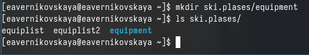{#fig:026 width=70%}

## Пункт 2
 
Перемещаем файлы equiplist и equiplist2 в каталог ~/ski.plases/equipment (рис. 27)

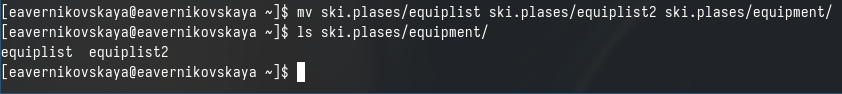{#fig:027 width=70%}

## Пункт 2
 
Создаём каталог ~/newdir и перемещаем его с названием plans в каталог ~/ski.plases (рис. 28)

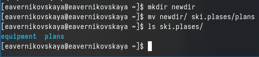{#fig:028 width=70%}

## Пункт 3

Создаём каталог с названием australia и лишаем членов группы и других пользователей прав на выполнение (рис. 29), (рис. 30)

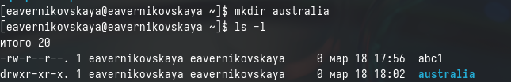{#fig:029 width=70%}

## Пункт 3

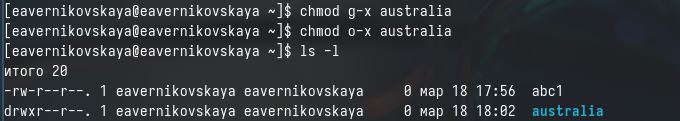{#fig:030 width=70%}

## Пункт 3

Создаём каталог с названием play и лишаем членов группы и других пользователей прав на чтение (рис. 31), (рис. 32)

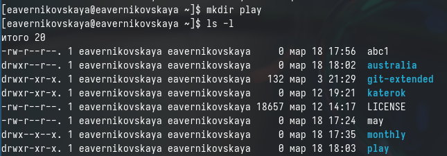{#fig:031 width=70%}

## Пункт 3

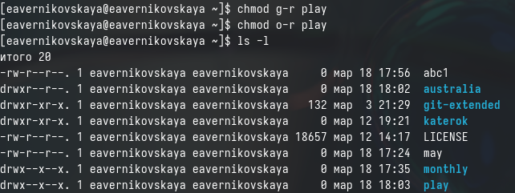{#fig:032 width=70%}

## Пункт 3

Создаём файл с названием my_os. Владельцу файла добавляем права на выполнение и лишаем его прав на запись (рис. 33), (рис. 34)

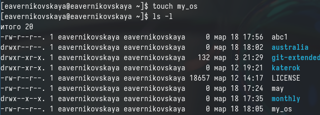{#fig:033 width=70%}

## Пункт 3

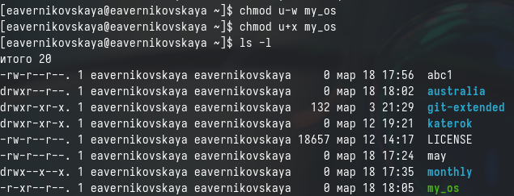{#fig:034 width=70%}

## Пункт 3

Создаём файл с названием feathers и добавляем членам группы права на запись (рис. 35), (рис. 36)

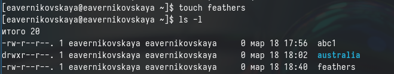{#fig:035 width=70%}

## Пункт 3

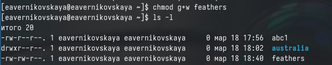{#fig:036 width=70%}

## Пункт 4

Просматриваем содержимое файла /etc/passwd с помощью команды *cat* (рис. 37)

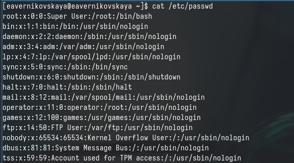{#fig:037 width=70%}

## Пункт 4

Копируем файл ~/feathers в файл ~/file.old (рис. 38)

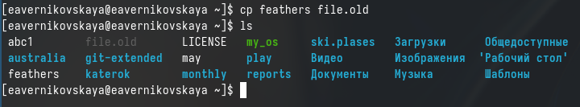{#fig:038 width=70%}

## Пункт 4

Перемещаем файл file.old в каталог ~/play (рис. 39)

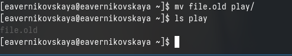{#fig:039 width=70%}

## Пункт 4

Копируем каталог ~/play с именем ~/fun (рис. 40)

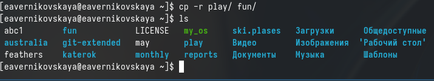{#fig:040 width=70%}

## Пункт 4

После перемещаем каталог ~/fun в каталог ~/play и называем его games (рис. 41)

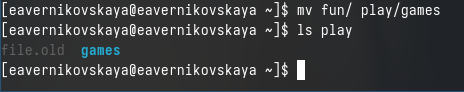{#fig:041 width=70%}

## Пункт 4

Лишаем владельца файла feathers прав на чтение введя *chmod u-r feathers* (рис. 42)

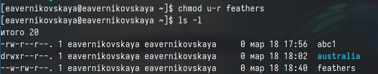{#fig:042 width=70%}

## Пункт 4

Теперь пытаемся просмотреть файл feathers с помощью команды *cat*, но у нас это не получится, так как мы лишены прав на чтение (рис. 43)

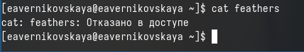{#fig:043 width=70%}

## Пункт 4

Возращаем владельцу файла feathers права на чтение введя *chmod u+r feathers* (рис. 44)

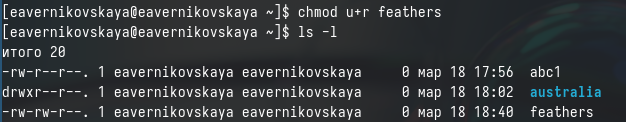{#fig:044 width=70%}

## Пункт 4

Лишаем владельца каталога play прав на выполнение введя *chmod u-x play* (рис. 45)

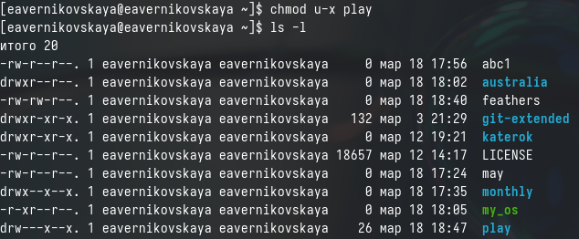{#fig:045 width=70%}

## Пункт 4

Пытаемся перейти в каталог play, но у нас это не получится, так как мы лишены прав на выполнение (т.е. лишены возможности сделать каталог play текущим) (рис. 46)

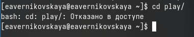{#fig:046 width=70%}

## Пункт 4

Возращаем владельцу каталога play права на выполнение введя *chmod u+x play* (рис. 47)

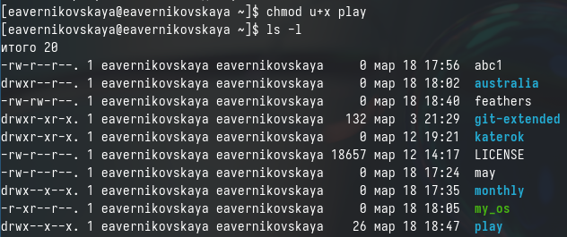{#fig:047 width=70%}

## Пункт 5

С помощью команды *man* смотрим информацию о командах mount, fsck, mkfs, kill (рис. 48), (рис. 49), (рис. 50), (рис. 51), (рис. 52)

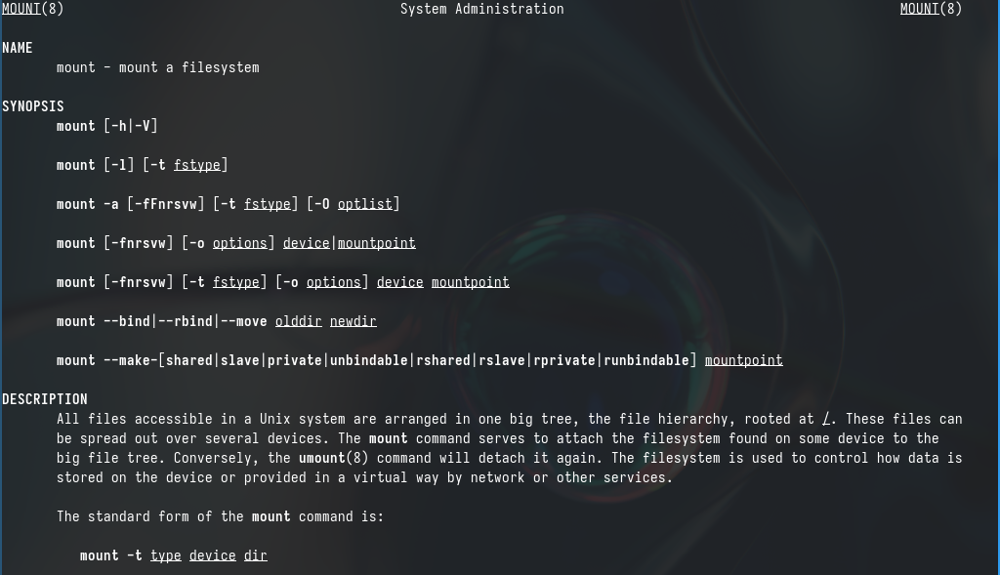{#fig:048 width=60%}

## Пункт 5

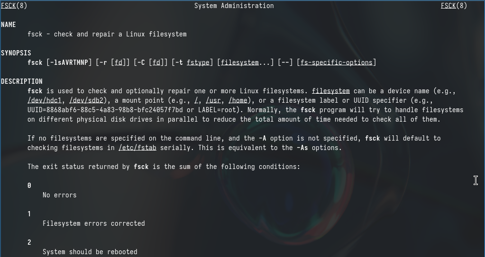{#fig:049 width=70%}

## Пункт 5

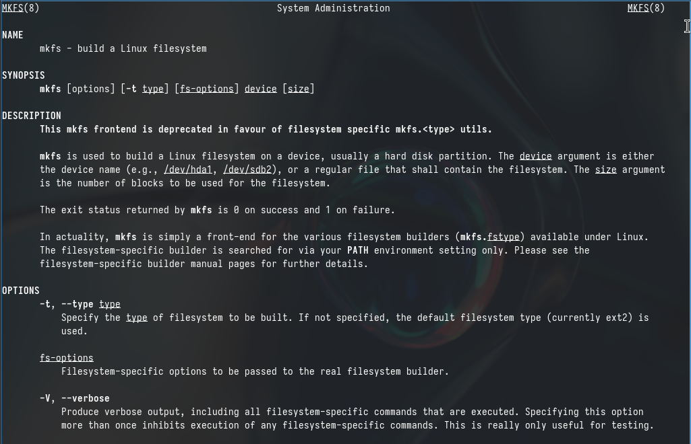{#fig:050 width=70%}

## Пункт 5

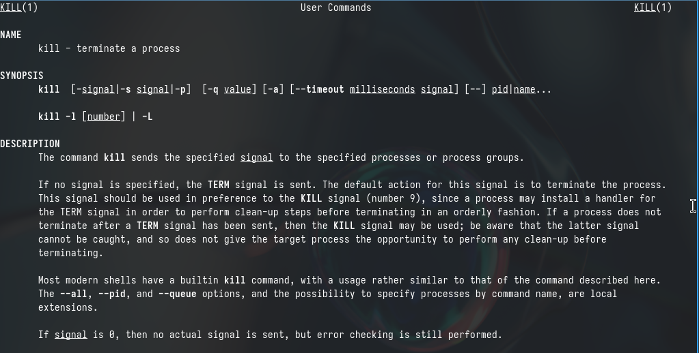{#fig:051 width=70%}

## Пункт 5

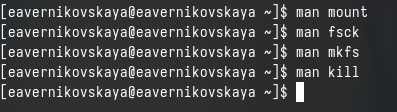{#fig:052 width=70%}

## Пункт 5

С помощь команды *man* я прочитала описание каждой из приведённой в задании команды:

1. mount: Используется для монтирования файловых систем в определенные точки монтирования в операционной системе Linux.
2. fsck: Проверяет и исправляет целостность файловой системы, обнаруживая и исправляя ошибки на диске.
3. mkfs: Создает новую файловую систему на указанном устройстве.
4. kill: Используется для отправки сигналов процессам в Linux, что может привести к завершению процесса.

# Подведение итогов

## Выводы

В ходе выполнения лабораторной рбаоты мы ознакомились с файловой системой Linux, её структурой, именами и содержанием каталогов. А также приобрели практические навыки по применению команд для работы
с файлами и каталогами, по управлению процессами (и работами), по проверке использования диска и обслуживанию файловой системы.

## Список литературы

Не пользовалась сайтами.
