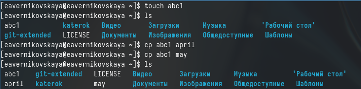

---
## Front matter
title: "Отчёт по лабораторной работе №7"
subtitle: "Дисциплина: Операционные системы"
author: "Верниковская Екатерина Андреевна"

## Generic otions
lang: ru-RU
toc-title: "Содержание"

## Bibliography
bibliography: bib/cite.bib
csl: pandoc/csl/gost-r-7-0-5-2008-numeric.csl

## Pdf output format
toc: true # Table of contents
toc-depth: 2
lof: true # List of figures
lot: true # List of tables
fontsize: 12pt
linestretch: 1.5
papersize: a4
documentclass: scrreprt
## I18n polyglossia
polyglossia-lang:
  name: russian
  options:
	- spelling=modern
	- babelshorthands=true
polyglossia-otherlangs:
  name: english
## I18n babel
babel-lang: russian
babel-otherlangs: english
## Fonts
mainfont: PT Serif
romanfont: PT Serif
sansfont: PT Sans
monofont: PT Mono
mainfontoptions: Ligatures=TeX
romanfontoptions: Ligatures=TeX
sansfontoptions: Ligatures=TeX,Scale=MatchLowercase
monofontoptions: Scale=MatchLowercase,Scale=0.9
## Biblatex
biblatex: true
biblio-style: "gost-numeric"
biblatexoptions:
  - parentracker=true
  - backend=biber
  - hyperref=auto
  - language=auto
  - autolang=other*
  - citestyle=gost-numeric
## Pandoc-crossref LaTeX customization
figureTitle: "Рис."
tableTitle: "Таблица"
listingTitle: "Листинг"
lofTitle: "Список иллюстраций"
lotTitle: "Список таблиц"
lolTitle: "Листинги"
## Misc options
indent: true
header-includes:
  - \usepackage{indentfirst}
  - \usepackage{float} # keep figures where there are in the text
  - \floatplacement{figure}{H} # keep figures where there are in the text
---

# Цель работы

Ознакомиться с файловой системой Linux, её структурой, именами и содержанием каталогов. Приобрести практические навыки по применению команд для работы с файлами и каталогами, по управлению процессами (и работами), по проверке использования диска и обслуживанию файловой системы.

# Задание

1. Выполнить все примеры, приведённые в первой части описания лабораторной работы.
2. Выполнить задания с командой chmod.
3. Выполнить задания с командой man.

# Выполнение лабораторной работы

## Копирование файлов и каталогов (пункт 1)

Создаём файл abc1 и копируем его с названием april и may с помощью команд *touch* (создание файла) и *cp* (копирование файла) (рис. [-@fig:001])

{#fig:001 width=70%}

Создаём каталог monthly с помощью *mkdir* и копируем в него файлы april и may (рис. [-@fig:002])

{#fig:002 width=70%}

В каталоге monthly копируем файл may с именем june (рис. [-@fig:003])

{#fig:003 width=70%}

Копируем каталог monthly с именем monthly.00 ddtlz *cp -r* (рис. [-@fig:004])

{#fig:004 width=70%}

Далее копируем каталог monthly.00 в каталог /tmp (рис. [-@fig:005])

{#fig:005 width=70%}

## Перемещение и переименование файлов и каталогов (пункт 1)

В домашнем каталоге меняем название файла а april на july с поомщью *mv* (рис. [-@fig:006])

{#fig:006 width=70%}

Перемещаем файл july в каталог monthly.00 используя команду *mv* (рис. [-@fig:007])

{#fig:007 width=70%}

Переименовываем каталог monthly.00 в monthly.01 (рис. [-@fig:008])

{#fig:008 width=70%}

После создаём каталог с названием reports и перемещаем в него каталог monthly.01 (рис. [-@fig:009])

{#fig:009 width=70%}

В каталоге reports переименовываем каталог monthly.01 в monthly (рис. [-@fig:010])

{#fig:010 width=70%}

## Права доступа (пункт 1)

Создаём файл may с правом выполнения для владельца. Задать права можно с помощью команды *chmod u+x may* (рис. [-@fig:011])

{#fig:011 width=70%}

После лишаем владельца файла may прав на выполнения введя *hmod u-x may* (рис. [-@fig:012])

{#fig:012 width=70%}

Создаём каталог monthly с запретом на чтение для членов группы и всех остальных пользователей. Это можно сделать введя команды *chmod g-r monthly* и *chmod o-r monthly* (рис. [-@fig:013]), (рис. [-@fig:014])

{#fig:013 width=70%}

{#fig:014 width=70%}

Далее создаём файл abc1 с правом записи для членов группы *chmod g+w abc1* (рис. [-@fig:015]), (рис. [-@fig:016])

{#fig:015 width=70%}

{#fig:016 width=70%}

## Анализ файловой системы (пункт 1)

Для просмотра используемых в операционной системе файловых систем можно используем командой *mount* без параметров (рис. [-@fig:017])

{#fig:017 width=70%}

Далее с помощью команды *cat /etc/fstab* просматриваем файл /etc/fstab чтобы определить смонтированные файловые системы в ОС (рис. [-@fig:018])

{#fig:018 width=70%}

Потом используем команду *df* чтобы я определения объёма свободного пространства на файловой системе (рис. [-@fig:019])

{#fig:019 width=70%}

Далее с помощью команды *fsck* проверяем целостность файловых систем (рис. [-@fig:020])

{#fig:020 width=70%}

## Пункт 2

Копируем файл /usr/include/sys/io.h в домашний каталог и называем его equipment (рис. [-@fig:021])
 
{#fig:021 width=70%}

В домашнем каталоге создаём директорию ~/ski.plases (рис. [-@fig:022])

{#fig:022 width=70%}

Перемещаем файл equipment в каталог ~/ski.plases (рис. [-@fig:023])

{#fig:023 width=70%}

В каталоге ski.plases переименовыеваем файл equipment в equiplist (рис. [-@fig:024])
 
{#fig:024 width=70%}

В домашнем каталоге создаём файл abc1 и копируем его в каталог ~/ski.plases с название equiplist2 (рис. [-@fig:025])

{#fig:025 width=70%}

Создаём каталог с именем equipment в каталоге ~/ski.plases (рис. [-@fig:026])

{#fig:026 width=70%}
 
Перемещаем файлы equiplist и equiplist2 в каталог ~/ski.plases/equipment (рис. [-@fig:027])

{#fig:027 width=70%}
 
Создаём каталог ~/newdir и перемещаем его с названием plans в каталог ~/ski.plases (рис. [-@fig:028])

{#fig:028 width=70%}

## Пункт 3

Создаём каталог с названием australia и лишаем членов группы и других пользователей прав на выполнение (рис. [-@fig:029]), (рис. [-@fig:030])

{#fig:029 width=70%}

{#fig:030 width=70%}

Создаём каталог с названием play и лишаем членов группы и других пользователей прав на чтение (рис. [-@fig:031]), (рис. [-@fig:032])

{#fig:031 width=70%}

{#fig:032 width=70%}

Создаём файл с названием my_os. Владельцу файла добавляем права на выполнение и лишаем его прав на запись (рис. [-@fig:033]), (рис. [-@fig:034])

{#fig:033 width=70%}

{#fig:034 width=70%}

Создаём файл с названием feathers и добавляем членам группы права на запись (рис. [-@fig:035]), (рис. [-@fig:036])

{#fig:035 width=70%}

{#fig:036 width=70%}

## Пункт 4

Просматриваем содержимое файла /etc/passwd с помощью команды *cat* (рис. [-@fig:037])

{#fig:037 width=70%}

Копируем файл ~/feathers в файл ~/file.old (рис. [-@fig:038])

{#fig:038 width=70%}

Перемещаем файл file.old в каталог ~/play (рис. [-@fig:039])

{#fig:039 width=70%}

Копируем каталог ~/play с именем ~/fun (рис. [-@fig:040])

{#fig:040 width=70%}

После перемещаем каталог ~/fun в каталог ~/play и называем его games (рис. [-@fig:041])

{#fig:041 width=70%}

Лишаем владельца файла feathers прав на чтение введя *chmod u-r feathers* (рис. [-@fig:042])

{#fig:042 width=70%}

Теперь пытаемся просмотреть файл feathers с помощью команды *cat*, но у нас это не получится, так как мы лишены прав на чтение (рис. [-@fig:043])

{#fig:043 width=70%}

Возращаем владельцу файла feathers права на чтение введя *chmod u+r feathers* (рис. [-@fig:044])

{#fig:044 width=70%}

Лишаем владельца каталога play прав на выполнение введя *chmod u-x play* (рис. [-@fig:045])

{#fig:045 width=70%}

Пытаемся перейти в каталог play, но у нас это не получится, так как мы лишены прав на выполнение (т.е. лишены возможности сделать каталог play текущим) (рис. [-@fig:046])

{#fig:046 width=70%}

Возращаем владельцу каталога play права на выполнение введя *chmod u+x play* (рис. [-@fig:047])

{#fig:047 width=70%}

## Пункт 5

С помощью команды *man* смотрим информацию о командах mount, fsck, mkfs, kill (рис. [-@fig:048]), (рис. [-@fig:049]), (рис. [-@fig:050]), (рис. [-@fig:051]), (рис. [-@fig:052])

{#fig:048 width=70%}

{#fig:049 width=70%}

{#fig:050 width=70%}

{#fig:051 width=70%}

{#fig:052 width=70%}

С помощь команды *man* я прочитала описание каждой из приведённой в задании команды:

1. mount: Используется для монтирования файловых систем в определенные точки монтирования в операционной системе Linux.
2. fsck: Проверяет и исправляет целостность файловой системы, обнаруживая и исправляя ошибки на диске.
3. mkfs: Создает новую файловую систему на указанном устройстве.
4. kill: Используется для отправки сигналов процессам в Linux, что может привести к завершению процесса.

## Ответы на контрольные вопросы

1. Дайте характеристику каждой файловой системе, существующей на жёстком диске компьютера, на котором вы выполняли лабораторную работу.

- Ext2, Ext3, Ext4 или Extended Filesystem - это стандартная файловая система для Linux. Она была разработана еще для Minix. Она самая стабильная из всех существующих, кодовая база изменяется очень редко и эта файловая система содержит больше всего функций. Версия ext2 была разработана уже именно для Linux и получила много улучшений. В 2001 году вышла ext3, которая добавила еще больше стабильности благодаря использованию журналирования. В 2006 была выпущена версия ext4, которая используется во всех дистрибутивах Linux до сегодняшнего дня. В ней было внесено много улучшений, в том числе увеличен максимальный размер раздела до одного экзабайта.

- Btrfs или B-Tree File System - это совершенно новая файловая система, которая сосредоточена на отказоустойчивости, легкости администрирования и восстановления данных. Файловая система объединяет в себе очень много новых интересных возможностей, таких как размещение на нескольких разделах, поддержка подтомов, изменение размера не лету, создание мгновенных снимков, а также высокая производительность. Но многими пользователями файловая система Btrfs считается нестабильной. Тем не менее, она уже используется как файловая система по умолчанию в OpenSUSE и SUSE Linux.

2. Приведите общую структуру файловой системы и дайте характеристику каждой директории первого уровня этой структуры.

- / — root каталог. Содержит в себе всю иерархию системы;
- /bin — здесь находятся двоичные исполняемые файлы. Основные общие команды, хранящиеся отдельно от других программ в системе (прим.: pwd, ls, cat, ps);
- /boot — тут расположены файлы, используемые для загрузки системы (образ initrd, ядро vmlinuz);
- /dev — в данной директории располагаются файлы устройств (драйверов). С помощью этих файлов можно взаимодействовать с устройствами. К примеру, если это жесткий диск, можно подключить его к файловой системе. В файл принтера же можно написать напрямую и отправить задание на печать;
- /etc— в этой директории находятся файлы конфигураций программ. Эти файлы позволяют настраивать системы, сервисы, скрипты системных демонов;
- /home — каталог, аналогичный каталогу Users в Windows. Содержит домашние каталоги учетных записей пользователей (кроме root). При создании нового пользователя здесь создается одноименный каталог с аналогичным именем и хранит личные файлы этого пользователя;
- /lib — содержит системные библиотеки, с которыми работают программы и модули ядра;
- /lost+found — содержит файлы, восстановленные после сбоя работы системы. Система проведет проверку после сбоя и найденные файлы можно будет посмотреть в данном каталоге;
- /media — точка монтирования внешних носителей. Например, когда вы вставляете диск в дисковод, он будет автоматически смонтирован в директорию /media/cdrom;
- /mnt — точка временного монтирования. Файловые системы подключаемых устройств обычно монтируются в этот каталог для временного использования;
- /opt — тут расположены дополнительные (необязательные) приложения. Такие программы обычно не подчиняются принятой иерархии и хранят свои файлы в одном подкаталоге (бинарные, библиотеки, конфигурации);
- /proc — содержит файлы, хранящие информацию о запущенных процессах и о состоянии ядра ОС;
- /root — директория, которая содержит файлы и личные настройки суперпользователя;
- /run — содержит файлы состояния приложений. Например, PID-файлы или UNIX-сокеты;
- /sbin — аналогично /bin содержит бинарные файлы. Утилиты нужны для настройки и администрирования системы суперпользователем;
- /srv — содержит файлы сервисов, предоставляемых сервером (прим. FTP или Apache HTTP);
- /sys — содержит данные непосредственно о системе. Тут можно узнать информацию о ядре, драйверах и устройствах;
- /tmp — содержит временные файлы. Данные файлы доступны всем пользователям на чтение и запись. Стоит отметить, что данный каталог очищается при перезагрузке;
- /usr — содержит пользовательские приложения и утилиты второго уровня, используемые пользователями, а
не системой. Содержимое доступно только для чтения (кроме root). Каталог имеет вторичную иерархию и похож на корневой;
- /var — содержит переменные файлы. Имеет подкаталоги, отвечающие за отдельные переменные. Например, логи будут храниться в /var/log, кэш в /var/cache, очереди заданий в /var/spool/ и так далее.

3. Какая операция должна быть выполнена, чтобы содержимое некоторой файловой системы было доступно операционной системе?

Монтирование тома.

4. Назовите основные причины нарушения целостности файловой системы. Как устранить повреждения файловой системы?

Отсутствие синхронизации между образом файловой системы в памяти и ее данными на диске в случае
аварийного останова может привести к появлению следующих ошибок:

- Один блок адресуется несколькими mode (принадлежит нескольким файлам).
- Блок помечен как свободный, но в то же время занят (на него ссылается onode).
- Блок помечен как занятый, но в то же время свободен (ни один inode на него не ссылается).
- Неправильное число ссылок в inode (недостаток или избыток ссылающихся записей в каталогах).
- Несовпадение между размером файла и суммарным размером адресуемых inode блоков. 
- Недопустимые адресуемые блоки (например, расположенные за пределами файловой системы).
- “Потерянные” файлы (правильные inode, на которые не ссылаются записи каталогов).
- Недопустимые или неразмещенные номера inode в записях каталогов.

5. Как создаётся файловая система?

Команда mkfs - позволяет создать файловую систему Linux.

6. Дайте характеристику командам для просмотра текстовых файлов.

- Cat - выводит содержимое файла на стандартное устройство вывода. 
- Выполнение команды head выведет первые 10 строк текстового файла.
- Выполнение команды tail выведет последние 10 строк текстового файла.
- Команда tac - это тоже самое, что и cat, только отображает строки в обратном порядке.
- Для того, чтобы просмотреть огромный текстовый файл применяются команды для постраничного просмотра. Такие как more и less.

7. Приведите основные возможности команды cp в Linux.

Cp – копирует или перемещает директорию, файлы.

8. Приведите основные возможности команды mv в Linux.

Mv - переименовывает или перемещает файл или директорию

9. Что такое права доступа? Как они могут быть изменены?

Права доступа к файлу или каталогу можно изменить, воспользовавшись командой chmod. Сделать это может владелец файла (или каталога) или пользователь с правами администратора.

# Выводы

В ходе выполнения лабораторной рбаоты мы ознакомились с файловой системой Linux, её структурой, именами и содержанием каталогов. А также приобрели практические навыки по применению команд для работы
с файлами и каталогами, по управлению процессами (и работами), по проверке использования диска и обслуживанию файловой системы.

# Список литературы

Не пользовалась сайтами.
