---
## Front matter
lang: ru-RU
title: Лабораторная работа №8
subtitle: Операционные системы
author:
  - Верниковская Е. А., НПИбд-01-23
institute:
  - Российский университет дружбы народов, Москва, Россия
date: 28 марта 2024

## i18n babel
babel-lang: russian
babel-otherlangs: english

## Formatting pdf
toc: false
toc-title: Содержание
slide_level: 2
aspectratio: 169
section-titles: true
theme: metropolis
header-includes:
 - \metroset{progressbar=frametitle,sectionpage=progressbar,numbering=fraction}
 - '\makeatletter'
 - '\beamer@ignorenonframefalse'
 - '\makeatother'
 
## Fonts
mainfont: PT Serif
romanfont: PT Serif
sansfont: PT Sans
monofont: PT Mono
mainfontoptions: Ligatures=TeX
romanfontoptions: Ligatures=TeX
sansfontoptions: Ligatures=TeX,Scale=MatchLowercase
monofontoptions: Scale=MatchLowercase,Scale=0.9
---

# Вводная часть

## Цель работы

Ознакомиться с инструментами поиска файлов и фильтрации текстовых данных. Приобрести практические навыки: по управлению процессами (и заданиями), по проверке использования диска и обслуживанию файловых систем.

## Задание

1. Записать в файл file.txt названия файлов, содержащихся в каталоге /etc. Дописать в этот же файл названия файлов, содержащихся в нашем домашнем каталоге.
2. Вывести имена всех файлов из file.txt, имеющих расширение .conf, после чего записать их в новый текстовой файл conf.txt.
3. Определить, какие файлы в нашем домашнем каталоге имеют имена, начинавшиеся с символа c. Предложить несколько вариантов, как это сделать.
4. Вывести на экран (по странично) имена файлов из каталога /etc, начинающиеся с символа h.
5. Запустить в фоновом режиме процесс, который будет записывать в файл ~/logfile файлы, имена которых начинаются с log.
6. Удалить файл ~/logfile.
7. Запустить из консоли в фоновом режиме редактор gedit.

## Задание

8. Определить идентификатор процесса gedit, используя команду ps, конвейер и фильтр grep.
9. Прочитать справку (man) команды kill, после чего использовать её для завершения процесса gedit.
10. Выполнить команды df и du, предварительно получив более подробную информацию об этих командах, с помощью команды man.
11. Воспользовавшись справкой команды find, высести имена всех директорий, имеющихся в нашем домашнем каталоге.

# Выполнение лабораторной работы

## Задание №1

Записываем в файл file.txt названия файлов, содержащихся в каталоге /etc с помощью команды *ls -lR /etc >> file.txt* (рис. 1), (рис. 2), (рис. 3)

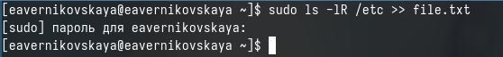{#fig:001 width=70%}

## Задание №1

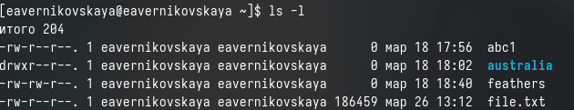{#fig:002 width=70%}

## Задание №1

{#fig:003 width=70%}

## Задание №1

Далее дописываем в файл file.txt названия файлов, содержащихся в нашем домашнем каталоге с помощью команды *ls -lR ~/ >> file.txt* (рис. 4)

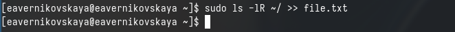{#fig:004 width=70%}

## Задание №2

Выводим имена всех файлов из file.txt, имеющих расширение .conf с помощью команды *grep .conf file.txt* (рис. 5)

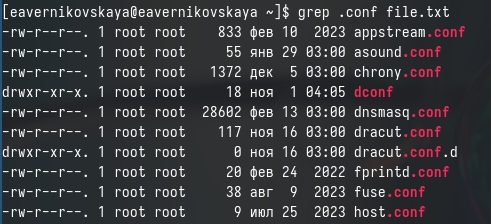{#fig:005 width=70%}

## Задание №2

После чего записываем их в новый текстовой файл conf.txt  введя команду *grep .conf file.txt > conf.txt* (рис. 6), (рис. 7), (рис. 8)

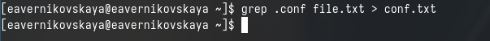{#fig:006 width=70%}

## Задание №2

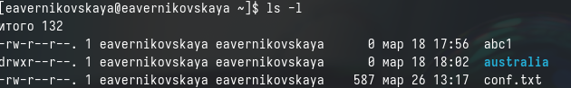{#fig:007 width=70%}

## Задание №2

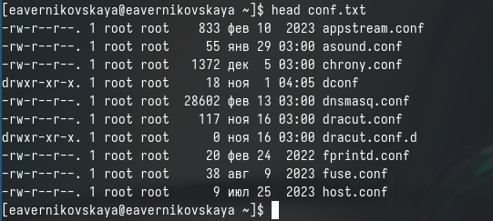{#fig:008 width=70%}

## Задание №3

Определяем, какие файлы в нашем домашнем каталоге имеют имена, начинавшиеся с символа *с* введя команду *find ~ -name "c^" -print* (рис. 9), (рис. 10), (рис. 11]), (рис. 12)

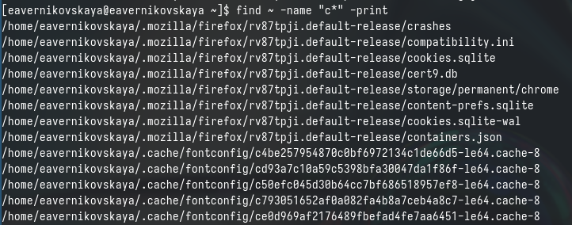{#fig:009 width=70%}

## Задание №3

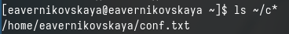{#fig:010 width=70%}

## Задание №3

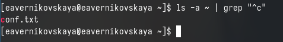{#fig:011 width=70%}

## Задание №3

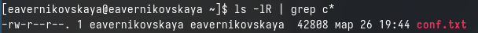{#fig:012 width=70%}

## Задание №4

Выводим на экран (по странично) имена файлов из каталога /etc, начинающиеся с символа h введя *find /etc -name "h^" -print* (рис. 13)

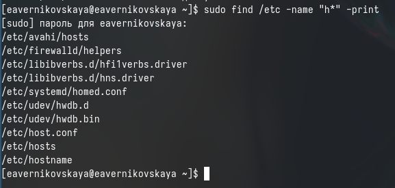{#fig:013 width=70%}

## Задание №5

Запускаем в фоновом режиме процесс, который будет записывать в файл ~/logfile файлы, имена которых начинаются с log с помощью команды *find ~ -name "log^" -print > logfile &* (рис. 14), (рис. 15), (рис. 16)

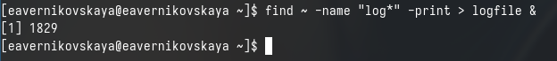{#fig:014 width=70%}

## Задание №5

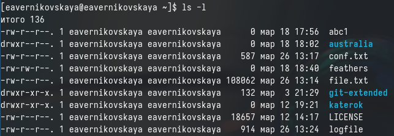{#fig:015 width=70%}

## Задание №5

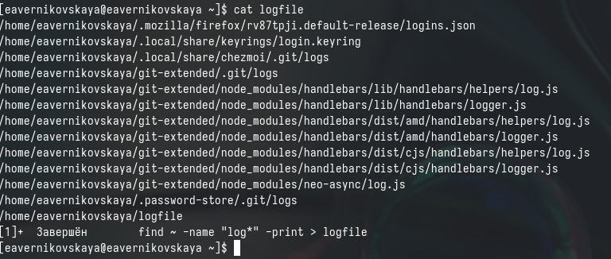{#fig:016 width=70%}

## Задание №6

После удаляем файл ~/logfile (рис. 17)

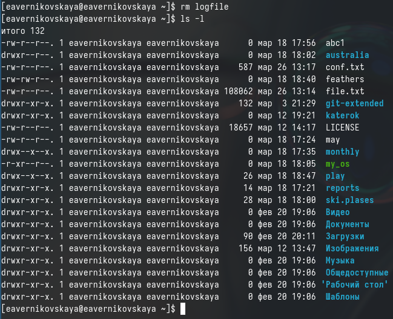{#fig:017 width=50%}

## Задание №7

Запустить из консоли в фоновом режиме редактор gedit введя *gedit &* (рис. 18), (рис. 19)

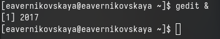{#fig:018 width=70%}

## Задание №7

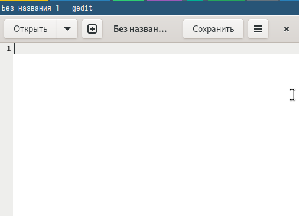{#fig:019 width=60%}

## Задание №8

Определяем идентификатор процесса gedit, используя команду ps, конвейер и фильтр grep. Варианты команд:
1. *ps aux | grep gedit*
2. *pgrep gedit*
3. *ps aux | grep gedit | grep -v grep* (рис. 20)

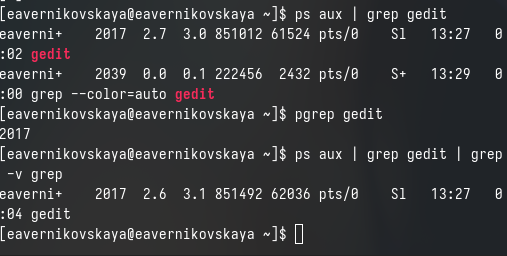{#fig:020 width=70%}

## Задание №9

Читаем справку (man) команды kill, после чего используем её для завершения процесса gedit. Вводим *kill <идентификатор прноцесса>* (рис. 21), (рис. 22)

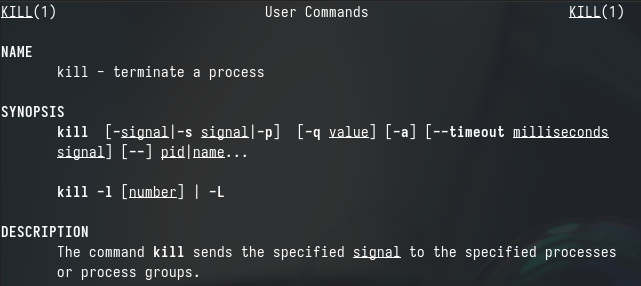{#fig:021 width=70%}

## Задание №9

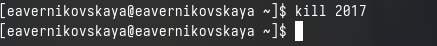{#fig:022 width=70%}

## Задание №10

Получаем более подробную информацию о командах df и du, с помощью команды man (рис. 23]), (рис. 24), (рис. 25)

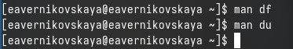{#fig:023 width=70%}

## Задание №10

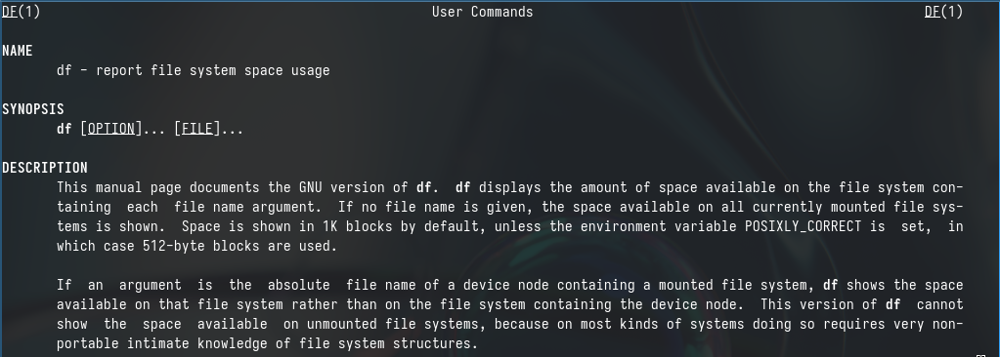{#fig:024 width=70%}

## Задание №10

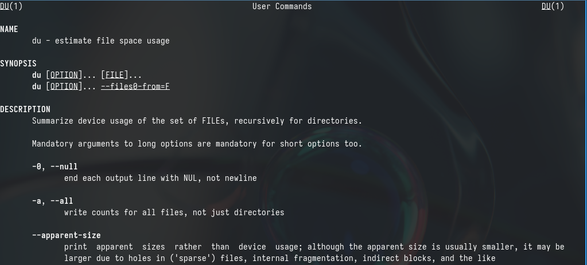{#fig:025 width=70%}

## Задание №10

Выполняем команду df и du. Первая показывает размер каждого смонтированного раздела диска, вторая u показывает число килобайт, используемое каждым файлом или каталогом (рис. 26), (рис. 27)

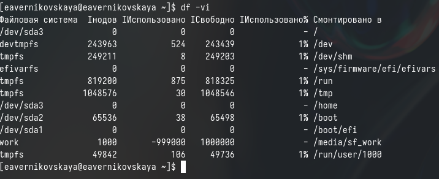{#fig:026 width=70%}

## Задание №10

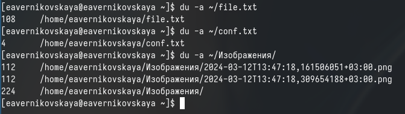{#fig:027 width=70%}

## Задание №11

Далее смотрим справку по команде find (рис. 28), (рис. 29)

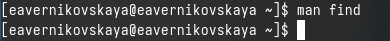{#fig:028 width=70%}

## Задание №11

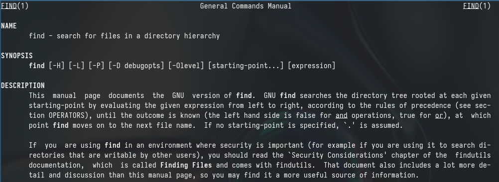{#fig:029 width=70%}

## Задание №11

Используя команду find выводим имена всех директорий, имеющихся в нашем домашнем каталоге. Вводим команду *find ~ -type d* (рис. 30), (рис. 31)

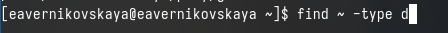{#fig:030 width=70%}

## Задание №11

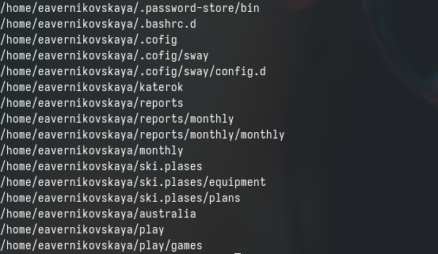{#fig:031 width=70%}

# Подведение итогов

## Выводы

В ходе выполнения лабораторной работы мы ознакомились с инструментами поиска файлов и фильтрации текстовых данных. А иакже приобрели практические навыки: по управлению процессами (и заданиями), по проверке использования диска и обслуживанию файловых систем.

## Список литературы

Не пользовалась сайтами.
