---
## Front matter
title: "Отчёт по лабораторной работе №8"
subtitle: "Дисциплина: Операционные системы"
author: "Верниковская Екатерина Андреевна"

## Generic otions
lang: ru-RU
toc-title: "Содержание"

## Bibliography
bibliography: bib/cite.bib
csl: pandoc/csl/gost-r-7-0-5-2008-numeric.csl

## Pdf output format
toc: true # Table of contents
toc-depth: 2
lof: true # List of figures
lot: true # List of tables
fontsize: 12pt
linestretch: 1.5
papersize: a4
documentclass: scrreprt
## I18n polyglossia
polyglossia-lang:
  name: russian
  options:
	- spelling=modern
	- babelshorthands=true
polyglossia-otherlangs:
  name: english
## I18n babel
babel-lang: russian
babel-otherlangs: english
## Fonts
mainfont: PT Serif
romanfont: PT Serif
sansfont: PT Sans
monofont: PT Mono
mainfontoptions: Ligatures=TeX
romanfontoptions: Ligatures=TeX
sansfontoptions: Ligatures=TeX,Scale=MatchLowercase
monofontoptions: Scale=MatchLowercase,Scale=0.9
## Biblatex
biblatex: true
biblio-style: "gost-numeric"
biblatexoptions:
  - parentracker=true
  - backend=biber
  - hyperref=auto
  - language=auto
  - autolang=other*
  - citestyle=gost-numeric
## Pandoc-crossref LaTeX customization
figureTitle: "Рис."
tableTitle: "Таблица"
listingTitle: "Листинг"
lofTitle: "Список иллюстраций"
lotTitle: "Список таблиц"
lolTitle: "Листинги"
## Misc options
indent: true
header-includes:
  - \usepackage{indentfirst}
  - \usepackage{float} # keep figures where there are in the text
  - \floatplacement{figure}{H} # keep figures where there are in the text
---

# Цель работы

Ознакомиться с инструментами поиска файлов и фильтрации текстовых данных. Приобрести практические навыки: по управлению процессами (и заданиями), по проверке использования диска и обслуживанию файловых систем.

# Задание

1. Записать в файл file.txt названия файлов, содержащихся в каталоге /etc. Дописать в этот же файл названия файлов, содержащихся в нашем домашнем каталоге.
2. Вывести имена всех файлов из file.txt, имеющих расширение .conf, после чего записать их в новый текстовой файл conf.txt.
3. Определить, какие файлы в нашем домашнем каталоге имеют имена, начинавшиеся с символа c. Предложить несколько вариантов, как это сделать.
4. Вывести на экран (по странично) имена файлов из каталога /etc, начинающиеся с символа h.
5. Запустить в фоновом режиме процесс, который будет записывать в файл ~/logfile файлы, имена которых начинаются с log.
6. Удалить файл ~/logfile.
7. Запустить из консоли в фоновом режиме редактор gedit.
8. Определить идентификатор процесса gedit, используя команду ps, конвейер и фильтр grep.
9. Прочитать справку (man) команды kill, после чего использовать её для завершения процесса gedit.
10. Выполнить команды df и du, предварительно получив более подробную информацию об этих командах, с помощью команды man.
11. Воспользовавшись справкой команды find, высести имена всех директорий, имеющихся в нашем домашнем каталоге.

# Выполнение лабораторной работы

Записываем в файл file.txt названия файлов, содержащихся в каталоге /etc с помощью команды *ls -lR /etc >> file.txt* (рис. [-@fig:001]), (рис. [-@fig:002]), (рис. [-@fig:003])

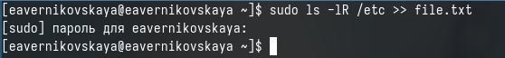{#fig:001 width=70%}

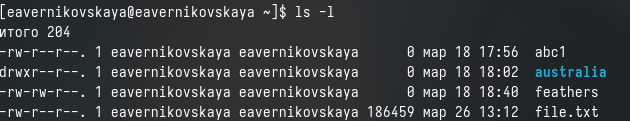{#fig:002 width=70%}

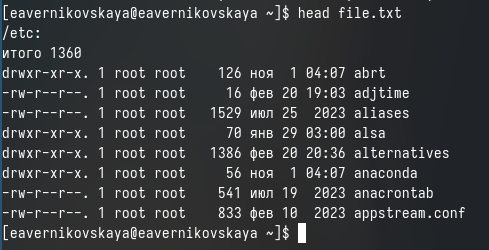{#fig:003 width=70%}

Далее дописываем в файл file.txt названия файлов, содержащихся в нашем домашнем каталоге с помощью команды *ls -lR ~/ >> file.txt* (рис. [-@fig:004])

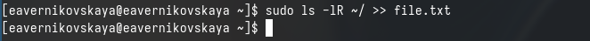{#fig:004 width=70%}

Выводим имена всех файлов из file.txt, имеющих расширение .conf с помощью команды *grep .conf file.txt* (рис. [-@fig:005])

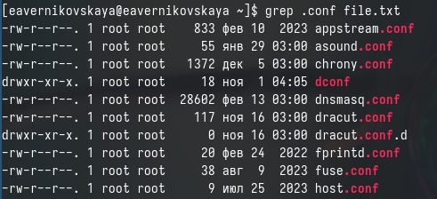{#fig:005 width=70%}

После чего записываем их в новый текстовой файл conf.txt  введя команду *grep .conf file.txt > conf.txt* (рис. [-@fig:006]), (рис. [-@fig:007]), (рис. [-@fig:008])

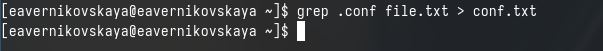{#fig:006 width=70%}

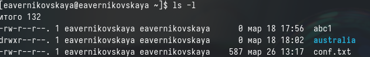{#fig:007 width=70%}

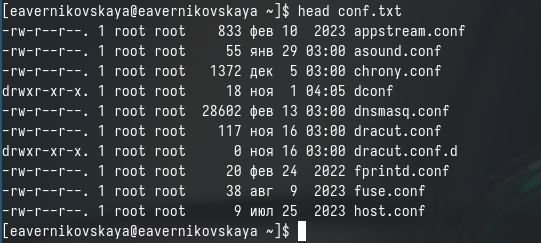{#fig:008 width=70%}

Определяем, какие файлы в нашем домашнем каталоге имеют имена, начинавшиеся с символа *с* введя команду *find ~ -name "c^" -print* (рис. [-@fig:009]), (рис. [-@fig:010]), (рис. [-@fig:011]), (рис. [-@fig:012])

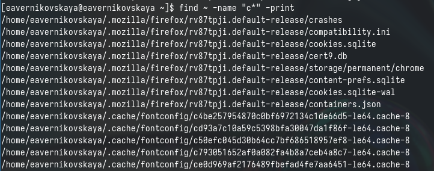{#fig:009 width=70%}

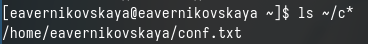{#fig:010 width=70%}

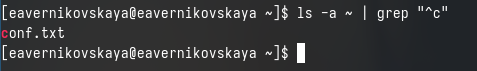{#fig:011 width=70%}

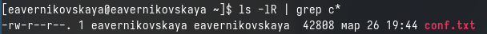{#fig:012 width=70%}

Выводим на экран (по странично) имена файлов из каталога /etc, начинающиеся с символа h введя *find /etc -name "h^" -print* (рис. [-@fig:013])

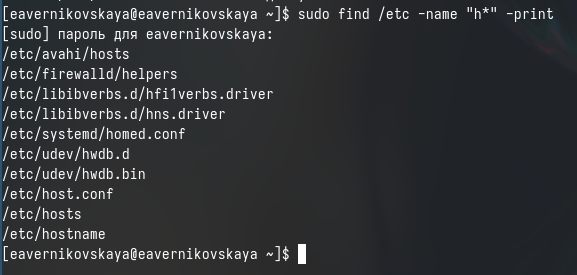{#fig:013 width=70%}

Запускаем в фоновом режиме процесс, который будет записывать в файл ~/logfile файлы, имена которых начинаются с log с помощью команды *find ~ -name "log^" -print > logfile &* (рис. [-@fig:014]), (рис. [-@fig:015]), (рис. [-@fig:016])

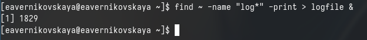{#fig:014 width=70%}

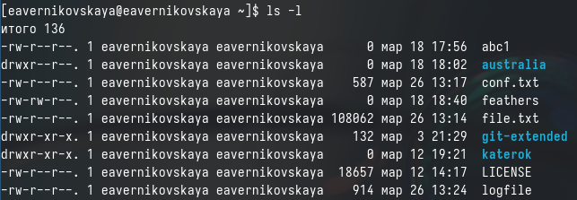{#fig:015 width=70%}

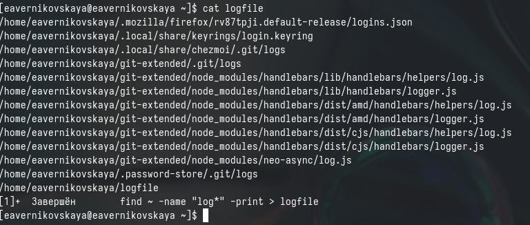{#fig:016 width=70%}

После удаляем файл ~/logfile (рис. [-@fig:017])

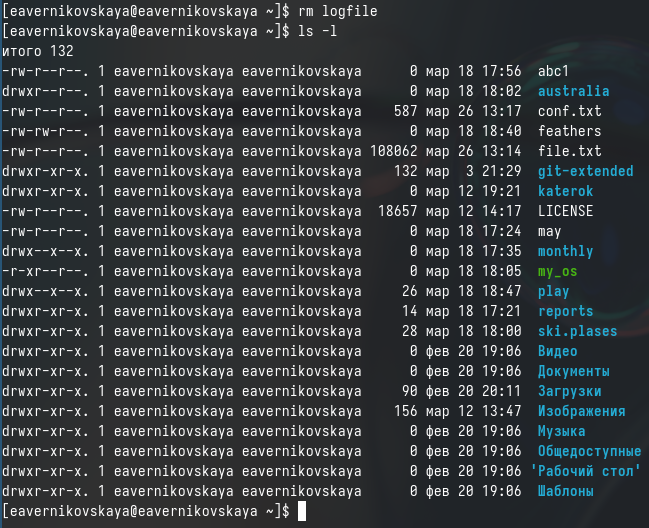{#fig:017 width=70%}

Запустить из консоли в фоновом режиме редактор gedit введя *gedit &* (рис. [-@fig:018]), (рис. [-@fig:019])

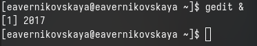{#fig:018 width=70%}

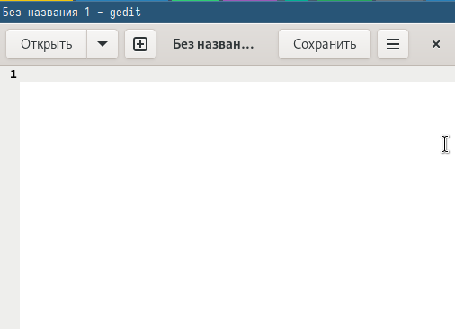{#fig:019 width=70%}

Определяем идентификатор процесса gedit, используя команду ps, конвейер и фильтр grep. Варианты команд:
1. *ps aux | grep gedit*
2. *pgrep gedit*
3. *ps aux | grep gedit | grep -v grep* (рис. [-@fig:020])

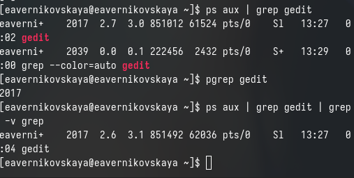{#fig:020 width=70%}

Читаем справку (man) команды kill, после чего используем её для завершения процесса gedit. Вводим *kill <идентификатор прноцесса>* (рис. [-@fig:021]), (рис. [-@fig:022])

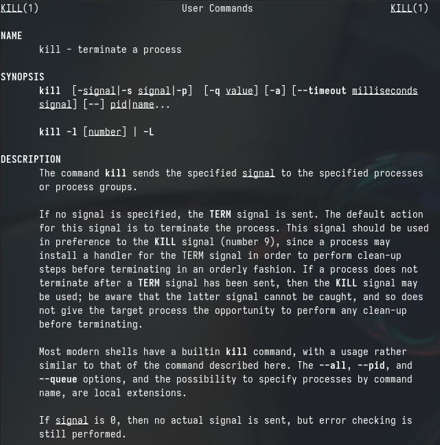{#fig:021 width=70%}

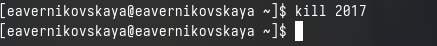{#fig:022 width=70%}

Получаем более подробную информацию о командах df и du, с помощью команды man (рис. [-@fig:023]), (рис. [-@fig:024]), (рис. [-@fig:025])

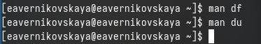{#fig:023 width=70%}

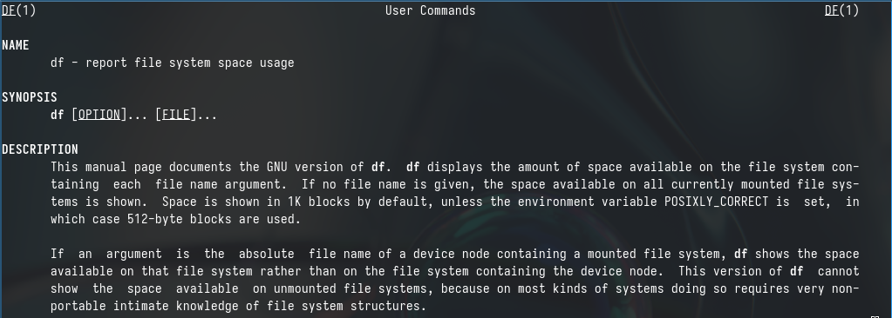{#fig:024 width=70%}

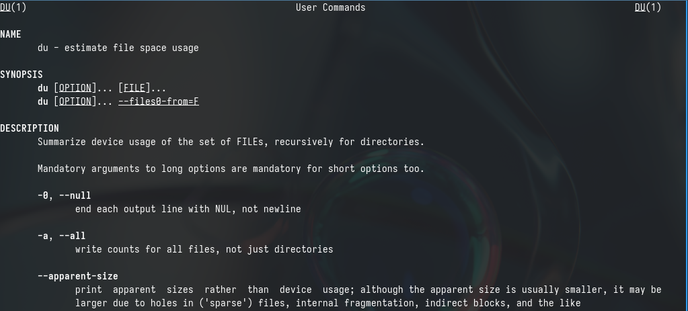{#fig:025 width=70%}

Выполняем команду df и du. Первая показывает размер каждого смонтированного раздела диска, вторая u показывает число килобайт, используемое каждым файлом или каталогом (рис. [-@fig:026]), (рис. [-@fig:027])

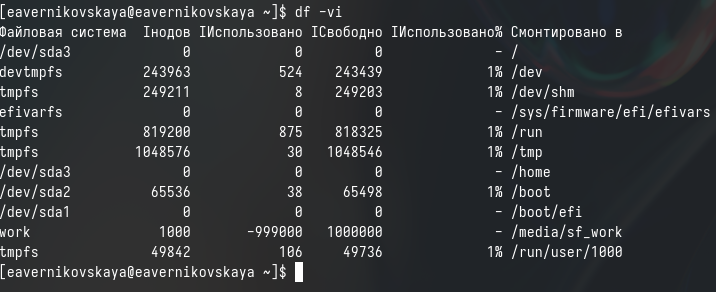{#fig:026 width=70%}

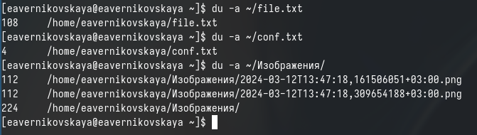{#fig:027 width=70%}

Далее смотрим справку по команде find (рис. [-@fig:028]), (рис. [-@fig:029])

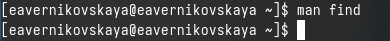{#fig:028 width=70%}

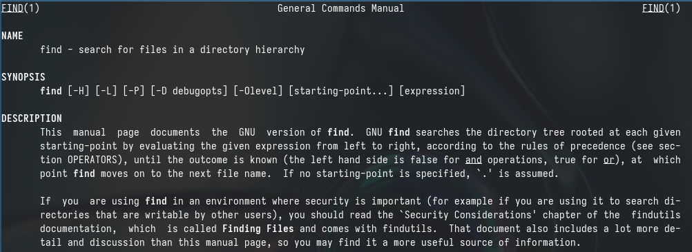{#fig:029 width=70%}

Используя команду find выводим имена всех директорий, имеющихся в нашем домашнем каталоге. Вводим команду *find ~ -type d* (рис. [-@fig:030]), (рис. [-@fig:031])

{#fig:030 width=70%}

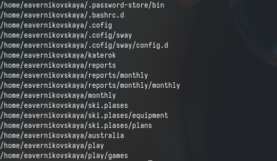{#fig:031 width=70%}

# Ответы на контрольные вопросы

1. Какие потоки ввода вывода вы знаете?

В системе по умолчанию открыто три специальных потока: 
- stdin стандартный поток ввода (по умолчанию: клавиатура), файловый дескриптор 0; 
- stdout стандартный поток вывода (по умолчанию: консоль), файловый дескриптор 1; 
- stderr стандартный поток вывод сообщений об ошибках (по умолчанию: консоль), файловый дескриптор 2.

2. Объясните разницу между операцией > и >>.

- Символ > используется для перенаправления вывода команды в файл. Если файл уже существует, его содержимое будет полностью перезаписано.
- Символ >> также используется для перенаправления вывода команды в файл, но с дополнением данных в конец файла, не перезаписывая существующее содержимое.

3. Что такое конвейер?

Конвейер (pipe) служит для объединения простых команд или утилит в цепочки, в которых результат работы предыдущей команды передаётся последующей.

4. Что такое процесс? Чем это понятие отличается от программы?

Главное отличие между программой и процессом заключается в том, что программа - это набор инструкций, который позволяет ЦПУ выполнять определенную задачу, в то время как процесс - это исполняемая программа.

5. Что такое PID и GID?

PPID - (parent process ID) идентификатор родительского процесса. Процесс может порождать и другие процессы. UID, GID - реальные идентификаторы пользователя и его группы, запустившего данный процесс.

6. Что такое задачи и какая команда позволяет ими управлять?

Запущенные фоном программы называются задачами (jobs). Ими можно управлять с помощью команды jobs, которая выводит список запущенных в данный момент задач.

7. Найдите информацию об утилитах top и htop. Каковы их функции?

Команда htop похожа на команду top по выполняемой функции: они обе показывают информацию о процессах в реальном времени, выводят данные о потреблении системных ресурсов и позволяют искать, останавливать и управлять процессами.
У обеих команд есть свои преимущества. Например, в программе htop реализован очень удобный поиск по процессам, а также их фильтрация. В команде top это не так удобно — нужно знать кнопку для вывода функции поиска.
Зато в top можно разделять область окна и выводить информацию о процессах в соответствии с разными настройками. В целом top намного более гибкая в настройке отображения процессов.

8. Назовите и дайте характеристику команде поиска файлов. Приведите примеры использования этой команды.

Команда find - это одна из наиболее важных и часто используемых утилит системы Linux. Это команда для поиска файлов и каталогов на основе специальных условий. Ее можно использовать в различных обстоятельствах, например, для поиска файлов по разрешениям, владельцам, группам, типу, размеру и другим подобным критериям.
Утилита find предустановлена по умолчанию во всех Linux дистрибутивах, поэтому вам не нужно будет устанавливать никаких дополнительных пакетов. Это очень важная находка для тех, кто хочет использовать командную строку наиболее эффективно.
Команда find имеет такой синтаксис: find [папка] [параметры] критерий шаблон [действие] 
Пример: find /etc -name "h*" -print

9. Можно ли по контексту (содержанию) найти файл? Если да, то как?

Да, можно.
Синтаксис команды: find ~ -type f -exec grep -H ‘текстДляПоиска’ {} ;

10. Как определить объем свободной памяти на жёстком диске?

С помощью команды df -h.

11. Как определить объем вашего домашнего каталога?

С помощью команды du -s.

12. Как удалить зависший процесс?

С помощью команды kill% номер задачи

# Выводы

В ходе выполнения лабораторной работы мы ознакомились с инструментами поиска файлов и фильтрации текстовых данных. А иакже приобрели практические навыки: по управлению процессами (и заданиями), по проверке использования диска и обслуживанию файловых систем.

# Список литературы

Не пользовалась сайтами.
