---
## Front matter
lang: ru-RU
title: Лабораторная работа №9
subtitle: Операционные системы
author:
  - Верниковская Е. А., НПИбд-01-23
institute:
  - Российский университет дружбы народов, Москва, Россия
date: 3 апреля 2024

## i18n babel
babel-lang: russian
babel-otherlangs: english

## Formatting pdf
toc: false
toc-title: Содержание
slide_level: 2
aspectratio: 169
section-titles: true
theme: metropolis
header-includes:
 - \metroset{progressbar=frametitle,sectionpage=progressbar,numbering=fraction}
 - '\makeatletter'
 - '\beamer@ignorenonframefalse'
 - '\makeatother'
 
## Fonts
mainfont: PT Serif
romanfont: PT Serif
sansfont: PT Sans
monofont: PT Mono
mainfontoptions: Ligatures=TeX
romanfontoptions: Ligatures=TeX
sansfontoptions: Ligatures=TeX,Scale=MatchLowercase
monofontoptions: Scale=MatchLowercase,Scale=0.9
---

# Вводная часть

## Цель работы

Освоить основные возможности командной оболочки Midnight Commander. Приобрести навыки практической работы по просмотру каталогов и файлов; манипуляций с ними.

# Задание

## Задания по mc

1. Изучить информацию о mc, вызвав в командной строке man mc.
2. Запустить из командной строки mc, изучить его структуру и меню.
3. Выполнить несколько операций в mc, используя управляющие клавиши (операции с панелями; выделение/отмена выделения файлов, копирование/перемещение файлов, получение информации о размере и правах доступа на файлы и/или каталоги и т.п.)
4. Выполнить основные команды меню левой (или правой) панели. Оценить степень подробности вывода информации о файлах.

## Задания по mc

5. Используя возможности подменю Файл, выполнить:
- просмотр содержимого текстового файла;
- редактирование содержимого текстового файла (без сохранения результатов редактирования);
- создание каталога;
- копирование в файлов в созданный каталог.
6. С помощью соответствующих средств подменю Команда осуществить:
- поиск в файловой системе файла с заданными условиями (например, файла с расширением .c или .cpp, содержащего строку main);
- выбор и повторение одной из предыдущих команд;
- переход в домашний каталог;
- анализ файла меню и файла расширений.

## Задания по mc

7. Вызвать подменю Настройки. Освоить операции, определяющие структуру экрана mc (Full screen, Double Width, Show Hidden Files и т.д.).

## Задания по встроенному редактору mc

1. Создать текстовой файл text.txt.
2. Открыть этот файл с помощью встроенного в mc редактора.
3. Вставить в открытый файл небольшой фрагмент текста, скопированный из любого другого файла или Интернета.

## Задания по встроенному редактору mc

4. Пррделать с текстом следующие манипуляции, используя горячие клавиши:
- Удалить строку текста.
- Выделить фрагмент текста и скопировать его на новую строку.
- Выделить фрагмент текста и перенести его на новую строку.
- Сохранить файл.
- Отменить последнее действие.
- Перейти в конец файла (нажав комбинацию клавиш) и написать некоторый текст.
- Перейти в начало файла (нажав комбинацию клавиш) и написать некоторый текст.
- Сохранить и закрыть файл.

## Задания по встроенному редактору mc

5. Открыть файл с исходным текстом на некотором языке программирования.
6. Используя меню редактора, включить подсветку синтаксиса, если она не включена, или выключить, если она включена.

# Выполнение лабораторной работы

## Задания по mc

Узучаем информацию о mc, вызвав в командной строке команду *man mc* (рис. 1), (рис. 2)

{#fig:001 width=70%}

## Задания по mc

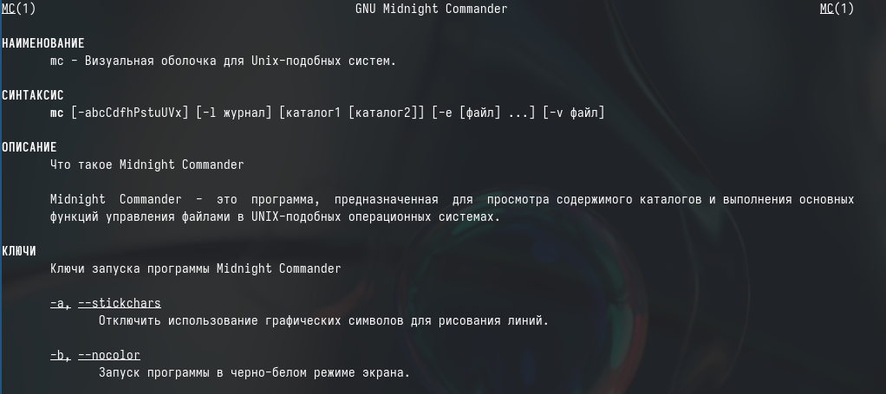{#fig:002 width=70%}

## Задания по mc

Запускаем из командной строки mc, изучаем его структуру и меню. С помощью стрелок вниз и вверх я могу перемещаться по файла, с помощью Tab я могу менять панели (рис. 3)

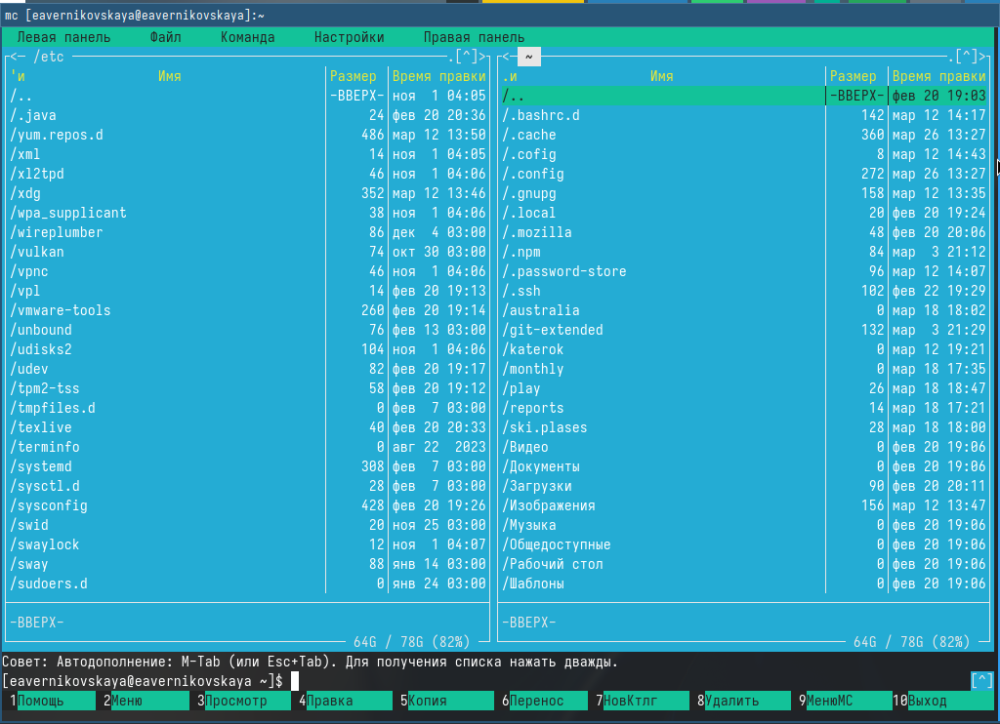{#fig:003 width=40%}

## Задания по mc

Также я могу копировать и перемещать файлы и смотреть права доступа файлам. Всё это я могу делать с помощью управляющих (рис. 4), (рис. 5]), (рис. 6), (рис. 7), (рис. 8)

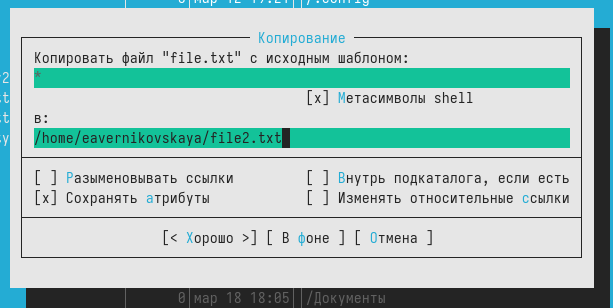{#fig:004 width=70%}

## Задания по mc

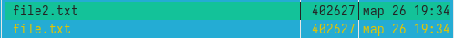{#fig:005 width=70%}

## Задания по mc

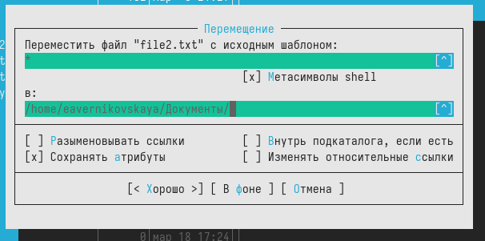{#fig:006 width=70%}

## Задания по mc

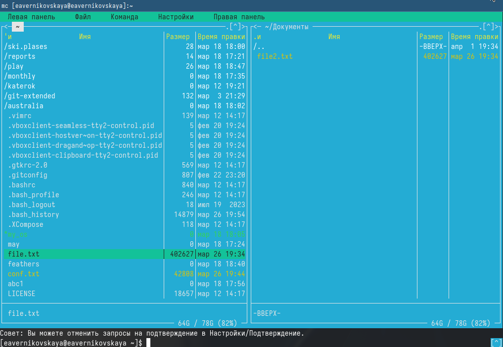{#fig:007 width=70%}

## Задания по mc

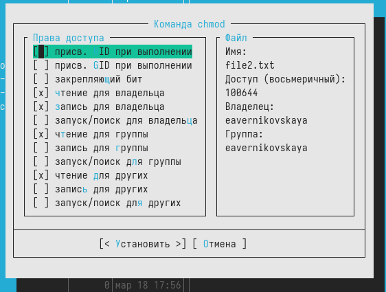{#fig:008 width=50%}

## Задания по mc

Далее выполняем основные команды меню левой панели. И смотрим информацию о файлах. Сравниваем степень подробности вывода информации о файлах. Команда меню левой панели показывает намного больше информации, чем команда *ls -l* (рис. 9), (рис. 10), (рис. 11)

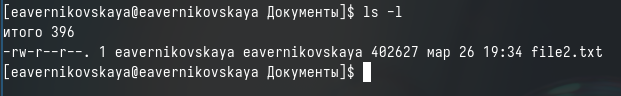{#fig:009 width=70%}

## Задания по mc

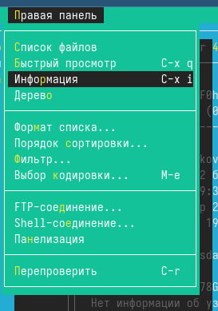{#fig:010 width=30%}

## Задания по mc

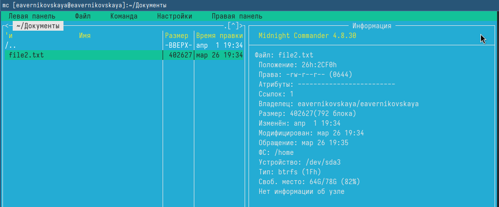{#fig:011 width=70%}

## Задания по mc

Используем возможности подменю Файл. Сначала просматриваем содержимое текстового файла (рис. 12), (рис. 13), (рис. 14)

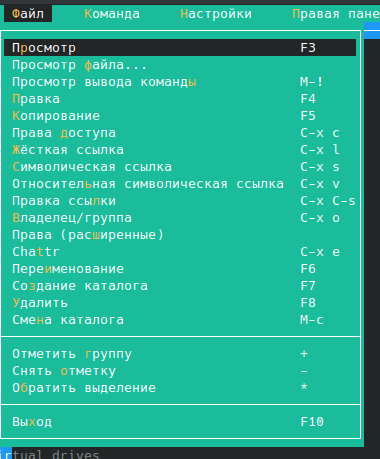{#fig:012 width=30%}

## Задания по mc

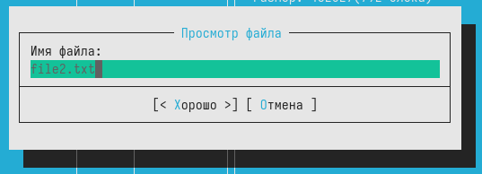{#fig:013 width=70%}

## Задания по mc

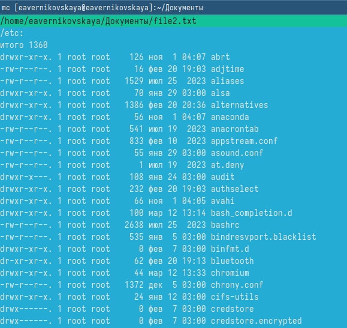{#fig:014 width=50%}

## Задания по mc

Редактируем содержимое файла без сохранения результатов (рис. 15), (рис. 16)

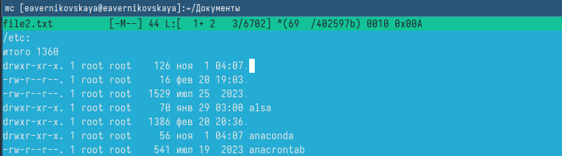{#fig:015 width=70%}

## Задания по mc

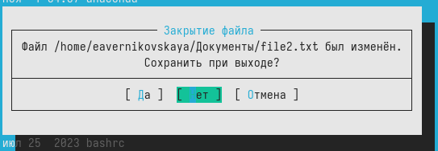{#fig:016 width=70%}

## Задания по mc

Далее создаём каталог и потом копируем в него любой файл (рис. 17), (рис. 18), (рис. 19)

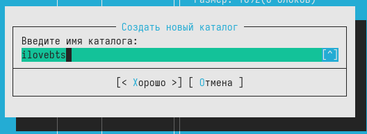{#fig:017 width=70%}

## Задания по mc

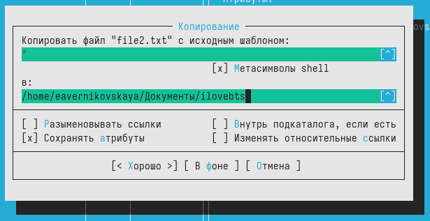{#fig:018 width=70%}

## Задания по mc

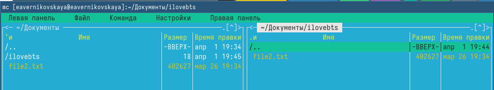{#fig:019 width=70%}

## Задания по mc

С помощью соответствующих средств подменю Команда осуществляем поиск в файловой системе файла с заданными условиями. Мы искали файл с расширением *.txt, который содержит слово root (рис. 20), (рис. 21), (рис. 22)

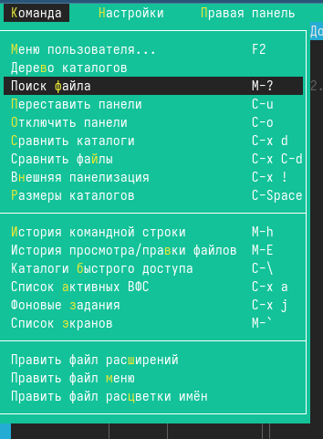{#fig:020 width=20%}

## Задания по mc

{#fig:021 width=70%}

## Задания по mc

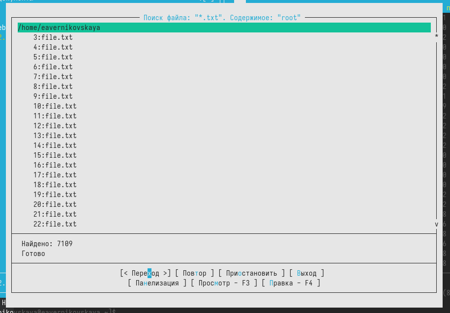{#fig:022 width=70%}

## Задания по mc

Далее мы посмотрели историю командной строки (рис. 23)

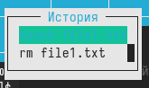{#fig:023 width=70%}

## Задания по mc

Потом мы перешли в доманший каталог (рис. 24)

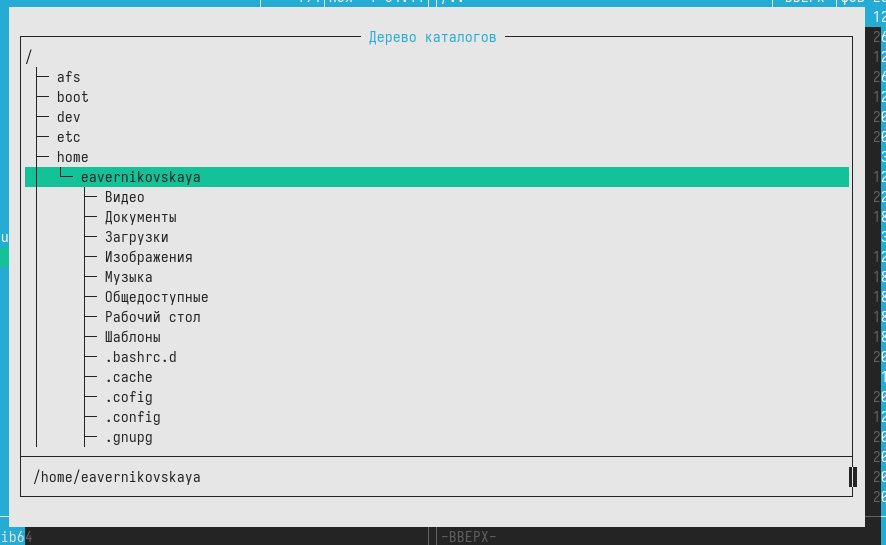{#fig:024 width=70%}

## Задания по mc

Далее мы проанализировали файл меню и файл расширений (рис. 25), (рис. 26)

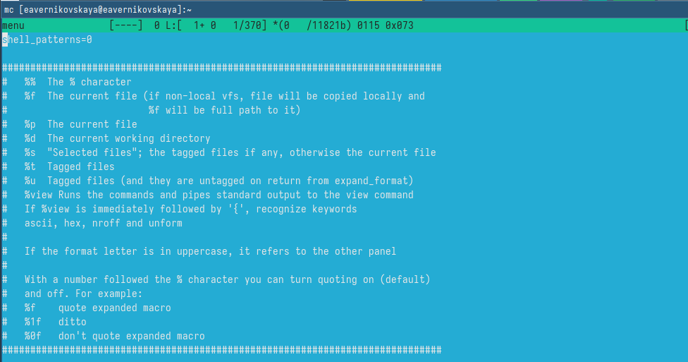{#fig:025 width=70%}

## Задания по mc

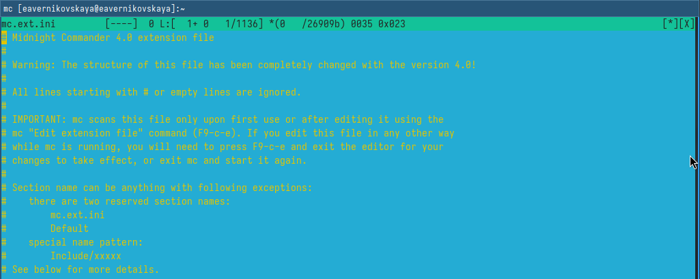{#fig:026 width=70%}

## Задания по mc

После вызвали подменю Настройки и освоили операции, определяющие структуру экрана mc. Посмотрели параметры конфигурации, внешний вид, определение клавиш и настройки панели (рис. 27), (рис. 28), (рис. 29), (рис. 30), (рис. 31)

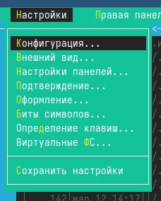{#fig:027 width=20%}

## Задания по mc

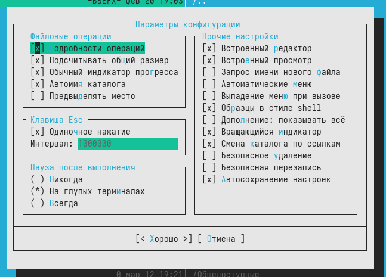{#fig:028 width=60%}

## Задания по mc

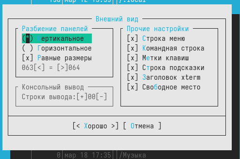{#fig:029 width=70%}

## Задания по mc

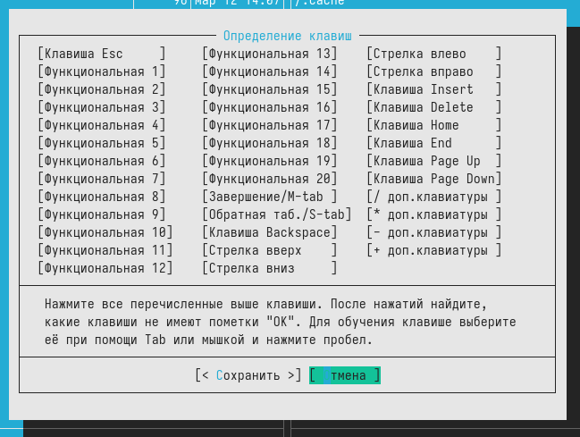{#fig:030 width=50%}

## Задания по mc

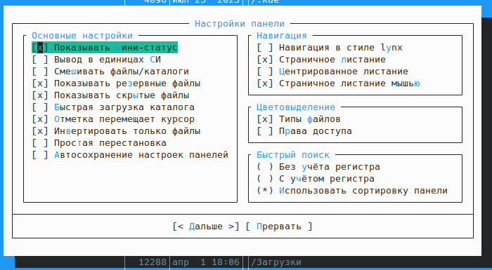{#fig:031 width=70%}

## Задания по встроенному редактору mc

Создаём файл с названием text.txt (рис. 32)

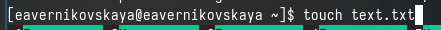{#fig:032 width=70%}

## Задания по встроенному редактору mc

Далее открываем этот файл с помощью встроенного в mc редактора (рис. 33)

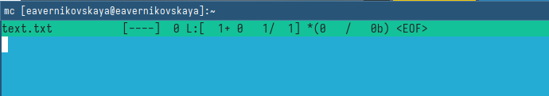{#fig:033 width=70%}

## Задания по встроенному редактору mc

Далее пишем в нём любой текст (рис. 34)

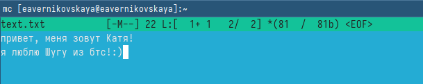{#fig:034 width=70%}

## Задания по встроенному редактору mc

Потом удаляем строчку текста с помощью горячей клавиши "crtrl-y" (рис. 35)

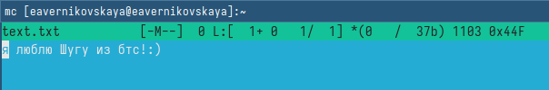{#fig:035 width=70%}

## Задания по встроенному редактору mc

Далее мы выделяли фрагмент текста и копировали его на новую строку, с помощью горячей клавиши F5 (рис. 36)

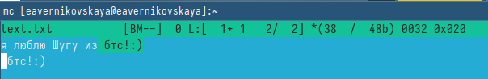{#fig:036 width=70%}

## Задания по встроенному редактору mc

После мы выделяли фрагмент текста и перемещали его на следуюущую строку, с помощью горячей клавиши F6 (рис. 37)

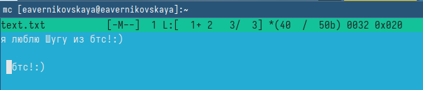{#fig:037 width=70%}

## Задания по встроенному редактору mc

Сохраняем файл нажав на клавишу F2 (рис. 38)

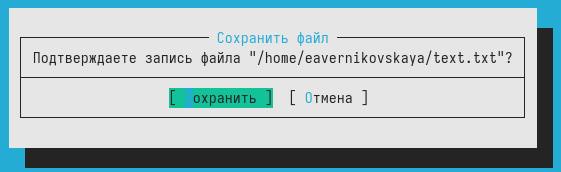{#fig:038 width=70%}

## Задания по встроенному редактору mc

Отменить последние действие можно с помощью горячей клавиши "crtrl-u". Что мы и сделали (рис. 39)

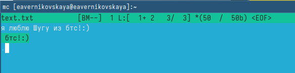{#fig:039 width=70%}

## Задания по встроенному редактору mc

Также мы можем перемещаться в корец и в начало файла с помощью горячих клавиш pgup - в начало файла и  pgon -  в конец файла. Перемещаемся в конец и начало файла и пишем там любую строчку (рис. 40), (рис. 41)

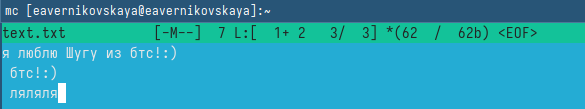{#fig:040 width=70%}

## Задания по встроенному редактору mc

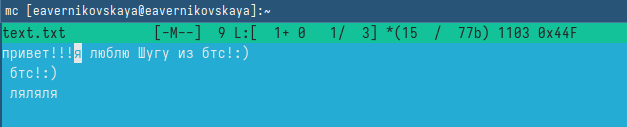{#fig:041 width=70%}

## Задания по встроенному редактору mc

Далее открываем файл с исходным текстом на языке программирования с++. Мы выдим, что подсветка синтаксиса включена (рис. 42)

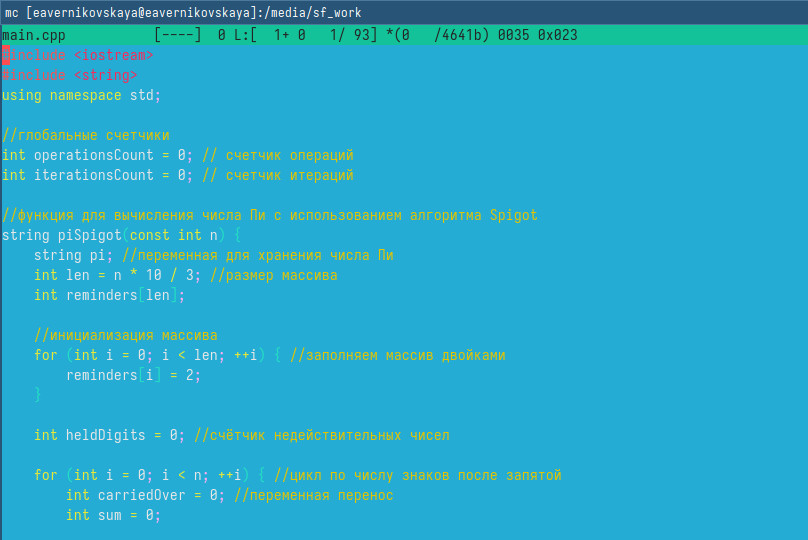{#fig:042 width=50%}

## Задания по встроенному редактору mc

Используя меню редактора, выключаем подсветку синтаксиса (рис. 43), (рис. 44)

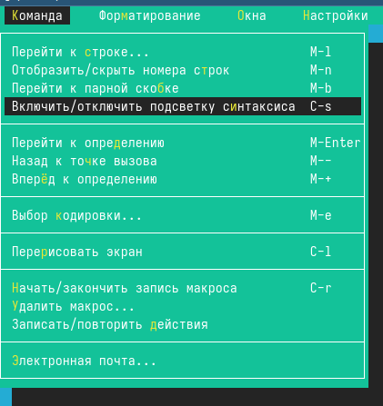{#fig:043 width=30%}

## Задания по встроенному редактору mc

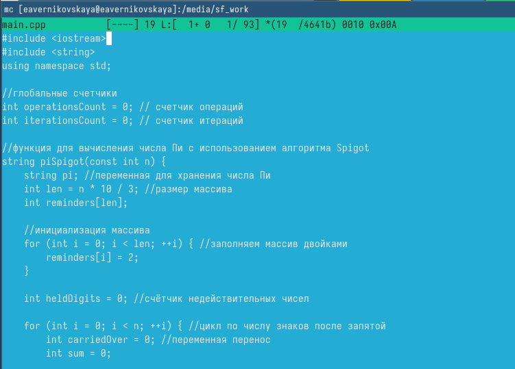{#fig:044 width=60%}

# Подведение итогов

## Выводы

В ходе выполнения лабораторной работы мы освоили основные возможности командной оболочки Midnight Commander. А также приобрели навыки практической работы по просмотру каталогов и файлов; манипуляций с ними.

## Список литературы

Не пользовалась сайтами.
