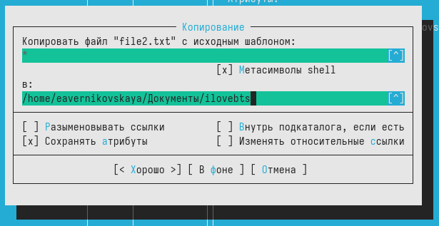

---
## Front matter
title: "Отчёт по лабораторной работе №9"
subtitle: "Дисциплина: Операционные системы"
author: "Верниковская Екатерина Андреевна"

## Generic otions
lang: ru-RU
toc-title: "Содержание"

## Bibliography
bibliography: bib/cite.bib
csl: pandoc/csl/gost-r-7-0-5-2008-numeric.csl

## Pdf output format
toc: true # Table of contents
toc-depth: 2
lof: true # List of figures
lot: true # List of tables
fontsize: 12pt
linestretch: 1.5
papersize: a4
documentclass: scrreprt
## I18n polyglossia
polyglossia-lang:
  name: russian
  options:
	- spelling=modern
	- babelshorthands=true
polyglossia-otherlangs:
  name: english
## I18n babel
babel-lang: russian
babel-otherlangs: english
## Fonts
mainfont: PT Serif
romanfont: PT Serif
sansfont: PT Sans
monofont: PT Mono
mainfontoptions: Ligatures=TeX
romanfontoptions: Ligatures=TeX
sansfontoptions: Ligatures=TeX,Scale=MatchLowercase
monofontoptions: Scale=MatchLowercase,Scale=0.9
## Biblatex
biblatex: true
biblio-style: "gost-numeric"
biblatexoptions:
  - parentracker=true
  - backend=biber
  - hyperref=auto
  - language=auto
  - autolang=other*
  - citestyle=gost-numeric
## Pandoc-crossref LaTeX customization
figureTitle: "Рис."
tableTitle: "Таблица"
listingTitle: "Листинг"
lofTitle: "Список иллюстраций"
lotTitle: "Список таблиц"
lolTitle: "Листинги"
## Misc options
indent: true
header-includes:
  - \usepackage{indentfirst}
  - \usepackage{float} # keep figures where there are in the text
  - \floatplacement{figure}{H} # keep figures where there are in the text
---

# Цель работы

Освоить основные возможности командной оболочки Midnight Commander. Приобрести навыки практической работы по просмотру каталогов и файлов; манипуляций с ними.

# Задание

## Задания по mc

1. Изучить информацию о mc, вызвав в командной строке man mc.
2. Запустить из командной строки mc, изучить его структуру и меню.
3. Выполнить несколько операций в mc, используя управляющие клавиши (операции с панелями; выделение/отмена выделения файлов, копирование/перемещение файлов, получение информации о размере и правах доступа на файлы и/или каталоги и т.п.)
4. Выполнить основные команды меню левой (или правой) панели. Оценить степень подробности вывода информации о файлах.
5. Используя возможности подменю Файл, выполнить:
- просмотр содержимого текстового файла;
- редактирование содержимого текстового файла (без сохранения результатов редактирования);
- создание каталога;
- копирование в файлов в созданный каталог.
6. С помощью соответствующих средств подменю Команда осуществить:
- поиск в файловой системе файла с заданными условиями (например, файла с расширением .c или .cpp, содержащего строку main);
- выбор и повторение одной из предыдущих команд;
- переход в домашний каталог;
- анализ файла меню и файла расширений.
7. Вызвать подменю Настройки. Освоить операции, определяющие структуру экрана mc (Full screen, Double Width, Show Hidden Files и т.д.).

## Задания по встроенному редактору mc

1. Создать текстовой файл text.txt.
2. Открыть этот файл с помощью встроенного в mc редактора.
3. Вставить в открытый файл небольшой фрагмент текста, скопированный из любого другого файла или Интернета.
4. Пррделать с текстом следующие манипуляции, используя горячие клавиши:
- Удалить строку текста.
- Выделить фрагмент текста и скопировать его на новую строку.
- Выделить фрагмент текста и перенести его на новую строку.
- Сохранить файл.
- Отменить последнее действие.
- Перейти в конец файла (нажав комбинацию клавиш) и написать некоторый текст.
- Перейти в начало файла (нажав комбинацию клавиш) и написать некоторый текст.
- Сохранить и закрыть файл.
5. Открыть файл с исходным текстом на некотором языке программирования.
6. Используя меню редактора, включить подсветку синтаксиса, если она не включена, или выключить, если она включена.

# Выполнение лабораторной работы

## Задания по mc

Узучаем информацию о mc, вызвав в командной строке команду *man mc* (рис. [-@fig:001]), (рис. [-@fig:002])

{#fig:001 width=70%}

{#fig:002 width=70%}

Запускаем из командной строки mc, изучаем его структуру и меню. С помощью стрелок вниз и вверх я могу перемещаться по файла, с помощью Tab я могу менять панели (рис. [-@fig:003])

{#fig:003 width=70%}

Также я могу копировать и перемещать файлы и смотреть права доступа файлам. Всё это я могу делать с помощью управляющих (рис. [-@fig:004]), (рис. [-@fig:005]), (рис. [-@fig:006]), (рис. [-@fig:007]), (рис. [-@fig:008])

{#fig:004 width=70%}

{#fig:005 width=70%}

{#fig:006 width=70%}

{#fig:007 width=70%}

{#fig:008 width=70%}

Далее выполняем основные команды меню левой панели. И смотрим информацию о файлах. Сравниваем степень подробности вывода информации о файлах. Команда меню левой панели показывает намного больше информации, чем команда *ls -l* (рис. [-@fig:009]), (рис. [-@fig:010]), (рис. [-@fig:011])

{#fig:009 width=70%}

{#fig:010 width=70%}

{#fig:011 width=70%}

Используем возможности подменю Файл. Сначала просматриваем содержимое текстового файла (рис. [-@fig:012]), (рис. [-@fig:013]), (рис. [-@fig:014])

{#fig:012 width=70%}

{#fig:013 width=70%}

{#fig:014 width=70%}

Редактируем содержимое файла без сохранения результатов (рис. [-@fig:015]), (рис. [-@fig:016])

{#fig:015 width=70%}

{#fig:016 width=70%}

Далее создаём каталог и потом копируем в него любой файл (рис. [-@fig:017]), (рис. [-@fig:018]), (рис. [-@fig:019])

{#fig:017 width=70%}

{#fig:018 width=70%}

{#fig:019 width=70%}

С помощью соответствующих средств подменю Команда осуществляем поиск в файловой системе файла с заданными условиями. Мы искали файл с расширением *.txt, который содержит слово root (рис. [-@fig:020]), (рис. [-@fig:021]), (рис. [-@fig:022])

{#fig:020 width=70%}

{#fig:021 width=70%}

{#fig:022 width=70%}

Далее мы посмотрели историю командной строки (рис. [-@fig:023])

{#fig:023 width=70%}

Потом мы перешли в доманший каталог (рис. [-@fig:024])

{#fig:024 width=70%}

Далее мы проанализировали файл меню и файл расширений (рис. [-@fig:025]), (рис. [-@fig:026])

{#fig:025 width=70%}

{#fig:026 width=70%}

После вызвали подменю Настройки и освоили операции, определяющие структуру экрана mc. Посмотрели параметры конфигурации, внешний вид, определение клавиш и настройки панели (рис. [-@fig:027]), (рис. [-@fig:028]), (рис. [-@fig:029]), (рис. [-@fig:030]), (рис. [-@fig:031])

{#fig:027 width=70%}

{#fig:028 width=70%}

{#fig:029 width=70%}

{#fig:030 width=70%}

{#fig:031 width=70%}

## Задания по встроенному редактору mc

Создаём файл с названием text.txt (рис. [-@fig:032])

{#fig:032 width=70%}

Далее открываем этот файл с помощью встроенного в mc редактора (рис. [-@fig:033])

{#fig:033 width=70%}

Далее пишем в нём любой текст (рис. [-@fig:034])

{#fig:034 width=70%}

Потом удаляем строчку текста с помощью горячей клавиши "crtrl-y" (рис. [-@fig:035])

{#fig:035 width=70%}

Далее мы выделяли фрагмент текста и копировали его на новую строку, с помощью горячей клавиши F5 (рис. [-@fig:036])

{#fig:036 width=70%}

После мы выделяли фрагмент текста и перемещали его на следуюущую строку, с помощью горячей клавиши F6 (рис. [-@fig:037])

{#fig:037 width=70%}

Сохраняем файл нажав на клавишу F2 (рис. [-@fig:038])

{#fig:038 width=70%}

Отменить последние действие можно с помощью горячей клавиши "crtrl-u". Что мы и сделали (рис. [-@fig:039])

{#fig:039 width=70%}

Также мы можем перемещаться в корец и в начало файла с помощью горячих клавиш pgup - в начало файла и  pgon -  в конец файла. Перемещаемся в конец и начало файла и пишем там любую строчку (рис. [-@fig:040]), (рис. [-@fig:041])

{#fig:040 width=70%}

{#fig:041 width=70%}

Далее открываем файл с исходным текстом на языке программирования с++. Мы выдим, что подсветка синтаксиса включена (рис. [-@fig:042])

{#fig:042 width=70%}

Используя меню редактора, выключаем подсветку синтаксиса (рис. [-@fig:043]), (рис. [-@fig:044])

{#fig:043 width=70%}

{#fig:044 width=70%}

# Ответы на контрольные вопросы

1. Какие режимы работы есть в mc. Охарактеризуйте их.

Панели могут дополнительно быть переведены в один из двух режимов: Информация или Дерево. В режиме Информация на панель выводятся сведения о файле и текущей файловой системе, расположенных на активной панели. В режиме Дерево на одной из панелей выводится структура дерева каталогов.

2. Какие операции с файлами можно выполнить как с помощью команд shell, так и с помощью меню (комбинаций клавиш) mc? Приведите несколько примеров.

В разделе Командная строка оболочки (Shell) перечисляются команды и комбинации клавиш, которые используются для ввода и редактирования команд в командной строке оболочки. Большая часть этих команд служит для переноса имен файлов и/или имен каталогов в командную строку (чтобы уменьшить трудоемкость ввода) или для доступа к истории команд. Клавиши редактирования строк ввода используются как при редактировании командной строки, так и других строк ввода, появляющихся в различных запросах программы.

Как с помощью меню так и с помощью команд shell можно переносить, копировать и получать информацию о файоах и каталогах.

3. Опишите структура меню левой (или правой) панели mc, дайте характеристику командам.

В меню каждой (левой или правой) панели можно выбрать Формат списка:
- стандартный - выводит список файлов и каталогов с указанием размера и времени правки; 
- ускоренный - позволяет задать число столбцов, на которые разбивается панель при выводе списка имён файлов или каталогов без дополнительной информации;
- расширенный - помимо названия файла или каталога выводит сведения о правах доступа, владельце, группе, размере, времени правки;
- определённый пользователем - позволяет вывести те сведения о файле или каталоге, которые задаст сам пользователь.

4. Опишите структура меню Файл mc, дайте характеристику командам.

В меню Файл содержит перечень команд, которые могут быть применены к одному или нескольким файлам или каталогам.
Команды меню Файл: 
- Просмотр (F3) - позволяет посмотреть содержимое текущего (или выделенного) файла без возможности редактирования.
- Просмотр вывода команды (М + !) - функция запроса команды с параметрами (аргумент к текущему выбранному файлу). 
- Правка (F4) - открывает текущий (или выделенный) файл для его редактирования.
- Копирование (F5) - осуществляет копирование одного или нескольких файлов или каталогов в указанное пользователем во всплывающем окне место.
- Права доступа (Ctrl-x c) - позволяет указать (изменить) права доступа к одному или нескольким файлам или каталогам. 
- Жёсткая ссылка (Ctrl-x l) - позволяет создать жёсткую ссылку к текущему (или выделенному) файлу.
- Символическая ссылка (Ctrl-x s) - позволяет создать символическую ссылку к текущему (или выделенному) файлу.
- Владелец/группа (Ctrl-x o) - позволяет задать (изменить) владельца и имя группы для одного или
нескольких файлов или каталогов.
- Права (расширенные) - позволяет изменить права доступа и владения для одного или нескольких файлов или каталогов. 
- Переименование (F6) - позволяет переименовать (или переместить) один или несколько файлов или каталогов. 
- Создание каталога ( F7 ) — позволяет создать каталог. 
- Удалить (F8) - позволяет удалить один или несколько файлов или каталогов. 
- Выход (F10) - завершает работу mc.

5. Опишите структура меню Команда mc, дайте характеристику командам.

В меню Команда содержатся более общие команды для работы с mc. 
Команды меню Команда:

- Дерево каталогов - отображает структуру каталогов системы.
- Поиск файла - выполняет поиск файлов по заданным параметрам.
- Переставить панели - меняет местами левую и правую панели.
- Сравнить каталоги (Ctrl-x d) - сравнивает содержимое двух каталогов.
- Размеры каталогов - отображает размер и время изменения каталога (по умолчанию в mc размер - каталога корректно не отображается).
- История командной строки - выводит на экран список ранее выполненных в оболочке команд.
- Каталоги быстрого доступа (Ctrl-) - пр вызове выполняется быстрая смена текущего каталога на один из заданного списка.
- Восстановление файлов - позволяет восстановить файлы на файловых системах ext2 и ext3.
- Редактировать файл расширений - позволяет задать с помощью определённого синтаксиса действия при запуске файлов с определённым расширением (например, какое программного обеспечение запускать для открытия или редактирования файлов с расширением doc или docx).
- Редактировать файл меню - позволяет отредактировать контекстное меню пользователя, вызываемое по клавише F2.
- Редактировать файл расцветки имён - позволяет подобрать оптимальную для пользователя расцветку имён файлов в зависимости от их типа.

6. Опишите структура меню Настройки mc, дайте характеристику командам.

Меню Настройки содержит ряд дополнительных опций по внешнему виду и функциональности mc. 
Меню Настройки содержит: 
- Конфигурация - позволяет скорректировать настройки работы с панелями. 
- Внешний вид и Настройки панелей - определяет элементы (строка меню, командная строка, подсказки и прочее), отображаемые при вызове mc, а также геометрию расположения панелей и цветовыделение.
- Биты символов - задаёт формат обработки информации локальным терминалом.
- Подтверждение - позволяет установить или убрать вывод окна с запросом подтверждения действий при операциях удаления и перезаписи файлов, а также при выходе из программы.
- Распознание клавиш - диалоговое окно используется для тестирования функциональных клавиш, клавиш управления курсором и прочее.
- Виртуальные ФС – настройки виртуальной файловой системы: тайм-аут, пароль и прочее.

7. Назовите и дайте характеристику встроенным командам mc.

- F1 Вызов контекстно-зависимой подсказки;
- F2 Вызов пользовательского меню с возможностью создания и/или дополнения дополнительных функций;
- F3 Просмотр содержимого файла, на который указывает подсветка в активной панели (без возможности редактирования);
- F4 Вызов встроенного в mc редактора для изменения содержания файла, на который указывает подсветка в активной панели;
- F5 Копирование одного или нескольких файлов, отмеченных в первой (активной) панели, в каталог, отображаемый на второй панели;
- F6 Перенос одного или нескольких файлов, отмеченных в первой (активной) панели, в каталог, отображаемый на второй панели;
- F7 Создание подкаталога в каталоге, отображаемом в активной панели;
- F8 Удаление одного или нескольких файлов (каталогов), отмеченных в первой (активной) панели файлов;
- F9 Вызов меню mc;
- F10 Выход из mc;

8. Назовите и дайте характеристику командам встроенного редактора mc.

- Ctrl-y удалить строку;
- Ctrl-u отмена последней операции; Ins вставка/замена;
- F7 поиск (можно использовать регулярные выражения);
- (стрелочка вверх)-F7 повтор последней операции поиска;
- F4 замена;
- F3 первое нажатие — начало выделения,
- второе — окончание выделения;
- F5 копировать выделенный фрагмент;
- F6 переместить выделенный фрагмент;
- F8 удалить выделенный фрагмент;
- F2 записать изменения в файл;
- F10 выйти из редактора.

9. Дайте характеристику средствам mc, которые позволяют создавать меню, определяемые пользователем.

Можете сохранить часто используемые команды панелизации под отдельными информативными именами, чтобы иметь возможность их быстро вызвать по этим именам.Для этого нужно набрать команду в строке ввода (строка “Команда”) и нажать кнопку Добавить. После этого потребуется ввести имя, по которому мы будем вызывать команду. В следующий раз вам достаточно будет выбрать нужное имя из списка, а не вводить всю команду заново.

10. Дайте характеристику средствам mc, которые позволяют выполнять действия, определяемые пользователем, над текущим файлом.

Панель в mc отображает список файлов текущего каталога. Абсолютный путь к этому каталогу отображается в заголовке панели. У активной панели заголовок и одна из её строк подсвечиваются. Управление панелями осуществляется с помощью определённых комбинаций клавиш или пунктов меню mc.

# Выводы

В ходе выполнения лабораторной работы мы освоили основные возможности командной оболочки Midnight Commander. А также приобрели навыки практической работы по просмотру каталогов и файлов; манипуляций с ними.

# Список литературы

Не пользовалась сайтами.
