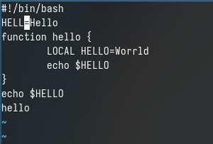

---
## Front matter
lang: ru-RU
title: Лабораторная работа №10
subtitle: Операционные системы
author:
  - Верниковская Е. А., НПИбд-01-23
institute:
  - Российский университет дружбы народов, Москва, Россия
date: 10 апреля 2024

## i18n babel
babel-lang: russian
babel-otherlangs: english

## Formatting pdf
toc: false
toc-title: Содержание
slide_level: 2
aspectratio: 169
section-titles: true
theme: metropolis
header-includes:
 - \metroset{progressbar=frametitle,sectionpage=progressbar,numbering=fraction}
 - '\makeatletter'
 - '\beamer@ignorenonframefalse'
 - '\makeatother'
 
## Fonts
mainfont: PT Serif
romanfont: PT Serif
sansfont: PT Sans
monofont: PT Mono
mainfontoptions: Ligatures=TeX
romanfontoptions: Ligatures=TeX
sansfontoptions: Ligatures=TeX,Scale=MatchLowercase
monofontoptions: Scale=MatchLowercase,Scale=0.9
---

# Вводная часть

## Цель работы

Ознакомиться с операционной системой Linux. Получить практические навыки работы с редактором vi, установленным по умолчанию практически во всех дистрибутивах.

## Задание

1. Ознакомиться с теоретическим материалом.
2. Ознакомиться с редактором vi.
3. Выполнить упражнения, используя команды vi.

# Выполнение лабораторной работы

## Задание 1. Создание нового файла с использованием vi

Создаём каталог с именем ~/work/os/lab10 (рис. 1)

{#fig:001 width=70%}

## Задание 1. Создание нового файла с использованием vi

Переходим в только что сохданный каталог (рис. 2)

{#fig:002 width=70%}

## Задание 1. Создание нового файла с использованием vi

Далее вызываем vi и создаём файл hello.sh командой *vi hello.sh* (рис. 3), (рис. 4)

{#fig:003 width=70%}

## Задание 1. Создание нового файла с использованием vi

{#fig:004 width=60%}

## Задание 1. Создание нового файла с использованием vi

После нажимаем на кнопку *i* чтобы перейти в режим вставки (рис. 5)

{#fig:005 width=70%}

## Задание 1. Создание нового файла с использованием vi

Вводим нужный текст: (рис. 6)

```
#!/bin/bash
HELL=Hello
function hello {
	LOCAL HELLO=World
	echo $HELLO
}
echo $HELLO
hello
```

## Задание 1. Создание нового файла с использованием vi

{#fig:006 width=70%}

## Задание 1. Создание нового файла с использованием vi

Далее нажимаем *esc* для перехода в командый режим (рис. 7)

{#fig:007 width=70%}

## Задание 1. Создание нового файла с использованием vi

Далее с помощью *:* мы переходим в режим последней строки. Внизу экрана появляется приглашение в виде двоеточия (рис. 8)

{#fig:008 width=70%}

## Задание 1. Создание нового файла с использованием vi

После вводим w(записать) и q(выйти), а затем нажимаем *enter* для сохранения нашего текста и завершения работы (рис. 9)

{#fig:009 width=70%}

## Задание 1. Создание нового файла с использованием vi

Далее делаем файл исполняемым введя *chmod +x hello.sh* (рис. 10)

{#fig:010 width=70%}

## Задание 2. Редактирование существующего файла

Вызываем vi на редоктирование файла (рис. 11), (рис. 12)

{#fig:011 width=70%}

## Задание 2. Редактирование существующего файла

{#fig:012 width=60%}

## Задание 2. Редактирование существующего файла

Устанавливаем курсор в конец слова HELL второй строки (рис. 13)

{#fig:013 width=40%}

## Задание 2. Редактирование существующего файла

Далее переходим в режим вставки нажав *i* и заменяем на HELLO. После нажимаем на *esc* для возврата в командный режим (рис. 14)

{#fig:014 width=40%}

## Задание 2. Редактирование существующего файла

После устанавливаем курсор на четвёртую строку и стираем слово LOCAL (рис. 15)

{#fig:015 width=40%}

## Задание 2. Редактирование существующего файла

Переходим в режим вставки и набираем слово local. После переходим опять в командный режим (рис. 16)

{#fig:016 width=40%}

## Задание 2. Редактирование существующего файла

Далее устанавливаем курсор на последней строке файла и вставляем туда следующий текст: echo $HELLO (рис. 17)

{#fig:017 width=40%}

## Задание 2. Редактирование существующего файла

Переходим снова в командный режим. Далее удаляем последнюю строку (рис. 18)

{#fig:018 width=40%}

## Задание 2. Редактирование существующего файла

После вводим команду отмены изменений нажав на *u* (рис. 19)

{#fig:019 width=30%}

## Задание 2. Редактирование существующего файла

Вводим *:* для перехода в режим последней строки. Записываем произведённые изменения и выходим из vi (рис. 20)

{#fig:020 width=50%}

# Подведение итогов

## Выводы

В ходе выполнения лабораторной работы мы ознакомились с операционной системой Linux а также получили практические навыки работы с редактором vi, установленным по умолчанию практически во всех дистрибутивах.

## Список литературы

Не пользовалась сайтами.
