---
## Front matter
title: "Отчёт по лабораторной работе №10"
subtitle: "Дисциплина: Операционные системы"
author: "Верниковская Екатерина Андреевна"

## Generic otions
lang: ru-RU
toc-title: "Содержание"

## Bibliography
bibliography: bib/cite.bib
csl: pandoc/csl/gost-r-7-0-5-2008-numeric.csl

## Pdf output format
toc: true # Table of contents
toc-depth: 2
lof: true # List of figures
lot: true # List of tables
fontsize: 12pt
linestretch: 1.5
papersize: a4
documentclass: scrreprt
## I18n polyglossia
polyglossia-lang:
  name: russian
  options:
	- spelling=modern
	- babelshorthands=true
polyglossia-otherlangs:
  name: english
## I18n babel
babel-lang: russian
babel-otherlangs: english
## Fonts
mainfont: PT Serif
romanfont: PT Serif
sansfont: PT Sans
monofont: PT Mono
mainfontoptions: Ligatures=TeX
romanfontoptions: Ligatures=TeX
sansfontoptions: Ligatures=TeX,Scale=MatchLowercase
monofontoptions: Scale=MatchLowercase,Scale=0.9
## Biblatex
biblatex: true
biblio-style: "gost-numeric"
biblatexoptions:
  - parentracker=true
  - backend=biber
  - hyperref=auto
  - language=auto
  - autolang=other*
  - citestyle=gost-numeric
## Pandoc-crossref LaTeX customization
figureTitle: "Рис."
tableTitle: "Таблица"
listingTitle: "Листинг"
lofTitle: "Список иллюстраций"
lotTitle: "Список таблиц"
lolTitle: "Листинги"
## Misc options
indent: true
header-includes:
  - \usepackage{indentfirst}
  - \usepackage{float} # keep figures where there are in the text
  - \floatplacement{figure}{H} # keep figures where there are in the text
---

# Цель работы

Ознакомиться с операционной системой Linux. Получить практические навыки работы с редактором vi, установленным по умолчанию практически во всех дистрибутивах.

# Задание

1. Ознакомиться с теоретическим материалом.
2. Ознакомиться с редактором vi.
3. Выполнить упражнения, используя команды vi.

# Выполнение лабораторной работы

## Задание 1. Создание нового файла с использованием vi

Создаём каталог с именем ~/work/os/lab10 (рис. [-@fig:001])

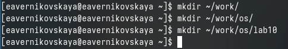{#fig:001 width=70%}

Переходим в только что сохданный каталог (рис. [-@fig:002])

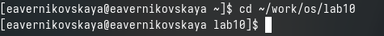{#fig:002 width=70%}

Далее вызываем vi и создаём файл hello.sh командой *vi hello.sh* (рис. [-@fig:003]), (рис. [-@fig:004])

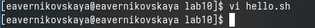{#fig:003 width=70%}

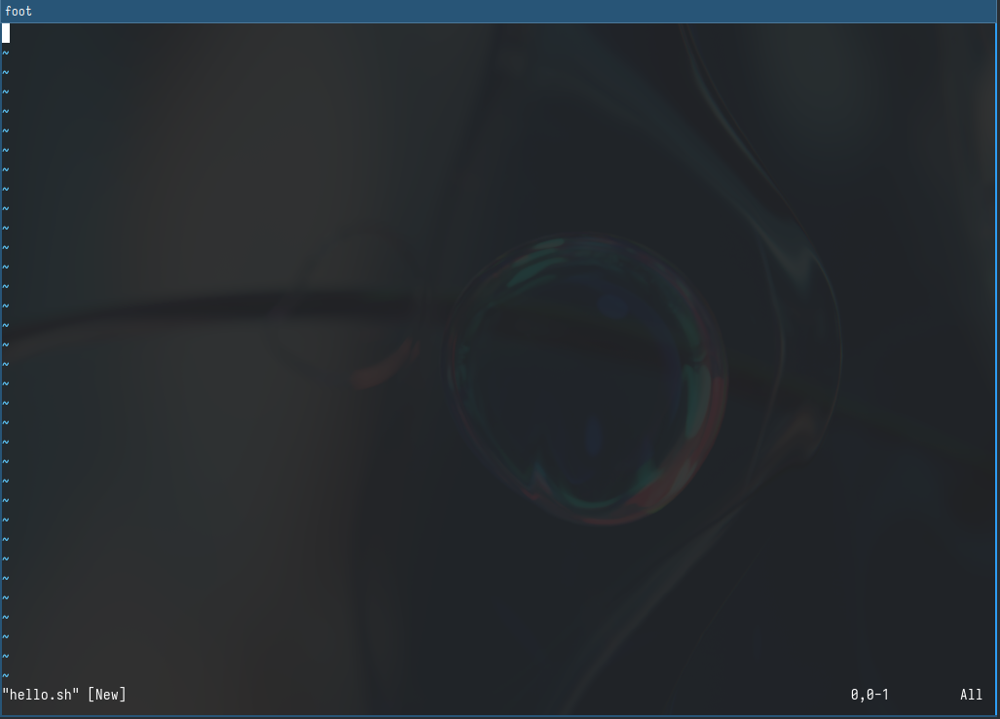{#fig:004 width=70%}

После нажимаем на кнопку *i* чтобы перейти в режим вставки (рис. [-@fig:005])

{#fig:005 width=70%}

Вводим нужный текст: (рис. [-@fig:006])

```
#!/bin/bash
HELL=Hello
function hello {
	LOCAL HELLO=World
	echo $HELLO
}
echo $HELLO
hello
```

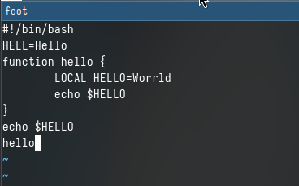{#fig:006 width=70%}

Далее нажимаем *esc* для перехода в командый режим (рис. [-@fig:007])

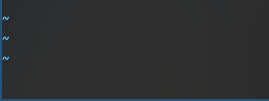{#fig:007 width=70%}

Далее с помощью *:* мы переходим в режим последней строки. Внизу экрана появляется приглашение в виде двоеточия (рис. [-@fig:008])

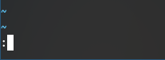{#fig:008 width=70%}

После вводим w(записать) и q(выйти), а затем нажимаем *enter* для сохранения нашего текста и завершения работы (рис. [-@fig:009])

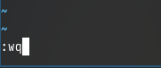{#fig:009 width=70%}

Далее делаем файл исполняемым введя *chmod +x hello.sh* (рис. [-@fig:010])

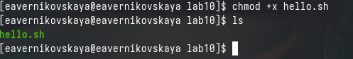{#fig:010 width=70%}

## Задание 2. Редактирование существующего файла

Вызываем vi на редоктирование файла (рис. [-@fig:011]), (рис. [-@fig:012])

{#fig:011 width=70%}

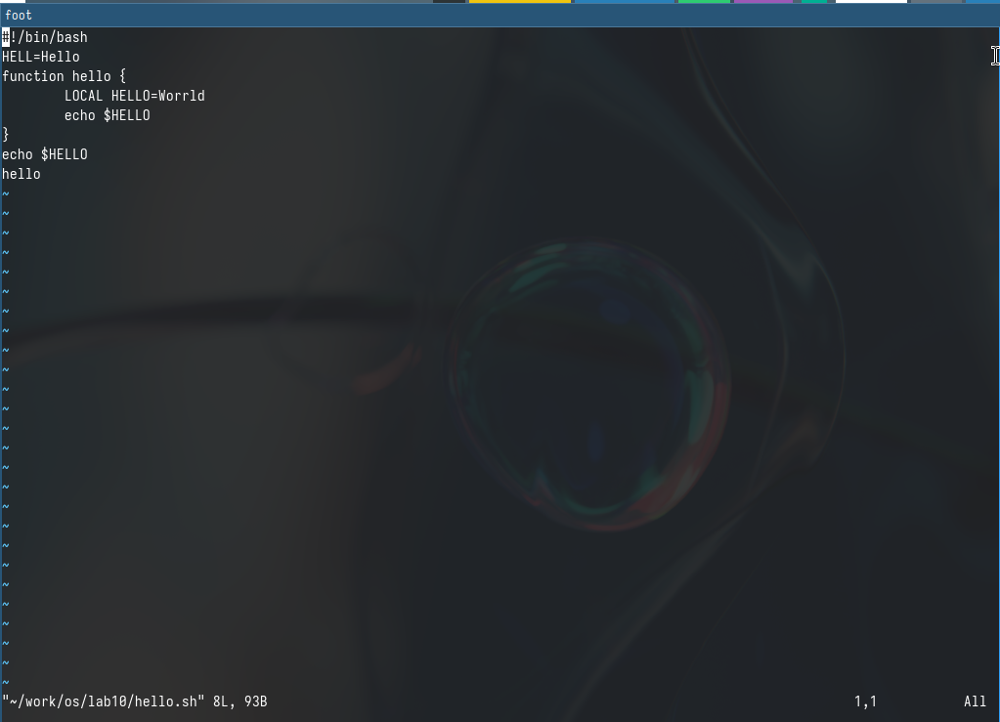{#fig:012 width=70%}

Устанавливаем курсор в конец слова HELL второй строки (рис. [-@fig:013])

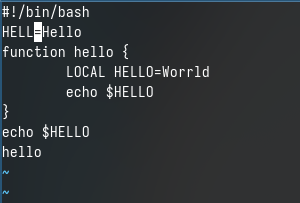{#fig:013 width=70%}

Далее переходим в режим вставки нажав *i* и заменяем на HELLO. После нажимаем на *esc* для возврата в командный режим (рис. [-@fig:014])

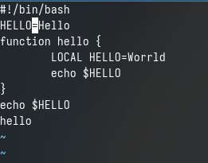{#fig:014 width=70%}

После устанавливаем курсор на четвёртую строку и стираем слово LOCAL (рис. [-@fig:015])

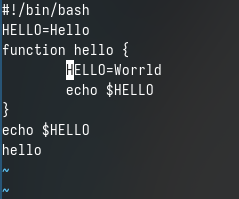{#fig:015 width=70%}

Переходим в режим вставки и набираем слово local. После переходим опять в командный режим (рис. [-@fig:016])

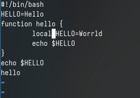{#fig:016 width=70%}

Далее устанавливаем курсор на последней строке файла и вставляем туда следующий текст: echo $HELLO (рис. [-@fig:017])

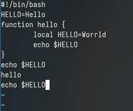{#fig:017 width=70%}

Переходим снова в командный режим. Далее удаляем последнюю строку (рис. [-@fig:018])

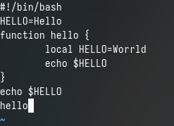{#fig:018 width=70%}

После вводим команду отмены изменений нажав на *u* (рис. [-@fig:019])

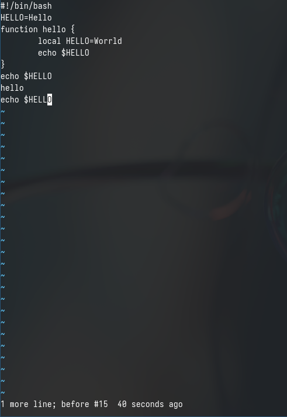{#fig:019 width=70%}

Вводим *:* для перехода в режим последней строки. Записываем произведённые изменения и выходим из vi (рис. [-@fig:020])

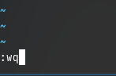{#fig:020 width=70%}

# Ответы на контрольные вопросы

1. Дайте краткую характеристику режимам работы редактора vi.

- командный режим — предназначен для ввода команд редактирования и навигации по редактируемому файлу;
- режим вставки — предназначен для ввода содержания редактируемого файла;
- режим последней (или командной) строки — используется для записи изменений в файл и выхода из редактора.

2. Как выйти из редактора, не сохраняя произведённые изменения?

Можно нажимать символ q (или q!), если требуется выйти из редактора без сохранения.

3. Назовите и дайте краткую характеристику командам позиционирования.

- 0 (ноль) — переход в начало строки;
- $ — переход в конец строки;
- G — переход в конец файла;
- n G — переход на строку с номером n.

4. Что для редактора vi является словом?

Редактор vi предполагает, что слово - это строка символов, которая может включать в себя буквы, цифры и символы подчеркивания.

5. Каким образом из любого места редактируемого файла перейти в начало (конец)
файла?

С помощью G — переход в конец файла.

6. Назовите и дайте краткую характеристику основным группам команд редактирования.

- Вставка текста: а — вставить текст после курсора; А — вставить текст в конец строки; i — вставить текст перед курсором; n i — вставить текст n раз; I — вставить текст в начало строки.
- Вставка строки: о — вставить строку под курсором; О — вставить строку над курсором.
- Удаление текста: x — удалить один символ в буфер; d w — удалить одно слово в буфер; d $ — удалить в буфер текст от курсора до конца строки; d 0 — удалить в буфер текст от начала строки до позиции курсора; d d — удалить в буфер одну строку; n d d — удалить в буфер n строк.
- Отмена и повтор произведённых изменений: u — отменить последнее изменение; . — повторить последнее изменение.
- Копирование текста в буфер: Y — скопировать строку в буфер; n Y — скопировать n строк в буфер; y w — скопировать слово в буфер.
- Вставка текста из буфера: p — вставить текст из буфера после курсора; P — вставить текст из буфера перед курсором.
- Замена текста: c w — заменить слово; n c w — заменить n слов; c $ — заменить текст от курсора до конца строки; r — заменить слово; R — заменить текст.
- Поиск текста: / текст — произвести поиск вперёд по тексту указанной строки символов текст; ? текст — произвести поиск назад по тексту указанной строки символов текст.

7. Необходимо заполнить строку символами $. Каковы ваши действия?

Перейти в режим вставки.

8. Как отменить некорректное действие, связанное с процессом редактирования?

С помощью u — отменить последнее изменение.

9. Назовите и дайте характеристику основным группам команд режима последней строки.

Режим последней строки — используется для записи изменений в файл и выхода из редактора.

10. Как определить, не перемещая курсора, позицию, в которой заканчивается строка?

$ — переход в конец строки.

11. Выполните анализ опций редактора vi (сколько их, как узнать их назначение и т.д.).

Опции редактора vi позволяют настроить рабочую среду. Для задания опций используется команда set (в режиме последней строки): 
- : set all — вывести полный список опций;
- : set nu — вывести номера строк;
- : set list — вывести невидимые символы;
- : set ic — не учитывать при поиске, является ли символ прописным или строчным.

12. Как определить режим работы редактора vi?

В редакторе vi есть два основных режима: командный режим и режим вставки. По умолчанию работа начинается в командном режиме. В режиме вставки клавиатура используется для набора текста. Для выхода в командный режим используется клавиша Esc или комбинация Ctrl + c. 

13. Постройте граф взаимосвязи режимов работы редактора vi.

{#fig:021 width=70%}

# Выводы

В ходе выполнения лабораторной работы мы ознакомились с операционной системой Linux а также получили практические навыки работы с редактором vi, установленным по умолчанию практически во всех дистрибутивах.

# Список литературы

Не пользовалась сайтами.
