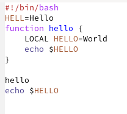
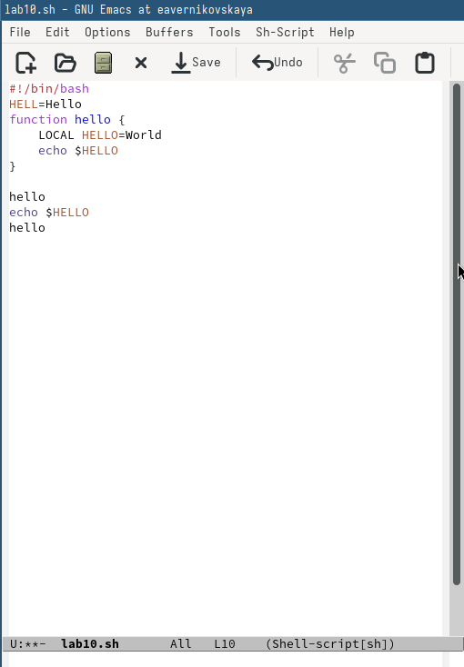
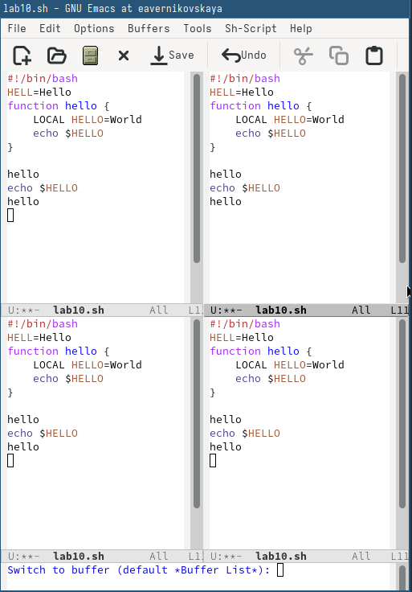

---
## Front matter
lang: ru-RU
title: Лабораторная работа №11
subtitle: Операционные системы
author:
  - Верниковская Е. А., НПИбд-01-23
institute:
  - Российский университет дружбы народов, Москва, Россия
date: 18 апреля 2024

## i18n babel
babel-lang: russian
babel-otherlangs: english

## Formatting pdf
toc: false
toc-title: Содержание
slide_level: 2
aspectratio: 169
section-titles: true
theme: metropolis
header-includes:
 - \metroset{progressbar=frametitle,sectionpage=progressbar,numbering=fraction}
 - '\makeatletter'
 - '\beamer@ignorenonframefalse'
 - '\makeatother'
 
## Fonts
mainfont: PT Serif
romanfont: PT Serif
sansfont: PT Sans
monofont: PT Mono
mainfontoptions: Ligatures=TeX
romanfontoptions: Ligatures=TeX
sansfontoptions: Ligatures=TeX,Scale=MatchLowercase
monofontoptions: Scale=MatchLowercase,Scale=0.9
---

# Вводная часть

## Цель работы

Познакомиться с операционной системой Linux. Получить практические навыки работы с редактором Emacs.

## Задание

1. Ознакомиться с теоретическим материалом.
2. Ознакомиться с редактором emacs.
3. Выполнить упражнения.
4. Ответить на контрольные вопросы.

# Выполнение лабораторной работы

## Выполнение лабораторной работы

Скачиваем emacs (рис. 1)

{#fig:001 width=70%}

## Выполнение лабораторной работы

Открываем emacs (рис. 2), (рис. 3)

{#fig:002 width=70%}

## Выполнение лабораторной работы

{#fig:003 width=30%}

## Выполнение лабораторной работы

Создаём файл lab10.sh с помощью комбинации Ctrl-x и Ctrl-f (рис. 4), (рис. 5)

{#fig:004 width=70%}

## Выполнение лабораторной работы

{#fig:005 width=70%}

## Выполнение лабораторной работы

Вводим нужный текст: (рис. 6)

```
#!/bin/bash
HELL=Hello
function hello {
LOCAL HELLO=World
echo
echo $HELLO
hello
```

## Выполнение лабораторной работы

{#fig:006 width=70%}

## Выполнение лабораторной работы

Далее сохраняем файл с помощью комбинации Ctrl-x Ctrl-s (рис. 7)

{#fig:007 width=70%}

## Выполнение лабораторной работы

Вырезаем одной командой целую строку (С-k) (рис. 8)

{#fig:008 width=50%}

## Выполнение лабораторной работы

Вставляем эту строку в конец файла (C-y) (рис. 9)

{#fig:009 width=50%}

## Выполнение лабораторной работы

Выделяем область текста (C-space) (рис. 10)

{#fig:010 width=50%}

## Выполнение лабораторной работы

Копируем область в буфер обмена (M-w) и вставляем область в конец файла (рис. 11)

{#fig:011 width=30%}

## Выполнение лабораторной работы

Вновь выделяем эту область и на этот раз вырезаем её (C-w) (рис. 12)

{#fig:012 width=30%}

## Выполнение лабораторной работы

Отменяем последнее действие (C-/) (рис. 13)

{#fig:013 width=30%}

## Выполнение лабораторной работы

Перемещаем курсор в начало строки (C-a) (рис. 14)

{#fig:014 width=30%}

## Выполнение лабораторной работы

Перемещаем курсор в конец строки (C-e) (рис. 15)

{#fig:015 width=30%}

## Выполнение лабораторной работы

Перемещаем курсор в начало буфера (M-<)(рис. 16)

{#fig:016 width=70%}

## Выполнение лабораторной работы

Перемещаем курсор в конец буфера (M->) (рис. 17)

{#fig:017 width=70%}

## Выполнение лабораторной работы

Выводим список активных буферов на экран (C-x C-b) (рис. 18)

{#fig:018 width=20%}

## Выполнение лабораторной работы
 
Перемещаемся во вновь открытое окно (C-x) со списком открытых буферов и переключитесь на другой буфер (рис. 19)

{#fig:019 width=20%}

## Выполнение лабораторной работы

Закрываем это окно (C-x 0) (рис. 20)

{#fig:020 width=20%}

## Выполнение лабораторной работы

Теперь вновь переключаемся между буферами, но уже без вывода их списка на экран (C-x b) (рис. 21)

{#fig:021 width=70%}

## Выполнение лабораторной работы

Далее делим фрейм на 4 части: делим сначала фрейм на два окна по вертикали (C-x 3), а затем каждое из этих окон на две части по горизонтали (C-x 2) (рис. 22), (рис. 23)

## Выполнение лабораторной работы


{#fig:022 width=30%}

## Выполнение лабораторной работы

{#fig:023 width=30%}

## Выполнение лабораторной работы

После переключаемся в режим поиска (C-s) и находим несколько слов, присутствующих в тексте (рис. 24), (рис. 25)

{#fig:024 width=70%}

## Выполнение лабораторной работы

{#fig:025 width=30%}

## Выполнение лабораторной работы

Выходим из режима поиска, нажав C-g (рис. 26)

{#fig:026 width=70%}

## Выполнение лабораторной работы

Переходим в режим поиска и замены (M-%), вводим текст, который следует найти и заменить, нажимаем Enter, затем вводим текст для замены. После того как будут подсвечены результаты поиска, нажимаем ! для подтверждения замены. Но перед этим всем мы переходим в режим начала буфера (рис. 27), (рис. 28), (рис. 29)

## Выполнение лабораторной работы

{#fig:027 width=70%}

## Выполнение лабораторной работы

{#fig:028 width=30%}

## Выполнение лабораторной работы

{#fig:029 width=30%}

## Выполнение лабораторной работы

Пробуем другой режим поиска, нажав M-s. Он отличается от предыдущего тем, что выводит результат в отдельном окне (рис. 30)

{#fig:030 width=70%}


# Подведение итогов

## Выводы

В ходе выполнения лабораторной работы мы ознакомились с операционной системой Linux а также получили практические навыки работы с редактором Emacs.

## Список литературы

Не пользовалась сайтами.
