---
## Front matter
title: "Отчёт по лабораторной работе №11"
subtitle: "Дисциплина: Операционные системы"
author: "Верниковская Екатерина Андреевна"

## Generic otions
lang: ru-RU
toc-title: "Содержание"

## Bibliography
bibliography: bib/cite.bib
csl: pandoc/csl/gost-r-7-0-5-2008-numeric.csl

## Pdf output format
toc: true # Table of contents
toc-depth: 2
lof: true # List of figures
lot: true # List of tables
fontsize: 12pt
linestretch: 1.5
papersize: a4
documentclass: scrreprt
## I18n polyglossia
polyglossia-lang:
  name: russian
  options:
	- spelling=modern
	- babelshorthands=true
polyglossia-otherlangs:
  name: english
## I18n babel
babel-lang: russian
babel-otherlangs: english
## Fonts
mainfont: PT Serif
romanfont: PT Serif
sansfont: PT Sans
monofont: PT Mono
mainfontoptions: Ligatures=TeX
romanfontoptions: Ligatures=TeX
sansfontoptions: Ligatures=TeX,Scale=MatchLowercase
monofontoptions: Scale=MatchLowercase,Scale=0.9
## Biblatex
biblatex: true
biblio-style: "gost-numeric"
biblatexoptions:
  - parentracker=true
  - backend=biber
  - hyperref=auto
  - language=auto
  - autolang=other*
  - citestyle=gost-numeric
## Pandoc-crossref LaTeX customization
figureTitle: "Рис."
tableTitle: "Таблица"
listingTitle: "Листинг"
lofTitle: "Список иллюстраций"
lotTitle: "Список таблиц"
lolTitle: "Листинги"
## Misc options
indent: true
header-includes:
  - \usepackage{indentfirst}
  - \usepackage{float} # keep figures where there are in the text
  - \floatplacement{figure}{H} # keep figures where there are in the text
---

# Цель работы

Познакомиться с операционной системой Linux. Получить практические навыки работы с редактором Emacs.

# Задание

1. Ознакомиться с теоретическим материалом.
2. Ознакомиться с редактором emacs.
3. Выполнить упражнения.
4. Ответить на контрольные вопросы.

# Выполнение лабораторной работы

Скачиваем emacs (рис. [-@fig:001])

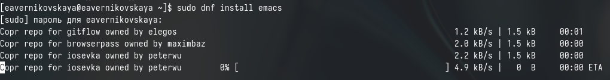{#fig:001 width=70%}

Открываем emacs (рис. [-@fig:002]), (рис. [-@fig:003])

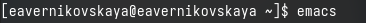{#fig:002 width=70%}

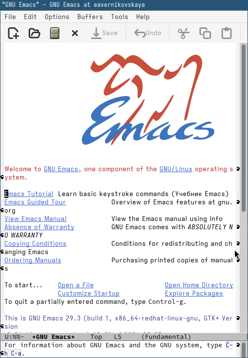{#fig:003 width=70%}

Создаём файл lab10.sh с помощью комбинации Ctrl-x и Ctrl-f (рис. [-@fig:004]), (рис. [-@fig:005])

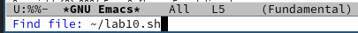{#fig:004 width=70%}

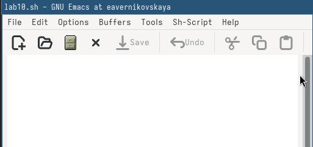{#fig:005 width=70%}

Вводим нужный текст: (рис. [-@fig:006])

```
#!/bin/bash
HELL=Hello
function hello {
LOCAL HELLO=World
echo
echo $HELLO
hello
```

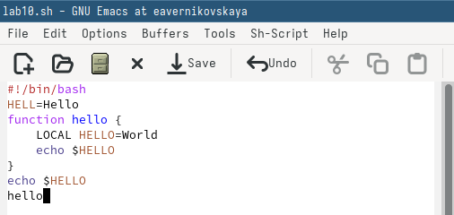{#fig:006 width=70%}

Далее сохраняем файл с помощью комбинации Ctrl-x Ctrl-s (рис. [-@fig:007])

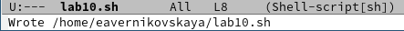{#fig:007 width=70%}

Вырезаем одной командой целую строку (С-k) (рис. [-@fig:008])

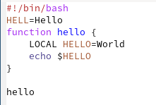{#fig:008 width=70%}

Вставляем эту строку в конец файла (C-y) (рис. [-@fig:009])

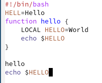{#fig:009 width=70%}

Выделяем область текста (C-space) (рис. [-@fig:010])

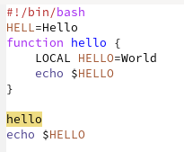{#fig:010 width=70%}

Копируем область в буфер обмена (M-w) и вставляем область в конец файла (рис. [-@fig:011])

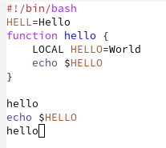{#fig:011 width=70%}

Вновь выделяем эту область и на этот раз вырезаем её (C-w) (рис. [-@fig:012])

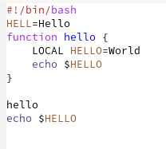{#fig:012 width=70%}

Отменяем последнее действие (C-/) (рис. [-@fig:013])

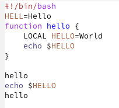{#fig:013 width=70%}

Перемещаем курсор в начало строки (C-a) (рис. [-@fig:014])

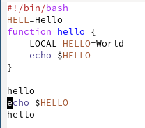{#fig:014 width=70%}

Перемещаем курсор в конец строки (C-e) (рис. [-@fig:015])

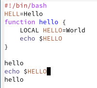{#fig:015 width=70%}

Перемещаем курсор в начало буфера (M-<)(рис. [-@fig:016])

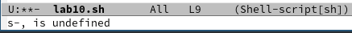{#fig:016 width=70%}

Перемещаем курсор в конец буфера (M->) (рис. [-@fig:017])

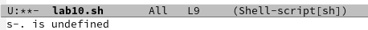{#fig:017 width=70%}

Выводим список активных буферов на экран (C-x C-b) (рис. [-@fig:018])

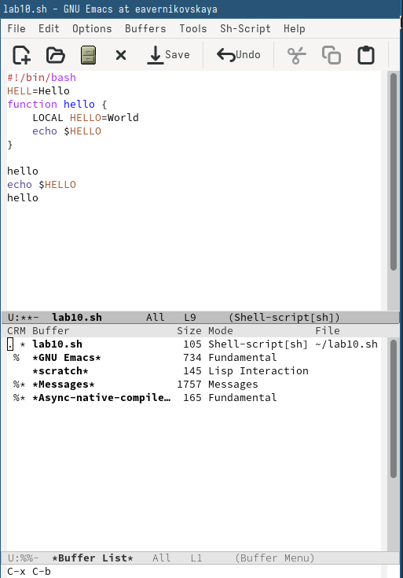{#fig:018 width=70%}
 
Перемещаемся во вновь открытое окно (C-x) со списком открытых буферов и переключитесь на другой буфер (рис. [-@fig:019])

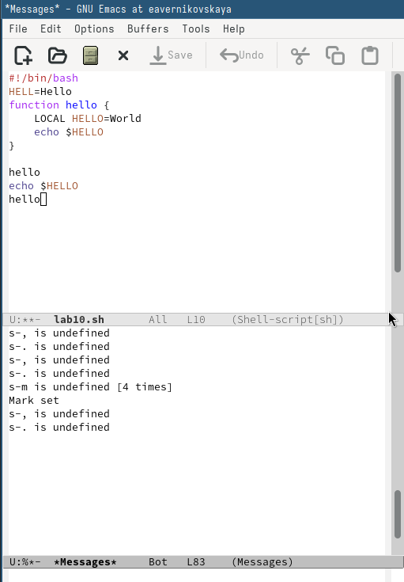{#fig:019 width=70%}

Закрываем это окно (C-x 0) (рис. [-@fig:020])

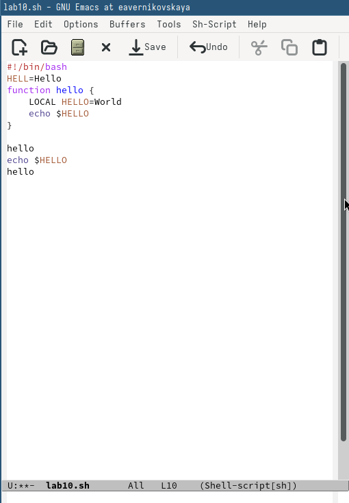{#fig:020 width=70%}

Теперь вновь переключаемся между буферами, но уже без вывода их списка на экран (C-x b) (рис. [-@fig:021])

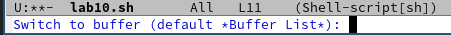{#fig:021 width=70%}

Далее делим фрейм на 4 части: делим сначала фрейм на два окна по вертикали (C-x 3), а затем каждое из этих окон на две части по горизонтали (C-x 2) (рис. [-@fig:022]), (рис. [-@fig:023])

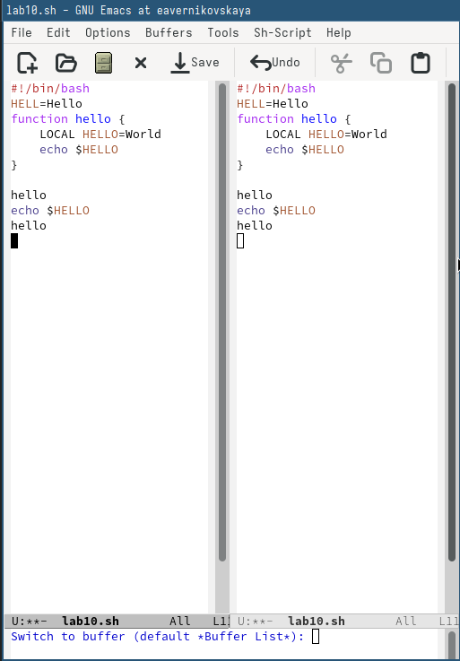{#fig:022 width=70%}

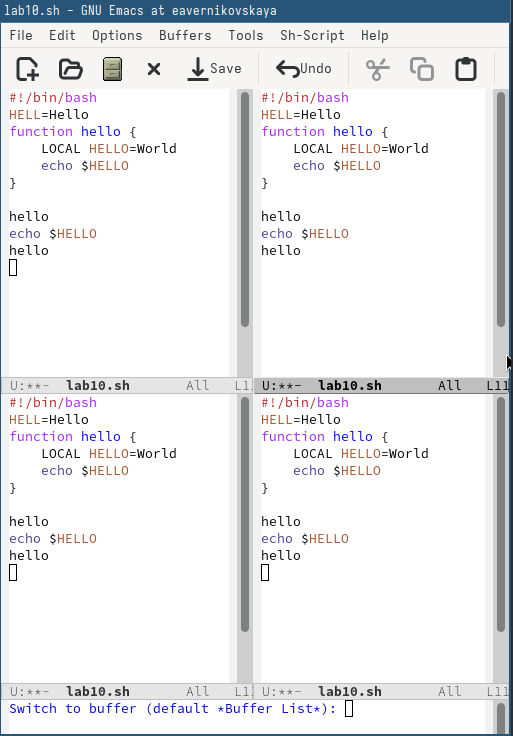{#fig:023 width=70%}

После переключаемся в режим поиска (C-s) и находим несколько слов, присутствующих в тексте (рис. [-@fig:024]), (рис. [-@fig:025])

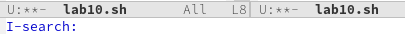{#fig:024 width=70%}

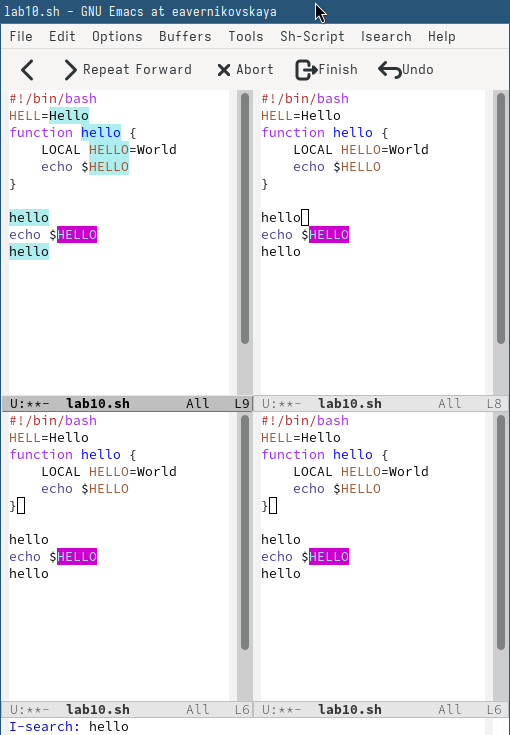{#fig:025 width=70%}

Выходим из режима поиска, нажав C-g (рис. [-@fig:026])

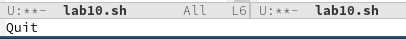{#fig:026 width=70%}

Переходим в режим поиска и замены (M-%), вводим текст, который следует найти и заменить, нажимаем Enter, затем вводим текст для замены. После того как будут подсвечены результаты поиска, нажимаем ! для подтверждения замены. Но перед этим всем мы переходим в режим начала буфера (рис. [-@fig:027]), (рис. [-@fig:028]), (рис. [-@fig:029])

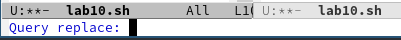{#fig:027 width=70%}

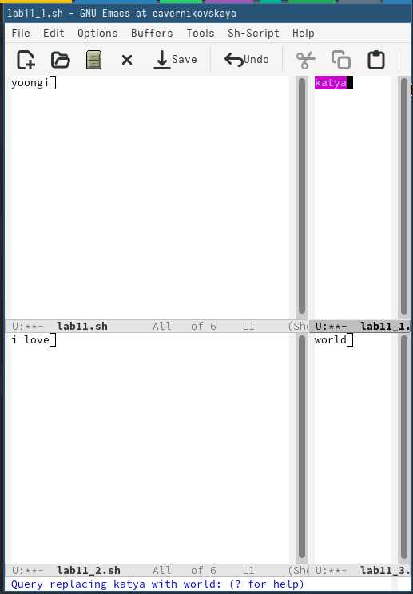{#fig:028 width=70%}

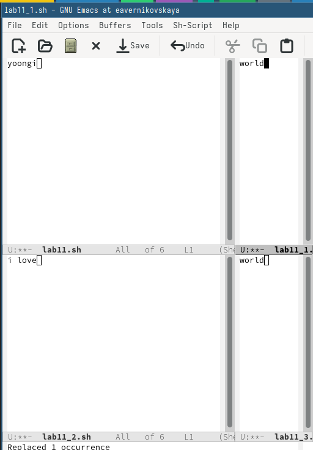{#fig:029 width=70%}

Пробуем другой режим поиска, нажав M-s. Он отличается от предыдущего тем, что выводит результат в отдельном окне (рис. [-@fig:030])

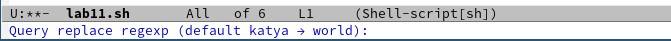{#fig:030 width=70%}

# Ответы на контрольные вопросы

1. Кратко охарактеризуйте редактор emacs.

Emacs — один из наиболее мощных и широко распространённых редакторов, используемых в мире UNIX. Написан на языке высокого уровня Lisp.

2. Какие особенности данного редактора могут сделать его сложным для освоения новичком?

Большое разнообразие сложных комбинаций клавиш, которые необходимы для редактирования файла и в принципе для работа с Emacs.

3. Своими словами опишите, что такое буфер и окно в терминологии emacs’а.

Буфер - это объект в виде текста. Окно - это прямоугольная область, в которой отображен буфер.

4. Можно ли открыть больше 10 буферов в одном окне?

Да, можно.

5. Какие буферы создаются по умолчанию при запуске emacs?

Emacs использует буферы с именами, начинающимися с пробела, для внутренних целей. Отчасти он обращается с буферами с такими именами особенным образом — например, по умолчанию в них не записывается информация для отмены изменений.

6. Какие клавиши вы нажмёте, чтобы ввести следующую комбинацию C-c | и C-c C-|?

Ctrl + c, а потом | и Ctrl + c Ctrl + |

7. Как поделить текущее окно на две части?

С помощью команды Ctrl + x 3 (по вертикали) и Ctrl + x 2 (по горизонтали)

8. В каком файле хранятся настройки редактора emacs?

Настройки emacs хранятся в файле . emacs, который хранится в домашней дирректории пользователя. Кроме этого файла есть ещё папка . emacs.

9. Какую функцию выполняет клавиша и можно ли её переназначить?

Выполняет функцию стереть, думаю можно переназначить.

10. Какой редактор вам показался удобнее в работе vi или emacs? Поясните почему.

Для меня удобнее был редактор Emacs, так как у него есть командая оболочка. А vi открывается в терминале, и выглядит своеобразно.

# Выводы

В ходе выполнения лабораторной работы мы ознакомились с операционной системой Linux а также получили практические навыки работы с редактором Emacs.

# Список литературы

Не пользовалась сайтами.
