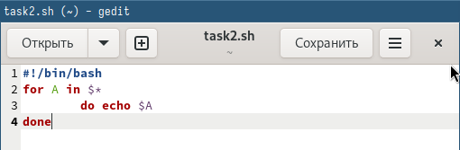

---
## Front matter
lang: ru-RU
title: Лабораторная работа №12
subtitle: Операционные системы
author:
  - Верниковская Е. А., НПИбд-01-23
institute:
  - Российский университет дружбы народов, Москва, Россия
date: 25 апреля 2024

## i18n babel
babel-lang: russian
babel-otherlangs: english

## Formatting pdf
toc: false
toc-title: Содержание
slide_level: 2
aspectratio: 169
section-titles: true
theme: metropolis
header-includes:
 - \metroset{progressbar=frametitle,sectionpage=progressbar,numbering=fraction}
 - '\makeatletter'
 - '\beamer@ignorenonframefalse'
 - '\makeatother'
 
## Fonts
mainfont: PT Serif
romanfont: PT Serif
sansfont: PT Sans
monofont: PT Mono
mainfontoptions: Ligatures=TeX
romanfontoptions: Ligatures=TeX
sansfontoptions: Ligatures=TeX,Scale=MatchLowercase
monofontoptions: Scale=MatchLowercase,Scale=0.9
---

# Вводная часть

## Цель работы

Изучить основы программирования в оболочке ОС UNIX/Linux, а также научиться писать небольшие командные файлы.

## Задание

1. Написать скрипт, который при запуске будет делать резервную копию самого себя (то есть файла, в котором содержится его исходный код) в другую директорию backup в вашем домашнем каталоге. При этом файл должен архивироваться одним из архиваторов на выбор zip, bzip2 или tar. Способ использования команд архивации необходимо узнать, изучив справку.
2. Написать пример командного файла, обрабатывающего любое произвольное число аргументов командной строки, в том числе превышающее десять. Например, скрипт может последовательно распечатывать значения всех переданных аргументов.

## Задание

3. Написать командный файл — аналог команды ls (без использования самой этой команды и команды dir). Требуется, чтобы он выдавал информацию о нужном каталоге и выводил информацию о возможностях доступа к файлам этого каталога.
4. Написать командный файл, который получает в качестве аргумента командной строки формат файла (.txt, .doc, .jpg, .pdf и т.д.) и вычисляет количество таких файлов в указанной директории также передаётся в виде аргумента командной строки.

# Выполнение лабораторной работы

## Задание №1

Создаю файл для первого задания с расширением sh и делаю его исполняемым (рис. 1)

{#fig:001 width=70%}

## Задание №1

Открываю файл task1.sh в текстовом редакторе gedit и пишу скрипт, который при запуске будет делать резервную копию самого себя (то есть файла, в котором содержится его исходный код) в другую директорию backup в нашем домашнем каталоге. При этом файл должен архивироваться одним из архиваторов на выбор zip, bzip2 или tar (рис. 2), (рис. 3)

{#fig:002 width=70%}

## Задание №1

{#fig:003 width=70%}

## Задание №1

Далее запускаю файл с помощью bash и проверяю работу скрипта (рис. 4), (рис. 5), (рис. 6)

{#fig:004 width=70%}

## Задание №1

{#fig:005 width=70%}

## Задание №1

{#fig:006 width=70%}

## Задание №2

Создаю файл для второго задания с расширением sh и делаю его исполняемым (рис. 7)

{#fig:007 width=70%}

## Задание №2

Открываю файл task2.sh в текстовом редакторе gedit и пишу пример командного файла, обрабатывающего любое произвольное число аргументов командной строки, в том числе превышающее десять. Например, скрипт
может последовательно распечатывать значения всех переданных аргументов (рис. 8), (рис. 9)

{#fig:008 width=70%}

## Задание №2

{#fig:009 width=70%}

## Задание №2

Далее запускаю файл с помощью bash и проверяю его работу (рис. 10)

{#fig:010 width=70%}

## Задание №3

Создаю файл для третьего задания с расширением sh и делаю его исполняемым (рис. 11)

{#fig:011 width=70%}

## Задание №3

Открываю файл task3.sh в текстовом редакторе gedit и пишу командный файл — аналог команды ls (без использования самой этой команды и команды dir). Он будет выдавать информацию о нужном каталоге
и выводить информацию о возможностях доступа к файлам этого каталога. (рис. 12), (рис. 13)

{#fig:012 width=70%}

## Задание №3

{#fig:013 width=60%}

## Задание №3

Далее запускаю файл с помощью bash и проверяю его работу (рис. 14)

{#fig:014 width=70%}

## Задание №4

Создаю файл для третьего задания с расширением sh и делаю его исполняемым (рис. 15)

{#fig:015 width=70%}

## Задание №4

Открываю файл task4.sh в текстовом редакторе gedit и пишу командный файл, который получает в качестве аргумента командной строки формат файла (.txt, .doc, .jpg, .pdf и т.д.) и вычисляет количество таких файлов в указанной директории. Путь к директории также передаётся в виде аргумента командной строки (рис. 16), (рис. 17)

{#fig:016 width=70%}

## Задание №4

{#fig:017 width=70%}

## Задание №4

Далее запускаю файл с помощью bash и проверяю его работу (рис. 18), (рис. 19)

{#fig:018 width=70%}

## Задание №4

{#fig:019 width=70%}

# Подведение итогов

## Выводы

В ходе выполнения лабораторной работы мы изучили основы программирования в оболочке ОС UNIX/Linux, а также научились писать небольшие командные файлы.

## Список литературы

Не пользовалась сайтами.
