---
## Front matter
lang: ru-RU
title: Лабораторная работа №13
subtitle: Операционные системы
author:
  - Верниковская Е. А., НПИбд-01-23
institute:
  - Российский университет дружбы народов, Москва, Россия
date: 3 мая 2024

## i18n babel
babel-lang: russian
babel-otherlangs: english

## Formatting pdf
toc: false
toc-title: Содержание
slide_level: 2
aspectratio: 169
section-titles: true
theme: metropolis
header-includes:
 - \metroset{progressbar=frametitle,sectionpage=progressbar,numbering=fraction}
 - '\makeatletter'
 - '\beamer@ignorenonframefalse'
 - '\makeatother'
 
## Fonts
mainfont: PT Serif
romanfont: PT Serif
sansfont: PT Sans
monofont: PT Mono
mainfontoptions: Ligatures=TeX
romanfontoptions: Ligatures=TeX
sansfontoptions: Ligatures=TeX,Scale=MatchLowercase
monofontoptions: Scale=MatchLowercase,Scale=0.9
---

# Вводная часть

## Цель работы

Изучить основы программирования в оболочке ОС UNIX. Научится писать более сложные командные файлы с использованием логических управляющих конструкций и циклов.

## Задание

1. Используя команды getopts grep, написать командный файл, который анализирует командную строку с ключами:
- -iinputfile — прочитать данные из указанного файла;
- -ooutputfile — вывести данные в указанный файл;
- -pшаблон — указать шаблон для поиска;
- -c — различать большие и малые буквы;
- -n — выдавать номера строк.
а затем ищет в указанном файле нужные строки, определяемые ключом -p.

## Задание

2. Написать на языке Си программу, которая вводит число и определяет, является ли оно больше нуля, меньше нуля или равно нулю. Затем программа завершается с помощью функции exit(n), передавая информацию в о коде завершения в оболочку. Командный файл должен вызывать эту программу и, проанализировав с помощью команды $?, выдать сообщение о том, какое число было введено.

## Задание

3. Написать командный файл, создающий указанное число файлов, пронумерованных последовательно от 1 до N (например 1.tmp, 2.tmp, 3.tmp,4.tmp и т.д.). Число файлов, которые необходимо создать, передаётся в аргументы командной строки. Этот же командный файл должен уметь удалять все созданные им файлы (если они существуют).
4. Написать командный файл, который с помощью команды tar запаковывает в архив все файлы в указанной директории. Модифицировать его так, чтобы запаковывались только те файлы, которые были изменены менее недели тому назад (использовать команду find).

# Выполнение лабораторной работы

## Задание №1

Создаю файл для первого задания с расширением sh и делаю его исполняемым (рис. 1)

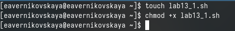{#fig:001 width=70%}

## Задание №1

Открываю файл lab13_1.sh в текстовом редакторе gedit и пишу командный файл, который будет анализировать командную строку с ключами (см. в задании №1) (рис. 2)

## Задание №1

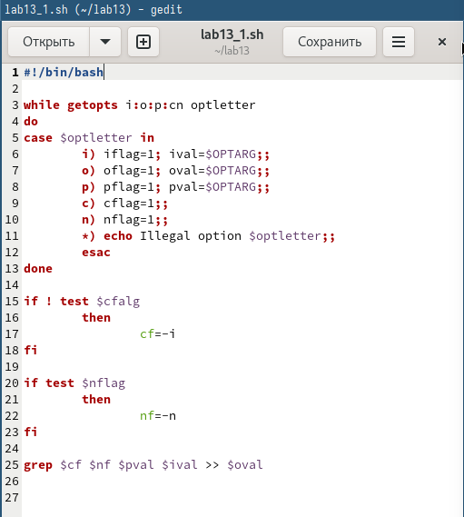{#fig:002 width=40%}

## Задание №1

Дадее создаю файл input.txt с любым текстом (рис. 3), (рис. 4)

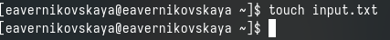{#fig:003 width=70%}

## Задание №1

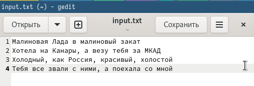{#fig:004 width=70%}

## Задание №1

Далее запускаю файл с помощью bash и проверяю работу командного файла. Во время работы программы создался файл output.txt с нужным содержимым (рис. 5), (рис. 6), (рис. 7)

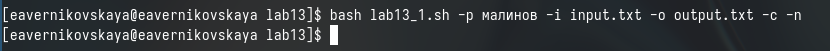{#fig:005 width=70%}

## Задание №1

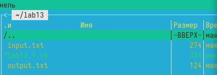{#fig:006 width=70%}

## Задание №1

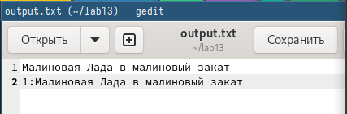{#fig:007 width=70%}

## Задание №2

Создаю файл для второго задания с расширением sh и делаю его исполняемым (рис. 8)

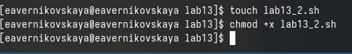{#fig:008 width=70%}

## Задание №2

Открываю файл lab13_2.sh в текстовом редакторе gedit и пишу командный файл и программу на языке си, которая будет выводить число и определять, является ли оно больше нуля, меньше нуля или равно нулю. (рис. 9), (рис. 10)

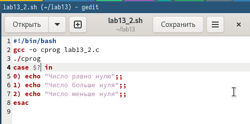{#fig:009 width=70%}

## Задание №2

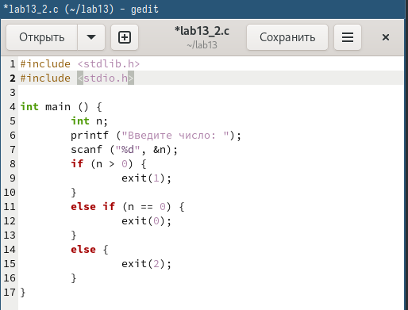{#fig:010 width=60%}

## Задание №2

Далее запускаю файл с помощью bash и проверяю его работу (рис. 11)

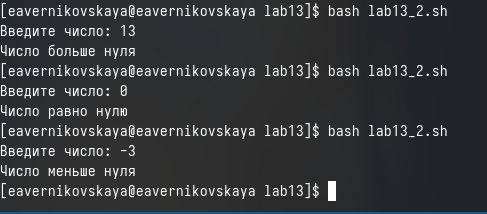{#fig:011 width=70%}

## Задание №3

Создаю файл для третьего задания с расширением sh и делаю его исполняемым (рис. 12)

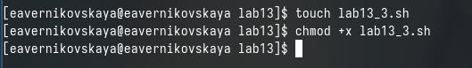{#fig:012 width=70%}

## Задание №3

Открываю файл lab13_3.sh в текстовом редакторе gedit и пишу командный файл, создающий указанное число файлов, пронумерованных последовательно от 1 до N (например 1.tmp, 2.tmp, 3.tmp,4.tmp и т.д.). Число файлов, которые необходимо создать, передаётся в аргументы командной строки. Этот же командный файл должен уметь удалять все созданные им файлы (если они существуют) (рис. 13)

## Задание №3

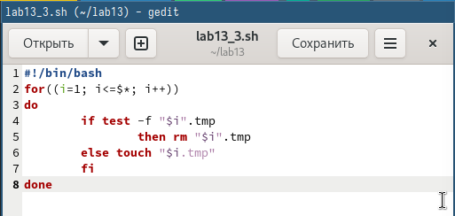{#fig:013 width=70%}

## Задание №3

Далее запускаю файл с помощью bash и проверяю его работу (рис. 14), (рис. 15)

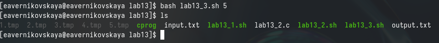{#fig:014 width=70%}

## Задание №3

{#fig:015 width=70%}

## Задание №4

Создаю файл для четвёртого задания с расширением sh и делаю его исполняемым (рис. 16)

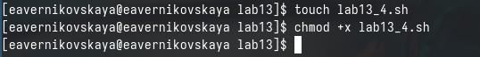{#fig:016 width=70%}

## Задание №4

Открываю файл lab13_4.sh в текстовом редакторе gedit и пишу командный файл, который с помощью команды tar будет запаковывать в архив все файлы в указанной директории. (рис. 17)

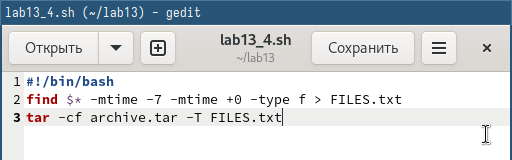{#fig:017 width=70%}

## Задание №4

Далее запускаю файл с помощью bash и проверяю его работу (рис. 18)

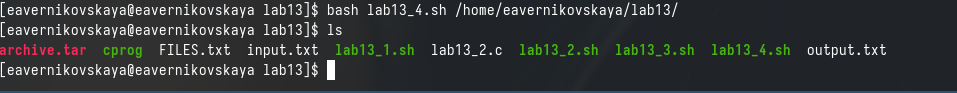{#fig:018 width=70%}

# Подведение итогов

## Выводы

В ходе выполнения лабораторной работы мы изучили основы программирования в оболочке ОС UNIX а также научились писать более сложные командные файлы с использованием логических управляющих конструкций и циклов.

## Список литературы

Не пользовалась сайтами.
