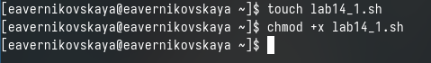

---
## Front matter
lang: ru-RU
title: Лабораторная работа №14
subtitle: Операционные системы
author:
  - Верниковская Е. А., НПИбд-01-23
institute:
  - Российский университет дружбы народов, Москва, Россия
date: 10 мая 2024

## i18n babel
babel-lang: russian
babel-otherlangs: english

## Formatting pdf
toc: false
toc-title: Содержание
slide_level: 2
aspectratio: 169
section-titles: true
theme: metropolis
header-includes:
 - \metroset{progressbar=frametitle,sectionpage=progressbar,numbering=fraction}
 - '\makeatletter'
 - '\beamer@ignorenonframefalse'
 - '\makeatother'
 
## Fonts
mainfont: PT Serif
romanfont: PT Serif
sansfont: PT Sans
monofont: PT Mono
mainfontoptions: Ligatures=TeX
romanfontoptions: Ligatures=TeX
sansfontoptions: Ligatures=TeX,Scale=MatchLowercase
monofontoptions: Scale=MatchLowercase,Scale=0.9
---

# Вводная часть

## Цель работы

Изучить основы программирования в оболочке ОС UNIX. Научиться писать более сложные командные файлы с использованием логических управляющих конструкций и циклов.

## Задание

1. Написать командный файл, реализующий упрощённый механизм семафоров. Командный файл должен в течение некоторого времени t1 дожидаться освобождения ресурса, выдавая об этом сообщение, а дождавшись его освобождения, использовать его в течение некоторого времени t2<>t1, также выдавая информацию о том, что ресурс используется соответствующим командным файлом (процессом). Запустить командный файл в одном виртуальном терминале в фоновом режиме, перенаправив его вывод в другой (> /dev/tty#, где # — номер терминала куда перенаправляется вывод), в котором также запущен этот файл, но не фоновом, а в привилегированном режиме. Доработать программу так, чтобы имелась возможность взаимодействия трёх
и более процессов.

## Задание

2. Реализовать команду man с помощью командного файла. Изучите содержимое каталога /usr/share/man/man1. В нем находятся архивы текстовых файлов, содержащих справку по большинству установленных в системе программ и команд. Каждый архив можно открыть командой less сразу же просмотрев содержимое справки. Командный файл должен получать в виде аргумента командной строки название команды и в виде
результата выдавать справку об этой команде или сообщение об отсутствии справки, если соответствующего файла нет в каталоге man1.

## Задание

3. Используя встроенную переменную $RANDOM, напишите командный файл, генерирующий случайную последовательность букв латинского алфавита. Учтите, что $RANDOM выдаёт псевдослучайные числа в диапазоне от 0 до 32767.

# Выполнение лабораторной работы

## Задание №1

Создаю файл для первого задания с расширением sh и делаю его исполняемым (рис. 1)

{#fig:001 width=70%}

## Задание №1

Открываю файл lab14_1.sh в текстовом редакторе gedit и пишу командный файл, реализующий упрощённый механизм семафоров (подробнее см. в задании №1) (рис. 2)

## Задание №1

{#fig:002 width=50%}

## Задание №1

Далее запускаю файл с помощью bash и проверяю работу командного файла (рис. 3)

{#fig:003 width=70%}

## Задание №2

Изучаю содержимое каталога /usr/share/man/man1. В нем находятся архивы текстовых файлов, содержащих
справку по большинству установленных в системе программ и команд (рис. 4), (рис. 5)

{#fig:004 width=70%}

## Задание №2

{#fig:005 width=70%}

## Задание №2

Создаю файл для второго задания с расширением sh и делаю его исполняемым (рис. 6)

{#fig:006 width=70%}

## Задание №2

Открываю файл lab14_2.sh в текстовом редакторе gedit и пишу командный файл, который будет реализовывать команду man (рис. 7)

{#fig:007 width=70%}

## Задание №2

Далее запускаю файл с помощью bash и проверяю его работу (рис. 8), (рис. 9), (рис. 10), (рис. 11)

## Задание №2

{#fig:008 width=60%}

## Задание №2

{#fig:009 width=60%}

## Задание №2

{#fig:010 width=60%}

## Задание №2

{#fig:011 width=70%}

## Задание №3

Создаю файл для третьего задания с расширением sh и делаю его исполняемым (рис. 12)

{#fig:012 width=70%}

## Задание №3

Открываю файл lab14_3.sh в текстовом редакторе gedit и пишу командный файл, генерирующий случайную последовательность букв латинского алфавита (рис. 13)

## Задание №3

{#fig:013 width=70%}

## Задание №3

Далее запускаю файл с помощью bash и проверяю его работу (рис. 14)

{#fig:014 width=70%}

# Подведение итогов

## Выводы

В ходе выполнения лабораторной работы мы изучили основы программирования в оболочке ОС UNIX а также научились писать более сложные командные файлы с использованием логических управляющих конструкций и циклов.

## Список литературы

Не пользовалась сайтами.
