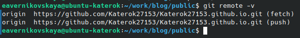

---
## Front matter
lang: ru-RU
title: 1-ый этап индивидуального проекта
subtitle: Операционные системы
author:
  - Верниковская Е. А., НПИбд-01-23
institute:
  - Российский университет дружбы народов, Москва, Россия
date: 28 февраля 2024

## i18n babel
babel-lang: russian
babel-otherlangs: english

## Formatting pdf
toc: false
toc-title: Содержание
slide_level: 2
aspectratio: 169
section-titles: true
theme: metropolis
header-includes:
 - \metroset{progressbar=frametitle,sectionpage=progressbar,numbering=fraction}
 - '\makeatletter'
 - '\beamer@ignorenonframefalse'
 - '\makeatother'
 
## Fonts
mainfont: PT Serif
romanfont: PT Serif
sansfont: PT Sans
monofont: PT Mono
mainfontoptions: Ligatures=TeX
romanfontoptions: Ligatures=TeX
sansfontoptions: Ligatures=TeX,Scale=MatchLowercase
monofontoptions: Scale=MatchLowercase,Scale=0.9
---

# Вводная часть

## Цель работы

Научиться размещать на Github pages заготовки для пресонального сайта

## Задание

1. Установить необходимое программное обеспечение.
2. Скачать шаблон темы сайта.
3. Разместить его на хостинге git.
4. Установить параметр для URLs сайта.
5. Разместить заготовку сайта на Github pages.

# Выполнение 1-ого этапа индивидуального проекта

## Установка необходимого ПО

Скачиваем последнюю версию исполняемого файла hugo для своей ОС (рис. 1)

{#fig:001 width=70%}

## Установка необходимого ПО

Переходим в папку Загрузки и распаковывем архив с исполняемым файлом, введя *tar -xvf* (рис. 2)

{#fig:002 width=70%}

## Установка необходимого ПО

Далее переходим в домашний каталог и создаём папку bin, с помощью *mkdir* (рис. 3)

{#fig:003 width=70%}

## Установка необходимого ПО

Переносим в папку bin исполняемый файл hugo, с помощью команды *mv* (рис. 4)

{#fig:004 width=70%}

## Скачивание шаблона темы сайта

- Создаём свой репозиторий на основе репозитория с шаблоном темы сайта (рис. 5)

{#fig:005 width=40%}

## Скачивание шаблона темы сайта

Переходим в каталог ~/work и клонируем созданный репозиторий к себе в локальный репозиторий, введя *git clone –recursive* (рис. 6)

{#fig:006 width=70%}

## Скачивание шаблона темы сайта

Запускаем исполняемый файл, введя *~/bin/hugo server* (рис. 7)

{#fig:007 width=70%}

## Скачивание шаблона темы сайта

Копируем ссылку (выделена на предыдцщем скриншоте) и переходим на страничку сайта на локальном сервере (рис. 8)

{#fig:008 width=40%}

## Установка параметра для URLs сайта

Создаём новый пустой репозиторий с именем Katerok27153.github.io (имя репозитория будет адресом сайта) (рис. 9)

{#fig:009 width=60%}

## Установка параметра для URLs сайта

В каталоге work клонируем созданный репозиторий, чтобы создать локальный репозиторий у себя на компьютере (рис. 10)

{#fig:010 width=70%}

## Установка параметра для URLs сайта

Далее переходим в созданный новый каталог и создаём главную ветку с именем main, с помощью команды *git checkout -b main* (рис. 11)

{#fig:011 width=70%}

## Установка параметра для URLs сайта

Создаём пустой файл README.md и отправляем изменения на глобальный репозиторий, чтобы активировать его (рис. 12)

{#fig:012 width=70%}

## Установка параметра для URLs сайта

В файле .gitignore отключаем public, чтобы каталоги с таким названием не игнорировались (рис. 13)

{#fig:013 width=70%}

## Установка параметра для URLs сайта

Подключаем репозиторий к каталогу public (рис. 14)

{#fig:014 width=70%}

## Установка параметра для URLs сайта

Далее запускаем исполняемый файл, с помощью *~/bin/hugo*, чтобы заполнить создавшийся public (рис. 15)

{#fig:015 width=70%}

## Размещение загатовки файла на Github pages

Проверяем есть ли подключение между public и репозиторием Katerok27153.github.io (рис. 16)

{#fig:016 width=70%}

## Размещение загатовки файла на Github pages

Отправляем изменения на глобальный репозиторий, с помощью *git add .*, *git commit -am* и *git push* (рис. 17)

{#fig:017 width=60%}

## Размещение загатовки файла на Github pages

{#fig:018 width=70%}

## Размещение загатовки файла на Github pages

- Копируем ссылку на наш новый сайт (имя репозитория, в нашем случаем Katerok27153.github.io) и переходим на него (рис. 19)
- Всё получилось!!!

{#fig:019 width=40%}

# Выводы

В ходе выполнения 1-ого этапа индивидуального проекта мы научились размещать на Github pages заготовки для персонального сайта
