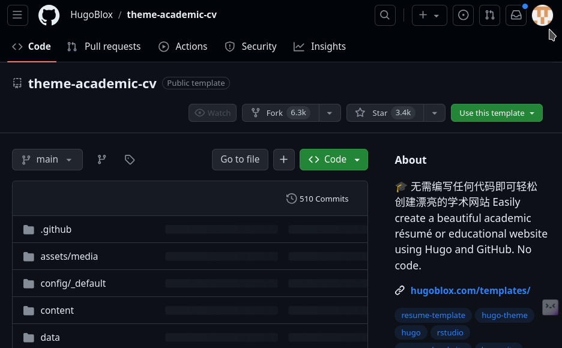
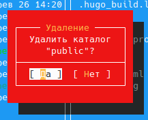

---
## Front matter
title: "Отчёт по выполнению 1-ого этапа индивидуального проекта"
subtitle: "Дисциплина: Операционные системы"
author: "Верниковская Екатерина Андреевна"

## Generic otions
lang: ru-RU
toc-title: "Содержание"

## Bibliography
bibliography: bib/cite.bib
csl: pandoc/csl/gost-r-7-0-5-2008-numeric.csl

## Pdf output format
toc: true # Table of contents
toc-depth: 2
lof: true # List of figures
lot: true # List of tables
fontsize: 12pt
linestretch: 1.5
papersize: a4
documentclass: scrreprt
## I18n polyglossia
polyglossia-lang:
  name: russian
  options:
	- spelling=modern
	- babelshorthands=true
polyglossia-otherlangs:
  name: english
## I18n babel
babel-lang: russian
babel-otherlangs: english
## Fonts
mainfont: PT Serif
romanfont: PT Serif
sansfont: PT Sans
monofont: PT Mono
mainfontoptions: Ligatures=TeX
romanfontoptions: Ligatures=TeX
sansfontoptions: Ligatures=TeX,Scale=MatchLowercase
monofontoptions: Scale=MatchLowercase,Scale=0.9
## Biblatex
biblatex: true
biblio-style: "gost-numeric"
biblatexoptions:
  - parentracker=true
  - backend=biber
  - hyperref=auto
  - language=auto
  - autolang=other*
  - citestyle=gost-numeric
## Pandoc-crossref LaTeX customization
figureTitle: "Рис."
tableTitle: "Таблица"
listingTitle: "Листинг"
lofTitle: "Список иллюстраций"
lotTitle: "Список таблиц"
lolTitle: "Листинги"
## Misc options
indent: true
header-includes:
  - \usepackage{indentfirst}
  - \usepackage{float} # keep figures where there are in the text
  - \floatplacement{figure}{H} # keep figures where there are in the text
---

# Цель работы

Разместить на Github pages заготовки для персонального сайта.

# Задание

1. Установить необходимое программное обеспечение.
2. Скачать шаблон темы сайта.
3. Разместить его на хостинге git.
4. Установить параметр для URLs сайта.
5. Разместить заготовку сайта на Github pages.

# Выполнение 1-ого этапа индивидуального проекта

## Установка необходимого ПО

Скачиваем последнюю версию исполняемого файла *hugo* для своей ОС (рис. [-@fig:001])

{#fig:001 width=70%}

Переходим в папку *Загрузки* и распаковывем архив с исполняемым файлом (рис. [-@fig:002])

{#fig:002 width=70%}

Далее переходим в домашний каталог и создаём папку *bin*, с помощью *mkdir* (рис. [-@fig:003])

{#fig:003 width=70%}

Переносим в папку *bin* исполняемый файл *hugo*, с помощью команды *mv* (рис. [-@fig:004])

{#fig:004 width=70%}

## Скачивание шаблона темы сайта

Открываем репозиторий с шаблоном темы сайта (рис. [-@fig:005])

{#fig:005 width=70%}

Далее создаём свой репозиторий (с именем blog) на основе репозитория с шаблоном темы сайта (рис. [-@fig:006])

{#fig:006 width=70%}

Переходим в каталог *~/work* и клонируем созданный репозиторий к себе в локальный репозиторий, введя *git clone --recursive <ссылка на репозиторий>* (рис. [-@fig:007])

{#fig:007 width=70%}

## Размещение его на хостинге git

Переходим в созданныё каталог *blog* и запускаем исполняемый файл, введя *~/bin/hugo* (рис. [-@fig:008])

{#fig:008 width=70%}

Проверяем содержимое каталога, и замечаем что создался каталог *public*, который сейчас нам не нужен (рис. [-@fig:009])

{#fig:009 width=70%}

Удаляем папку *public* (рис. [-@fig:010]), (рис. [-@fig:011]), (рис. [-@fig:012])

{#fig:010 width=70%}

{#fig:011 width=70%}

{#fig:012 width=70%}

Снова запускаем исполняемый файл, введя *~/bin/hugo server* (рис. [-@fig:013])

{#fig:013 width=70%}

Копируем ссылку (выделена на предыдцщем скриншоте) и переходим на страничку сайта на локальном сервере 
(рис. [-@fig:014])

{#fig:014 width=70%}

## Установка параметра для URLs сайта

Создаём новый пустой репозиторий с именем *Katerok27153.github.io* (имя репозитория будет адресом сайта) (рис. [-@fig:015]), (рис. [-@fig:016])

{#fig:015 width=70%}

{#fig:016 width=70%}

В каталоге *work* клонируем созданный репозиторий, чтобы создать локальный репозиторий у себя на компьютере (рис. [-@fig:017]), (рис. [-@fig:018])

{#fig:017 width=70%}

{#fig:018 width=70%}

Далее переходим в созданный новый каталог и создаём главную ветку с именем *main*, с помощью команды *git checkout -b main* (рис. [-@fig:019])

{#fig:019 width=70%}

Создаём пустой файл README.md c помощью *touch README.md* и отправляем изменения на глобальный репозиторий, чтобы активировать его (рис. [-@fig:020]), (рис. [-@fig:021])

{#fig:020 width=70%}

{#fig:021 width=70%}

Пытаемся подключить созданный репозиторий к каталогу *public* из репозитория *blog*. Но сначала надо в файле *.gitignore* отключить public, чтобы каталоги с таким названием не игнорировались (рис. [-@fig:022])

{#fig:022 width=70%}

Далее в файле *.gitignore* комментируем public (рис. [-@fig:023]), (рис. [-@fig:024])

{#fig:023 width=70%}

{#fig:024 width=70%}

Подключаем репозиторий к каталогу *public* (рис. [-@fig:025]), (рис. [-@fig:026])

{#fig:025 width=70%}

{#fig:026 width=70%}

Далее запускаем исполняемый файл, с помощью *~/bin/hugo*, чтобы заполнить создавшийся public (рис. [-@fig:027]), (рис. [-@fig:028])

{#fig:027 width=70%}

{#fig:028 width=70%}

## Размещение загатовки файла на Github pages

Проверяем есть ли подключение между *public* и репозиторием *Katerok27153.github.io* (рис. [-@fig:029])

{#fig:029 width=70%}

Отправляем изменения на глобальный репозиторий, с помощью *git add .*, *git commit -am* и *git push* (рис. [-@fig:030 ]), (рис. [-@fig:031]), (рис. [-@fig:032])

{#fig:030 width=70%}

{#fig:031 width=70%}

{#fig:032 width=70%}

Копируем ссылку на наш новый сайт (имя репозитория, в нашем случаем *Katerok27153.github.io*) и переходим на него (рис. [-@fig:033])

{#fig:033 width=70%}

# Выводы
 
В ходе выполнения 1-ого этапа индивидуального проекта мы научились размещать на Github pages заготовки для персонального сайта

# Список литературы

1. Исполняемый файл hugo [Электронный ресурс] URL: https://github.com/gohugoio/hugo/releases
2. Репозиторий с шаблоном темы сайта [Электронный ресурс] URL: https://github.com/HugoBlox/theme-academic-cv
