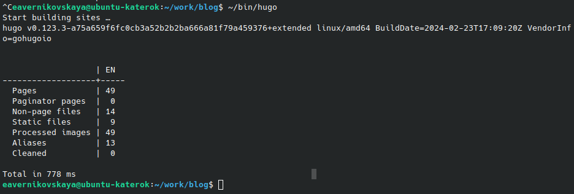

---
## Front matter
lang: ru-RU
title: 2-ой этап индивидуального проекта
subtitle: Операционные системы
author:
  - Верниковская Е. А., НПИбд-01-23
institute:
  - Российский университет дружбы народов, Москва, Россия
date: 14 марта 2024

## i18n babel
babel-lang: russian
babel-otherlangs: english

## Formatting pdf
toc: false
toc-title: Содержание
slide_level: 2
aspectratio: 169
section-titles: true
theme: metropolis
header-includes:
 - \metroset{progressbar=frametitle,sectionpage=progressbar,numbering=fraction}
 - '\makeatletter'
 - '\beamer@ignorenonframefalse'
 - '\makeatother'
 
## Fonts
mainfont: PT Serif
romanfont: PT Serif
sansfont: PT Sans
monofont: PT Mono
mainfontoptions: Ligatures=TeX
romanfontoptions: Ligatures=TeX
sansfontoptions: Ligatures=TeX,Scale=MatchLowercase
monofontoptions: Scale=MatchLowercase,Scale=0.9
---

# Вводная часть

## Цель работы

Добавить на сайт данные о себе.

## Задание

1. Разместить фотографию владельца сайта.
2. Разместить краткое описание владельца сайта (Biography).
3. Добавить информацию об интересах (Interests).
4. Добавить информацию от образовании (Education).
5. Сделать пост по прошедшей неделе.
6. Добавить пост на тему по выбору:
- Управление версиями. Git.
- Непрерывная интеграция и непрерывное развертывание (CI/CD).

# Выполнение 2-ого этапа индивидуального проекта

## Размещение фотографии владельца на сайте

Заходим в каталог ~/work/blog (рис. 1)

{#fig:001 width=70%}

## Размещение фотографии владельца на сайте

Далее запускаем исполняемый файл hugo, с помощью команды *~/bin/hugo server* и переходим на наш локальный сайт (рис. 2)

{#fig:002 width=60%}

## Размещение фотографии владельца на сайте

Потом переходим в каталог ~/work/blog/content/authors/admin и меняем фотографию владельца сайта на свою (рис. 3), (рис. 4)

{#fig:003 width=70%}

## Размещение фотографии владельца на сайте

{#fig:004 width=70%}

## Размещение информации о владельце на сайте

Далее в том же каталоге открываем файл _index.md и заполняем информацию о себе (имя владельца сайта, Interests и Education) (рис. 5)

{#fig:005 width=40%}

## Размещение информации о владельце на сайте

В конце файла пишем краткое описание о себе, т.е о владельце сайта (Biography) (рис. 6)

{#fig:006 width=70%}

## Размещение постов на сайте

Переходим в каталог ~/work/blog/content/post и создаём две папки (я назвала их *post_1* и *post_2*), где будут хранится материалы постов (рис. 7), (рис. 8), (рис. 9)

{#fig:007 width=70%}

## Размещение постов на сайте

{#fig:008 width=70%}

## Размещение постов на сайте

{#fig:009 width=70%}

## Размещение постов на сайте

Редактируем в папке post_1 файл index.md. Пишем там пост о нашей прошедшей неделе, по желанию вставляем картинки (рис. 10) 

{#fig:010 width=30%}

## Размещение постов на сайте

Далее редактируем другой файл index.md в папке post_2. Я выбрала тему "Управление версиями. Git." (рис. 11)

{#fig:011 width=40%}

## Сборка сайта

Собираем наш сайт выполнив в каталоге ~/work/blog команду *~/bin/hugo* (рис. 12)

{#fig:012 width=70%}

## Сборка сайта

Далее сохраняем изменения и отправляем их на git (рис. 13)

{#fig:013 width=50%}

## Сборка сайта

Далее переходим в каталог ~/work/blog/public и также сохраняем изменения и выкладываем их на git (рис. 14), (рис. 15)

{#fig:014 width=70%}

## Сборка сайта

{#fig:015 width=70%}

## Сборка сайта

Далее переходим на наш сайт (не на локальный!) по ссылке katerok27153.github.io и видим что всё получилось (рис. 16), (рис. 17), (рис. 18), (рис. 19)

## Сборка сайта

{#fig:016 width=60%}

## Сборка сайта

{#fig:017 width=70%}

## Сборка сайта

{#fig:018 width=50%}

## Сборка сайта

{#fig:019 width=50%}

# Подведение итогов

## Выводы

В ходе выполнения 2-ого этапа индивидуального проекта мы научились размещать на сайте данные о себе и выкладывать посты.

## Список литературы

1. Мой сайт [Электронный ресурс] URL: https://katerok27153.github.io/
2. Этапы реализации проекта [Электронный ресурс] URL: https://esystem.rudn.ru/mod/page/view.php?id=1098920
