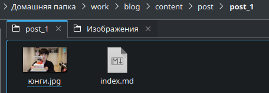

---
## Front matter
title: "Отчёт по выполнению 2-ого этапа индивидуального проекта"
subtitle: "Дисциплина: Операционные системы"
author: "Верниковская Екатерина Андреевна"

## Generic otions
lang: ru-RU
toc-title: "Содержание"

## Bibliography
bibliography: bib/cite.bib
csl: pandoc/csl/gost-r-7-0-5-2008-numeric.csl

## Pdf output format
toc: true # Table of contents
toc-depth: 2
lof: true # List of figures
lot: true # List of tables
fontsize: 12pt
linestretch: 1.5
papersize: a4
documentclass: scrreprt
## I18n polyglossia
polyglossia-lang:
  name: russian
  options:
	- spelling=modern
	- babelshorthands=true
polyglossia-otherlangs:
  name: english
## I18n babel
babel-lang: russian
babel-otherlangs: english
## Fonts
mainfont: PT Serif
romanfont: PT Serif
sansfont: PT Sans
monofont: PT Mono
mainfontoptions: Ligatures=TeX
romanfontoptions: Ligatures=TeX
sansfontoptions: Ligatures=TeX,Scale=MatchLowercase
monofontoptions: Scale=MatchLowercase,Scale=0.9
## Biblatex
biblatex: true
biblio-style: "gost-numeric"
biblatexoptions:
  - parentracker=true
  - backend=biber
  - hyperref=auto
  - language=auto
  - autolang=other*
  - citestyle=gost-numeric
## Pandoc-crossref LaTeX customization
figureTitle: "Рис."
tableTitle: "Таблица"
listingTitle: "Листинг"
lofTitle: "Список иллюстраций"
lotTitle: "Список таблиц"
lolTitle: "Листинги"
## Misc options
indent: true
header-includes:
  - \usepackage{indentfirst}
  - \usepackage{float} # keep figures where there are in the text
  - \floatplacement{figure}{H} # keep figures where there are in the text
---

# Цель работы

Добавить на сайт данные о себе.

# Задание

1. Разместить фотографию владельца сайта.
2. Разместить краткое описание владельца сайта (Biography).
3. Добавить информацию об интересах (Interests).
4. Добавить информацию от образовании (Education).
5. Сделать пост по прошедшей неделе.
6. Добавить пост на тему по выбору:
- Управление версиями. Git.
- Непрерывная интеграция и непрерывное развертывание (CI/CD).

# Выполнение 2-ого этапа индивидуального проекта

## Размещение фотографии владельца на сайте

Заходим в каталог ~/work/blog (рис. [-@fig:001])

{#fig:001 width=70%}

Далее запускаем исполняемый файл hugo, с помощью команды *~/bin/hugo server* и переходим на наш локальный сайт (рис. [-@fig:002])

{#fig:002 width=70%}

Потом переходим в каталог ~/work/blog/content/authors/admin и меняем фотографию владельца сайта на свою (рис. [-@fig:003]), (рис. [-@fig:004])

{#fig:003 width=70%}

{#fig:004 width=70%}

## Размещение информации о владельце на сайте

Далее в том же каталоге открываем файл _index.md и заполняем информацию о себе (имя владельца сайта, Interests и Education) (рис. [-@fig:005])

{#fig:005 width=70%}

В конце файла пишем краткое описание о себе, т.е о владельце сайта (Biography) (рис. [-@fig:006])

{#fig:006 width=70%}

## Размещение постов на сайте

Переходим в каталог ~/work/blog/content/post и создаём две папки (я назвала их *post_1* и *post_2*), где будут хранится материалы постов (рис. [-@fig:007]), (рис. [-@fig:008]), (рис. [-@fig:009])

{#fig:007 width=70%}

{#fig:008 width=70%}

{#fig:009 width=70%}

Редактируем в папке post_1 файл index.md. Пишем там пост о нашей прошедшей неделе, по желанию вставляем картинки (рис. [-@fig:010]) 

{#fig:010 width=70%}

Далее редактируем другой файл index.md в папке post_2. Я выбрала тему "Управление версиями. Git." (рис. [-@fig:011])

{#fig:011 width=70%}

## Сборка сайта

Собираем наш сайт выполнив в каталоге ~/work/blog команду *~/bin/hugo* (рис. [-@fig:012])

{#fig:012 width=70%}

Далее сохраняем изменения и отправляем их на git (рис. [-@fig:013])

{#fig:013 width=70%}

Далее переходим в каталог ~/work/blog/public и также сохраняем изменения и выкладываем их на git (рис. [-@fig:014]), (рис. [-@fig:015])

{#fig:014 width=70%}

{#fig:015 width=70%}

Далее переходим на наш сайт (не на локальный!) по ссылке katerok27153.github.io и видим что всё получилось (рис. [-@fig:016]), (рис. [-@fig:017]), (рис. [-@fig:018]), (рис. [-@fig:019])

{#fig:016 width=70%}

{#fig:017 width=70%}

{#fig:018 width=70%}

{#fig:019 width=70%}

# Выводы
 
В ходе выполнения 2-ого этапа индивидуального проекта мы научились размещать на сайте данные о себе и выкладывать посты.

# Список литературы

1. Мой сайт [Электронный ресурс] URL: https://katerok27153.github.io/
2. Этапы реализации проекта [Электронный ресурс] URL: https://esystem.rudn.ru/mod/page/view.php?id=1098920
