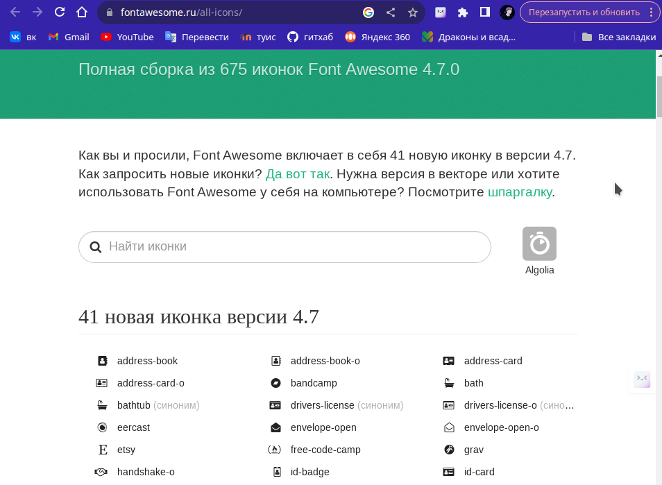

---
## Front matter
title: "Отчёт по выполнению 3-ого этапа индивидуального проекта"
subtitle: "Дисциплина: Операционные системы"
author: "Верниковская Екатерина Андреевна"

## Generic otions
lang: ru-RU
toc-title: "Содержание"

## Bibliography
bibliography: bib/cite.bib
csl: pandoc/csl/gost-r-7-0-5-2008-numeric.csl

## Pdf output format
toc: true # Table of contents
toc-depth: 2
lof: true # List of figures
lot: true # List of tables
fontsize: 12pt
linestretch: 1.5
papersize: a4
documentclass: scrreprt
## I18n polyglossia
polyglossia-lang:
  name: russian
  options:
	- spelling=modern
	- babelshorthands=true
polyglossia-otherlangs:
  name: english
## I18n babel
babel-lang: russian
babel-otherlangs: english
## Fonts
mainfont: PT Serif
romanfont: PT Serif
sansfont: PT Sans
monofont: PT Mono
mainfontoptions: Ligatures=TeX
romanfontoptions: Ligatures=TeX
sansfontoptions: Ligatures=TeX,Scale=MatchLowercase
monofontoptions: Scale=MatchLowercase,Scale=0.9
## Biblatex
biblatex: true
biblio-style: "gost-numeric"
biblatexoptions:
  - parentracker=true
  - backend=biber
  - hyperref=auto
  - language=auto
  - autolang=other*
  - citestyle=gost-numeric
## Pandoc-crossref LaTeX customization
figureTitle: "Рис."
tableTitle: "Таблица"
listingTitle: "Листинг"
lofTitle: "Список иллюстраций"
lotTitle: "Список таблиц"
lolTitle: "Листинги"
## Misc options
indent: true
header-includes:
  - \usepackage{indentfirst}
  - \usepackage{float} # keep figures where there are in the text
  - \floatplacement{figure}{H} # keep figures where there are in the text
---

# Цель работы

Добавить к сайту достижения.

# Задание

1. Добавить информацию о навыках (Skills).
2. Добавить информацию об опыте (Experience).
3. Добавить информацию о достижениях (Accomplishments).
4. Сделать пост по прошедшей неделе.
5. Добавить пост на тему по выбору:
- Легковесные языки разметки.
- Языки разметки. LaTeX.
- Язык разметки Markdown.

# Выполнение 3-ого этапа индивидуального проекта

## Добавление информации о навыках (skills)

Заходим в каталог ~/work/blog. Далее запускаем исполняемый файл hugo, с помощью команды *~/bin/hugo server* и переходим на наш локальный сайт (рис. [-@fig:001])

{#fig:001 width=70%}

Потом переходим в каталог ~/work/blog/content/authors/admin и редактируем файл  _index.md. Добавляем информацию о навыках (skills) а точнее о наших хобби и технических навыков (рис. [-@fig:002]), (рис. [-@fig:003])

{#fig:002 width=70%}

{#fig:003 width=70%}

Иконки для навыков можно найти в интернете в официальной библиотеке иконок fas и fab (рис. [-@fig:004]), (рис. [-@fig:005]), (рис. [-@fig:006])

{#fig:004 width=70%}

{#fig:005 width=70%}

{#fig:006 width=70%}

## Добавление информации об опыте (experience)

Далее переходим в каталог ~/work/blog/content и редактируем файл _index.md уже там (рис. [-@fig:007])

{#fig:007 width=70%}

Добавляем информацию об опыте, отредактировав блок с названием experience (рис. [-@fig:008])

{#fig:008 width=70%}

## Добавление информации о достижениях (accomplishments)

Потом в том же файле добавляем информацию о достижениях, отредактировав блок с названием accomplishments (рис. [-@fig:009])

{#fig:009 width=70%}

Добаялем нужные логотипы организаций в каталог ~/work/blog/assets/media/icons/brands. Картинки должны быт в формате *svg* (рис. [-@fig:010])

{#fig:010 width=70%}

## Размещение постов на сайте

Переходим в каталог ~/work/blog/content/post и создаём две папки (я назвала их *post_3* и *post_4*), где будут хранится материалы постов (рис. [-@fig:011]), (рис. [-@fig:012]), (рис. [-@fig:013])

{#fig:011 width=70%}

{#fig:012 width=70%}

{#fig:013 width=70%}

Редактируем в папке post_3 файл index.md. Пишем там пост о нашей прошедшей неделе, по желанию вставляем картинки (рис. [-@fig:014]) 

{#fig:014 width=70%}

Далее редактируем другой файл index.md в папке post_4. Я выбрала тему "Языки разметки. LaTeX." (рис. [-@fig:015])

{#fig:015 width=70%}

## Сборка сайта

Собираем наш сайт выполнив в каталоге ~/work/blog команду *~/bin/hugo* (рис. [-@fig:016])

{#fig:016 width=70%}

Далее сохраняем изменения и отправляем их на git (рис. [-@fig:017])

{#fig:017 width=70%}

Далее переходим в каталог ~/work/blog/public и также сохраняем изменения и выкладываем их на git (рис. [-@fig:018]), (рис. [-@fig:019])

{#fig:018 width=70%}

{#fig:019 width=70%}

Далее переходим на наш сайт (не на локальный!) по ссылке katerok27153.github.io и видим что всё получилось (рис. [-@fig:020]), (рис. [-@fig:021]), (рис. [-@fig:022]), (рис. [-@fig:023]), (рис. [-@fig:024]), (рис. [-@fig:025])

{#fig:020 width=70%}

{#fig:021 width=70%}

{#fig:022 width=70%}

{#fig:023 width=70%}

{#fig:024 width=70%}

{#fig:025 width=70%}

# Выводы
 
В ходе выполнения 3-ого этапа индивидуального проекта мы научились размещать на сайте информацю о наших навыках, опыте и достижениях.

# Список литературы

1. Мой сайт [Электронный ресурс] URL: https://katerok27153.github.io/
2. Этапы реализации проекта [Электронный ресурс] URL: https://esystem.rudn.ru/mod/page/view.php?id=1098920
3. Официальная библиотека иконок [Электронный ресурс] URL: https://fontawesome.ru/all-icons/
