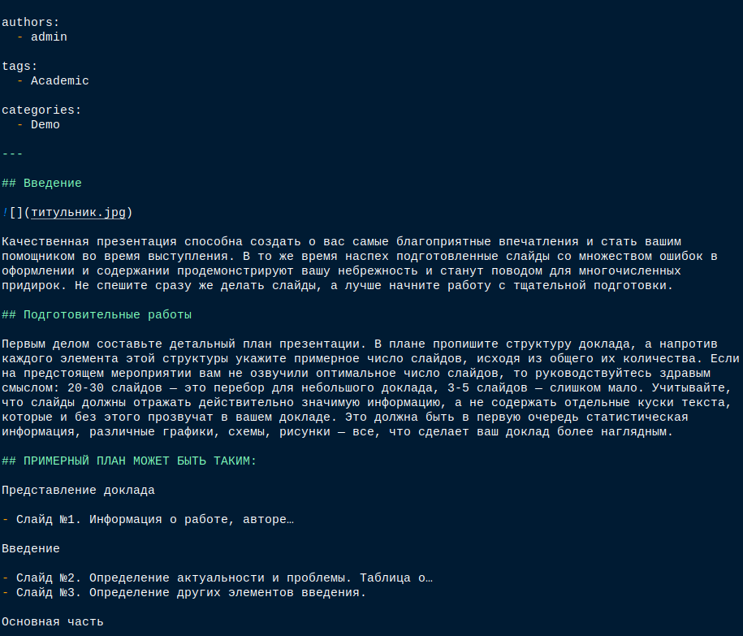

---
## Front matter
lang: ru-RU
title: 4-ый этап индивидуального проекта
subtitle: Операционные системы
author:
  - Верниковская Е. А., НПИбд-01-23
institute:
  - Российский университет дружбы народов, Москва, Россия
date: 21 апреля 2024

## i18n babel
babel-lang: russian
babel-otherlangs: english

## Formatting pdf
toc: false
toc-title: Содержание
slide_level: 2
aspectratio: 169
section-titles: true
theme: metropolis
header-includes:
 - \metroset{progressbar=frametitle,sectionpage=progressbar,numbering=fraction}
 - '\makeatletter'
 - '\beamer@ignorenonframefalse'
 - '\makeatother'
 
## Fonts
mainfont: PT Serif
romanfont: PT Serif
sansfont: PT Sans
monofont: PT Mono
mainfontoptions: Ligatures=TeX
romanfontoptions: Ligatures=TeX
sansfontoptions: Ligatures=TeX,Scale=MatchLowercase
monofontoptions: Scale=MatchLowercase,Scale=0.9
---

# Вводная часть

## Цель работы

Добавить к сайту ссылки на научные и библиометрические ресурсы.

## Задание

1. Зарегистрироваться на соответствующих ресурсах и разместить на них ссылки на сайте:
- eLibrary : https://elibrary.ru/;
- Google Scholar : https://scholar.google.com/;
- ORCID : https://orcid.org/;
- Mendeley : https://www.mendeley.com/;
- ResearchGate : https://www.researchgate.net/;
- Academia.edu : https://www.academia.edu/;
- arXiv : https://arxiv.org/;
- github : https://github.com/.

## Задание

2. Сделать пост по прошедшей неделе.
3. Добавить пост на тему по выбору:
- Оформление отчёта.
- Создание презентаций.
- Работа с библиографией.

# Выполнение 4-ого этапа индивидуального проекта

## Регистрация на научных и библиометрических ресурсах

Регистрируемся на eLibrary (рис. 1), (рис. 2)

## Регистрация на научных и библиометрических ресурсах

{#fig:001 width=60%}

## Регистрация на научных и библиометрических ресурсах

{#fig:002 width=20%}

## Регистрация на научных и библиометрических ресурсах

Регистрируемся на ORCID (рис. 3), (рис. 4)

## Регистрация на научных и библиометрических ресурсах

{#fig:003 width=40%}

## Регистрация на научных и библиометрических ресурсах

{#fig:004 width=70%}

## Регистрация на научных и библиометрических ресурсах

Регистрируемся на Mendeley (рис. 5), (рис. 6)

## Регистрация на научных и библиометрических ресурсах

{#fig:005 width=40%}

## Регистрация на научных и библиометрических ресурсах

{#fig:006 width=70%}

## Регистрация на научных и библиометрических ресурсах

Регистрируемся на ResearchGate (рис. 7), (рис. 8)

## Регистрация на научных и библиометрических ресурсах

{#fig:007 width=40%}

## Регистрация на научных и библиометрических ресурсах

{#fig:008 width=70%}

## Регистрация на научных и библиометрических ресурсах

Регистрируемся на Academia.edu (рис. 9), (рис. 10)

## Регистрация на научных и библиометрических ресурсах

{#fig:009 width=40%}

## Регистрация на научных и библиометрических ресурсах

{#fig:010 width=20%}

## Регистрация на научных и библиометрических ресурсах

Регистрируемся на arXiv (рис. 11), (рис. 12)

## Регистрация на научных и библиометрических ресурсах

{#fig:011 width=40%}

## Регистрация на научных и библиометрических ресурсах

{#fig:012 width=50%}

## Регистрация на научных и библиометрических ресурсах

На Google Scholar и github я уже была зарегестрирована (рис. 13), (рис. 14])

## Регистрация на научных и библиометрических ресурсах

{#fig:013 width=40%}

## Регистрация на научных и библиометрических ресурсах

{#fig:014 width=70%}

## Добавление ссылок на научные и библиометрические ресурсы

Заходим в каталог ~/work/blog. Далее запускаем исполняемый файл hugo, с помощью команды *~/bin/hugo server* и переходим на наш локальный сайт (рис. 15)

{#fig:015 width=50%}

## Добавление ссылок на научные и библиометрические ресурсы

Потом переходим в каталог ~/work/blog/content/authors/admin и редактируем файл _index.md. Добавляем ссылок на научные и библиометрические ресурсы, где мы ранее зарегестрировались (рис. 16)

## Добавление ссылок на научные и библиометрические ресурсы

{#fig:016 width=60%}

## Размещение постов на сайте

Переходим в каталог ~/work/blog/content/post и создаём две папки (я назвала их *post_5* и *post_6*), где будут хранится материалы постов (рис. 17), (рис. 18), (рис. 19)

{#fig:017 width=70%}

## Размещение постов на сайте

{#fig:018 width=70%}

## Размещение постов на сайте

{#fig:019 width=70%}

## Размещение постов на сайте

Редактируем в папке post_4 файл index.md. Пишем там пост о нашей прошедшей неделе, по желанию вставляем картинки (рис. 20)

## Размещение постов на сайте

{#fig:020 width=50%}

## Размещение постов на сайте

Далее редактируем другой файл index.md в папке post_6. Я выбрала тему "Создание презентаций." (рис. 21)

## Размещение постов на сайте

{#fig:021 width=50%}

## Сборка сайта

Собираем наш сайт выполнив в каталоге ~/work/blog команду *~/bin/hugo* (рис. 22)

{#fig:022 width=70%}

## Сборка сайта

Далее сохраняем изменения и отправляем их на git (рис. 23)

{#fig:023 width=70%}

## Сборка сайта

Далее переходим в каталог ~/work/blog/public и также сохраняем изменения и выкладываем их на git (рис. 24), (рис. 25)

{#fig:024 width=70%}

## Сборка сайта

{#fig:025 width=70%}

## Сборка сайта

Далее переходим на наш сайт (не на локальный!) по ссылке katerok27153.github.io и видим что всё получилось (рис. 26), (рис. 27), (рис. 28)

{#fig:026 width=70%}

## Сборка сайта

{#fig:027 width=70%}

## Сборка сайта

{#fig:028 width=70%}

# Подведение итогов

## Выводы

В ходе выполнения 4-ого этапа индивидуального проекта мы научились регистрироваться на научных и  библиометрических ресурсах и добавлять ссылки на наш сайт.

## Список литературы

1. Мой сайт [Электронный ресурс] URL: https://katerok27153.github.io/
2. Этапы реализации проекта [Электронный ресурс] URL: https://esystem.rudn.ru/mod/page/view.php?id=1098920
3. Официальная библиотека иконок [Электронный ресурс] URL: https://fontawesome.ru/all-icons/
4. Очень много ссылок на библиометрические ресурсы
