---
## Front matter
lang: ru-RU
title: 5-ый этап индивидуального проекта
subtitle: Операционные системы
author:
  - Верниковская Е. А., НПИбд-01-23
institute:
  - Российский университет дружбы народов, Москва, Россия
date: 10 мая 2024

## i18n babel
babel-lang: russian
babel-otherlangs: english

## Formatting pdf
toc: false
toc-title: Содержание
slide_level: 2
aspectratio: 169
section-titles: true
theme: metropolis
header-includes:
 - \metroset{progressbar=frametitle,sectionpage=progressbar,numbering=fraction}
 - '\makeatletter'
 - '\beamer@ignorenonframefalse'
 - '\makeatother'
 
## Fonts
mainfont: PT Serif
romanfont: PT Serif
sansfont: PT Sans
monofont: PT Mono
mainfontoptions: Ligatures=TeX
romanfontoptions: Ligatures=TeX
sansfontoptions: Ligatures=TeX,Scale=MatchLowercase
monofontoptions: Scale=MatchLowercase,Scale=0.9
---

# Вводная часть

## Цель работы

Добавить с сайту все остальные элементы.

## Задание

1. Сделать записи для персональных проектов.
2. Сделать пост по прошедшей неделе.
3. Добавить пост на тему по выбору.
- Языки научного программирования.

# Выполнение 5-ого этапа индивидуального проекта

## Добавление записей для персональных проектов

Заходим в каталог ~/work/blog. Далее запускаем исполняемый файл hugo, с помощью команды *~/bin/hugo server* и переходим на наш локальный сайт (рис. 1)

## Добавление записей для персональных проектов

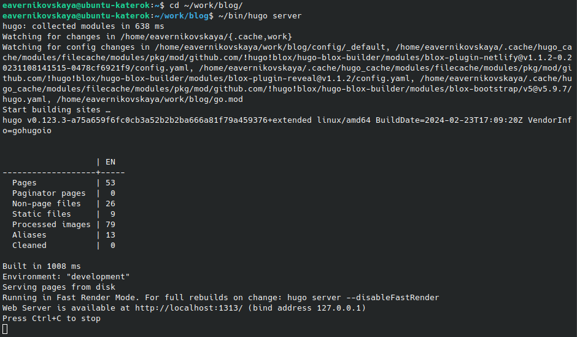{#fig:001 width=70%}

## Добавление записей для персональных проектов

Потом переходим в каталог ~/work/blog/content/project и создаём свои папки для персональных проектов (рис. 2), (рис. 3)

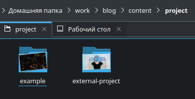{#fig:002 width=70%}

## Добавление записей для персональных проектов

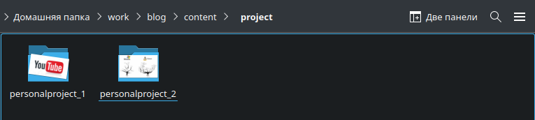{#fig:003 width=70%}

## Добавление записей для персональных проектов

Я создала две папки (я назвала их *personalproject_1* и *personalproject_2*). В них добавила необходимые фотки и файлы _index.md (рис. 4), (рис. 5)

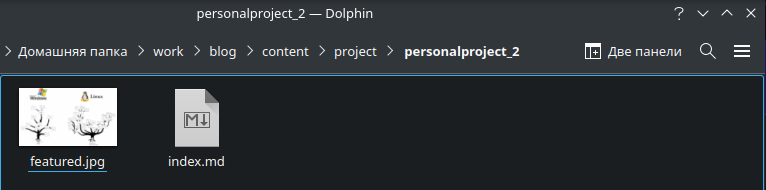{#fig:004 width=70%}

## Добавление записей для персональных проектов

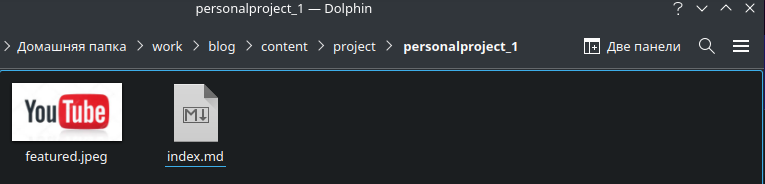{#fig:005 width=70%}

## Добавление записей для персональных проектов

Далее редактирую файлы _index.md (рис. 6), (рис. 7)

## Добавление записей для персональных проектов

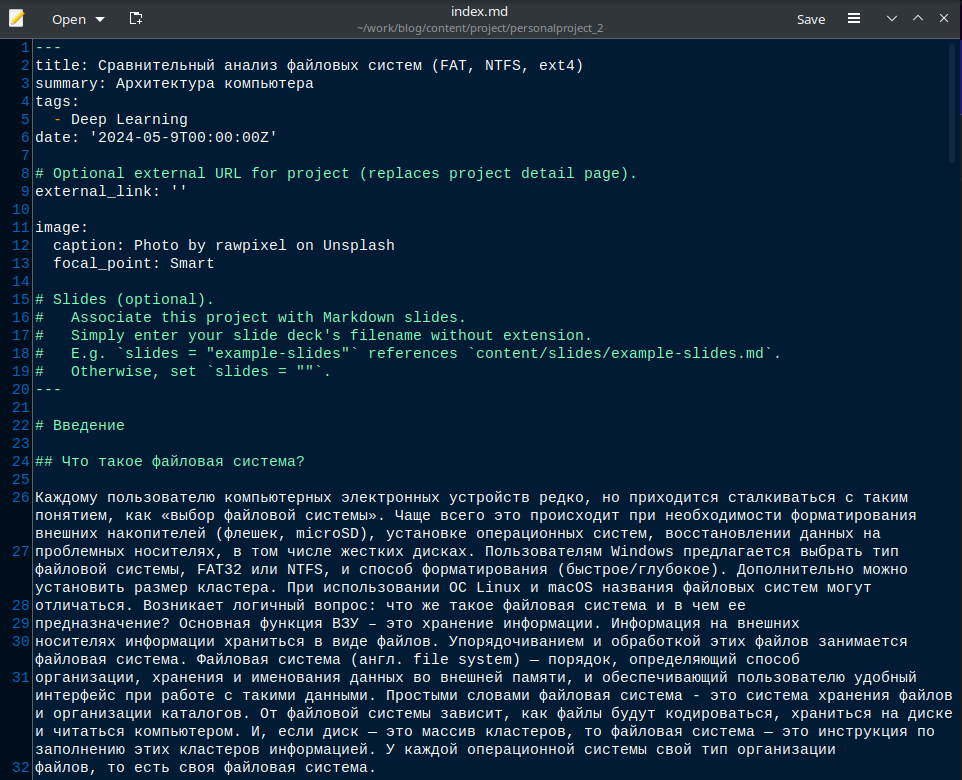{#fig:006 width=40%}

## Добавление записей для персональных проектов

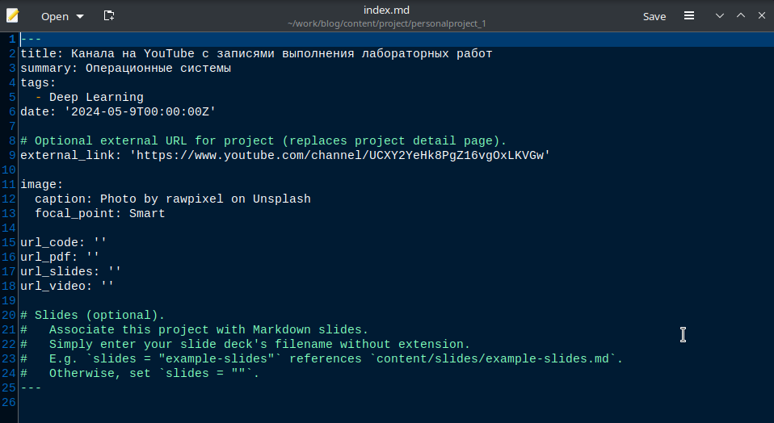{#fig:007 width=70%}

## Размещение постов на сайте

Переходим в каталог ~/work/blog/content/post и создаём две папки (я назвала их *post_7* и *post_8*), где будут хранится материалы постов (рис. 8), (рис. 9), (рис. 10)

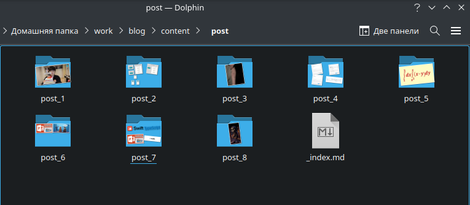{#fig:008 width=70%}

## Размещение постов на сайте

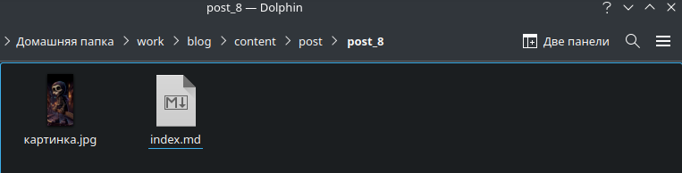{#fig:009 width=70%}

## Размещение постов на сайте

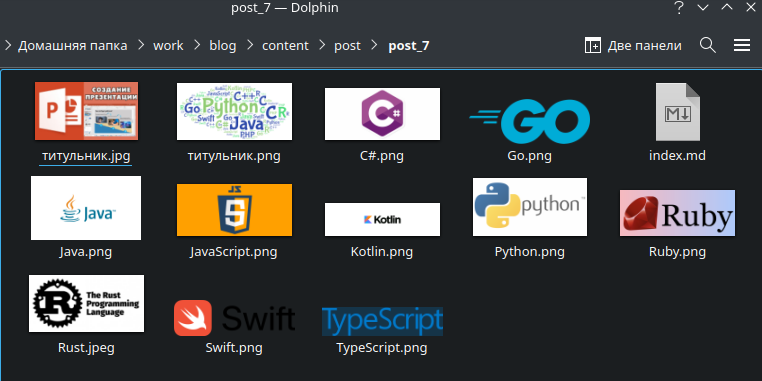{#fig:010 width=70%}

## Размещение постов на сайте

Редактируем в папке post_7 файл index.md. Пишем там пост о нашей прошедшей неделе, по желанию вставляем картинки (рис. 11)

## Размещение постов на сайте

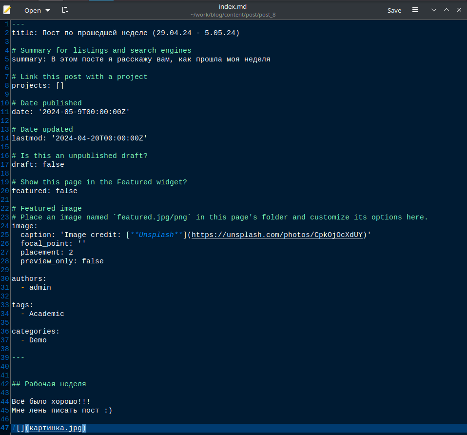{#fig:011 width=40%}

## Размещение постов на сайте

Далее редактируем другой файл index.md в папке post_8, где будет пост по выбранной теме. Мне не дали выбрать тему, поэтому я написала пост по теме "Языки научного программирования." (рис. 12)

## Размещение постов на сайте

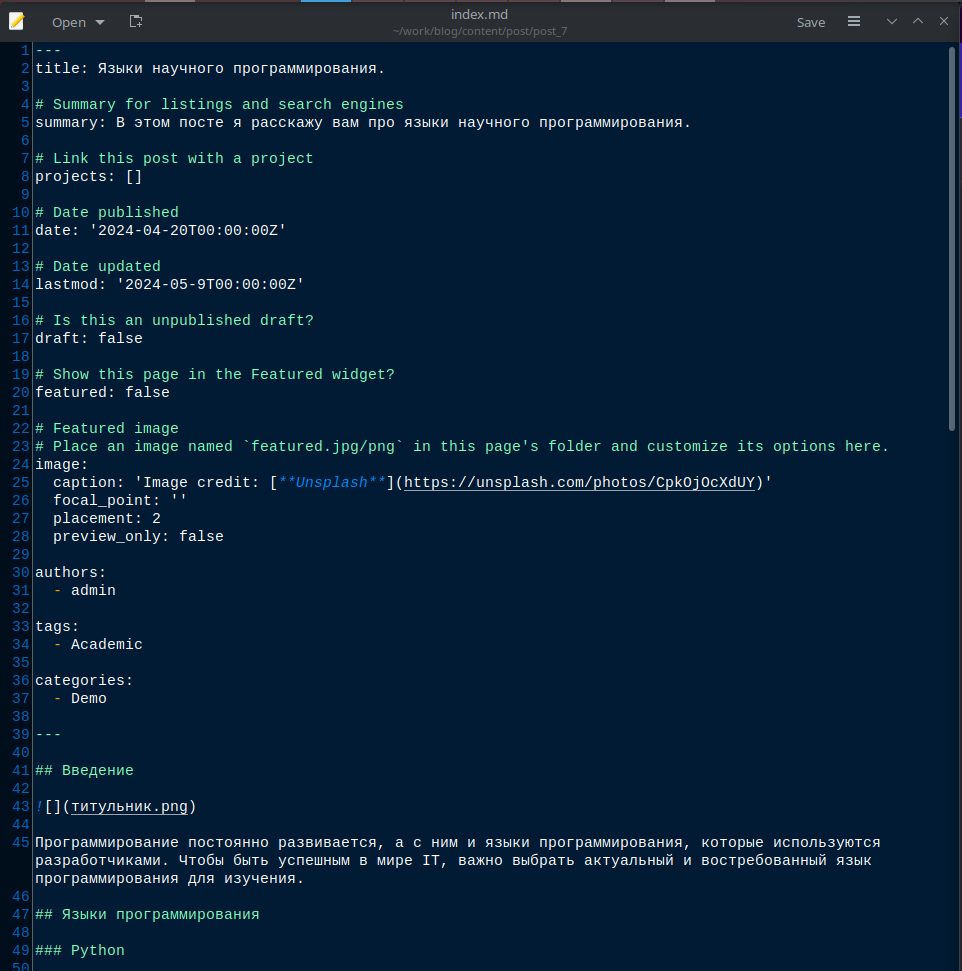{#fig:012 width=40%}

## Сборка сайта

Собираем наш сайт выполнив в каталоге ~/work/blog команду *~/bin/hugo* (рис. 13)

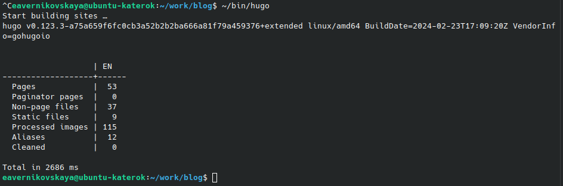{#fig:013 width=70%}

## Сборка сайта

Далее сохраняем изменения и отправляем их на git (рис. 14)

## Сборка сайта

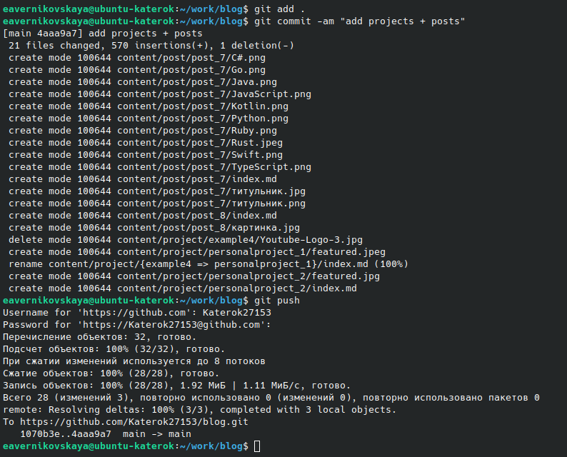{#fig:014 width=40%}

## Сборка сайта

Далее переходим в каталог ~/work/blog/public и также сохраняем изменения и выкладываем их на git (рис. 15), (рис. 16)

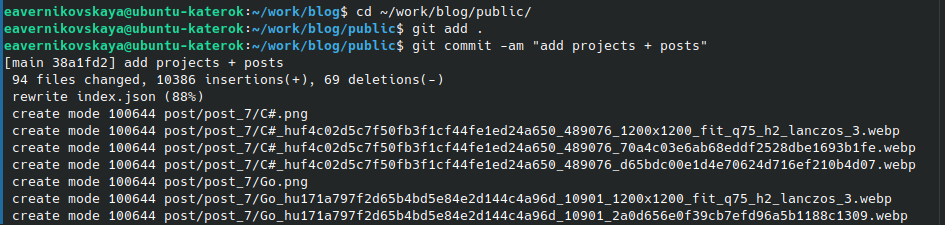{#fig:015 width=70%}

## Сборка сайта

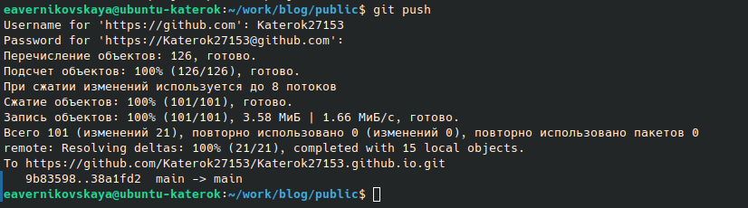{#fig:016 width=70%}

## Сборка сайта

Далее переходим на наш сайт (не на локальный!) по ссылке katerok27153.github.io и видим что всё получилось (рис. 17), (рис. 18), (рис. 19), (рис. 20), (рис. 21)

## Сборка сайта

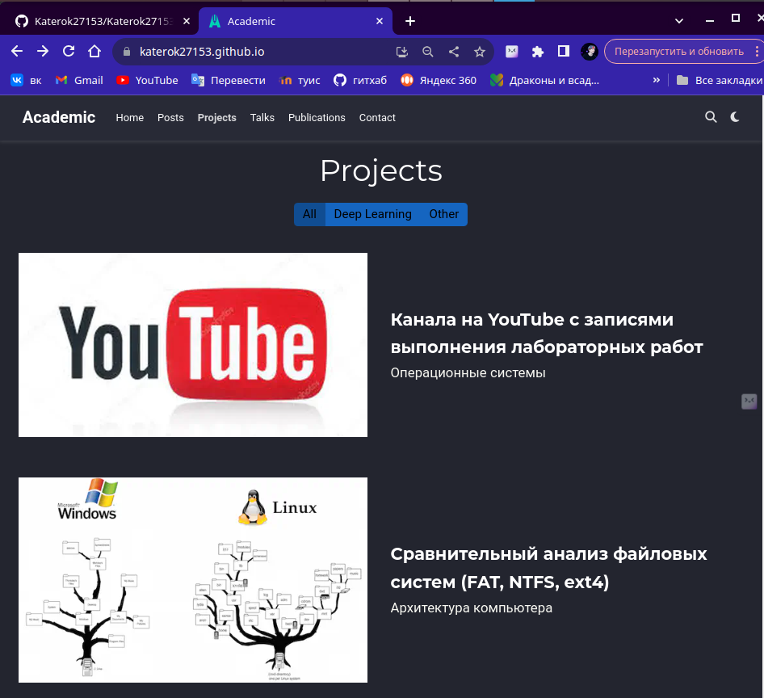{#fig:017 width=50%}

## Сборка сайта

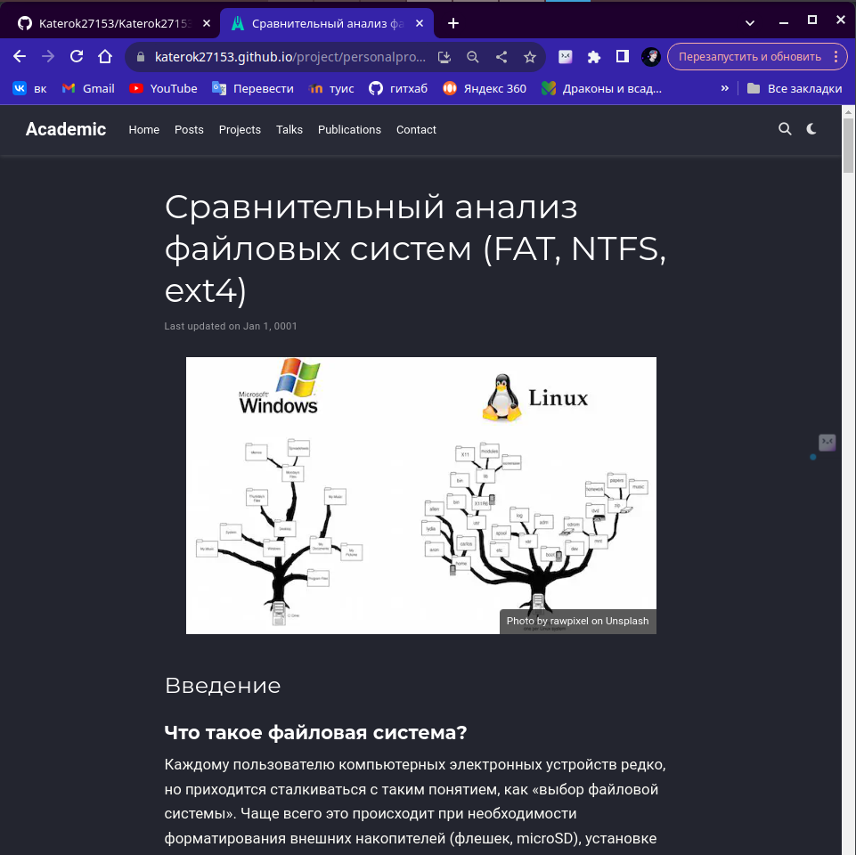{#fig:018 width=40%}

## Сборка сайта

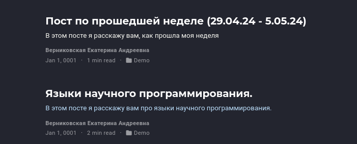{#fig:019 width=70%}

## Сборка сайта

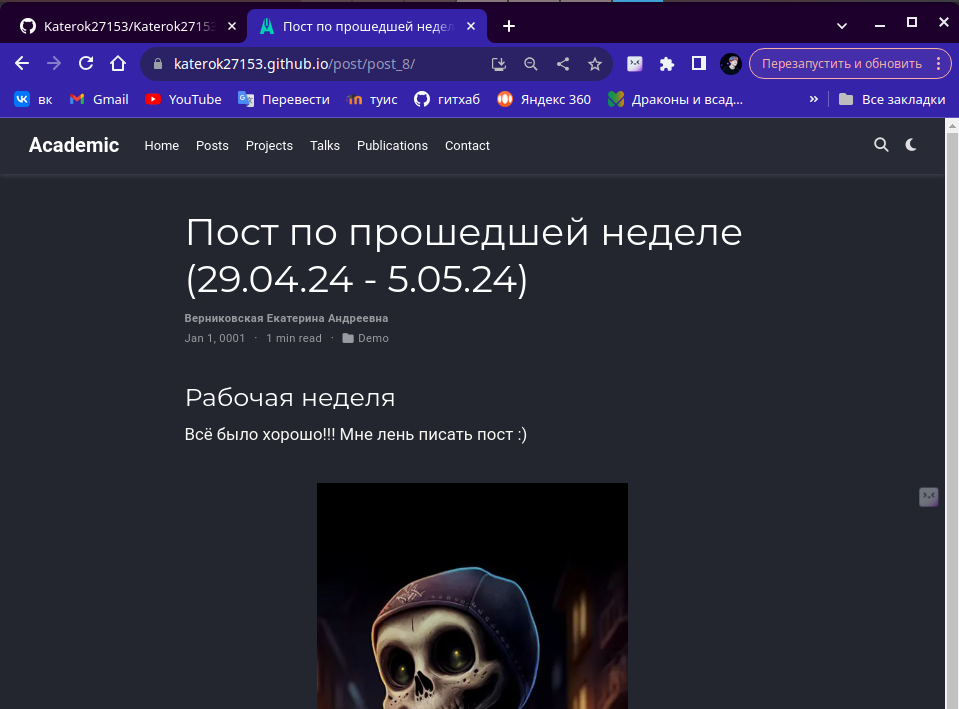{#fig:020 width=50%}

## Сборка сайта

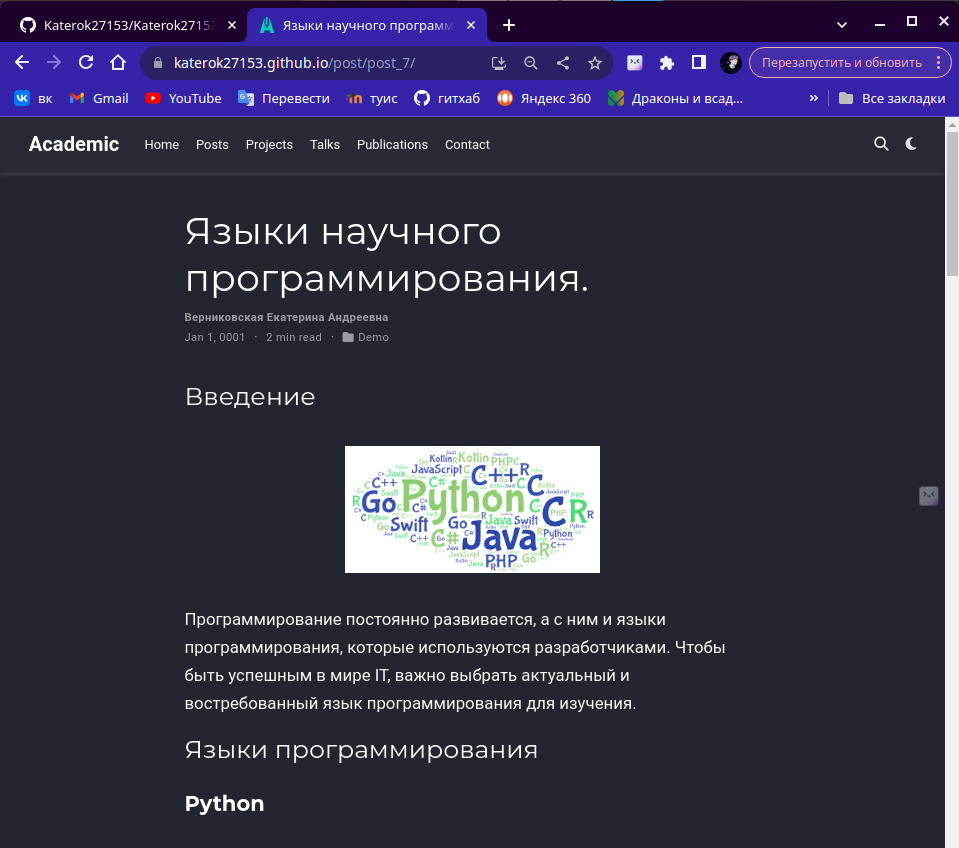{#fig:021 width=40%}

# Подведение итогов

## Выводы

В ходе выполнения 5-ого этапа индивидуального проекта мы добавлять записи персональных проектов на наш сайт.

## Список литературы

1. Мой сайт [Электронный ресурс] URL: https://katerok27153.github.io/
2. Этапы реализации проекта [Электронный ресурс] URL: https://esystem.rudn.ru/mod/page/view.php?id=1098920
3. Официальная библиотека иконок [Электронный ресурс] URL: https://fontawesome.ru/all-icons/
