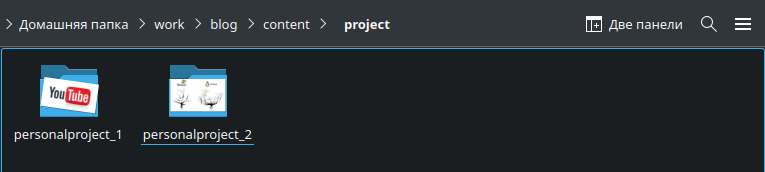

---
## Front matter
title: "Отчёт по выполнению 5-ого этапа индивидуального проекта"
subtitle: "Дисциплина: Операционные системы"
author: "Верниковская Екатерина Андреевна"

## Generic otions
lang: ru-RU
toc-title: "Содержание"

## Bibliography
bibliography: bib/cite.bib
csl: pandoc/csl/gost-r-7-0-5-2008-numeric.csl

## Pdf output format
toc: true # Table of contents
toc-depth: 2
lof: true # List of figures
lot: true # List of tables
fontsize: 12pt
linestretch: 1.5
papersize: a4
documentclass: scrreprt
## I18n polyglossia
polyglossia-lang:
  name: russian
  options:
	- spelling=modern
	- babelshorthands=true
polyglossia-otherlangs:
  name: english
## I18n babel
babel-lang: russian
babel-otherlangs: english
## Fonts
mainfont: PT Serif
romanfont: PT Serif
sansfont: PT Sans
monofont: PT Mono
mainfontoptions: Ligatures=TeX
romanfontoptions: Ligatures=TeX
sansfontoptions: Ligatures=TeX,Scale=MatchLowercase
monofontoptions: Scale=MatchLowercase,Scale=0.9
## Biblatex
biblatex: true
biblio-style: "gost-numeric"
biblatexoptions:
  - parentracker=true
  - backend=biber
  - hyperref=auto
  - language=auto
  - autolang=other*
  - citestyle=gost-numeric
## Pandoc-crossref LaTeX customization
figureTitle: "Рис."
tableTitle: "Таблица"
listingTitle: "Листинг"
lofTitle: "Список иллюстраций"
lotTitle: "Список таблиц"
lolTitle: "Листинги"
## Misc options
indent: true
header-includes:
  - \usepackage{indentfirst}
  - \usepackage{float} # keep figures where there are in the text
  - \floatplacement{figure}{H} # keep figures where there are in the text
---

# Цель работы

Добавить с сайту все остальные элементы.

# Задание

1. Сделать записи для персональных проектов.
2. Сделать пост по прошедшей неделе.
3. Добавить пост на тему по выбору.
- Языки научного программирования.

# Выполнение 5-ого этапа индивидуального проекта

## Добавление записей для персональных проектов

Заходим в каталог ~/work/blog. Далее запускаем исполняемый файл hugo, с помощью команды *~/bin/hugo server* и переходим на наш локальный сайт (рис. [-@fig:001])

{#fig:001 width=70%}

Потом переходим в каталог ~/work/blog/content/project и создаём свои папки для персональных проектов (рис. [-@fig:002]), (рис. [-@fig:003])

{#fig:002 width=70%}

{#fig:003 width=70%}

Я создала две папки (я назвала их *personalproject_1* и *personalproject_2*). В них добавила необходимые фотки и файлы _index.md (рис. [-@fig:004]), (рис. [-@fig:005])

{#fig:004 width=70%}

{#fig:005 width=70%}

Далее редактирую файлы _index.md (рис. [-@fig:006]), (рис. [-@fig:007])

{#fig:006 width=70%}

{#fig:007 width=70%}

## Размещение постов на сайте

Переходим в каталог ~/work/blog/content/post и создаём две папки (я назвала их *post_7* и *post_8*), где будут хранится материалы постов (рис. [-@fig:008]), (рис. [-@fig:009]), (рис. [-@fig:010])

{#fig:008 width=70%}

{#fig:009 width=70%}

{#fig:010 width=70%}

Редактируем в папке post_7 файл index.md. Пишем там пост о нашей прошедшей неделе, по желанию вставляем картинки (рис. [-@fig:011]) 

{#fig:011 width=70%}

Далее редактируем другой файл index.md в папке post_8, где будет пост по выбранной теме. Мне не дали выбрать тему, поэтому я написала пост по теме "Языки научного программирования." (рис. [-@fig:012])

{#fig:012 width=70%}

## Сборка сайта

Собираем наш сайт выполнив в каталоге ~/work/blog команду *~/bin/hugo* (рис. [-@fig:013])

{#fig:013 width=70%}

Далее сохраняем изменения и отправляем их на git (рис. [-@fig:014])

{#fig:014 width=70%}

Далее переходим в каталог ~/work/blog/public и также сохраняем изменения и выкладываем их на git (рис. [-@fig:015]), (рис. [-@fig:016])

{#fig:015 width=70%}

{#fig:016 width=70%}

Далее переходим на наш сайт (не на локальный!) по ссылке katerok27153.github.io и видим что всё получилось (рис. [-@fig:017]), (рис. [-@fig:018]), (рис. [-@fig:019]), (рис. [-@fig:020]), (рис. [-@fig:021])

{#fig:017 width=70%}

{#fig:018 width=70%}

{#fig:019 width=70%}

{#fig:020 width=70%}

{#fig:021 width=70%}

# Выводы
 
В ходе выполнения 5-ого этапа индивидуального проекта мы добавлять записи персональных проектов на наш сайт.

# Список литературы

1. Мой сайт [Электронный ресурс] URL: https://katerok27153.github.io/
2. Этапы реализации проекта [Электронный ресурс] URL: https://esystem.rudn.ru/mod/page/view.php?id=1098920
3. Официальная библиотека иконок [Электронный ресурс] URL: https://fontawesome.ru/all-icons/
