---
## Front matter
lang: ru-RU
title: Доклад
subtitle: Система управления пакетами dpkg
author:
  - Верниковская Е. А., НПИбд-01-23
institute:
  - Российский университет дружбы народов, Москва, Россия
date: 20 мая 2024

## i18n babel
babel-lang: russian
babel-otherlangs: english

## Formatting pdf
fontsize: 1pt
toc: false
toc-title: Содержание
slide_level: 2
aspectratio: 169
section-titles: true
theme: metropolis
header-includes:
 - \metroset{progressbar=frametitle,sectionpage=progressbar,numbering=fraction}
 - '\makeatletter'
 - '\beamer@ignorenonframefalse'
 - '\makeatother'

## Fonts
mainfont: PT Serif
romanfont: PT Serif
sansfont: PT Sans
monofont: PT Mono
mainfontoptions: Ligatures=TeX
romanfontoptions: Ligatures=TeX
sansfontoptions: Ligatures=TeX,Scale=MatchLowercase
monofontoptions: Scale=MatchLowercase,Scale=0.9
---

## Докладчик

:::::::::::::: {.columns align=center}
::: {.column width="70%"}

  * Верниковская Екатерина Андреевна
  * Студентка
  * Российский университет дружбы народов
  * [1132236136@pfur.ru](mailto:1132236136@pfur.ru)

:::
::: {.column width="30%"}

:::
::::::::::::::

## Вводная часть 

:::::::::::::: {.columns align=top}
::: {.column width="50%"}
**Актуальность темы и проблема:**
  
  
  тема "система управления пакетами dpkg" остается актуальной, поскольку это основной инструмент управления программным обеспечением в Debian и его производных дистрибутивах Linux. Понимание работы dpkg важно для администраторов систем и разработчиков, чтобы обеспечивать стабильность, безопасность и эффективность в установке, удалении и управлении пакетами программного обеспечения
  
:::
::: {.column width="40%"}
**Объект и предмет исследования:**
  
  
  система управления пакетами dpkg
  
:::
::::::::::::::

## Вводная часть 

:::::::::::::: {.columns align=top}
::: {.column width="30%"}
**Цель:**
  
  
  цель данного доклада - рассмотреть основные принципы работы системы управления пакетами dpkg, изучить её функциональность, основные команды и возможности
  
:::
::: {.column width="30%"}
**Задачи исследования:**
  
  
  узнать что такое менеджеры пакетов и какие они бывают, что такое пакеты и подробнее узнать про систему управления пакетами dpkg
  
:::
::: {.column width="20%"}
**Материалы и методы и инструменты исследования:**
  
  
  интернет-ресурсы, аналитика и практические навыки работы на своей операционной системе Linux (Ubuntu)
:::
::::::::::::::

## Введение

:::::::::::::: {.columns align=top}
::: {.column width="50%"}

В далекие времена установка программного обеспечения под операционные системы семейства Linux могла серьезно напугать начинающих пользователей этих ОС. Загрузка исходных кодов, управление зависимостями, часто представляющее собой сложную задачу, ручное редактирование конфигурационных файлов и другие аспекты установки приложений в прошлом, сегодня кажутся устаревшими и неактуальными.

:::
::: {.column width="50%"}

Сейчас любой уважающий себя дистрибутив Linux имеет в своем составе возможность установки программного обеспечения с помощью менеджеров пакетов.

:::
::::::::::::::

## Что такое менеджер пакетов

Системы управления пакетами (которые также иногда называются «менеджер пакетов» или «пакетный менеджер») — это набор программного обеспечения, позволяющего управлять процессом установки, удаления, настройки и обновления различных компонентов ПО.

Менеджер пакетов следит за тем, какие программы установлены на  компьютере, и позволяет легко устанавливать новые программы, обновлять программы до более новых версий или удалять те программы, которые ранее были установлены.

## Что такое менеджер пакетов

:::::::::::::: {.columns align=top}
::: {.column width="40%"}

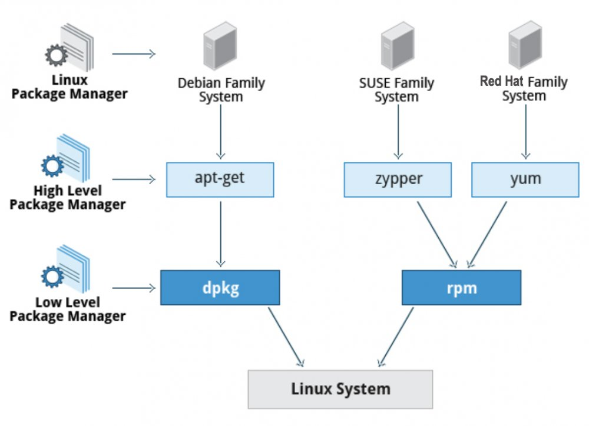

:::
::: {.column width="60%"}

Категории пакетных менеджеров:

- **Высокоуровневые менеджеры.** Применяются для поиска и скачивания пакетов из репозиториев. В процессе работы могут задействовать низкоуровневые менеджеры для инсталляции загруженных программ.

- **Низкоуровневые менеджеры.** Используются для установки локальных пакетов, загруженных вручную пользователем, или высокоуровневым пакетным менеджером.

:::
::::::::::::::

## Что такое менеджер пакетов

Популярные пакетные менеджеры:

:::::::::::::: {.columns align=top}
::: {.column width="30%"}

**DPKG (Debian Package)** – система управления пакетами в Debian и дистрибутивах на его основе, например Ubuntu.

:::
::: {.column width="30%"}

**APT (Advanced Packaging Tool)** – консольная утилита, выполняющая роль «поисковика» и загрузчика пакетов из репозиториев. Установка скачанных пакетов производится утилитой DPKG.

:::
::: {.column width="30%"}

**RPM (Red Hat Package Manager)** - формат пакетов и низкоуровневый пакетный менеджер систем RED HAT (RHEL, CentOS, Fedora и др.)

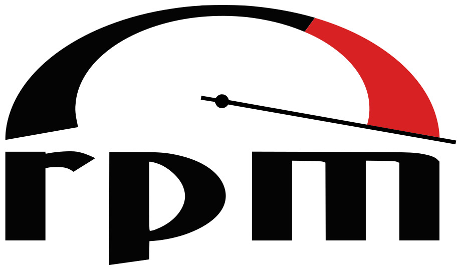

:::
::::::::::::::

## Что такое менеджер пакетов

Популярные пакетные менеджеры:

:::::::::::::: {.columns align=top}
::: {.column width="30%"}

**YUM (Yellowdog Updater, Modified)** – высокоуровневый пакетный менеджер, написанный на языке Python для систем RED HAT (RHEL, CentOS, Fedora).

:::
::: {.column width="30%"}

**Pacman** – высокоуровневый пакетный менеджер системы Arch Linux и его родственных дистрибутивов (Manjaro, EndeavourOS и др.).

:::
::: {.column width="30%"}

**Portage** – система управления пакетами Gentoo или Calculate Linux.

:::
::::::::::::::

## Что такое пакет и чем он отличается от обычной программы

:::::::::::::: {.columns align=top}
::: {.column width="50%"}

В Linux термин "пакет" обычно относится к файлу, содержащему программное обеспечение, его зависимости и метаданные, необходимые для установки и управления программным обеспечением в операционной системе. Пакеты представляют собой удобный способ организации и распространения программного обеспечения в Linux.

:::
::: {.column width="50%"}

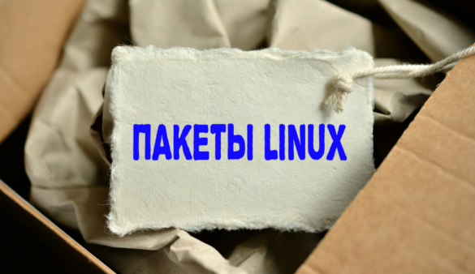

:::
::::::::::::::

## Что такое пакет и чем он отличается от обычной программы

Отличие между пакетом в Linux и обычной программой-установщиком заключается в том, что пакет представляет собой архив с программным обеспечением, зависимостями и метаданными, который устанавливается с помощью специальных инструментов управления пакетами. А программы-установщики обычно представляют собой отдельные исполняемые файлы или скрипты, которые запускаются для установки программы и не всегда управляют зависимостями или метаданными так же эффективно, как это делают пакеты.

Установщик может сам выполнить все необходимые команды и установить программу, а пакет — нет. Для установки и управления пакетами как раз и нужен менеджер пакетов.

## Из чего состоит пакет

:::::::::::::: {.columns align=center}
::: {.column width="30%"}

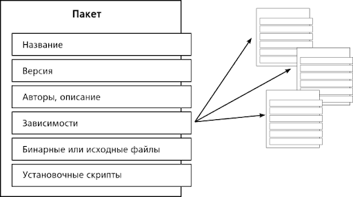

:::
::: {.column width="70%"}

Пакет, как правило, содержит само приложение, в откомпилированном  виде, то есть, по сути в виде бинарного файла. Также в пакете указывается метаинформация. 

Метаинформация представляет собой составленное по определённым правилам описание, которое содержит имя пакета, номер версии и сборки, сведения о разработчике и его мастер-сайте, список файлов, их положение в файловой иерархии, список зависимостей. Также, здесь могу присутствовать установочные и настроечные сценарии, необходимые для развертывания приложения.
  
:::
::::::::::::::

## Из чего состоит пакет

:::::::::::::: {.columns align=center}
::: {.column width="50%"}

Различные дистрибутивы ОС Linux имеют свои форматы пакетов. Вот основные форматы:

- .deb – Debian и производные (Ubuntu, Mint и т.д.)
- .rpm – Red Hat и производные (CentOS, Fedora и т.д.), OpenSUSE
- .apk – Android
- .ebuild – Gentoo

:::
::: {.column width="50%"}

Структура имени пакетов такова: имя-дополнение-версия_архитектура.deb
Например: vivaldi-stable_6.7.3329.24-1_amd64.deb 

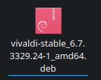
  
:::
::::::::::::::

## Пакетный менеджер Dpkg

:::::::::::::: {.columns align=center}
::: {.column width="30%"}

:::
::: {.column width="70%"}

Dpkg - это пакетный менеджер для Debian систем. DPKG используется с пакетами, созданными для Linux на базе Debian, которые заканчиваются расширением .deb. Он может устанавливать, удалять и создавать пакеты, но, в отличие от других систем управления пакетами, он не может автоматически загружать и устанавливать пакеты или их зависимости.

С dpkg можно устанавливать только локальные файлы, которые мы уже загрузили самостоятельно. Он не может искать удаленные репозитории или извлекать из них пакеты.
  
:::
::::::::::::::

## Установка пакета

:::::::::::::: {.columns align=center}
::: {.column width="50%"}

Dpkg — это, прежде всего, инструмент для установки уже доступных пакетов Debian (поскольку он ничего не загружает). Чтобы установить пакет, используется опция **-i** или **--install**. Мы можем видеть каждый этап, выполняемый dpkg, поэтому мы знаем, в каком месте могла произойти какая-либо ошибка.

:::
::: {.column width="50%"}

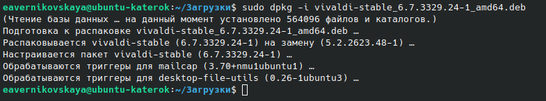
  
:::
::::::::::::::

## Установка пакета

:::::::::::::: {.columns align=center}
::: {.column width="50%"}

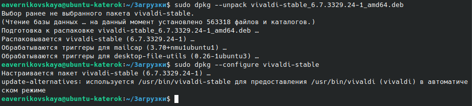

:::
::: {.column width="50%"}

Установку также можно выполнить в два этапа: сперва распаковка (**--unpack**), затем конфигурация (**--configure**). Благодаря этому apt-get делает меньше обращений к dpkg (каждый такой запрос является дорогостоящей операцией из-за необходимости загрузки в память базы данных, включая весь список уже установленных файлов). 
  
:::
:::::::::::::

## Удаление пакета

:::::::::::::: {.columns align=center}
::: {.column width="30%"}

Запуск dpkg с опцией **-r** или **--remove**, за которой следует имя пакета, приведет к удалению этого пакета. 

:::
::: {.column width="70%"}

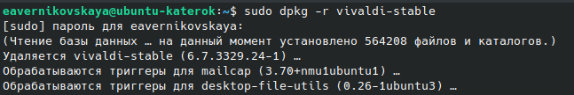
  
:::
::::::::::::::

## Удаление пакета

:::::::::::::: {.columns align=center}
::: {.column width="35%"}

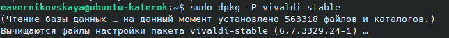

:::
::: {.column width="65%"}

Это удаление, однако, не полное: все конфигурационные файлы, сценарии сопровождающего, файлы журналов (системные журналы) и другие пользовательские данные, используемые этим пакетом, останутся. Таким путём легко избавиться от программы, деинсталлировав её, но при этом сохраняется возможность установить её ещё раз с той же конфигурацией. Для полного удаления всего, связанного с пакетом, используется опция **-P** или **--purge**, сопровождающаяся именем пакета.
  
:::
:::::::::::::

## Запросы к базе данных dpkg и анализ файлов .deb

:::::::::::::: {.columns align=center}
::: {.column width="50%"}

Dpkg также обладает возможностью проведения запросов к своей внутренней базе данных для получения информации. При помощи различных опций можно получить подробную информацию о пакетах, их файловой структуре, а также произвести поиск пакетов, содержащих определенные файлы.

Так, **--listfiles** пакет (или **-L**) выводит список файлов, установленых пакетом;

:::
::: {.column width="50%"}

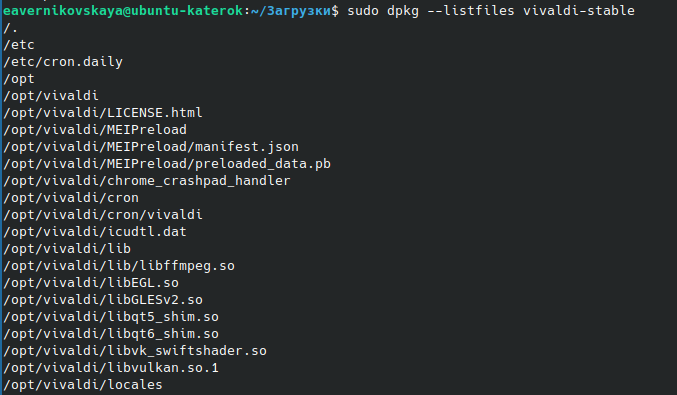
  
:::
::::::::::::::

## Запросы к базе данных dpkg и анализ файлов .deb

:::::::::::::: {.columns align=center}
::: {.column width="70%"}

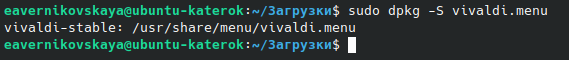

:::
::: {.column width="30%"}

**--search** файл (или **-S**) ищет пакет, к которому относится этот файл; 
  
:::
:::::::::::::

## Запросы к базе данных dpkg и анализ файлов .deb

:::::::::::::: {.columns align=center}
::: {.column width="30%"}

**--status** пакет (or **-s**) выводит информацию о том или ином установленном пакете; 

:::
::: {.column width="70%"}

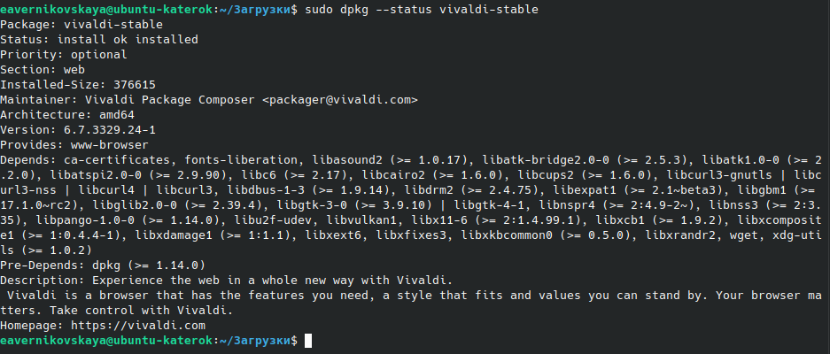
  
:::
::::::::::::::

## Запросы к базе данных dpkg и анализ файлов .deb

:::::::::::::: {.columns align=center}
::: {.column width="70%"}

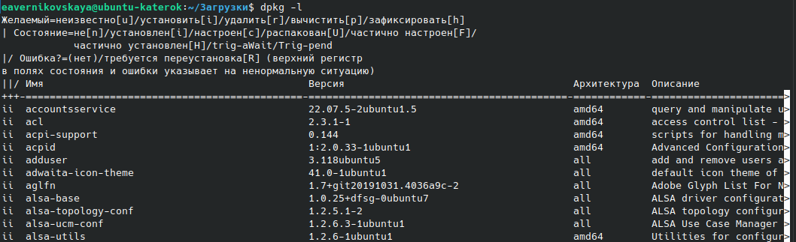

:::
::: {.column width="30%"}

**--list** (или **-l**) показывает список пакетов, известных системе, и их статус; 
  
:::
:::::::::::::

## Запросы к базе данных dpkg и анализ файлов .deb

:::::::::::::: {.columns align=center}
::: {.column width="30%"}

**--contents** file.deb (или **-c**) показывает список файлов в этом пакете;

:::
::: {.column width="70%"}

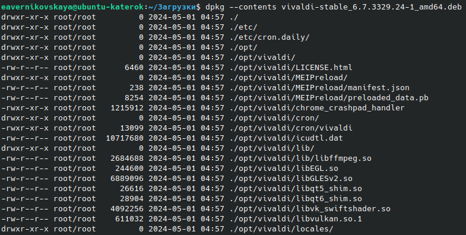
  
:::
::::::::::::::

## Запросы к базе данных dpkg и анализ файлов .deb

:::::::::::::: {.columns align=center}
::: {.column width="70%"}

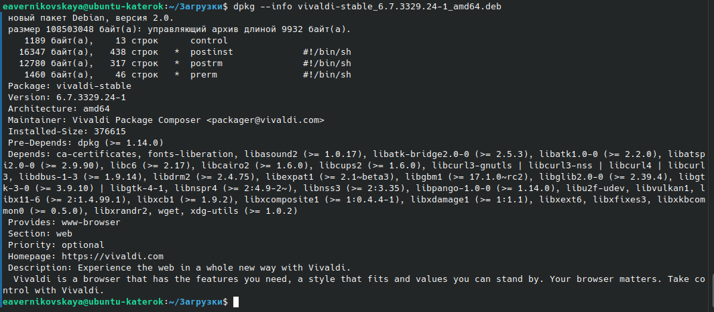

:::
::: {.column width="30%"}

**--info** file.deb  (или **-I**) показывает информацию о пакете Debian. 
  
:::
:::::::::::::

## Файл журнала dpkg

Dpkg сохраняет журнал всех своих действий в **/var/log/dpkg.log**. Этот журнал чрезвычайно подробный: в нём задокументированы все этапы обработки пакетов dpkg. Этот журнал помогает не только отследить поведение dpkg, но и сохранить историю изменений в системе: можно найти точный момент, когда каждый пакет был установлен или обновлён, и эта информация может быть чрезвычайно полезной при выяснении причин изменения поведения системы в целом.

:::::::::::::: {.columns align=top}
::: {.column width="50%"}

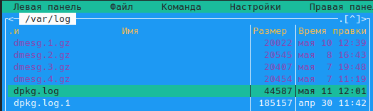

:::
::: {.column width="50%"}

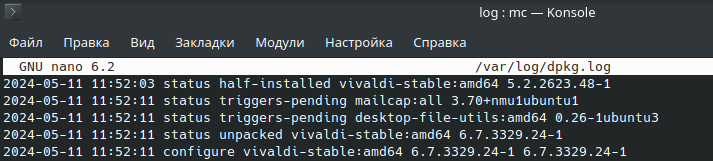

:::
::::::::::::::

## Поддержка мультиархитектуры

:::::::::::::: {.columns align=center}
::: {.column width="55%"}

Все пакеты Debian имеют поле Architecture в своих метаданных. Это поле может содержать либо значение «all» (для пакетов, которые не зависят от архитектуры), либо название конкретной архитектуры, для которой пакет предназначен (например «amd64», «armhf», …). В последнем случае dpkg по умолчанию допустит установку пакета только в том случае, если его архитектура соответствует архитектуре системы, возвращаемой dpkg **--print-architecture**.

:::
::: {.column width="45%"}

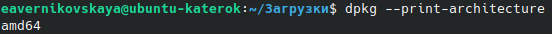

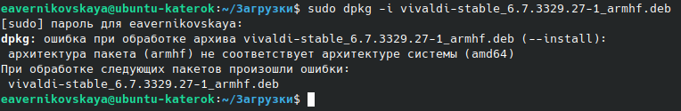
  
:::
::::::::::::::

## Включение мультиархитектуры

:::::::::::::: {.columns align=center}
::: {.column width="30%"}

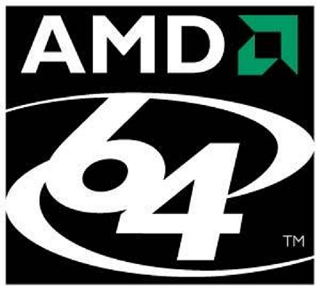

:::
::: {.column width="70%"}

Поддержка мультиархитектуры dpkg позволяет определять «чужеродные архитектуры», которые могут быть установлены в данной системе. Это легко сделать с помощью dpkg **--add-architecture**. Существует и соответствующая команда dpkg **--remove-architecture** для отключения поддержки чужеродной архитектуры, но её можно использовать только в том случае, когда в системе не осталось ни одного пакета этой архитектуры.
  
:::
:::::::::::::

## Вывод

:::::::::::::: {.columns align=center}
::: {.column width="70%"}

Dpkg является базовой программой для управления пакетами в системе Debian. Он позволяет устанавливать, удалять и управлять пакетами, обеспечивая фундаментальные операции с пакетами Debian.
Отличительной особенностью dpkg является его простота, что делает его привлекательным выбором для опытных пользователей.
Но dpkg является низкоуровневым пакетным менеджером и отличается от более полноценных систем управления пакетами, таких как APT, тем, что не предполагает автоматического решения зависимостей и загрузки пакетов из сети.

:::
::: {.column width="30%"}

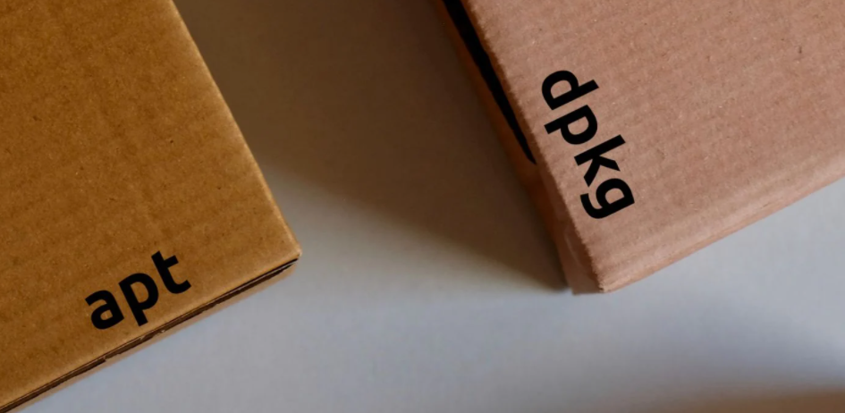
  
:::
:::::::::::::

## Список литературы{.unnumbered}

1. Andrey_Biryukov. Управление пакетами в ОС Linuх. Habr, 2023. [Электронный ресурс] URL: https://habr.com/ru/companies/otus/articles/743614/
2. Yadav V. Package Management in Linux. Scaler Topics, 2024. [Электронный ресурс] URL: https://www.scaler.com/topics/cyber-security/package-management-in-linux/
3. Популярные пакетные менеджеры Linux. Eternalhost, 2020. [Электронный ресурс] URL: https://eternalhost.net/blog/sistemnoe-administrirovanie/paketnye-menedzhery-linux
4. Работа с пакетами при помощи dpkg. [Электронный ресурс] URL: https://l.github.io/debian-handbook/html/ru-RU/sect.manipulating-packages-with-dpkg.html

